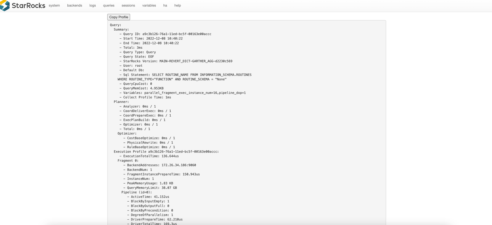

# Query Profile Overview

## Introduction

Query Profile records execution information for all working nodes involved in a query, helping you quickly identify bottlenecks affecting query performance. It is a powerful tool for diagnosing and tuning query performance in StarRocks.

> From v3.3.0 onwards, StarRocks supports providing Query Profile for data loading with INSERT INTO FILES() and Broker Load. For details of the metrics involved, see [OlapTableSink Operator](./query_profile_operator_metrics.md#olaptablesink-operator).

## How to Enable Query Profile

### Enable Query Profile

You can enable Query Profile by setting the variable `enable_profile` to `true`:

```SQL
SET enable_profile = true;
SET GLOBAL enable_profile = true;
```

### Query Profile for Slow Queries

It is not recommended to enable Query Profile globally in production for long periods, as it may impose additional system overhead. To capture and analyze only slow queries, set the variable `big_query_profile_threshold` to a time duration greater than `0s`. For example, setting it to `30s` means only queries exceeding 30 seconds will trigger Query Profile.

```SQL
-- 30 seconds
SET global big_query_profile_threshold = '30s';

-- 500 milliseconds
SET global big_query_profile_threshold = '500ms';

-- 60 minutes
SET global big_query_profile_threshold = '60m';
```

### Runtime Query Profile

For long-running queries, it can be difficult to determine progress or detect issues before completion. The Runtime Query Profile feature (v3.1+) collects and reports Query Profile data at fixed intervals during execution, providing real-time insight into query progress and bottlenecks.

When Query Profile is enabled, Runtime Query Profile is automatically activated with a default reporting interval of 10 seconds. Adjust the interval with `runtime_profile_report_interval`:

```SQL
SET runtime_profile_report_interval = 30;
```

### Configurations

| Configuration Item                | Type         | Valid Values      | Default | Description                                                                                 |
|-----------------------------------|--------------|-------------------|---------|---------------------------------------------------------------------------------------------|
| enable_profile                    | Session Var  | true/false        | false   | Enable Query Profile                                                                        |
| pipeline_profile_level            | Session Var  | 1/2               | 1       | 1: merge metrics; 2: retain original structure (disables visualization tools)               |
| runtime_profile_report_interval   | Session Var  | Positive integer  | 10      | Runtime Query Profile report interval (seconds)                                              |
| big_query_profile_threshold       | Session Var  | String            | 0s      | Enable Query Profile for queries exceeding this duration (e.g., '30s', '500ms', '60m')       |
| enable_statistics_collect_profile | FE Dynamic   | true/false        | false   | Enable Query Profile for statistics collection-related queries                               |

## How to Obtain Query Profile

### Via Web UI

1. Access `http://<fe_ip>:<fe_http_port>` in your browser.
2. Click **queries** in the top navigation.
3. In the **Finished Queries** list, select the query you want to analyze and click the link in the **Profile** column.


You will be redirected to the detailed page of the selected Query Profile.



### Via SQL Function (`get_query_profile`)

Example workflow:
- `last_query_id()`: Returns the ID of the most recently executed query in your session. Useful for quickly retrieving the profile of your last query.
- `show profilelist;`: Lists recent queries along with their IDs and status. Use this to find the `query_id` needed for profile analysis.
- `get_query_profile('<query_id>')`: Returns the detailed execution profile for the specified query. Use this to analyze how a query was executed and where time or resources were spent.


```sql
-- Enable the profiling feature.
SET enable_profile = true;

-- Run a query that performs a scan and aggregation to generate a meaningful profile.
-- (Using a system table ensures this works on any cluster)
SELECT count(*) FROM information_schema.columns;

-- Get the query_id of the query.
SELECT last_query_id();
+--------------------------------------+
| last_query_id()                      |
+--------------------------------------+
| 019b364f-10c4-704c-b79a-af2cc3a77b89 |
+--------------------------------------+

-- Get the list of profiles
SHOW PROFILELIST;

-- Obtain the query profile.
SELECT get_query_profile('019b364f-10c4-704c-b79a-af2cc3a77b89')\G
```

### In Managed Version

In StarRocks Managed (Enterprise) environments, you can conveniently access query profiles directly from the query history in the web console. The managed UI provides an intuitive, visual representation of each query's execution profile, making it easy to analyze performance and identify bottlenecks without manual SQL commands.

## Interpret Query Profile

### Explain Analyze

Most users may find it challenging to analyze the raw text directly. StarRocks provides a [Text-based Query Profile Visualized Analysis](./query_profile_text_based_analysis.md) method for a more intuitive understanding.

### Managed Version

In the StarRocks Enterprise Edition (EE), the Managed Version provides a built-in visualization tool for query profiles. This tool offers an interactive, graphical interface that makes it much easier to interpret complex query execution details compared to raw text output.

**Key features of the visualization tool include:**
- **Operator-level breakdown:** View the execution plan as a tree or graph, with each operator's metrics (time, rows, memory) clearly displayed.
- **Bottleneck highlighting:** Quickly identify slow or resource-intensive operators through color-coded indicators.
- **Drill-down capability:** Click on any operator to see detailed statistics, including input/output rows, CPU time, memory usage, and more.

**How to use:**
1. Open the StarRocks Managed web console.
2. Navigate to the **Query** or **Query History** section.
3. Select a query and click the **Profile** or **Visualize** button.
4. Explore the visualized profile to analyze performance and identify optimization opportunities.

This visualization tool is exclusive to the Managed/Enterprise Edition and is designed to accelerate troubleshooting and performance tuning for complex workloads.

