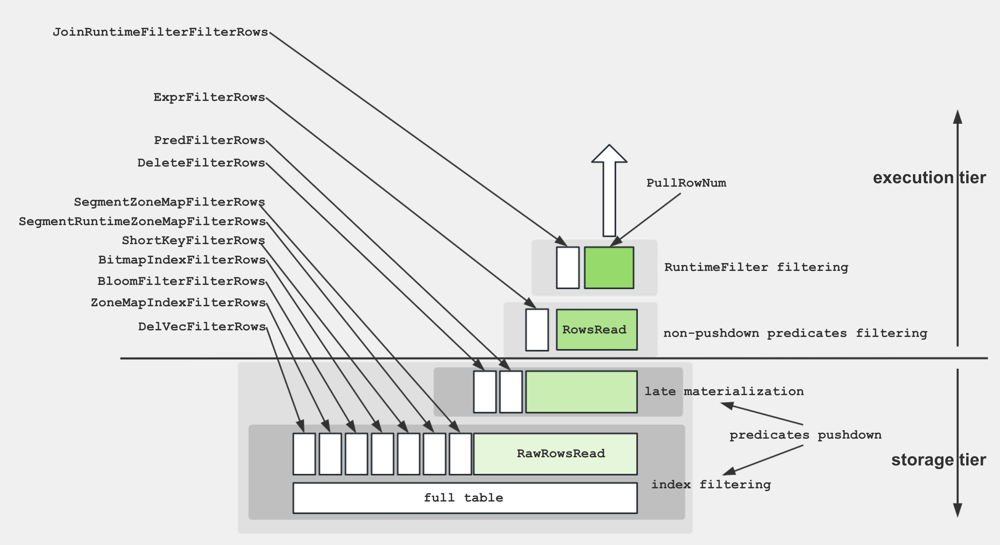
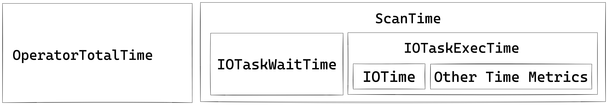
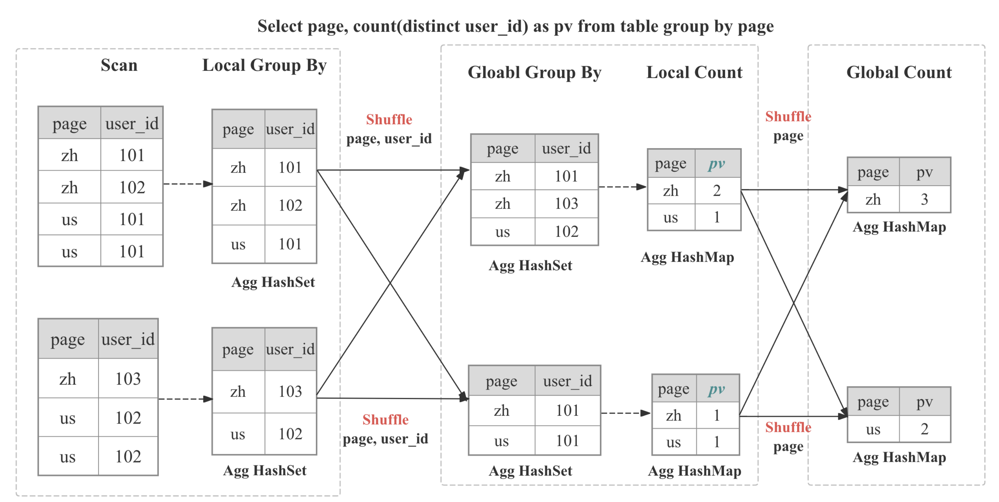
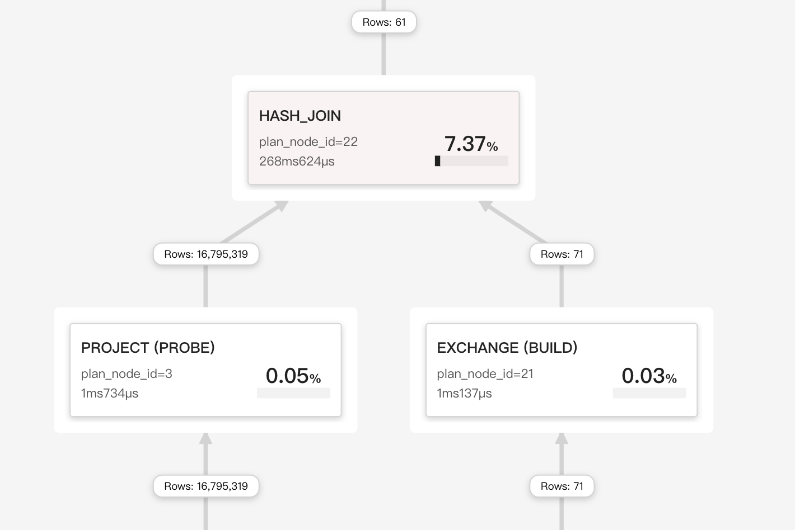

# Query Tuning Recipes

> A pragmatic playbook: **symptom → root cause → proven fixes**.  
> Use it when you’ve opened a profile and spotted a red-flag metric but still need to answer “_now what?_”.

---

## 1 · Fast Diagnosis Workflow

1. **Skim the Execution Overview**  
   If `QueryPeakMemoryUsagePerNode > 80 %` or `QuerySpillBytes > 1 GB`, jump straight to the memory & spill recipes.

2. **Find the slowest Pipeline / Operator**  
   ⟶ In _Query Profile UI_ click **Sort by OperatorTotalTime %**.  
   The hottest operator tells you which recipe block to read next (Scan, Join, Aggregate, …).

3. **Confirm the bottleneck subtype**  
   Each recipe begins with its _signature_ metric pattern. Match those before trying the fixes.

---

## 2 · Recipes by Operator

### 2.1 OLAP / Connector Scan  [[metrics]](./query_profile_operator_metrics.md#scan-operator)

To facilitate a better understanding of the various metrics within the Scan Operator, the following diagram demonstrates the associations between these metrics and storage structures.




To retrieve data from disk and apply the predicates, the storage engine utilize several techniques:
1. **Data Storage**: Encoded and compressed data is stored on disk in segments, accompanied by various indices.
2. **Index Filtering**: The engine leverages indices such as BitmapIndex, BloomfilterIndex, ZonemapIndex, ShortKeyIndex, and NGramIndex to skip unnecessary data.
3. **Pushdown Predicates**: Simple predicates, like `a > 1`, are pushed down to evaluate on specific columns.
4. **Late Materialization**: Only the required columns and filtered rows are retrieved from disk.
5. **Non-Pushdown Predicates**: Predicates that cannot be pushed down are evaluated.
6. **Projection Expression**: Expressions, such as `SELECT a + 1`, are computed.

The Scan Operator utilizes an additional thread pool for executing IO tasks. Therefore, the relationship between time metrics for this node is illustrated below:




#### Common performance bottlenecks

**Cold or slow storage** – When `BytesRead`, `ScanTime`, or `IOTaskExecTime` dominate and disk I/O hovers around 80‑100 %, the scan is hitting cold or under‑provisioned storage. Move hot data to NVMe/SSD and enable the Data Cache. Size it via BE `datacache_*` settings (or legacy `block_cache_*`), and enable scan‑time usage via session `enable_scan_datacache`.

**Filter push‑down missing** – If `PushdownPredicates` stays near 0 while `ExprFilterRows` is high, predicates aren’t reaching the storage layer. Rewrite them as simple comparisons (avoid `%LIKE%` and wide `OR` chains) or add zonemap/Bloom indexes or materialized views so they can be pushed down.

**Thread‑pool starvation** – A high `IOTaskWaitTime` together with a low `PeakIOTasks` signals saturated I/O concurrency. Enable and size the Data Cache (BE `datacache_*` and session `enable_scan_datacache`), move hot data to faster storage (NVMe/SSD)

**Data skew across tablets** – A wide gap between the maximum and minimum `OperatorTotalTime` means some tablets do much more work than others. Re‑bucket on a higher‑cardinality key or increase the bucket count to spread the load.

**Rowset/segment fragmentation** – Exploding `RowsetsReadCount`/`SegmentsReadCount` plus a long `SegmentInitTime` indicate many tiny rowsets. Trigger a manual compaction and batch small loads so segments merge up‑front.

**Accumulated soft deletes** – A large `DeleteFilterRows` implies heavy soft‑delete usage. Run BE compaction to purge soft deletes.

### 2.2 Aggregate  [[metrics]](./query_profile_operator_metrics.md#aggregate-operator)


Aggregate Operator is responsible for executing aggregation functions, `GROUP BY`, and `DISTINCT`. 


**Multi forms of aggregation algorithm**

| Form | When the planner chooses it | Internal data structure | Highlights / caveats |
|------|----------------------------|-------------------------|-----------------------|
| Hash aggregation | keys fit into memory; cardinality not extreme | Compact hash table with SIMD probing | default path, excellent for modest key counts |
| Sorted aggregation | input already ordered on the GROUP BY keys | Simple row comparison + running state | zero hash table cost, often 2-3× faster on probing heavy skews |
| Spillable aggregation (3.2+) | hash table outsizes memory limit | Hybrid hash/merge with disk spill partitions | prevents OOM, preserves pipeline parallelism |

**Multi-Stage Distributed Aggregation**

In StarRocks the aggregation is implemented in distributed manner, which can be multi-stage depends on the query pattern and optimizer decision.

```
┌─────────┐        ┌──────────┐        ┌────────────┐        ┌────────────┐
│ Stage 0 │ local  │ Stage 1  │ shard/ │ Stage 2    │ gather/│ Stage 3    │ final
│ Partial │───►    │ Update   │ hash   │ Merge      │ shard  │ Finalize   │ output
└─────────┘        └──────────┘        └────────────┘        └────────────┘
```

| Stages | When Used | What Happens |
|--------|------------|--------------|
| One-stage | The `DISTRIBUTED BY` is a subset of `GROUP BY`, the partitions are colocated | Partial aggregates immediately become the final result. |
| Two-stage (local + global) | Typical distributed `GROUP BY` | Stage 0 inside each BE collapses duplicates adaptively; Stage 1 shuffles data based on `GROUP BY` then perform global aggregation |
| Three-stage (local + shuffle + final) | Heavy `DISTINCT` and high-cardinality `GROUP BY` | Stage 0 as above; Stage 1 shuffles by `GROUP BY`, then aggregate by `GROUP BY` and `DISTINCT`; Stage 2 merges partial state as `GROUP BY` |
| Four-stage (local + partial + intermediate + final) | Heavy `DISTINCT` and low-cardinality `GROUP BY` | Introduce an additional stage to shuffle by `GROUP BY` and `DISTINCT` to avoid single-point bottleneck |


#### Common performance bottlenecks


**High‑cardinality GROUP BY** – When `HashTableSize` or `HashTableMemoryUsage` balloons toward the memory limit, the grouping key is too wide or too distinct. Enable sorted streaming aggregation (`enable_streaming_preaggregation = true`), create a roll‑up materialized view, or cast wide string keys to `INT`.

**Shuffle skew** – Large differences in `HashTableSize` or `InputRowCount` across fragments reveal an unbalanced shuffle. Add a salt column to the key or use the `DISTINCT [skew]` hint so rows distribute evenly.

**State‑heavy aggregate functions** – If `AggregateFunctions` dominates runtime and the functions include `HLL_`, `BITMAP_`, or `COUNT(DISTINCT)`, enormous state objects are being moved around. Pre‑compute HLL/bitmap sketches during ingestion or switch to approximate variants.

**Partial aggregation degraded** – A huge `InputRowCount` with modest `AggComputeTime`, plus massive `BytesSent` in the upstream EXCHANGE, means pre‑aggregation was bypassed. Force it back on with `SET streaming_preaggregation_mode = "force_preaggregation"`.

**Expensive key expressions** – When `ExprComputeTime` rivals `AggComputeTime`, the GROUP BY keys are computed row by row. Materialize those expressions in a sub‑query or promote them to generated columns.

### 2.3 Join  [[metrics]](./query_profile_operator_metrics.md#join-operator)



Join Operator is responsible for implementing explicit join or implicit joins.

During execution the join operator is split into Build (hash-table construction) and Probe phases that run in parallel inside the pipeline engine. Vector chunks (up to 4096 rows) are batch-hashed with SIMD; consumed keys generate runtime filters—Bloom or IN filters—pushed back to upstream scans to cut probe input early.

**Join Strategies**

StarRocks relies on a vectorized, pipeline-friendly hash-join core that can be wired into four physical strategies the cost-based optimizer weighs at plan time:

| Strategy | When the optimizer picks it | What makes it fast |
|----------|-----------------------------|---------------------|
| Colocate Join | Both tables belong to the same colocation group (identical bucket keys, bucket count, and replica layout).   | No network shuffle: each BE joins only its local buckets. |
| Bucket-Shuffle Join | One of join tables has the same bucket key with join key | Only need to shuffle one join table, which can reduce the network cost |
| Broadcast Join | Build side is very small (row/byte thresholds or explicit hint).   | Small table is replicated to every probe node; avoids shuffling large table. |
| Shuffle (Hash) Join | General case, keys don’t align. | Hash-partition each row on the join key so probes are balanced across BEs. |

#### Common performance bottlenecks

**Oversized build side** – Spikes in `BuildHashTableTime` and `HashTableMemoryUsage` show the build side has outgrown memory. Swap probe/build tables, pre‑filter the build table, or enable hash spilling.

**Cache‑unfriendly probe** – When `SearchHashTableTime` dominates, the probe side is not cache‑efficient. Sort the probe rows on the join keys and enable runtime filters.

**Shuffle skew** – If a single fragment’s `ProbeRows` dwarfs all others, the data is skewed. Switch to a higher‑cardinality key or append a salt such as `key || mod(id, 16)`.

**Accidental broadcast** – Join type **BROADCAST** with huge `BytesSent` means a table you thought was small isn’t. Lower `broadcast_row_limit` or enforce shuffle with the `SHUFFLE` hint.

**Missing runtime filters** – A tiny `JoinRuntimeFilterEvaluate` together with full‑table scans suggests runtime filters never propagated. Rewrite the join as pure equality and make sure the column types line up.

**Non‑equi fallback** – When the operator type is `CROSS` or `NESTLOOP`, an inequality or function prevents a hash join. Add a true equality predicate or pre‑filter the larger table.

### 2.4 Exchange (Network)  [[metrics]](./query_profile_operator_metrics.md#exchange-operator)

**Oversized shuffle or broadcast** – If `NetworkTime` exceeds 30 % and `BytesSent` is large, the query is shipping too much data. Re‑evaluate the join strategy and reduce the shuffle/broadcast volume (e.g., enforce shuffle instead of broadcast, or pre‑filter upstream).

**Receiver backlog** – High `WaitTime` in the sink with sender queues that stay full indicates the receiver cannot keep up. Increase the receiver thread pool (`brpc_num_threads`) and confirm NIC bandwidth and QoS settings.

**Enable exchange compression** – When network bandwidth is the bottleneck, compress exchange payloads. Set `SET transmission_compression_type = 'zstd';` and optionally increase `SET transmission_encode_level = 7;` to enable adaptive column encoding. Expect higher CPU usage in exchange for reduced bytes on the wire.

### 2.5 Sort / Merge / Window

For ease of understanding various metrics, Merge can be represented as the following state mechanism:

```plaintext
               ┌────────── PENDING ◄──────────┐
               │                              │
               │                              │
               ├──────────────◄───────────────┤
               │                              │
               ▼                              │
   INIT ──► PREPARE ──► SPLIT_CHUNK ──► FETCH_CHUNK ──► FINISHED
               ▲
               |
               | one traverse from leaf to root
               |
               ▼
            PROCESS
```


**Sort spilling** – When `MaxBufferedBytes` rises above roughly 2 GB or `SpillBytes` is non‑zero, the sort phase is spilling to disk. Add a `LIMIT`, pre‑aggregate upstream, or raise `sort_spill_threshold` if the machine has enough memory.

**Merge starvation** – A high `PendingStageTime` tells you the merge is waiting for upstream chunks. optimize the producer operator first or enlarge pipeline buffers.

**Wide window partitions** – Huge `PeakBufferedRows` inside a window operator point to very broad partitions or an ORDER BY lacking frame limits. Partition more granularly, add `RANGE BETWEEN` bounds, or materialize intermediate aggregates.

---

## 3 · Memory & Spill Cheatsheet

| Threshold | What to watch | Practical action |
| --- | --- | --- |
| **80 %** of BE memory | `QueryPeakMemoryUsagePerNode` | Lower session `exec_mem_limit` or add BE RAM |
| Spill detected (`SpillBytes` > 0) | `QuerySpillBytes`, per-operator `SpillBlocks` | Increase memory limit; upgrade to SR 3.2+ for hybrid hash/merge spill |

---

## 4 · Template for Your Post-mortem

```text
1. Symptom
   – Slow stage: Aggregate (OperatorTotalTime 68 %)
   – Red-flag: HashTableMemoryUsage 9 GB (> exec_mem_limit)
2. Root cause
   – GROUP BY high-cardinality UUID
3. Fix applied
   – Added sorted streaming agg + roll-up MV
4. Outcome
   – Query runtime ↓ from 95 s ➜ 8 s; memory peak 0.7 GB```
