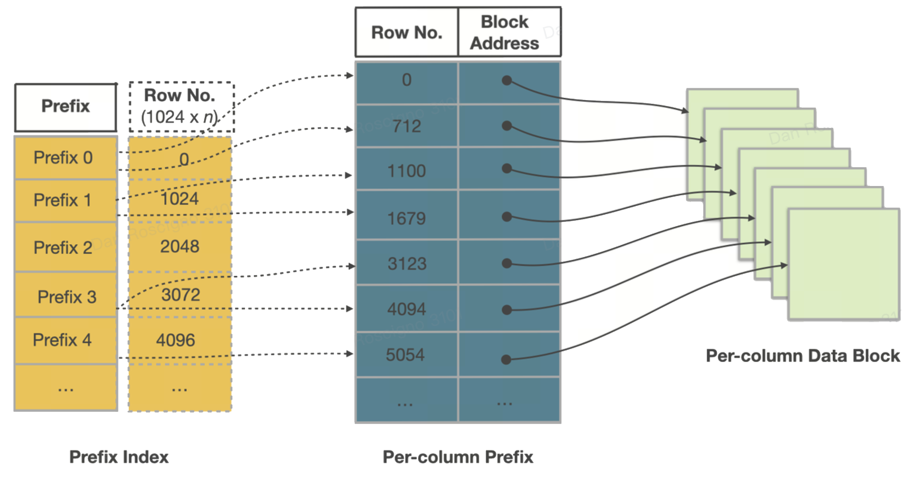

# Table clustering

A thoughtful sort‑key is the highest‑leverage physical‑design knob in StarRocks. This guide explains how the sort key works under the hood, the systemic benefits it unlocks, and a concrete playbook for picking an effective key for your own workload.

## Example
Suppose you run a telemetry system that receives billions of rows per day, each tagged with a `device_id` and `ts` (timestamp). Defining `ORDER BY (device_id, ts)` on your fact table ensures:

- Point queries on `device_id` return in milliseconds.
- Dashboards filter recent time windows for each device prune most data.
- Aggregations like `GROUP BY device_id` benefit from streaming aggregation.
- Compression improves due to runs of nearby timestamps per device.

This simple two-column sort key `ORDER BY (device_id, ts)`  delivers I/O reduction, CPU savings, and more stable query performance across billions of rows.

```sql
CREATE TABLE telemetry (
  device_id VARCHAR,
  ts DATETIME,
  value DOUBLE
)
ENGINE=OLAP
PRIMARY KEY(device_id, ts)
PARTITION BY date_trunc('day', ts)
DISTRIBUTED BY HASH(device_id) BUCKETS 16
ORDER BY (device_id, ts);
```
---

## Benefits in Depth

1. Massive I/O Elimination—Segment & Page Pruning

    How it works:

    Each segment and 64 KB page stores min/max values for all columns. If a predicate falls outside that range, StarRocks skips the entire chunk and never touches the disk.

    Example:

    ```sql
    SELECT count(*)
    FROM events
    WHERE tenant_id = 42
      AND ts BETWEEN '2025-05-01' AND '2025-05-07';
    ```

    With `ORDER BY (tenant_id, ts)` only the segments whose first key equals 42 are considered, and within them only the pages whose ts window overlaps those seven days. A 100 B‑row table may scan less than 1 B rows, turning minutes into seconds.

---
2. Millisecond Point  Look‑Ups—Sparse Prefix Index

    How it works:

    A sparse prefix index stores every ~1 Kth sort‑key value. A binary search lands on the right page, then a single disk read (often already cached) returns the row.

    Example:

    ```sql
    SELECT *
    FROM orders
    WHERE order_id = 982347234;
    ```

    With `ORDER BY (order_id)` the probe needs ≈ 50 key comparisons across a 50 B‑row table—sub‑10 ms latency even on cold data cache.

---
3. Faster Sorted Aggregation

    How it works:

    When the sort key aligns with the GROUP BY clause, StarRocks performs streaming aggregation as it scans—no sorting or hash-table needed.
    
    This sorted-aggregation plan scans rows in sort-key order and emits groups on the fly, exploiting CPU cache locality and skipping intermediate materialisation.
    
    Example:

    ```sql
    SELECT device_id, COUNT(*)
    FROM   telemetry
    WHERE  ts BETWEEN '2025-01-01' AND '2025-01-31'
    GROUP  BY device_id;
    ```

    If the table is `ORDER BY (device_id, ts)`, the engine groups rows as they stream in—without building a hash table or re-sorting. For high-cardinality keys like device_id, this can reduce both CPU and memory usage dramatically.
    
    Streaming aggregation with sorted input typically improves throughput by 2–3× over hash-aggregation for large group cardinalities.

---
4. Higher  Compression &  Hotter  Caches

    How it works:

    Sorted data shows small deltas or long runs, accelerating dictionary, RLE, and frame‑of‑reference encodings. Compact pages stream sequentially through CPU caches.

    Example:

    A telemetry table sorted by (device_id, ts) achieved 1.8 × better compression (LZ4) and 25 % lower CPU/scan than the same data ingested unsorted.

---

## How the Sort Key Works

The impact of a sort key starts the moment a row is written and persists through every read‑time optimisation. This section walks through that lifecycle—write path ➜ storage hierarchy ➜ segment internals ➜ read path—to show how each layer compounds the value of ordering.

1.  Write Path
    1. Ingest: rows land in a MemTable, are sorted by the declared sort key, and then flushed as a new Rowset containing one or more ordered Segments.
    2. Compaction: Background cumulative/base jobs merge many small Rowsets into larger ones, reclaiming deletes and lowering segment count without re‑sorting, because every source Rowset already shares the same order.
    3. Replication: Each Tablet (the shard that owns the Rowset) is synchronously replicated to peer Back‑End nodes, guaranteeing that sorted order is consistent across replicas.

   

2. Storage Hierarchy

| Object      | What it is     | Why is matters for the sort key |
| ------------- | ------------- | ------------------------------ |
| Partition | A coarse‑grained logical slice of a table (e.g., date or tenant_id). | Enables planner‑time partition pruning and isolates lifecycle ops (TTL, bulk load). |
| Tablet | A hash/random bucket within a partition, independently replicated across Back‑End nodes. | Unit whose rows are physically ordered by the sort key; all intra‑partition pruning starts here. |
| MemTable | In‑memory write buffer (~96 MB) that sorts by the declared key before flushing to disk. | Guarantees that every on‑disk Segment is already ordered—No external sort needed later. |
| Rowset | Immutable bundle of one or more Segments produced by a flush, streaming load, or compaction cycle. | Append‑only design lets StarRocks ingest concurrently while readers stay lock‑free. |
| Segment | Self‑contained columnar file (~512 MB) inside a Rowset carrying data pages plus pruning indexes. | Segment‑level zone‑maps and prefix indexes rely on the order established at the MemTable stage. |

3.  Inside a Segment File

   

Each Segment is self‑describing. From top to bottom you’ll find:

    - Column data pages 64 KB blocks encoded (Dictionary, RLE, Delta) and compressed (LZ4 default).
    - Ordinal index Maps a row ordinal → page offset so the engine can jump directly to page n.
    - Zone‑map index min, max, and has_null per page and for the whole Segment—first line of defence for pruning.
    - Short‑key (prefix) index Sparse binary‑search table of the first 36 bytes of the sort key every ~1 K rows—enables millisecond point/range seeks.
    - Footer & magic number Offsets to every index and a checksum for integrity; lets StarRocks memory‑map just the tail to discover the rest.

Because the pages are already sorted by the key, those indexes are tiny yet brutally effective.

4. Read Path

    1. Partition pruning (planner‑time) If the WHERE clause constrains the partition key (e.g. `dt BETWEEN '2025‑05‑01' AND '2025‑05‑07'`), the optimizer opens only matching partition directories.
    2. Tablet pruning(planner-time) When the equality filter includes the hash distribution column, StarRocks computes the target tablet IDs and schedules just those Tablets.
    3. Prefix‑index seek A sparse short‑key index on the leading sort columns homes in on the exact segment or page.
    4. Zone‑map pruning min/max metadata per Segment and 64 KB page discards blocks that miss the predicate window.
    5. Vectorized scan & late materialization Surviving column pages stream sequentially through CPU caches; only referenced rows&columns are materialized, keeping memory tight.

    Because data is committed in key order on every flush, each read‑time pruning layer compounds on the one before it, delivering sub‑second scans on multi‑billion‑row tables.

---
## How to Choose an Effective Sort Key

1.  Start with Workload Intelligence

    Analyse the top‑N query patterns first:

    - Equality predicates (`=` / `IN`). Columns almost always filtered by equality make ideal leading candidates.
    - Range predicates. Timestamps and numeric ranges typically follow equality columns in the sort key.
    - Aggregation keys. If a range column also appears in `GROUP BY` clauses, placing it earlier in the key (after selective filters) can enable sorted aggregation.
    - Join/group-by keys. Consider placing join or grouping keys early if they are common

    Measure column cardinality: high‑cardinality columns (millions of distinct values) prune best. 

2.  Heuristics & Rules of Thumb

    1. Order rule:  (high‑selectivity equality columns) → (primary range column) → (cluster helpers).
    2. Cardinality Ordering: Placing low-cardinality columns before high-cardinality columns can enhance data compression.
    3. Width: Keep to 3‑5 columns. Very wide keys slow ingest and overflow the 36‑byte prefix‑index limit.
    4. String columns: a long leading string column may occupy most or all of the 36-byte limit in the prefix index, preventing subsequent columns in the sort key from being indexed effectively.

    This reduces the pruning power of the prefix index and degrades point query performance.

3.  Coordinate with Other Design Knobs
    - Partitioning: Choose a partition key that is coarser than the leading sort column (for example, `PARTITION BY date`, `ORDER BY (tenant_id, ts)`). That way partition pruning removes whole date ranges first, and sort pruning cleans up inside.
    - Bucketing: Using the same columns for both bucketing and clustering serves different purposes. Bucketing ensures even data distribution across the cluster, while sorting enables efficient I/O elimination.
    - Table type: Primary-Key tables default to using the primary key as the sort key, but they can also specify additional columns to refine physical order and enhance pruning. Aggregate and duplicate tables should follow the analytic predicate-driven sort key strategies discussed above.

---
4.  Reference Templates

| Scenario | Partition | Sort Key | Rationale |
| -------- | --------- | -------- | --------- |
| B2C Orders | date_trunc('day', order_ts) | (user_id, order_ts) | Most queries filter by user first, then recent time ranges.| 
| IoT Telemetry| date_trunc('day', ts)| (device_id, ts) | Device‑scoped time‑series reads dominate. | 
| SaaS Multi‑Tenant | tenant_id | (dt, event_id) | Tenant isolation via partition; sort clusters by day for dashboards. | 
| Dimension Lookup | none | (dim_id) | Small table, pure point look‑ups—single‑column suffices. |

---
## Conclusion

A well‑designed sort key trades a small, predictable ingest overhead for dramatic improvements in scan latency, storage efficiency, and CPU utilisation. By grounding your choice in workload realities, respecting cardinality, and validating with `EXPLAIN`, you can keep StarRocks humming even as data and user counts grow 10× and beyond.