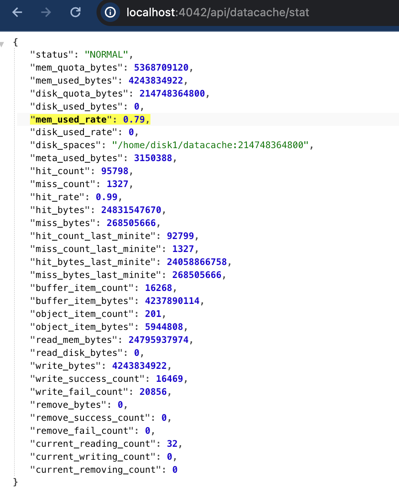

# Data Cache observability

In earlier versions, there are no rich metrics or efficient methods to monitor the performance, usage, and health of [Data Cache](./data_cache.md).

In v3.3, StarRocks improves the observability of Data Cache by offering efficient monitoring methods and more metrics. Users can now check the overall disk and memory usage of the data cache, and related metrics, enhancing monitoring of cache usage.

## SQL commands

You can run SQL commands to view the capacity and usage of Data Cache on each BE node.

### SHOW BACKENDS

The `DataCacheMetrics` field records the used disk and memory space of Data Cache on a specific BE.

```SQL
mysql> show backends\G
*************************** 1. row ***************************
            BackendId: 10004
                   IP: XXX.XX.XX.XXX
        HeartbeatPort: 4450
               BePort: 4448
             HttpPort: 4449
             BrpcPort: 4451
        LastStartTime: 2023-12-13 20:09:30
        LastHeartbeat: 2023-12-13 20:10:43
                Alive: true
 SystemDecommissioned: false
ClusterDecommissioned: false
            TabletNum: 48
     DataUsedCapacity: 0.000 B
        AvailCapacity: 280.103 GB
        TotalCapacity: 1.968 TB
              UsedPct: 86.10 %
       MaxDiskUsedPct: 86.10 %
               ErrMsg:
              Version: datacache-heartbeat-c68caf7
               Status: {"lastSuccessReportTabletsTime":"2023-12-13 20:10:38"}
    DataTotalCapacity: 280.103 GB
          DataUsedPct: 0.00 %
             CpuCores: 104
    NumRunningQueries: 0
           MemUsedPct: 0.00 %
           CpuUsedPct: 0.0 %
     -- highlight-start
     DataCacheMetrics: Status: Normal, DiskUsage: 0.00GB/2.00GB, MemUsage: 0.00GB/30.46GB
     -- highlight-end
1 row in set (1.90 sec)
```

### information_schema

The `be_datacache_metrics` view in `information_schema` records the following Data Cache-related information.

```Bash
mysql> select * from information_schema.be_datacache_metrics;
+-------+--------+------------------+-----------------+-----------------+----------------+-----------------+----------------------------------------------------------------------------------------------+
| BE_ID | STATUS | DISK_QUOTA_BYTES | DISK_USED_BYTES | MEM_QUOTA_BYTES | MEM_USED_BYTES | META_USED_BYTES | DIR_SPACES                                                                                   |
+-------+--------+------------------+-----------------+-----------------+----------------+-----------------+----------------------------------------------------------------------------------------------+
| 10004 | Normal |       2147483648 |               0 |     32706263420 |              0 |               0 | [{"Path":"/home/disk1/datacache","QuotaBytes":2147483648}] |
+-------+--------+------------------+-----------------+-----------------+----------------+-----------------+----------------------------------------------------------------------------------------------+
1 row in set (5.41 sec)
```

- `BE_ID`: the BE ID
- `STATUS`: the BE status
- `DISK_QUOTA_BYTES`: the disk cache capacity configured by users, in bytes
- `DISK_USED_BYTES`: the disk cache space that has been used, in bytes
- `MEM_QUOTA_BYTES`: the memory cache capacity configured by users, in bytes
- `MEM_USED_BYTES`: the memory cache space that has been used, in bytes
- `META_USED_BYTES`: the space used to cache metadata
- `DIR_SPACES`: the cache path and its cache size

## API call

Since v3.3.2, StarRocks provides two APIs to get cache metrics, which reflect the cache state at different levels:

- `/api/datacache/app_stat`: the actual cache hit rate of queries, calculated as `Remote Read Bytes / (Remote Read Bytes + Data Cache Read Bytes)`.
- `/api/datacache/stat`: the underlying execution state of Data Cache. This interface is mainly used for maintenance and bottleneck identification of Data Cache. It does not reflect the actual hit rate of the query. Common users do not need to pay attention to this interface.

### View cache hit metrics

View the cache hit metrics by accessing the following API interface:

```bash
http://${BE_HOST}:${BE_HTTP_PORT}/api/datacache/app_stat
```

Return:

```bash
{
    "hit_bytes": 4008,
    "miss_bytes": 2004,
    "hit_rate": 0.67,
    "hit_bytes_last_minute": 4008,
    "miss_bytes_last_minute": 2004, "hit_rate": 0.67, "hit_bytes_last_minute": 4008,
    "hit_rate_last_minute": 0.67
}
```

| **Metric**             | **Description**                                      |
| ---------------------- | ---------------------------------------------------- |
| hit_bytes              | Number of bytes read from the cache.                 |
| miss_bytes             | Number of bytes read from remote storage.            |
| hit_rate               | Cache hit rate, calculated as `(hit_bytes / (hit_bytes + miss_bytes))`. |
| hit_bytes_last_minute  | Number of bytes read from the cache in the last minute. |
| miss_bytes_last_minute | Number of bytes read from the remote storage in the last minute. |
| hit_rate_last_minute   | Cache hit rate in the last minute.                   |

### View the underlying execution state of Data Cache

You can get more detailed metrics on the Data Cache by accessing the following API interfaces.

```Bash
http://${BE_HOST}:${BE_HTTP_PORT}/api/datacache/stat
```

The following figure shows the returned metrics.



### Metric description

| **Metric**             | **Description**                                              |
| ---------------------- | ------------------------------------------------------------ |
| status                 | The status of the Data Cache instance, including:`NORMAL`: The instance runs normally.`ABNORMAL`: Data cannot be read or written into the cache. The issue must be located using logs.`UPDATING`: The instance is being updated, such as the updating state during online scaling. |
| mem_quota_bytes        | The memory cache capacity configured by users, in bytes.     |
| mem_used_bytes         | The memory cache space that has been used, in bytes.         |
| mem_used_rate          | The actual memory cache usage, in percentages.               |
| disk_quota_bytes       | The disk cache capacity configured by users, in bytes.       |
| disk_used_bytes        | The disk cache space that has been used, in bytes.           |
| disk_used_rate         | The actual disk cache usage, in percentages.                 |
| disk_spaces            | The disk cache information configured by users, including each cache path and the cache size. |
| meta_used_bytes        | The space used to cache system metadata, in bytes.           |
| hit_count              | The number of cache hits.                                    |
| miss_count             | The number of cache misses.                                  |
| hit_rate               | The cache hit rate.                                          |
| hit_bytes              | The number of bytes that are hit in the cache.               |
| miss_bytes             | The number of bytes that are missed in the cache.            |
| hit_count_last_minute  | The number of cache hits in the last minute.                 |
| miss_count_last_minute | The number of cache misses in the last minute.               |
| hit_bytes_last_minute  | The number of types that are hit in the last minute.         |
| miss_bytes_last_minute | The number of types that are missed in the last minute.      |
| buffer_item_count      | The current number of Buffer instances in the cache. Buffer instances refer to common data caches, such as when reading part of the raw data from a remote file and caching the data directly in memory or on disks. |
| buffer_item_bytes      | The number of types used to cache the Buffer instance.       |
| read_mem_bytes         | The number of bytes read from the memory cache.              |
| read_disk_bytes        | The number of bytes read from the disk cache.                |
| write_bytes            | The number of bytes written to the cache.                    |
| write_success_count    | The number of successful cache writes.                       |
| write_fail_count       | The number of failed cache writes.                           |
| remove_bytes           | The number of deleted bytes.                                 |
| remove_success_count   | The number of successful deletes.                            |
| remove_fail_count      | The number of failed deletes.                                |
| current_reading_count  | The number of ongoing cache reads.                           |
| current_writing_count  | The number of ongoing cache writes.                          |
| current_removing_count | The number of ongoing cache deletes.                         |
