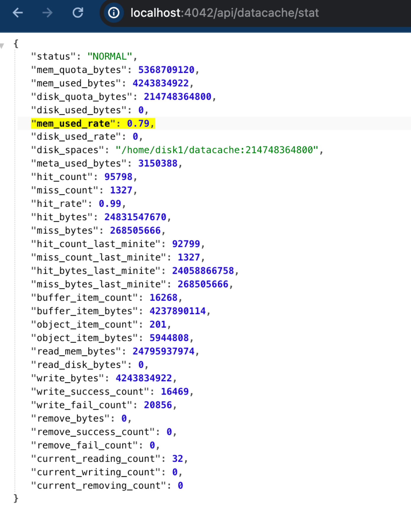

# Data Cache FAQ

This topic describes some frequently asked questions (FAQ) and common issues about Data Cache and provides troubleshooting steps and solutions to these issues.

## Enabling Data Cache

### How to confirm whether Data Cache is successfully enabled?

In most cases, you can check whether Data Cache is successfully enabled by any of the following methods:

- Execute `SHOW BACKENDS` (or `SHOW COMPUTE NODES`) from your SQL client, and check the value of `DataCacheMetrics`. You can confirm that Data Cache is enabled if the disk or memory cache quota is greater than 0.

```SQL
mysql> show backends \G
*************************** 1. row ***************************
            BackendId: 89041
                   IP: X.X.X.X
        HeartbeatPort: 9050
               BePort: 9060
             HttpPort: 8040
             BrpcPort: 8060
        LastStartTime: 2025-05-29 14:45:37
        LastHeartbeat: 2025-05-29 19:20:32
                Alive: true
 SystemDecommissioned: false
ClusterDecommissioned: false
            TabletNum: 10
     DataUsedCapacity: 0.000 B
        AvailCapacity: 1.438 TB
        TotalCapacity: 1.718 TB
              UsedPct: 16.27 %
       MaxDiskUsedPct: 16.27 %
               ErrMsg:
              Version: main-c15b412
               Status: {"lastSuccessReportTabletsTime":"2025-05-29 19:20:30"}
    DataTotalCapacity: 1.438 TB
          DataUsedPct: 0.00 %
             CpuCores: 8
             MemLimit: 50.559GB
    NumRunningQueries: 0
           MemUsedPct: 0.50 %
           CpuUsedPct: 0.2 %
     DataCacheMetrics: Status: Normal, DiskUsage: 44MB/1TB, MemUsage: 0B/0B
             Location:
           StatusCode: OK
1 row in set (0.00 sec)
```

In the above example, the disk cache quota of Data Cache is 1TB, and 44MB is currently in use; while the memory cache quota is 0B, thus memory cache is not enabled.

- You can access the BE Web Console (`http://${BE_HOST}:${BE_HTTP_PORT}/api/datacache/stat`) to check the current Data Cache quota, hit rate and other metrics. You can confirm that Data Cache is enbaled if `disk_quota_bytes` or `mem_quota_bytes` is greater than 0.



### Why is Data Cache not enabled by default?

From v3.3 onwards, BE will attempt to enable Data Cache upon startup. However, if there is insufficient space available on the current disk, Data Cache will not be enabled automatically.

It may be caused by the following situations:

- **Percentage**: The current disk usage is high.

- **Remaining space**: The remaining disk space size is relatively low.

Therefore, if Data Cache is not enabled by default, you can first check the current disk usage and increase disk capacity if necessary.

Alternatively, you can manually enable Data Cache by configuring cache quota based on the current available disk space.

```
# disable Data Cache Automatic Adjustment
datacache_auto_adjust_enable = false
# Set Data Cache disk quota manually
datacache_disk_size = 1T
```

## Using Data Cache

### What catalog types does Data Cache support?

Data Cache currently supports external catalog types that use StarRocks Native File Reader (such as Parquet/ORC/CSV Reader), including Hive, Iceberg, Hudi, Delta Lake, and Paimon. Catalogs that access data based on JNI (such as JDBC Catalog) are not supported yet.

:::note
Some catalogs may use different data access methods based on certain conditions (such as file type, and data status). For example, for the Paimon catalog, StarRocks may automatically choose whether to use Native File Reader or JNI to access data based on the compaction status of the current data. When JNI is used to access Paimon data, Data Cache acceleration is not supported.
:::

### How can I know that a query hits the cache?

You can check Data Cache-related metrics in the corresponding query profile. The metrics `DataCacheReadBytes` and `DataCacheReadCounter` indicates the local cache hit status.

```
 - DataCacheReadBytes: 518.73 MB
   - __MAX_OF_DataCacheReadBytes: 4.73 MB
   - __MIN_OF_DataCacheReadBytes: 16.00 KB
 - DataCacheReadCounter: 684
   - __MAX_OF_DataCacheReadCounter: 4
   - __MIN_OF_DataCacheReadCounter: 0
 - DataCacheReadTimer: 737.357us
 - DataCacheWriteBytes: 7.65 GB
   - __MAX_OF_DataCacheWriteBytes: 64.39 MB
   - __MIN_OF_DataCacheWriteBytes: 0.00
 - DataCacheWriteCounter: 7.887K (7887)
   - __MAX_OF_DataCacheWriteCounter: 65
   - __MIN_OF_DataCacheWriteCounter: 0
 - DataCacheWriteTimer: 23.467ms
   - __MAX_OF_DataCacheWriteTimer: 62.280ms
   - __MIN_OF_DataCacheWriteTimer: 0ns
```

### Why does a query miss the cache when Data Cache is enabled?

Follow these steps for troubleshooting:

1. Check whether Data Cache support the current catalog type.
2. Confirm whether the query statement meets the cache population conditions. In certain cases, Data Cache will reject cache population for some queries. For details, see [Data Cache Population Rules](./data_cache.md#population-rules).

The `EXPLAIN VERBOSE` command can be used to check whether a query triggers cache population.
Example:

```sql
mysql> EXPLAIN VERBOSE SELECT col1 FROM hudi_table;
|   0:HudiScanNode                        |
|      TABLE: hudi_table                  |
|      partitions=3/3                     |
|      cardinality=9084                   |
|      avgRowSize=2.0                     |
|      dataCacheOptions={populate: false} |
|      cardinality: 9084                  |
+-----------------------------------------+
```

In the above example, the `populate` field of the `dataCacheOptions` section is `false`, indicating the cache will not be populated for the query.

To enable Data Cache for such queries, you can modify the default population behavior by setting the system variable `populate_datacache_mode` to `always`.

## Data Cache Hit

### Why sometimes the same query needs to be executed multiple times before fully hitting the cache?

In the current version, Data Cache uses asynchronous population by default to reduce its impact on query performance. When using asynchronous population, the system will try to cache the accessed data in the background without affecting the read performance as much as possible. Therefore, executing a query for a single time can only cache a part of the data. You need to run the query for multiple times to cache all the data required by the query.

You can also use the synchronous cache population by setting `enable_datacache_async_populate_mode=false`, or warm up the target data in advance by `CACHE SELECT`.

### Why is it that all the data in the current query has been cached, but there is still a few data accessed remotely?

In the current version, I/O adaptation is enabled by default to optimize cache performance when disk I/O load is high, which may result in a small number of requests directly accessing the remote storage in some cases.

You can disable the I/O adaptation function by setting `enable_datacache_io-adapter` to `false`.

## Others

### How to clear the cached data?

Currently, Data Cache does not provide a direct interface to clear the cached data, but you can choose one of the following methods to clear it:

- You can clean up cached data by deleting all data (including block files and meta directories) in the `datacache` directory on the BE/CN nodes, and then restarting the nodes. (Recommended)

- If you want to avoid restarting the BE/CN nodes, you can also clean cached data indirectly by scaling down the cache quota during runtime. For example, if you have set the disk cache quota to 2TB earlier, you can first scale it down to 0 (the system will automatically clean up the cached data), and then reset it to 2TB. 

Example:

```SQL
UPDATE be_configs SET VALUE="0" WHERE NAME="datacache_disk_size" and BE_ID=10005;
UPDATE be_configs SET VALUE="2T" WHERE NAME="datacache_disk_size" and BE_ID=10005;
```

:::note
When cleaning cached data during runtime, be cautious with the `WHERE` condition in the statement to avoid accidentally damaging other irrelevant parameters or nodes.
:::

### How to improve Data Cache performance?

With Data Cache, StarRocks essentially accesses local memory or disk instead of the remote storage. Therefore, the performance is directly related to the local cache medium. If you find that cache access latency is high due to high disk load, you may consider improving the performance of the local cache medium:

- Prioritize using high-performance NVME disks as cache disks.

- If high-performance disks are not available, you can also increase the number of disks to share the I/O pressure.

- Increase the server memory of the BE/CN nodes (rather than the Data Cache memory quota), using the Page Cache of the operating system to reduce the number of direct disk accesses and the disk I/O pressure.
