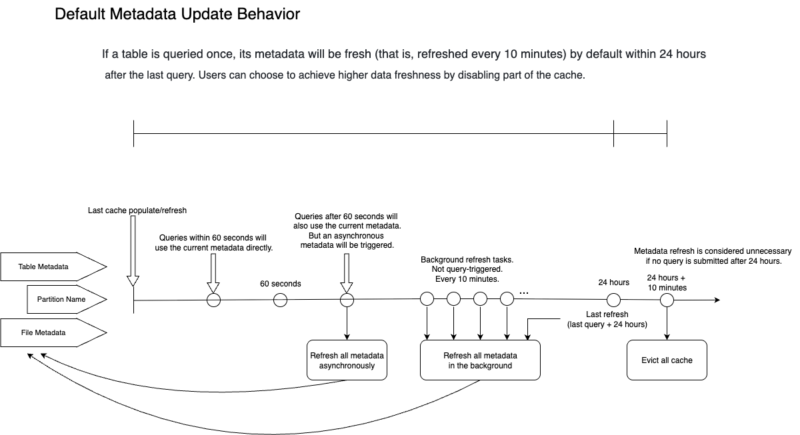
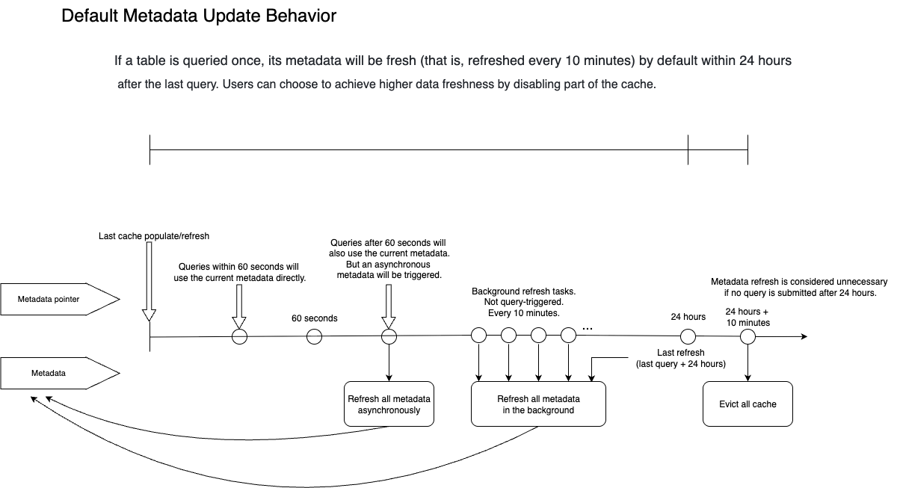

# Feature Support: Data Lake Analytics

From v2.3 onwards, StarRocks supports managing external data sources and analyzing data in data lakes via external catalogs.

This document outlines the feature support for external catalogs and the supported version of the features involved.

## Universal features

This section lists the universal features of the External Catalog feature, including storage systems, file readers, credentials, privileges, and Data Cache.

### External storage systems

| Storage System          | Supported Version |
| :---------------------- | :---------------- |
| HDFS                    | v2.3+             |
| AWS S3                  | v2.3+             |
| Microsoft Azure Storage | v3.0+             |
| Google GCS              | v3.0+             |
| Alibaba Cloud OSS       | v3.1+             |
| Huawei Cloud OBS        | v3.1+             |
| Tencent Cloud COS       | v3.1+             |
| Volcengine TOS          | v3.1+             |
| Kingsoft Cloud KS3      | v3.1+             |
| MinIO                   | v3.1+             |
| Ceph S3                 | v3.1+             |

In addition to the native support for the storage systems listed above, StarRocks also supports the following types of object storage services:

- **HDFS-compatible object storage services such as COS Cloud HDFS, OSS-HDFS, and OBS PFS**
  - **Description**: You need to specify the object storage URI prefix in the BE configuration item `fallback_to_hadoop_fs_list`, and upload the .jar package provided by the cloud vendor to the directory **/lib/hadoop/hdfs/**. Note that you must create the external catalog using the prefix you specified in `fallback_to_hadoop_fs_list`.
  - **Supported Version(s)**: v3.1.9+, v3.2.4+
- **S3-compatible object storage services other than those listed above**
  - **Description**: You need to specify the object storage URI prefix in the BE configuration item `s3_compatible_fs_list`. Note that you must create the external catalog using the prefix you specified in `s3_compatible_fs_list`.
  - **Supported Version(s)**: v3.1.9+, v3.2.4+

### Compression formats

This section only lists the compression formats supported by each file format. For the file formats supported by each external catalog, please refer to the section on the corresponding external catalog.

| File Format  | Compression Formats                                          |
| :----------- | :----------------------------------------------------------- |
| Parquet      | NO_COMPRESSION, SNAPPY, LZ4, ZSTD, GZIP, LZO (v3.1.5+)       |
| ORC          | NO_COMPRESSION, ZLIB, SNAPPY, LZO, LZ4, ZSTD                 |
| Text         | NO_COMPRESSION, LZO (v3.1.5+)                                |
| Avro         | NO_COMPRESSION (v3.2.1+), DEFLATE (v3.2.1+), SNAPPY (v3.2.1+), BZIP2 (v3.2.1+) |
| RCFile       | NO_COMPRESSION (v3.2.1+), DEFLATE (v3.2.1+), SNAPPY (v3.2.1+), GZIP (v3.2.1+) |
| SequenceFile | NO_COMPRESSION (v3.2.1+), DEFLATE (v3.2.1+), SNAPPY (v3.2.1+), BZIP2 (v3.2.1+), GZIP (v3.2.1+) |

:::note

The Avro, RCFile, and SequenceFile file formats are read by Java Native Interface (JNI) instead of the native readers within StarRocks. Therefore, the read performance for these file formats may not be as good as that of Parquet and ORC.

:::

### Management, credential, and access control

| Feature                                  | Description                                                  | Supported Version(s) |
| :--------------------------------------- | :----------------------------------------------------------- | :------------------- |
| Information Schema                       | Supports Information Schema for external catalogs.           | v3.2+                |
| Data lake access control                 | Supports StarRocks' native RBAC model for external catalogs. You can manage the privileges of databases, tables, and views (currently, Hive views and Iceberge views only) in external catalogs just like those in the default catalog of StarRocks. | v3.0+                |
| Reuse external services on Apache Ranger | Supports reusing the external service (such as the Hive Service) on Apache Ranger for access control. | v3.1.9+              |
| Kerberos authentication                  | Supports Kerberos authentication for HDFS or Hive Metastore. | v2.3+                |

### Data Cache

| Feature                                      | Description                                                  | Supported Version(s) |
| :------------------------------------------- | :----------------------------------------------------------- | :------------------- |
| Data Cache (Block Cache)                     | From v2.5 onwards, StarRocks supported the Data Cache feature (then called Block Cache) implemented using CacheLib, which led to limited optimization potential for its extensibility. Starting from v3.0, StarRocks refactored the cache implementation and added new features to Data Cache, resulting in better performance with each subsequent version. | v2.5+                |
| Data rebalancing among local disks           | Supports data rebalancing strategy to ensure that data skew is controlled under 10%. | v3.2+                |
| Replace Block Cache with Data Cache          | **Parameter changes** BE Configurations:<ul><li>Replace `block_cache_enable` with `datacache_enable`.</li><li>Replace `block_cache_mem_size` with `datacache_mem_size`.</li><li>Replace `block_cache_disk_size` with `datacache_disk_size`.</li><li>Replace `block_cache_disk_path` with `datacache_disk_path`.</li><li>Replace `block_cache_meta_path` with `datacache_meta_path`.</li><li>Replace `block_cache_block_size` with `datacache_block_size`.</li></ul>Session Variables:<ul><li>Replace `enable_scan_block_cache` with `enable_scan_datacache`.</li><li>Replace `enable_populate_block_cache` with `enable_populate_datacache`.</li></ul>After the cluster is upgraded to a version where Data Cache is available, the Block Cache parameters still take effect. The new parameters will override the old ones once Data Cache is enabled. The mixed usage of both groups of parameters is not allowed. Otherwise, some parameters will not take effect. | v3.2+                |
| New metrics for API that monitors Data Cache | Supports an individual API that monitors Data Cache including the cache capacity and hits. You can view Data Cache metrics via the interface `http://${BE_HOST}:${BE_HTTP_PORT}/api/datacache/stat`. | v3.2.3+              |
| Memory Tracker for Data Cache                | Supports Memory Tracker for Data Cache. You can view the memory-related metrics via the interface `http://${BE_HOST}:${BE_HTTP_PORT}/mem_tracker`. | v3.1.8+              |
| Data Cache Warmup                            | By executing CACHE SELECT, you can proactively populate the cache with the desired data from remote storage in advance to prevent the first query from taking too much time fetching the data. CACHE SELECT will not print data or incur calculations. It only fetches data. | v3.3+                |

## Hive Catalog

### Metadata

While executing queries against Hive data through Hive catalogs, StarRocks will cache the table metadata, to reduce the costs from frequent access to the remote storage. This mechanism ensures query performance while maintaining data freshness through the asynchronous refresh and expiration policy.

### Cached metadata

StarRocks will cache the following metadata during queries:

- **Table- or partition-level metadata**
  - Content: 
    - Table information: database, table schema, column names, and partition keys 
    - Partition information: partition list, and partition location
  - Influence: detecting the table existence (whether a table is deleted and/or recreated)
  - Catalog properties: 
    - `enable_metastore_cache`: Controls whether to enable the metastore cache. Default value: `true`.
    - `metastore_cache_refresh_interval_sec`: Controls the time interval at which the cached metadata is considered fresh. Default value: `60`. Unit: Seconds.
  - Location: Metastore (HMS or Glue)

- **Partition name list**
  - Content: List of partition names used to find and prune partitions. Although the partition name list has been collected as the partition information in the above section, there is a separate configuration to enable or disable this feature under certain circumstances. 
  - Influence: detecting the partition existence (whether there is a new partition or a partition is deleted and/or recreated)
  - Catalog properties: 
    - `enable_cache_list_names`: Controls whether to enable the partition name list cache. Default value: `true`.
    - `metastore_cache_refresh_interval_sec`: Controls the time interval at which the cached metadata is considered fresh. Default value: `60`. Unit: Seconds.
  - Location: Metastore (HMS or Glue)

- **File-level metadata**
  - Content: Paths to files under the partition folder.
  - Influence: Load data into an existing partition.
  - Catalog properties: 
    - `enable_remote_file_cache`: Controls whether to enable the metadata cache for files in the remote storage. Default value: `true`.
    - `remote_file_cache_refresh_interval_sec`: Controls the time interval at which the file metadata is considered fresh. Default value: `60`. Unit: Seconds.
    - `remote_file_cache_memory_ratio`: Controls the ratio of memory that can be used for the file metadata cache. Default value: `0.1` (10%).
  - Location: Remote storage (HDFS or S3)

### Asynchronous update policy

The following FE configuration item controls the asynchronous metadata update policy:

| Configuration item                                           | Default                              | Description                          |
| ------------------------------------------------------------ | ------------------------------------ | ------------------------------------ |
| enable_background_refresh_connector_metadata                 | `true` in v3.0 `false` in v2.5  | Whether to enable the periodic metadata cache refresh. After it is enabled, StarRocks polls the metastore, and refreshes the cached metadata of the frequently accessed external catalogs to perceive data changes. `true` indicates to enable the Hive metadata cache refresh, and `false` indicates to disable it. This item is an [FE dynamic parameter](../administration/management/FE_configuration.md#configure-fe-dynamic-parameters). You can modify it using the [ADMIN SET FRONTEND CONFIG](../sql-reference/sql-statements/cluster-management/config_vars/ADMIN_SET_CONFIG.md) command. |
| background_refresh_metadata_interval_millis                  | `600000` (10 minutes)                | The interval between two consecutive metadata cache refreshes. Unit: millisecond. This item is an [FE dynamic parameter](../administration/management/FE_configuration.md#configure-fe-dynamic-parameters). You can modify it using the [ADMIN SET FRONTEND CONFIG](../sql-reference/sql-statements/cluster-management/config_vars/ADMIN_SET_CONFIG.md) command. |
| background_refresh_metadata_time_secs_since_last_access_secs | `86400` (24 hours)                   | The expiration time of a metadata cache refresh task. For the external catalog that has been accessed, if it has not been accessed for more than the specified time, StarRocks stops refreshing its cached metadata. For the external catalog that has not been accessed, StarRocks will not refresh its cached metadata. Unit: second. This item is an [FE dynamic parameter](../administration/management/FE_configuration.md#configure-fe-dynamic-parameters). You can modify it using the [ADMIN SET FRONTEND CONFIG](../sql-reference/sql-statements/cluster-management/config_vars/ADMIN_SET_CONFIG.md) command. |

### Metadata cache behavior

This section uses the default behavior to explain the metadata behavior during metadata updates and queries.

By default, when a table is queried, StarRocks caches the metadata of the table, partitions, and files, and keeps it active for the next 24 hours. During the 24 hours, the system will ensure that the cache is refreshed at least every 10 minutes (note that 10 minutes is the estimated time for a metadata refresh round. If there are excessive external tables that are pending metadata refresh, the overall metadata refresh interval may be longer than 10 minutes). If a table has not been accessed for more than 24 hours, StarRocks discards the associated metadata. In other words, any query you make within 24 hours will, at worst, use metadata from 10 minutes ago.

In details:

1. Suppose the first query involves the partition `P1` of table `A`. StarRocks caches table-level metadata, partition name lists, and file path information under `P1`. The cache is synchronously populated while the query is executed.
2. If a second query is submitted within 60 seconds after the cache is populated, and hits the partition `P1` of table `A`, StarRocks uses the metadata cache directly, and at this point StarRocks considers all cached metadata to be fresh (`metastore_cache_refresh_interval_sec` and `remote_file_cache_refresh_interval_sec` control the time window in which StarRocks considers metadata to be fresh).
3. If a third query is submitted after 90 seconds, and hits the partition `P1` of table `A`, StarRocks will still use the metadata cache directly to complete the query. However, since it has been more than 60 seconds since the last metadata refresh, StarRocks will consider the metadata to be expired. So StarRocks will start an asynchronous refresh for the expired metadata. The asynchronous refresh will not affect the result of the current query because the query will still use the outdated metadata.
4. Because the partition `P1` of table `A` has been queried, it is estimated that the metadata will be refreshed every 10 minutes (controlled by `background_refresh_metadata_interval_millis`) for the next 24 hours (controlled by `background_refresh_metadata_time_secs_since_last_access_secs`). The actual interval between rounds of the metadata refresh also depends on the overall pending refresh tasks within the system.
5. If table `A` is not involved in any query within 24 hours, StarRocks will remove its metadata cache after 24 hours.

### Best practices

Hive Catalog's support for Hive Metastore (HMS) and AWS Glue mostly overlaps except that the automatic incremental update feature for HMS is not recommended. The default configuration is recommended in most cases.

The performance of metadata retrieval largely depends on the performance of the user's HMS or HDFS NameNode. Please consider all factors and base your judgment on test results.

- **[Default and Recommended] Best performance with a tolerance of minute-level data inconsistency**
  - **Configuration**: You can use the default setting. Data updated within 10 minutes (by default) is not visible. Old data will be returned to queries within this duration.
  - **Advantage**: Best query performance.
  - **Disadvantage**: Data inconsistency caused by latency.
  - **Supported Version(s)**: v2.5.5+ (Disabled by default in v2.5 and enabled by default in v3.0+)
- **Instant visibility of newly loaded data (files) without manual refresh**
  - **Configuration**: Disable the cache for the metadata of the underlying data files by setting the catalog property `enable_remote_file_cache` to `false`.
  - **Advantage**: Visibility of file changes with no delay.
  - **Disadvantage**: Lower performance when the file metadata cache is disabled. Each query must access the file list.
  - **Supported Version(s)**: v2.5.5+
- **Instant visibility of partition changes without manual refresh**
  - **Configuration**: Disable the cache for the Hive partition names by setting the catalog property `enable_cache_list_names` to `false`.
  - **Advantage**: Visibility of partition changes with no delay
  - **Disadvantage**: Lower performance when the partition name cache is disabled. Each query must access the partition list.
  - **Supported Version(s)**: v2.5.5+

:::tip

If you demand real-time updates on the data changes whilst the performance of your HMS is not optimized, you can enable the cache, disable the automatic incremental update, and manually refresh the metadata (using REFRESH EXTERNAL TABLE) via a scheduling system whenever there is a data change upstream.

:::

### Storage system

| Feature                         | Description                                                  | Supported Version(s)  |
| :------------------------------ | :----------------------------------------------------------- | :-------------------- |
| Recursive sub-directory listing | Enable recursive sub-directory listing by setting the Catalog property `enable_recursive_listing` to `true`. When recursive listing is enabled, StarRocks will read data from a table and its partitions and from the subdirectories within the physical locations of the table and its partitions. This feature is designed to address the issue of multi-layer nested directories. | v2.5.9+ v3.0.4+ (Disabled by default in v2.5 and v3.0, and enabled by default in v3.1+) |

### File formats and data types

#### File formats

| Feature | Supported File Formats                         |
| :------ | :--------------------------------------------- |
| Read    | Parquet, ORC, TEXT, Avro, RCFile, SequenceFile |
| Sink    | Parquet (v3.2+), ORC (v3.3+), TEXT (v3.3+)     |

#### Data types

INTERVAL, BINARY, and UNION types are not supported.

TEXT-formatted Hive table does not support MAP and STRUCT types.

### Hive views

StarRocks supports querying Hive views from v3.1.0 onwards.

:::note While StarRocks executes queries against a Hive view, it will try to parse the definition of the view using the syntax of StarRocks and Trino. An error will be returned if StarRocks cannot parse the definition of the view. There is a possibility that StarRocks failed to parse the Hive views created with functions exclusive to Hive or Spark.

:::

### Query statistics interfaces

| Feature                                                       | Supported Version(s) |
| :------------------------------------------------------------ | :------------------- |
| Supports SHOW CREATE TABLE to view Hive table schema          | v3.0+                |
| Supports ANALYZE to collect statistics                        | v3.2+                |
| Supports collecting histograms and STRUCT subfield statistics | v3.3+                |

### Data sinking

| Feature                | Supported Version(s) | Note                                                         |
| :--------------------- | :------------------- | :----------------------------------------------------------- |
| CREATE DATABASE        | v3.2+                | You can choose to specify the location for a database created in Hive or not. If you do not specify the location for the database, you will need to specify the location for the tables created under the database. Otherwise, an error will be returned. If you have specified the location for the database, tables without the location specified will inherit the location of the database. And if you have specified locations for both the database and the table, the table's location will take effect eventually. |
| CREATE TABLE           | v3.2+                | For both partitioned and non-partitioned tables.             |
| CREATE TABLE AS SELECT | v3.2+                |                                                              |
| INSERT INTO/OVERWRITE  | v3.2+                | For both partitioned and non-partitioned tables.             |
| CREATE TABLE LIKE      | v3.2.4+              |                                                              |
| Sink file size         | v3.3+                | You can define the maximum size of each data file to be sunk using the session variable `connector_sink_target_max_file_size`. |

## Iceberg Catalog

### Metadata

While executing queries against Iceberg data through Iceberg catalogs, StarRocks will cache the table metadata, to reduce the costs from frequent access to the remote storage. This mechanism ensures query performance while maintaining data freshness through the asynchronous refresh and expiration policy.

### Cached metadata

StarRocks will cache the following metadata during queries:

- **Metadata pointer cache**
  - Content: JSON file of the metadata pointer
    - Snapshot ID
    - Location of the manifest lists
  - Influence: detecting data changes (If a data changes occurs, the snapshot ID will change.)
  - Catalog properties: 
    - `enable_iceberg_metadata_cache`: Controls whether to enable the Iceberg metadata cache. Default value: `true`.
    - `iceberg_table_cache_refresh_interval_sec`: Controls the time interval at which the cached metadata is considered fresh. Default value: `60`. Unit: Seconds.

- **Metadata cache**
  - Content:
    - Manifest for data file path
    - Manifest for delete file path
    - Database
    - Partition (for materialized view rewrite)
  - Influence: 
    - Will not affect the data freshness for queries because the manifests for data or delete files cannot be changed.
    - May affect materialized view rewrite, causing queries to miss the materialized view. The partition metadata will be deleted when the snapshot ID is refreshed. Therefore, the new snapshot ID lacks partition metadata, causing misses of the materialized view rewrite.
  - Catalog properties: 
    - `enable_cache_list_names`: Controls whether to enable the partition name list cache. Default value: `true`.
    - `metastore_cache_refresh_interval_sec`: Controls the time interval at which the cached metadata is considered fresh. Default value: `60`. Unit: Seconds.
    - `iceberg_data_file_cache_memory_usage_ratio`: Controls the ratio of memory that can be used for the data file metadata cache. Default value: `0.1` (10%).
    - `iceberg_delete_file_cache_memory_usage_ratio`: Controls the ratio of memory that can be used for the delete file metadata cache. Default value: `0.1` (10%).

### Asynchronous update policy

The following FE configuration item controls the asynchronous metadata update policy:

| Configuration item                                           | Default                              | Description                          |
| ------------------------------------------------------------ | ------------------------------------ | ------------------------------------ |
| enable_background_refresh_connector_metadata                 | `true` in v3.0 `false` in v2.5  | Whether to enable the periodic metadata cache refresh. After it is enabled, StarRocks polls the metastore, and refreshes the cached metadata of the frequently accessed external catalogs to perceive data changes. `true` indicates to enable the Hive metadata cache refresh, and `false` indicates to disable it. This item is an [FE dynamic parameter](../administration/management/FE_configuration.md#configure-fe-dynamic-parameters). You can modify it using the [ADMIN SET FRONTEND CONFIG](../sql-reference/sql-statements/cluster-management/config_vars/ADMIN_SET_CONFIG.md) command. |
| background_refresh_metadata_interval_millis                  | `600000` (10 minutes)                | The interval between two consecutive metadata cache refreshes. Unit: millisecond. This item is an [FE dynamic parameter](../administration/management/FE_configuration.md#configure-fe-dynamic-parameters). You can modify it using the [ADMIN SET FRONTEND CONFIG](../sql-reference/sql-statements/cluster-management/config_vars/ADMIN_SET_CONFIG.md) command. |
| background_refresh_metadata_time_secs_since_last_access_secs | `86400` (24 hours)                   | The expiration time of a metadata cache refresh task. For the external catalog that has been accessed, if it has not been accessed for more than the specified time, StarRocks stops refreshing its cached metadata. For the external catalog that has not been accessed, StarRocks will not refresh its cached metadata. Unit: second. This item is an [FE dynamic parameter](../administration/management/FE_configuration.md#configure-fe-dynamic-parameters). You can modify it using the [ADMIN SET FRONTEND CONFIG](../sql-reference/sql-statements/cluster-management/config_vars/ADMIN_SET_CONFIG.md) command. |

### Metadata cache behavior

This section uses the default behavior to explain the metadata behavior during metadata updates and queries.

By default, when a table is queried, StarRocks caches the metadata of the table, and keeps it active for the next 24 hours. During the 24 hours, the system will ensure that the cache is refreshed at least every 10 minutes (note that 10 minutes is the estimated time for a metadata refresh round. If there are excessive external tables that are pending metadata refresh, the overall metadata refresh interval may be longer than 10 minutes). If a table has not been accessed for more than 24 hours, StarRocks discards the associated metadata. In other words, any query you make within 24 hours will, at worst, use metadata from 10 minutes ago.

In details:

1. Suppose the first query involves the table `A`. StarRocks caches its latest snapshot and metadata. The cache is synchronously populated while the query is executed.
2. If a second query is submitted within 60 seconds after the cache is populated, and hits the table `A`, StarRocks uses the metadata cache directly, and at this point StarRocks considers all cached metadata to be fresh (`iceberg_table_cache_refresh_interval_sec` controls the time window in which StarRocks considers metadata to be fresh).
3. If a third query is submitted after 90 seconds, and hits the table `A`, StarRocks will still use the metadata cache directly to complete the query. However, since it has been more than 60 seconds since the last metadata refresh, StarRocks will consider the metadata to be expired. So StarRocks will start an asynchronous refresh for the expired metadata. The asynchronous refresh will not affect the result of the current query because the query will still use the outdated metadata.
4. Because the table `A` has been queried, it is estimated that the metadata will be refreshed every 10 minutes (controlled by `background_refresh_metadata_interval_millis`) for the next 24 hours (controlled by `background_refresh_metadata_time_secs_since_last_access_secs`). The actual interval between rounds of the metadata refresh also depends on the overall pending refresh tasks within the system.
5. If table `A` is not involved in any query within 24 hours, StarRocks will remove its metadata cache after 24 hours.

### Best practices

Iceberg Catalog supports HMS, Glue, and Tabular as its metastore. The default configuration is recommended in most cases.

Please note that the default value of the session variable `enable_iceberg_metadata_cache` has been changed to accommodate different scenarios:

- From v3.2.1 to v3.2.3, this parameter is set to `true` by default, regardless of what metastore service is used.
- In v3.2.4 and later, if the Iceberg cluster uses AWS Glue as metastore, this parameter still defaults to `true`. However, if the Iceberg cluster uses other metastore services such as Hive metastore, this parameter defaults to `false`.
- From v3.3.0 onwards, the default value of this parameter is set to `true` again because StarRocks supports the new Iceberg metadata framework. Iceberg Catalog and Hive Catalog now use the same metadata polling mechanism and FE configuration item `background_refresh_metadata_interval_millis`.

| Feature                                                      | Supported Version(s) |
| :----------------------------------------------------------- | :------------------- |
| Distributed metadata plan (Recommended for scenarios with a large volume of metadata) | v3.3+                |
| Manifest Cache (Recommended for scenarios with a small volume of metadata but high demand on latency) | v3.3+                |

From v3.3.0 onwards, StarRocks supports the metadata reading and caching policies described above. The system will automatically adjust the choice of policy according to the machines in your cluster. Usually, you do not need to change it. Since metadata caching is enabled, it is possible that metadata freshness may be compromised due to performance considerations. Therefore, you can adjust it according to your specific query requirements:

- **[Default and recommended] Optimal performance with tolerance of minute-level data inconsistencies**
  - **Setting**: No additional setting is required. By default, data updated within 10 minutes is not visible. During this time, queries will return old data.
  - **Advantages**: Best query performance.
  - **Disadvantage**: data inconsistency caused by delays.
- **New data files generated by import and partition additions or deletions are immediately visible, and no manual refresh is required**
  - **Setting**: Set the Catalog property `iceberg_table_cache_ttl_sec` to `0` to allow StarRocks to fetch a new snapshot for each query.
  - **Advantages**: File and partition changes are visible without delay.
  - **Disadvantage**: Lower performance due to the snapshot fetching behavior for each query.

### File formats

| Feature | Supported File Formats |
| :------ | :--------------------- |
| Read    | Parquet, ORC           |
| Sink    | Parquet                |

- Both Parquet-formatted and ORC-formatted Iceberg V1 tables support position deletes and equality deletes.
- ORC-formatted Iceberg V2 tables support position deletes from v3.0.0, and Parquet-formatted ones support position deletes from v3.1.0.
- ORC-formatted Iceberg V2 tables support equality deletes from v3.1.8 and v3.2.3, and Parquet-formatted ones support equality deletes from v3.2.5.

### Iceberg views

StarRocks supports querying Iceberg views from v3.3.2 onwards and creating Iceberg views since v3.5.

Currently, only Iceberg views created through StarRocks are supported. Starting with v3.5, adding StarRocks syntax style definitions to existing Iceberg views is supported.

### Query statistics interfaces

| Feature                                                       | Supported Version(s) |
| :------------------------------------------------------------ | :------------------- |
| Supports SHOW CREATE TABLE to view Iceberg table schema       | v3.0+                |
| Supports ANALYZE to collect statistics                        | v3.2+                |
| Supports collecting histograms and STRUCT subfield statistics | v3.3+                |

### Data sinking

| Feature                | Supported Version(s) | Note                                                         |
| :--------------------- | :------------------- | :----------------------------------------------------------- |
| CREATE DATABASE        | v3.1+                | You can choose to specify the location for a database created in Iceberg or not. If you do not specify the location for the database, you will need to specify the location for the tables created under the database. Otherwise, an error will be returned. If you have specified the location for the database, tables without the location specified will inherit the location of the database. And if you have specified locations for both the database and the table, the table's location will take effect eventually. |
| CREATE TABLE           | v3.1+                | For both partitioned and non-partitioned tables.             |
| CREATE TABLE AS SELECT | v3.1+                |                                                              |
| INSERT INTO/OVERWRITE  | v3.1+                | For both partitioned and non-partitioned tables.             |

### Miscellaneous supports

| Feature                                                      | Supported Version(s) |
| :----------------------------------------------------------- | :------------------- |
| Supports reading TIMESTAMP-type partition formats `yyyy-MM-ddTHH:mm` and `yyyy-MM-dd HH:mm`. | v2.5.19+ v3.1.9+ v3.2.3+ |
| Supports Iceberg metadata table                              | v3.4.1+              |
| Supports Iceberg TimeTravel                                  | v3.4.0+              |

## Hudi Catalog

- StarRocks supports querying the Parquet-formatted data in Hudi, and supports SNAPPY, LZ4, ZSTD, GZIP, and NO_COMPRESSION compression formats for Parquet files.
- StarRocks fully supports Hudi's Copy On Write (COW) tables and Merge On Read (MOR) tables.
- StarRocks supports SHOW CREATE TABLE to view Hudi table schema from v3.0.0 onwards.
- StarRocks v3.5.0 supports Hudi 0.15.0.

## Delta Lake Catalog

- StarRocks supports querying the Parquet-formatted data in Delta Lake, and supports SNAPPY, LZ4, ZSTD, GZIP, and NO_COMPRESSION compression formats for Parquet files.
- StarRocks does not support querying the MAP-type and STRUCT-type data in Delta Lake.
- StarRocks supports SHOW CREATE TABLE to view Delta Lake table schema from v3.0.0 onwards.
- Currently, Delta Lake catalogs support the following table features:
  - V2 Checkpoint (From v3.3.0 onwards)
  - Timestamp without Timezone (From v3.3.1 onwards)
  - Column mapping (From v3.3.6 onwards)
  - Deletion Vector (From v3.4.1 onwards)

## JDBC Catalog

| Catalog type | Supported Version(s) |
| :----------- | :------------------- |
| MySQL        | v3.0+                |
| PostgreSQL   | v3.0+                |
| ClickHouse   | v3.3+                |
| Oracle       | v3.2.9+              |
| SQL Server   | v3.2.9+              |

### MySQL

| Feature        | Supported Version(s) |
| :------------- | :------------------- |
| Metadata cache | v3.3+                |

#### Data type correspondance

| MySQL             | StarRocks           | Supported Version(s) |
| :---------------- | :------------------ | :------------------- |
| BOOLEAN           | BOOLEAN             | v2.3+                |
| BIT               | BOOLEAN             | v2.3+                |
| SIGNED TINYINT    | TINYINT             | v2.3+                |
| UNSIGNED TINYINT  | SMALLINT            | v3.0.6+ v3.1.2+ |
| SIGNED SMALLINT   | SMALLINT            | v2.3+                |
| UNSIGNED SMALLINT | INT                 | v3.0.6+ v3.1.2+ |
| SIGNED INTEGER    | INT                 | v2.3+                |
| UNSIGNED INTEGER  | BIGINT              | v3.0.6+ v3.1.2+ |
| SIGNED BIGINT     | BIGINT              | v2.3+                |
| UNSIGNED BIGINT   | LARGEINT            | v3.0.6+ v3.1.2+ |
| FLOAT             | FLOAT               | v2.3+                |
| REAL              | FLOAT               | v3.0.1+              |
| DOUBLE            | DOUBLE              | v2.3+                |
| DECIMAL           | DECIMAL32           | v2.3+                |
| CHAR              | VARCHAR(columnsize) | v2.3+                |
| VARCHAR           | VARCHAR             | v2.3+                |
| TEXT              | VARCHAR(columnsize) | v3.0.1+              |
| DATE              | DATE                | v2.3+                |
| TIME              | TIME                | v3.1.9+ v3.2.4+ |
| TIMESTAMP         | DATETIME            | v2.3+                |

### PostgreSQL

#### Data type correspondance

| PGSQL     | StarRocks           | Supported Version(s) |
| :-------- | :------------------ | :------------------- |
| BIT       | BOOLEAN             | v2.3+                |
| SMALLINT  | SMALLINT            | v2.3+                |
| INTEGER   | INT                 | v2.3+                |
| BIGINT    | BIGINT              | v2.3+                |
| REAL      | FLOAT               | v2.3+                |
| DOUBLE    | DOUBLE              | v2.3+                |
| NUMERIC   | DECIMAL32           | v2.3+                |
| CHAR      | VARCHAR(columnsize) | v2.3+                |
| VARCHAR   | VARCHAR             | v2.3+                |
| TEXT      | VARCHAR(columnsize) | v2.3+                |
| DATE      | DATE                | v2.3+                |
| TIMESTAMP | DATETIME            | v2.3+                |
| UUID      | VARBINARY           | v3.5.3+              |

### ClickHouse 

Supported from v3.3.0 onwards.

### Oracle

Supported from v3.2.9 onwards.

### SQL Server

Supported from v3.2.9 onwards.

## Elasticsearch Catalog

Elasticsearch Catalog is supported from v3.1.0 onwards.

## Paimon Catalog

Paimon Catalog is supported from v3.1.0 onwards.

## MaxCompute Catalog

MaxCompute Catalog is supported from v3.3.0 onwards.

## Kudu Catalog

Kudu Catalog is supported from v3.3.0 onwards.

