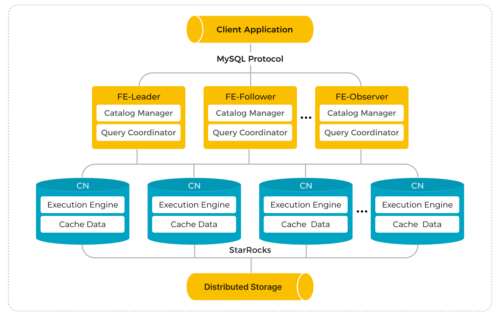

# Use HDFS for shared-data

import SharedDataIntro from '../../_assets/commonMarkdown/sharedDataIntro.md'
import SharedDataCNconf from '../../_assets/commonMarkdown/sharedDataCNconf.md'
import SharedDataUseIntro from '../../_assets/commonMarkdown/sharedDataUseIntro.md'
import SharedDataUse from '../../_assets/commonMarkdown/sharedDataUse.md'

<SharedDataIntro />

## Architecture



## Deploy a shared-data StarRocks cluster

The deployment of a shared-data StarRocks cluster is similar to that of a shared-nothing StarRocks cluster. The only difference is that you need to deploy CNs instead of BEs in a shared-data cluster. This section only lists the extra FE and CN configuration items you need to add in the configuration files of FE and CN **fe.conf** and **cn.conf** when you deploy a shared-data StarRocks cluster. For detailed instructions on deploying a StarRocks cluster, see [Deploy StarRocks](../../deployment/deploy_manually.md).

> **NOTE**
>
> Do not start the cluster until after it is configured for shared-storage in the next section of this document.

## Configure FE nodes for shared-data StarRocks

Before starting FEs, add the following configuration items in the FE configuration file **fe.conf**.

### Example FE configurations for HDFS

These are example shared-data additions for your `fe.conf` file on each of your FE nodes.

```Properties
run_mode = shared_data
cloud_native_meta_port = <meta_port>
cloud_native_storage_type = HDFS

# Example: hdfs://127.0.0.1:9000/user/starrocks/
cloud_native_hdfs_url = <hdfs_url>
```

### All FE parameters related to shared-storage with HDFS

#### run_mode

The running mode of the StarRocks cluster. Valid values:

- `shared_data`
- `shared_nothing` (Default)

> **NOTE**
>
> - You cannot adopt the `shared_data` and `shared_nothing` modes simultaneously for a StarRocks cluster. Mixed deployment is not supported.
> - Do not change `run_mode` after the cluster is deployed. Otherwise, the cluster fails to restart. The transformation from a shared-nothing cluster to a shared-data cluster or vice versa is not supported.

#### cloud_native_meta_port

The cloud-native meta service RPC port.

- Default: `6090`

#### enable_load_volume_from_conf

Whether to allow StarRocks to create the default storage volume by using the object storage-related properties specified in the FE configuration file. Valid values:

- `true` If you specify this item as `true` when creating a new shared-data cluster, StarRocks creates the built-in storage volume `builtin_storage_volume` using the object storage-related properties in the FE configuration file, and sets it as the default storage volume. However, if you have not specified the object storage-related properties, StarRocks fails to start.
- `false` (Default) If you specify this item as `false` when creating a new shared-data cluster, StarRocks starts directly without creating the built-in storage volume. You must manually create a storage volume and set it as the default storage volume before creating any object in StarRocks. For more information, see [Create the default storage volume](#use-your-shared-data-starrocks-cluster).

Supported from v3.1.0.

> **CAUTION**
>
> We strongly recommend you leave this item as `true` while you are upgrading an existing shared-data cluster from v3.0. If you specify this item as `false`, the databases and tables you created before the upgrade become read-only, and you cannot load data into them.

#### cloud_native_storage_type

The type of object storage you use. In shared-data mode, StarRocks supports storing data in Azure Blob (supported from v3.1.1 onwards), and object storages that are compatible with the S3 protocol (such as AWS S3, Google GCP, and MinIO). Valid value:

- `S3` (Default)
- `AZBLOB`
- `HDFS`

> **NOTE**
>
> - If you specify this parameter as `S3`, you must add the parameters prefixed by `aws_s3`.
> - If you specify this parameter as `AZBLOB`, you must add the parameters prefixed by `azure_blob`.
> - If you specify this parameter as `HDFS`, you must add the parameter `cloud_native_hdfs_url`.

#### cloud_native_hdfs_url

The URL of your HDFS storage, for example, `hdfs://127.0.0.1:9000/user/xxx/starrocks/`.

> **NOTE**
>
> Only credential-related configuration items can be modified after your shared-data StarRocks cluster is created. If you changed the original storage path-related configuration items, the databases and tables you created before the change become read-only, and you cannot load data into them.

If you want to create the default storage volume manually after the cluster is created, you only need to add the following configuration items:

```Properties
run_mode = shared_data
cloud_native_meta_port = <meta_port>
```

## Configure CN nodes for shared-data StarRocks

<SharedDataCNconf />

## Use your shared-data StarRocks cluster

<SharedDataUseIntro />

The following example creates a storage volume `def_volume` for an HDFS storage, enables the storage volume, and sets it as the default storage volume:

```SQL
CREATE STORAGE VOLUME def_volume
TYPE = HDFS
LOCATIONS = ("hdfs://127.0.0.1:9000/user/starrocks/");

SET def_volume AS DEFAULT STORAGE VOLUME;
```

<SharedDataUse />
