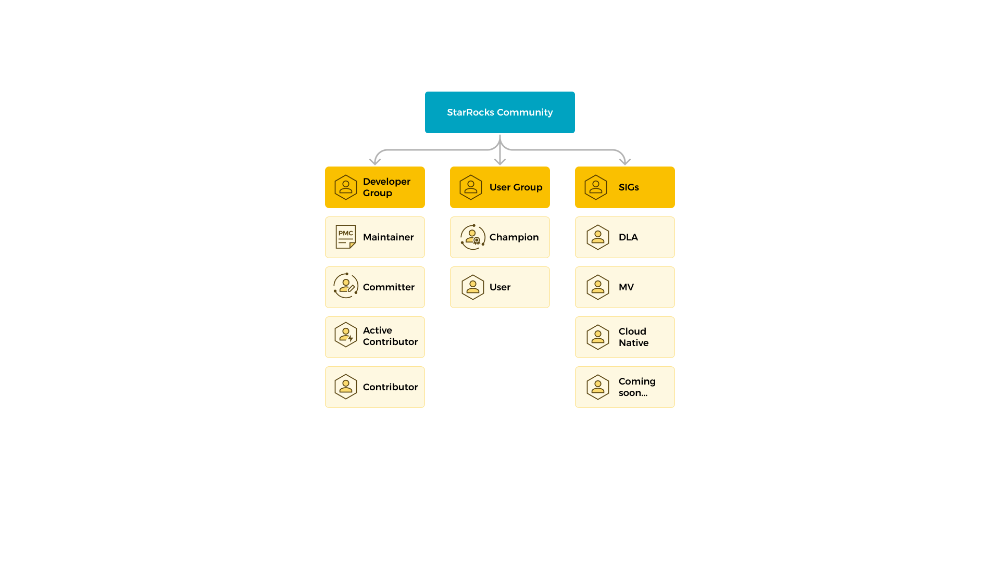

# Contribute to StarRocks

Contributing to StarRocks is cordially welcome from everyone. Contributing to StarRocks is not limited to contributing code. Below, we list different approaches to contributing to our community.

| Report a bug                        | You can [file an issue](https://github.com/StarRocks/starrocks/issues/new/choose) to report a bug with StarRocks. You can also click `Feedback` in the upper-right corner of the page you are reading in the Documentation Site to report a bug. |
| ----------------------------------- | ------------------------------------------------------------ |
| **Contribute code**                 | You can contribute your code by fixing a bug or implementing a feature. |
| **Contribute test case**            | You can contribute your test cases.                          |
| **Help review code**                | If you are an active contributor or committer of StarRocks, you can help us review the pull requests (PRs). |
| **Contribute documentation**        | StarRocks community maintains a tremendous amount of documentation both in Chinese and English. You can contribute documentation changes by fixing a documentation bug or proposing a new piece of content. |
| **Help StarRocks users**            | You can help newcomers who meet difficulties in our community. |
| **Spread the word about StarRocks** | You can author an article or give a talk about us to help spread our technology to the world. |

> **NOTE**
>
> To contribute documentation, remember to **sign off** your commit using `git commit -s`. Otherwise, the Developer Certificate of Origin (DCO) check cannot pass. In addition, prefix `[Doc]` to your PR title and select the **Doc** check box.
> 

## Community resources

The best place to get a wide variety of help about StarRocks is via StarRocks's [Slack Channel](https://join.slack.com/t/starrocks/shared_invite/zt-1d0cs3cs2-7eL5Q0cGoBofhyIOx7pLfQ). For contribution-related discussions, please go to the **#contributing-to-starrocks** channel.

You can also report issues and problems, or suggest new features, on [GitHub](https://github.com/StarRocks/starrocks/).

## Code of conduct

Our community strictly adheres to the [code of conduct](https://github.com/StarRocks/starrocks/blob/main/CODE_OF_CONDUCT.md).

## Community roles

Everyone is encouraged to participate in the StarRocks project. Anyone can make an impact by simply being involved in the discussions about new features, project roadmap, architecture, and even reporting issues you are facing.

The roles listed below are a few possible ways to get involved in the community, it also defines what is expected from each role.

## User group

### Participants

Participants are actively involved in the community and work to make StarRocks better for everyone.

As a participant, you can submit issue reports on GitHub, contribute test cases, translate/modify documentation, help answer user questions in forums or communities, participate in events, share your experience with StarRocks, star StarRocks on GitHub, and more.

Expectations and responsibilities:

- Follow the community's [code of conduct](https://github.com/StarRocks/starrocks/blob/main/CODE_OF_CONDUCT.md).

- Be involved in discussions and community events.

- Share feedback with the community so everyone else knows what is/isn’t working.

- Suggest improvements.

### Champions

StarRocks Community Champions are a group of passionate community evangelists and pioneers who are well-versed in StarRocks technology. They enjoy sharing the latest developments and products in the community, and their enthusiasm drives the progress and development of the community.

#### Benefits

##### Product

- Early access to new products/features.

- Participate in exclusive meetings with the project core team.

##### Community

- Listed as a StarRocks champion on the website.

- Exclusive prizes and badges.

##### Events

- Free access to StarRocks' events.

- Expense reimbursement for travel and accommodations for events.

- VIP seats and VIP events.

#### Requirements

1. Have published at least 3 StarRocks-related original and quality technical content (including articles, tutorials, videos, etc.).
2. Participate in at least 2 online/offline technical sharing sessions as a speaker.
3. Help answer user questions on Slack and other channels.

#### Other Requirements

1. StarRocks Champions must abide by the StarRocks Community [Code of Conduct.](https://github.com/StarRocks/starrocks/blob/main/CODE_OF_CONDUCT.md)
2. StarRocks Champions are eligible for one year, and must reapply each year based on their contributions in the past year.

## Developer Group

### Contributor

Everyone who contributes can become a StarRocks contributor. The members will provide mentorship and guidance when new contributors need assistance.

#### How to become a Contributor?

- 1 merged PR in any StarRocks' public repos.

#### As a Contributor, we expect you to

- Actively participate in StarRocks' project development.

- Participate in community events (meetups, hackathons, etc.).

- Learn and help others learn StarRocks-related technologies.

#### Privileges

- Be listed as a StarRocks contributor.

- Be awarded a StarRocks Contributor e-certificate.

### Active Contributor

Active contributors are contributors who have made outstanding contributions and sustained commitment to StarRocks. They actively participate in the community by contributing code, improving docs, and helping others.

#### How to become an Active Contributor?

- Have 5 merged PRs or fixed major bugs.

- Participate in more than 5 code reviews.

- Actively participate in community events such as online/offline meetups and community discussions.

#### Responsibilities and privileges

- Join the community meeting and discussion.

- Mentor and guide new contributors.

- Be listed as a StarRocks Active Contributor.

- Be awarded a StarRocks Active Contributor e-certificate.

### Committer

Committers are promoted from Active Contributors.

They have the authority to merge PRs into master branches and are responsible for the planning and maintenance of StarRocks. They also are active members in sharing their knowledge with the community.

#### How to become a Committer?

- Have a deep understanding of StarRocks' principles and future plans.

- Have the ability to deal with various issues that arise in the project promptly.

- Lead a major development, write and revise related documents.

- Receive at least two PMC nominations and pass voting.

### Responsibilities and privileges

- Mentor and guide other memberships in the community.

- Ensure continued health of subproject.

- Be granted write access to StarRocks repos (to be specified).

- Be listed as a StarRocks Committer.

- Be awarded a StarRocks Committer e-certificate.

### PMC

PMCs are promoted from Committers. They have the authority to merge merge PRs into master branches and are responsible for the planning and maintenance of StarRocks. They also are active members in sharing their knowledge with the community.

#### How to become a PMC?

- In-depth understanding of StarRocks principles and a clear understanding of StarRocks' future plans.

- Have the ability to deal with project issues promptly.

- Lead project development and iterations, and steer the overall direction of the project.

- Receive at least two PMC nominations and pass voting.

#### Responsibilities and privileges

- Mentor and guide other memberships in the community.

- Ensure continued health of the project, such as code quality and test coverage.

- Make and approve technical design decisions.

- Define milestones and releases.

- Vote and promote new committers and PMCs.

- Be listed as a StarRocks PMC.

- Be awarded a StarRocks PMC e-certificate.

## Contribution process

If you don't know how to get started, this is the process we suggest for contributions. This process is designed to help reduce your learning curve and get your pull requests merged more efficiently!

1. Sign the [Contributor License Agreement (CLA)](https://cla-assistant.io/StarRocks/starrocks).

2. Start a discussion by creating a Github [issue](https://github.com/StarRocks/starrocks/issues), or asking on [Slack channel](https://join.slack.com/t/starrocks/shared_invite/zt-1d0cs3cs2-7eL5Q0cGoBofhyIOx7pLfQ)(unless the change is trivial).

   Before getting your hands on codes, you should comment in the issue body, and inform the maintainer to assign you the issue that you wish to solve. It is recommended to share your plan on how to solve this problem in the issue body as well.

   - This step helps you identify possible collaborators and reviewers.
   - Will the change conflict with another change in progress? If so, work with others to minimize impact.
   - Is this change major? If so, work with others to break the change into smaller steps.

3. Implement the change.

   - If the change is major, split it into smaller PRs.

   - Include tests and documentation as necessary.

4. Create a Github [pull request](https://github.com/StarRocks/starrocks/pulls):

   In StarRocks community, we follow the fork-and-merge GitHub workflow when contributing code.

   - Create a fork of StarRocks in your GitHub account.
   - Clone this forked repository to your computer.
   - Check out a new branch based on the branch you expect to contribute to.
   - Commit your code changes to the new branch.
   - Push the branch with code changes to GitHub.
   - Create a PR to submit your code changes. It is recommended to submit ONE commit in ONE PR. You can follow the [PR templated](https://github.com/StarRocks/starrocks/blob/main/.github/PULL_REQUEST_TEMPLATE.md) when submitting a PR.
   - Make sure the pull request passes the tests in CI.

5. Review is required by at least 2 reviewers:

   - For StarRocks project, we require at least 2 lgtm from reviewers (committers) to merge the pull request.

   - This normally happens within a few days, but may take longer if the change is major, complex, or if a critical reviewer is unavailable. (feel free to ping the reviewer on the pull request).

6. Maintainers merge the pull request after the final changes are accepted.
