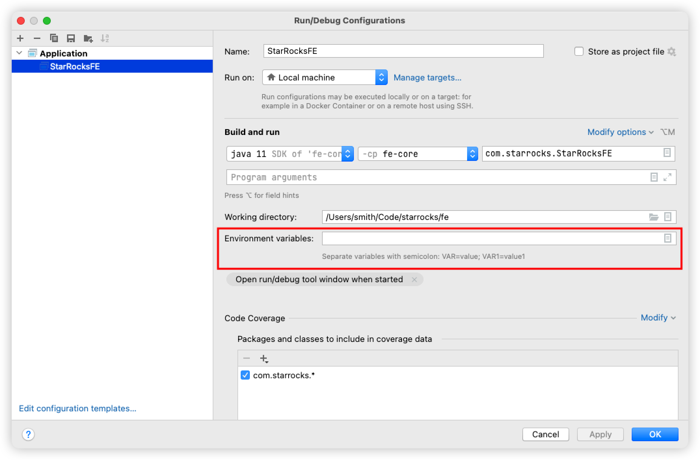

# Setup StarRocks FE development environment on IDEA

This tutorial is based on macOS and has been tested on Apple Chip(M1, M2).
Even if you are not using macOS, you can also refer to this tutorial.

## Requirements

<<<<<<< HEAD
**Thrift 0.13**
=======
### Thrift 0.13
>>>>>>> edd5009ce6 ([Doc] Revise Backup Restore according to feedback (#53738))

There is no 0.13 version of Thrift in the official brew repository; one of our committers created a version in their repo to install. 

```bash
brew install alberttwong/thrift/thrift@0.13
```

After installing Thrift successfully, you can check by executing following command:

```bash
$ thrift -version
Thrift version 0.13.0
```

<<<<<<< HEAD
**Protobuf**
=======
### Protobuf
>>>>>>> edd5009ce6 ([Doc] Revise Backup Restore according to feedback (#53738))

Just use the latest version v3, because the latest version of Protobuf is compatible with the v2 version of the Protobuf used in StarRocks.

```bash
brew install protobuf
```

<<<<<<< HEAD
**Maven**
=======
### Maven
>>>>>>> edd5009ce6 ([Doc] Revise Backup Restore according to feedback (#53738))

```
brew install maven
```

<<<<<<< HEAD
**Openjdk 1.8 or 11**
=======
### Openjdk 1.8 or 11
>>>>>>> edd5009ce6 ([Doc] Revise Backup Restore according to feedback (#53738))

```bash
brew install openjdk@11
```

<<<<<<< HEAD
**Python3**
=======
### Python3
>>>>>>> edd5009ce6 ([Doc] Revise Backup Restore according to feedback (#53738))

MacOS is already installed by default.


Everyone's Thrift and Protobuf installation directories may be different, you can use the brew list command to inspect:

```bash
brew list thrift@0.13.0
brew list protobuf
```

## Configure the StarRocks

<<<<<<< HEAD
**Download the StarRocks**
=======
### Download the StarRocks
>>>>>>> edd5009ce6 ([Doc] Revise Backup Restore according to feedback (#53738))

```
git clone https://github.com/StarRocks/starrocks.git
```

<<<<<<< HEAD
**Setup thirdparty directory**
=======
### Setup thirdparty directory
>>>>>>> edd5009ce6 ([Doc] Revise Backup Restore according to feedback (#53738))

Create `installed/bin` directory in `thirdparty`.

```bash
cd starrocks && mkdir -p thirdparty/installed/bin
```

Then create soft link for Thrift and Protobuf respectively.

```bash
ln -s /opt/homebrew/bin/thrift thirdparty/installed/bin/thrift
ln -s /opt/homebrew/bin/protoc thirdparty/installed/bin/protoc
```

<<<<<<< HEAD
**Setting environment variables**
=======
### Setting environment variables
>>>>>>> edd5009ce6 ([Doc] Revise Backup Restore according to feedback (#53738))

```bash
export JAVA_HOME="/opt/homebrew/Cellar/openjdk@11/11.0.15" # Caution: The jdk version may be different in you desktop
export PYTHON=/usr/bin/python3
export STARROCKS_THIRDPARTY=$(pwd)/thirdparty # Caution: Make sure you are in the starrocks directory
```

## Generate source code

Many source files in FE need to be generated manually, otherwise IDEA will report an error due to missing files.
Execute the following command to automatically generate:

```bash
cd gensrc
make clean
make
```

## Compile FE

Enter `fe` directory and use Maven to compile:

```bash
cd fe
mvn install -DskipTests
```

## Open StarRocks in IDEA

1. Open the `StarRocks` directory in IDEA.

2. Add Coding style setting
    To standardize the coding style, you should import the `fe/starrocks_intellij_style.xml` code style file in IDEA.


## Run StarRocks FE in MacOS

Use IDEA to open the `fe` directory.

If you execute the Main function directly in `StarRocksFE.java`, some errors will be reported. You only need to do some simple settings to run it smoothly.

**NOTICE:**  `StarRocksFE.java` is in the `fe/fe-core/src/main/java/com/starrocks` directory.

1. Copy the conf, bin and webroot directories from the StarRocks directory to `fe` directory:

```bash
cp -r conf fe/conf
cp -r bin fe/bin
cp -r webroot fe/webroot
```

2. Enter the `fe` directory and create the log and meta folders under the `fe` directory:

```bash
cd fe
mkdir log
mkdir meta
```

3. Set the environment variable, as shown in the following figure:



```bash
export PID_DIR=/Users/smith/Code/starrocks/fe/bin
export STARROCKS_HOME=/Users/smith/Code/starrocks/fe
export LOG_DIR=/Users/smith/Code/starrocks/fe/log
```

4. Modify the priority_networks in `fe/conf/fe.conf` to `127.0.0.1/24` to prevent FE from using the current computer's LAN IP and cause the port fail to bind.

5. Then you have run StarRocks FE successfully.

## DEBUG StarRocks FE in MacOS

If you started the FE with the debug option, you can then attach the IDEA debugger to the FE process.


```
./start_fe.sh --debug
```

See https://www.jetbrains.com/help/idea/attaching-to-local-process.html#attach-to-local.
