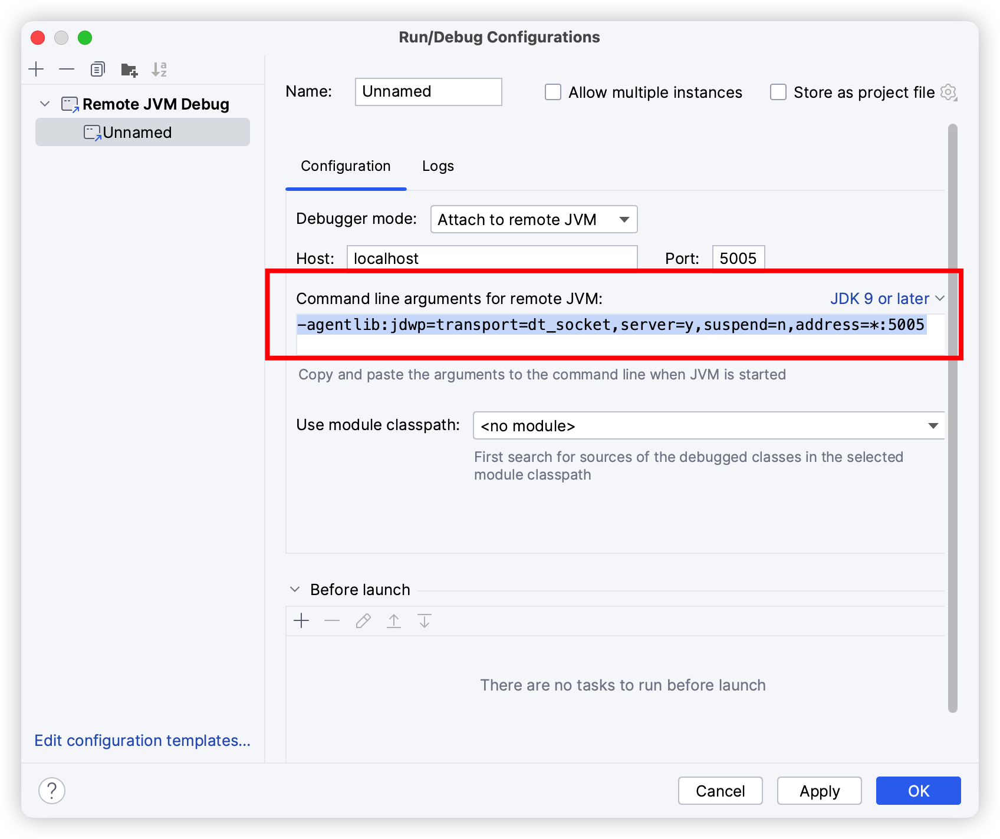
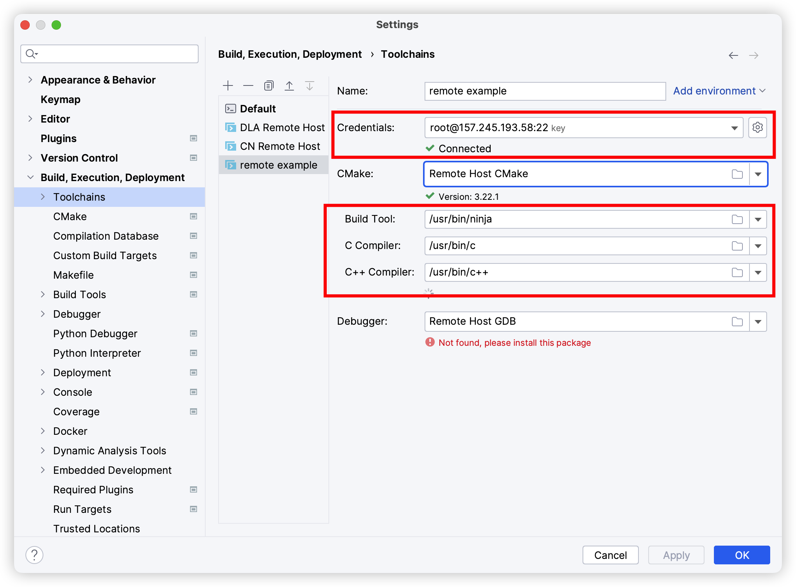
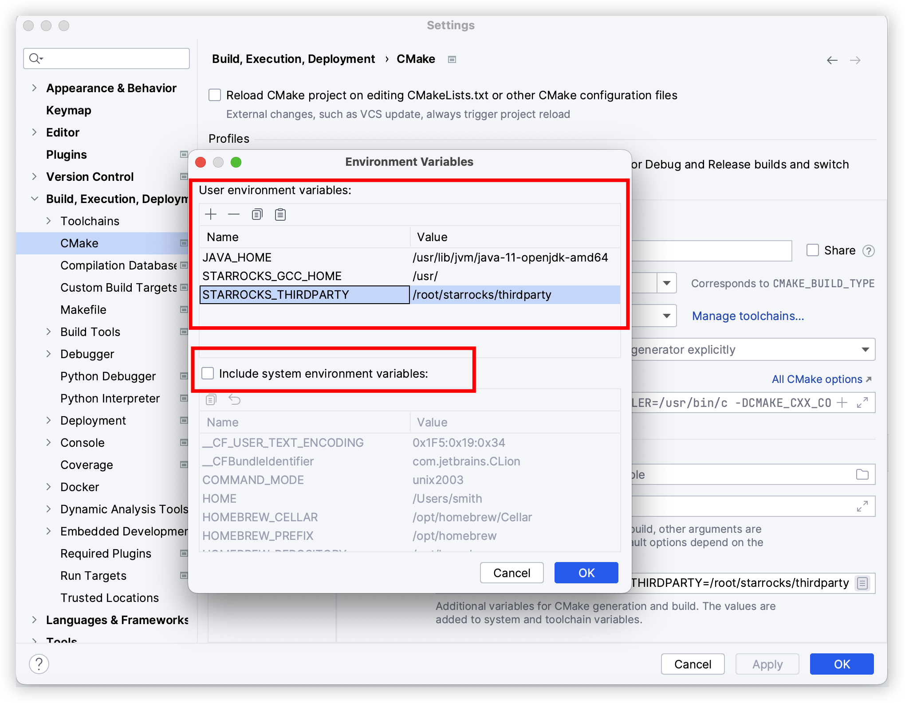

# Setup IDE  for developing StarRocks

Some people want to become StarRocks contributor, but are troubled by the development environment, so here I write a tutorial about it.

What is a perfect development toolchain?

* Support one click to compile FE and BE.
* Support code jump in Clion and IDEA.
* All variables in the IDE can be analyzed normally without red lines.
* Clion can enable its analysis function normally.
* Support FE and BE debug.

## Prepare

I use a MacBook(M1) for local coding and a remote server for compiling & testing StarRocks. (Remote server uses Ubuntu 22, **at least need 16GB RAM**).

The overall idea is to write code on the MacBook,  then automatically synchronize the code to the server through the IDE, and use the server to compile and develop StarRocks.

### MacBook Setup

**Thrift 0.13**

There is no 0.13 version of Thrift in brew repository, you can use the following command:

```bash
brew tap-new $USER/local-tap
brew extract --version='0.13.0' thrift $USER/local-tap
brew install thrift@0.13.0
```

You can check whether Thrift is installed successfully with the following command:

```bash
$ thrift -version
Thrift version 0.13.0
```

**Protobuf**

Just use the latest version v3 directly, because the latest version of Protobuf is compatible with the v2 version of the Protobuf protocol in StarRocks.

```bash
brew install protobuf
```

**Maven**

```bash
brew install maven
```

**OpenJDK 1.8 or 11**

```bash
brew install openjdk@11
```

**Python3**

MacOS comes with it, no installation is needed.

**Setup system env**

```bash
export JAVA_HOME=xxxxx
export PYTHON=/usr/bin/python3
```

### Ubuntu22 server setup

**Clone StarRocks code**

`git clone https://github.com/StarRocks/starrocks.git`

**Install required tools for compilation**:

```bash
sudo apt update
```

```bash
sudo apt install gcc g++ maven openjdk-11-jdk python3 python-is-python3 unzip cmake bzip2 ccache byacc ccache flex automake libtool bison binutils-dev libiberty-dev build-essential ninja-build
```

Setup `JAVA_HOME` env

```bash
export JAVA_HOME=/usr/lib/jvm/java-11-openjdk-amd64
```

**Do a compilation of StarRocks**

```bash
cd starrocks/
./build.sh
```

The first time compile needs to compile thirdparty, it will require some time.

**You have to use gcc for the first compilation, currently, thirdparty can't compile success in clang.**

## IDE Setup

### FE

FE development is simple because you can compile it in MacOS directly. Just enter `fe` folder and run the command `mvn install -DskipTests`.

Then you can use IDEA to open `fe` folder directly, everything is ok.

**Local debug**

The same as other Java applications.

**Remote debug**

In Ubuntu server, run with `./start_fe.sh --debug`, then use IDEA remote debug to connect it. The default port is 5005, you can change it in `start_fe.sh` scripts.

Debug java parameter: `-agentlib:jdwp=transport=dt_socket,server=y,suspend=n,address=*:5005` is just copied from IDEA.



### BE

It is recommended to run `mvn install -DskipTests` first in `fe` folder to ensure that thrift and protobuf in the gensrc directory are compiled correctly.

Then you need to enter  `gensrc` folder, run `make clean` and `make` commands respectively, otherwise Clion can't detect thrift's output files.

Use Clion to open `be` folder.

Enter `Settings`, add `Toolchains`. Add a remote server first, then setup Build Tool, C and C++ Compiler separately.



In `Settings` / `Deployment`. Change folder `mappings`.


In `Settings` / `Cmake`. Change Toolchain to be the remote toolchain just added. Add the following environment variables:

```bash
JAVA_HOME=/usr/lib/jvm/java-11-openjdk-amd64
STARROCKS_GCC_HOME=/usr/
STARROCKS_THIRDPARTY=/root/starrocks/thirdparty
```

Notice: Be careful not to check `Include system environment variables`.




From here on, all setup is complete. After Clion and the remote server are synchronized for a while, the code jump will work normally.

**Debug**

BE debug is a little difficult, you have to use gdb in your remote server. Of course, you can use gdb server + Clion remote gdb, but I don't recommend it, it's too stuck. 

We need to change `start_backend.sh` script from:

```bash
if [ ${RUN_BE} -eq 1 ]; then
    echo "start time: "$(date) >> $LOG_DIR/be.out
    if [ ${RUN_DAEMON} -eq 1 ]; then
        nohup ${STARROCKS_HOME}/lib/starrocks_be "$@" >> $LOG_DIR/be.out 2>&1 </dev/null &
    else
        ${STARROCKS_HOME}/lib/starrocks_be "$@" >> $LOG_DIR/be.out 2>&1 </dev/null
    fi
fi
```

to:

```bash
if [ ${RUN_BE} -eq 1 ]; then
    echo "start time: "$(date) >> $LOG_DIR/be.out
    if [ ${RUN_DAEMON} -eq 1 ]; then
        nohup ${STARROCKS_HOME}/lib/starrocks_be "$@" >> $LOG_DIR/be.out 2>&1 </dev/null &
    else
        gdb -tui ${STARROCKS_HOME}/lib/starrocks_be
    fi
fi
```

Then just run `./bin/start_be.sh` without any flag.

> If you face the error report when debugging for lakehouse, just add `handle SIGSEGV nostop noprint pass` in `~/.gdbinit`.

**LLVM**

Of course, you can use LLVM tools to development be.

Ubuntu LLVM installtion refer to: https://apt.llvm.org/

Then use the command:  `CC=clang-15 CXX=clang++-15 ./build.sh` to compile be. But the premise is that your thirdparty has been compiled with gcc.

## Last

Feel free to contribute codes to StarRocks. 🫵

## Reference

* [https://www.inlighting.org/archives/setup-perfect-starrocks-dev-env-en](https://www.inlighting.org/archives/setup-perfect-starrocks-dev-env-en)
* Chinese version: [https://www.inlighting.org/archives/setup-perfect-starrocks-dev-env](https://www.inlighting.org/archives/setup-perfect-starrocks-dev-env)
