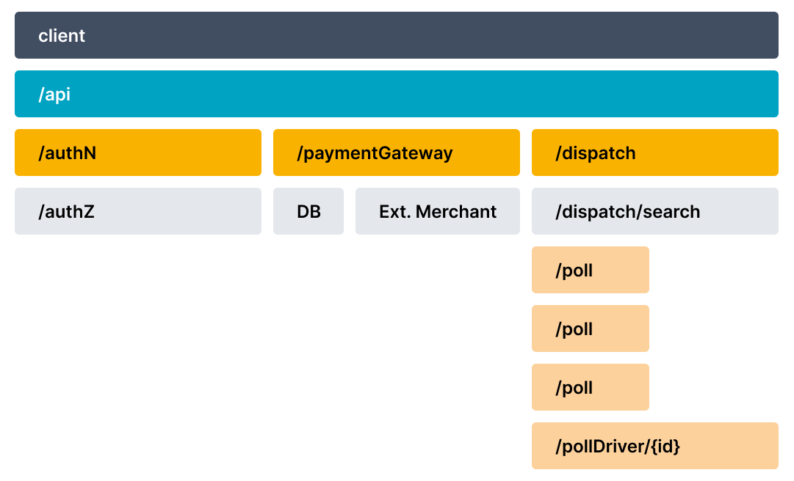
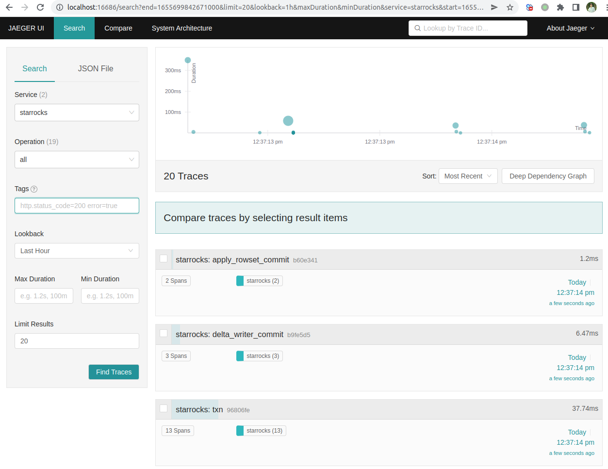
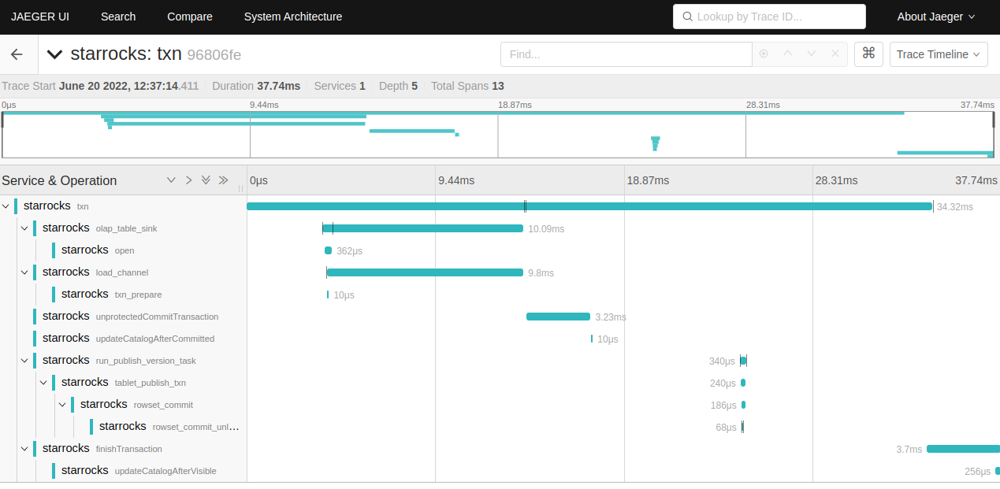

### Background

&emsp;A Distributed Trace, more commonly known as a Trace, records the paths taken by requests (made by an application or end-user) as they propagate through multi-service architectures, like microservice and serverless applications. Without tracing, it is challenging to pinpoint the cause of performance problems in a distributed system. It improves the visibility of our application or system’s health and lets us debug behavior that is difficult to reproduce locally. Tracing is essential for distributed systems, which commonly have nondeterministic problems or are too complicated to reproduce locally.
&emsp;Tracing makes debugging and understanding distributed systems less daunting by breaking down what happens within a request as it flows through a distributed system. A Trace is made of one or more Spans. The first Span represents the Root Span. Each Root Span represents a request from start to finish. The Spans underneath the parent provide a more in-depth context of what occurs during a request (or what steps make up a request). Many Observability back-ends visualize Traces as waterfall diagrams that may look something like this picture.



&emsp;Waterfall diagrams show the parent-child relationship between a Root Span and its child Spans. When a Span encapsulates another Span, this also represents a nested relationship.
&emsp;Recently SR added a tracing framework. It leverages opentelemetry and jaeger to trace distributed events in the system.

*   Opentelemetry is an instrumentation/tracing SDK. Developers can use it to instrument code and emit tracing data to an observability backend. It supports many languages. We use java and CPP SDK in SR.
*   Currently, Jaeger is used as the observability backend.

### Basic Usage

Steps to enable tracing in SR:

1.  Install [Jaeger](https://www.jaegertracing.io/docs/1.31/getting-started)
    The guide above uses docker. For simplicity, you can also just download binary package and run locally, `https://github.com/jaegertracing/jaeger/releases`

```
    decster@decster-MS-7C94:~/soft/jaeger-1.31.0-linux-amd64$ ll
    total 215836
    drwxr-xr-x  2 decster decster     4096 02-05 05:01:30 ./
    drwxrwxr-x 28 decster decster     4096 05-18 18:24:07 ../
    -rwxr-xr-x  1 decster decster 19323884 02-05 05:01:31 example-hotrod*
    -rwxr-xr-x  1 decster decster 23430444 02-05 05:01:29 jaeger-agent*
    -rwxr-xr-x  1 decster decster 51694774 02-05 05:01:29 jaeger-all-in-one*
    -rwxr-xr-x  1 decster decster 41273869 02-05 05:01:30 jaeger-collector*
    -rwxr-xr-x  1 decster decster 37576660 02-05 05:01:30 jaeger-ingester*
    -rwxr-xr-x  1 decster decster 47698843 02-05 05:01:30 jaeger-query*

    decster@decster-MS-7C94:~/soft/jaeger-1.31.0-linux-amd64$ ./jaeger-all-in-one 
```

2.  Config FE\&FE to enable tracing
    Currently, opentelemetry java & cpp sdk use different protocols, java uses grpc proto, while cpp uses thrift\&UDP, so the endpoint ports are different.

```
    fe.conf

    # Enable jaeger tracing by setting jaeger_grpc_endpoint
    # jaeger_grpc_endpoint = http://localhost:14250


    be.conf

    # Enable jaeger tracing by setting jaeger_endpoint
    # jaeger_endpoint = localhost:6831
```

3.  Open jaeger web UI, usually in `http://localhost:16686/search`
4.  Do some data ingestion (streamload\/insert into) and search TXN traces on web UI

(trace_pic2.png) 
(trace_pic3.png) 

### Adding traces

*   To add trace, first get familiar with basic concepts like tracer, span, trace propagation read the [observability primer](https://opentelemetry.io/docs/concepts/observability-primer).
*   Read utility class and it's usages in SR: TraceManager.java(java) `common/tracer.h/cpp (cpp)`, it's current usage(like write txn(load\/insert\/update\/delete) trace, and its propagation to BE).
*   Add your own trace
