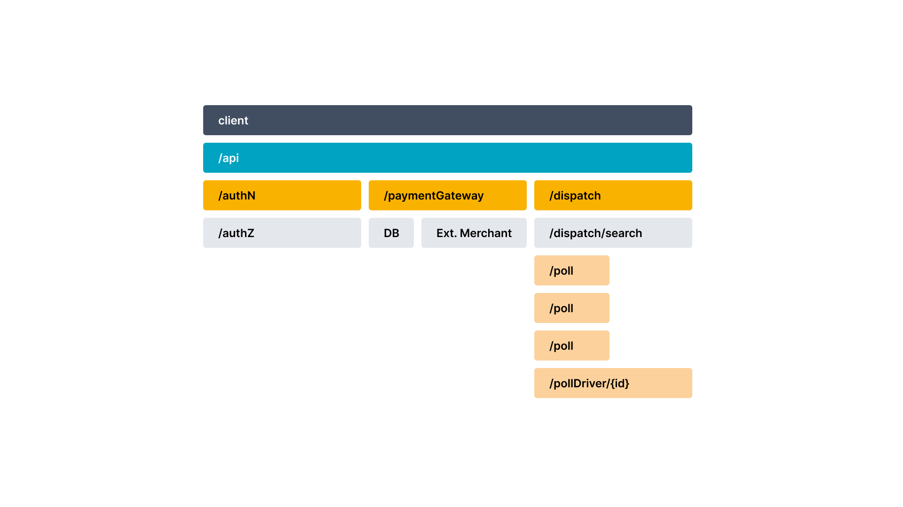
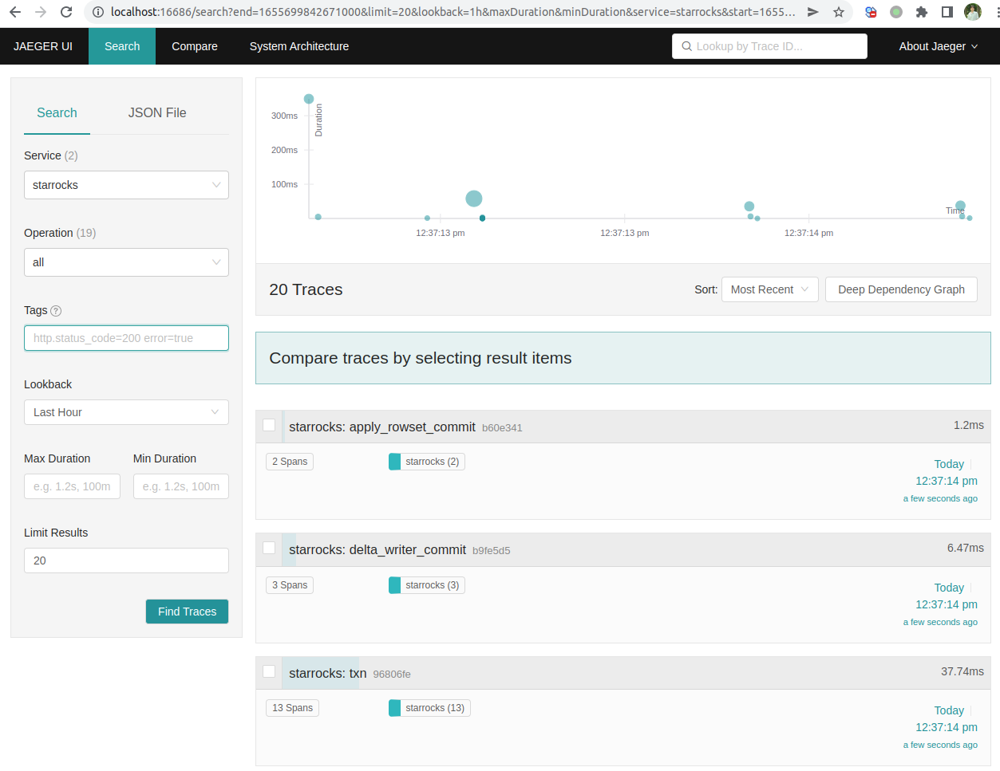
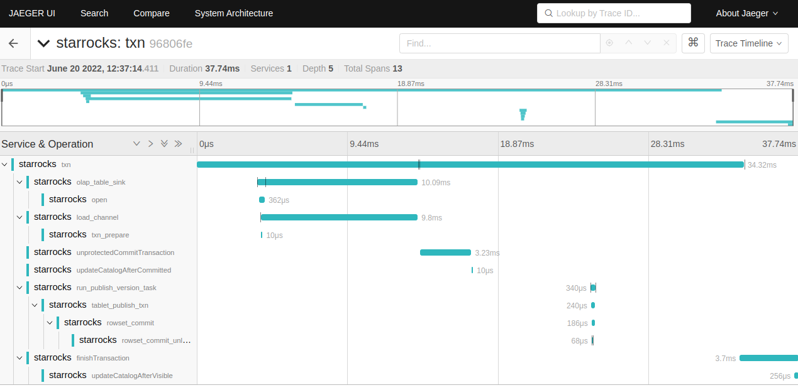

### Background

&emsp;A Distributed Trace, more commonly known as a Trace, records the paths taken by requests (made by an application or end-user) as they propagate through multi-service architectures, like microservice and serverless applications. Without tracing, it is challenging to pinpoint the cause of performance problems in a distributed system. It improves the visibility of our application or system’s health and lets us debug behavior that is difficult to reproduce locally. Tracing is essential for distributed systems, which commonly have nondeterministic problems or are too complicated to reproduce locally.
&emsp;Tracing makes debugging and understanding distributed systems less daunting by breaking down what happens within a request as it flows through a distributed system. A Trace is made of one or more Spans. The first Span represents the Root Span. Each Root Span represents a request from start to finish. The Spans underneath the parent provide a more in-depth context of what occurs during a request (or what steps make up a request). Many Observability back-ends visualize Traces as waterfall diagrams that may look something like this picture.



&emsp;Waterfall diagrams show the parent-child relationship between a Root Span and its child Spans. When a Span encapsulates another Span, this also represents a nested relationship.
&emsp;Recently SR added a tracing framework. It leverages opentelemetry and jaeger to trace distributed events in the system.

*   Opentelemetry is an instrumentation/tracing SDK. Developers can use it to instrument code and emit tracing data to an observability backend. It supports many languages. We use java and CPP SDK in SR.
*   Currently, Jaeger is used as the observability backend.

### Basic Usage

Steps to enable tracing in SR:

1.  Install [Jaeger](https://www.jaegertracing.io/docs/1.76/getting-started/). The following command exposes the Jaeger UI, the OTLP/gRPC receiver used by FE, and the Jaeger Thrift/UDP receiver used by BE.

```bash
docker run --rm --name jaeger \
    -p 16686:16686 \
    -p 4317:4317 \
    -p 6831:6831/udp \
    jaegertracing/all-in-one:1.76.0
```

2.  Configure FE and BE to enable tracing.
    The Java SDK in FE exports OTLP over gRPC, while the C++ SDK in BE exports Jaeger Thrift over UDP, so the endpoint ports are different.

```
    fe.conf

    # Export FE traces to Jaeger's OTLP/gRPC receiver
    # otlp_exporter_grpc_endpoint = http://localhost:4317

    # jaeger_grpc_endpoint remains accepted as a legacy alias, but its value
    # must also point to the OTLP/gRPC receiver on port 4317, not port 14250.


    be.conf

    # Enable jaeger tracing by setting jaeger_endpoint
    # jaeger_endpoint = localhost:6831
```

3.  Open jaeger web UI, usually in `http://localhost:16686/search`
4.  Do some data ingestion (streamload/insert into) and search TXN traces on web UI

(trace_pic2.png) 
(trace_pic3.png) 

### Adding traces

*   To add trace, first get familiar with basic concepts like tracer, span, trace propagation read the [observability primer](https://opentelemetry.io/docs/concepts/observability-primer/)
*   Read utility class and it's usages in SR: TraceManager.java(java) `common/tracer.h/cpp (cpp)`, it's current usage(like write txn(load\/insert\/update\/delete) trace, and its propagation to BE).
*   Add your own trace
