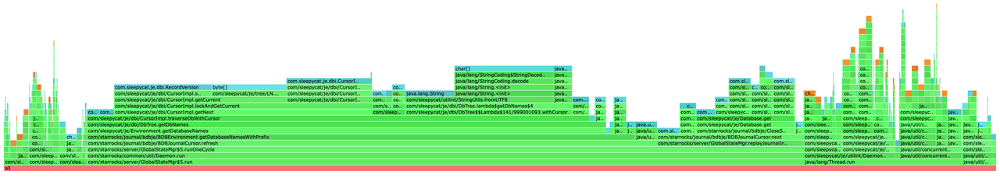

# Troubleshooting FE Heap Memory

This topic describes how to troubleshoot FE heap memory issues in StarRocks.

## Sudden surge of heap memory allocation

You can identify issues that cause sudden heap memory allocation surge by checking memory profiles (or memory allocate profiles) in StarRocks. From v3.3.6 onwards, StarRocks supports printing memory profiles in `.tgz`-formatted compressed HTML files under directory **fe/log/proc_profile**.


You can find the corresponding file based on the time when the memory issue occurred, decompress it, and open it in your browser. In the file, you will see the flame graph of the stack memory allocation. The wider a frame, the more memory resources the stack had been allocated to. For example, in the flame graph below, the width of frame `BDBEnvironment.getDatabaseNamesWithPrefix` exceeds 50% of the graph, indicating that more than half of the memory resources were allocated to this function.



If no memory profile was printed during the surge, you can manually disable the CPU profile, and set the profile printing interval to 5 minutes by setting the following items in the FE configuration file **fe.conf**, and restarting FE.

```Properties
proc_profile_cpu_enable = false
proc_profile_collect_interval_s = 300
```

### Workaround for versions earlier than v3.3.6

For versions earlier than v3.3.6, you can print memory profiles regularly via a script.

Run the following Shell script under the **fe** directory:

```Bash
#!/bin/bash

mkdir -p mem_alloc_log

while true
do
    current_time=$(date +'%Y-%m-%d-%H-%M-%S')
    file_name="mem_alloc_log/alloc-profile-${current_time}.html"
    ./bin/profiler.sh -e alloc --alloc 2m -d 300 -f "$file_name" `cat bin/fe.pid`
done
```

## Slow increase of heap memory usage

From v3.3.7 onwards, StarRocks supports printing Memory Usage Tracker logs for tracking memory leak issues. Memory Usage Tracker will regularly record the memory usage of each module.

Example:

```Plain
2025-02-05 19:35:23.287+08:00 INFO (MemoryUsageTracker|77) [MemoryUsageTracker.trackMemory():164] (0ms) Module Agent - AgentTaskTracker estimated 0B of memory. Contains AgentTask with 0 object(s).
2025-02-05 19:35:23.287+08:00 INFO (MemoryUsageTracker|77) [MemoryUsageTracker.trackMemory():164] (0ms) Module Backup - BackupHandler estimated 0B of memory. Contains BackupOrRestoreJob with 0 object(s).
2025-02-05 19:35:23.287+08:00 INFO (MemoryUsageTracker|77) [MemoryUsageTracker.trackMemory():164] (0ms) Module Compaction - CompactionMgr estimated 0B of memory. Contains PartitionStats with 0 object(s).
2025-02-05 19:35:23.287+08:00 INFO (MemoryUsageTracker|77) [MemoryUsageTracker.trackMemory():164] (0ms) Module Coordinator - QeProcessorImpl estimated 0B of memory. Contains QueryCoordinator with 0 object(s).
2025-02-05 19:35:23.287+08:00 INFO (MemoryUsageTracker|77) [MemoryUsageTracker.trackMemory():164] (0ms) Module Delete - DeleteMgrEPack estimated 0B of memory. Contains DeleteInfo with 0 object(s). DeleteJob with 0 object(s).
2025-02-05 19:35:23.287+08:00 INFO (MemoryUsageTracker|77) [MemoryUsageTracker.trackMemory():164] (0ms) Module Dict - CacheDictManager estimated 0B of memory. Contains ColumnDict with 0 object(s).
2025-02-05 19:35:23.287+08:00 INFO (MemoryUsageTracker|77) [MemoryUsageTracker.trackMemory():164] (0ms) Module Export - ExportMgr estimated 0B of memory. Contains ExportJob with 0 object(s).
2025-02-05 19:35:23.287+08:00 INFO (MemoryUsageTracker|77) [MemoryUsageTracker.trackMemory():164] (0ms) Module Load - InsertOverwriteJobMgr estimated 0B of memory. Contains insertOverwriteJobs with 0 object(s).
2025-02-05 19:35:23.287+08:00 INFO (MemoryUsageTracker|77) [MemoryUsageTracker.trackMemory():164] (0ms) Module Load - LoadMgrEPack estimated 245.7KB of memory. Contains LoadJob with 1165 object(s).
2025-02-05 19:35:23.287+08:00 INFO (MemoryUsageTracker|77) [MemoryUsageTracker.trackMemory():164] (0ms) Module Load - RoutineLoadMgrEPack estimated 0B of memory. Contains RoutineLoad with 0 object(s).
2025-02-05 19:35:23.287+08:00 INFO (MemoryUsageTracker|77) [MemoryUsageTracker.trackMemory():164] (0ms) Module Load - StreamLoadMgrEPack estimated 0B of memory. Contains StreamLoad with 0 object(s).
2025-02-05 19:35:23.287+08:00 INFO (MemoryUsageTracker|77) [MemoryUsageTracker.trackMemory():164] (0ms) Module LocalMetastore - LocalMetastore estimated 7KB of memory. Contains Partition with 45 object(s).
2025-02-05 19:35:23.287+08:00 INFO (MemoryUsageTracker|77) [MemoryUsageTracker.trackMemory():164] (0ms) Module MV - MVTimelinessMgr estimated 0B of memory. Contains mvTimelinessMap with 0 object(s).
2025-02-05 19:35:23.287+08:00 INFO (MemoryUsageTracker|77) [MemoryUsageTracker.trackMemory():164] (0ms) Module Profile - ProfileManager estimated 96B of memory. Contains QueryProfile with 4 object(s).
2025-02-05 19:35:23.287+08:00 INFO (MemoryUsageTracker|77) [MemoryUsageTracker.trackMemory():164] (0ms) Module Query - QueryTracker estimated 0B of memory. Contains QueryDetail with 0 object(s).
2025-02-05 19:35:23.287+08:00 INFO (MemoryUsageTracker|77) [MemoryUsageTracker.trackMemory():164] (0ms) Module Report - ReportHandler estimated 0B of memory. Contains PendingTask with 0 object(s). ReportQueue with 0 object(s).
2025-02-05 19:35:23.287+08:00 INFO (MemoryUsageTracker|77) [MemoryUsageTracker.trackMemory():164] (0ms) Module Statistics - CachedStatisticStorage estimated 0B of memory. Contains TableStats with 0 object(s). ColumnStats with 0 object(s). PartitionStats with 0 object(s). HistogramStats with 0 object(s). ConnectorTableStats with 0 object(s). ConnectorHistogramStats with 0 object(s).
2025-02-05 19:35:23.287+08:00 INFO (MemoryUsageTracker|77) [MemoryUsageTracker.trackMemory():164] (0ms) Module TabletInvertedIndex - TabletInvertedIndex estimated 49.8KB of memory. Contains TabletMeta with 208 object(s). TabletCount with 208 object(s). ReplicateCount with 216 object(s).
2025-02-05 19:35:23.287+08:00 INFO (MemoryUsageTracker|77) [MemoryUsageTracker.trackMemory():164] (0ms) Module Task - TaskManager estimated 0B of memory. Contains Task with 0 object(s).
2025-02-05 19:35:23.287+08:00 INFO (MemoryUsageTracker|77) [MemoryUsageTracker.trackMemory():164] (0ms) Module Task - TaskRunManager estimated 0B of memory. Contains PendingTaskRun with 0 object(s). RunningTaskRun with 0 object(s). HistoryTaskRun with 0 object(s).
2025-02-05 19:35:23.287+08:00 INFO (MemoryUsageTracker|77) [MemoryUsageTracker.trackMemory():164] (0ms) Module Transaction - GlobalTransactionMgr estimated 311.4KB of memory. Contains Txn with 1329 object(s). TxnCallbackCount with 0 object(s).
2025-02-05 19:35:23.288+08:00 INFO (MemoryUsageTracker|77) [MemoryUsageTracker.trackMemory():111] total tracked memory: 614.2KB, jvm: Process used: 672MB, heap used: 299.9MB, non heap used: 170MB, direct buffer used: 4.2MB
```
