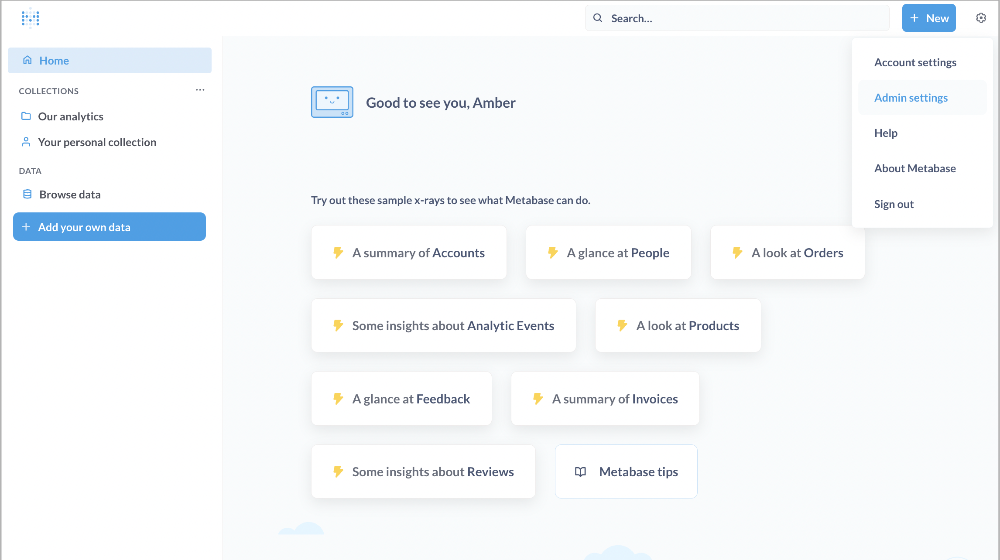
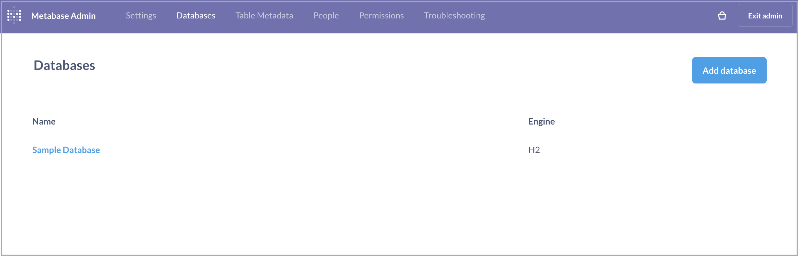
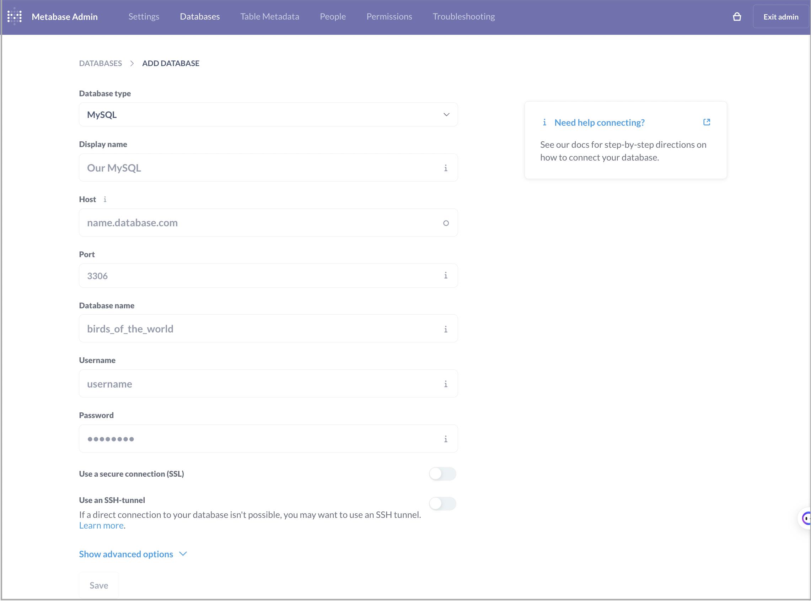

# Metabase

Metabase supports querying and visualizing both internal data and external data in StarRocks.

Start Metabase and do as follows:

1. In the upper-right corner of the Metabase homepage, click the **Settings** icon and choose **Admin settings**.

   

2. Choose **Databases** in the top menu bar.

3. On the **Databases** page, click **Add database**.

   

4. On the page that appears, configure the database parameters and click **Save**.

   - **Database type**: Select **MySQL**.
   - **Host** and **Port**: Enter the host and port information appropriate for your use case.
   - **Database name**: Enter a database name in the `<catalog_name>.<database_name>` format. In StarRocks versions earlier than v3.2, you can integrate only the internal catalog of your StarRocks cluster with Metabase. From StarRocks v3.2 onwards, you can integrate both the internal catalog and external catalogs of your StarRocks cluster with Metabase.
   - **Username** and **Password**: Enter the username and password of your StarRocks cluster user.

   The other parameters do not involve StarRocks. Configure them based on your business needs.

   
