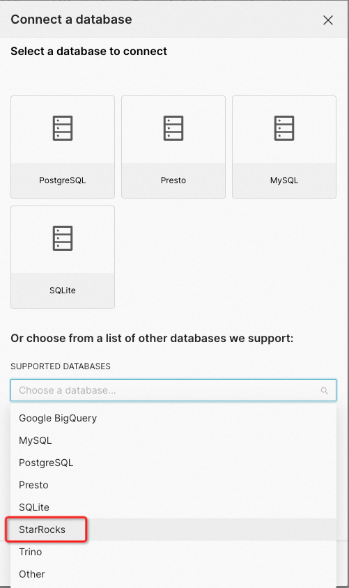

# Apache Superset

Apache Superset supports querying and visualizing both internal data and external data in StarRocks.

## Prerequisites

Make sure that you have finished the following installations:

1. Install the Python client for StarRocks on your Apache Superset server.

   ```SQL
   pip install starrocks
   ```

2. Install the latest version of Apache Superset. For more information, see [Installing Superset](https://superset.apache.org/docs/intro).

## Integration

Create a database in Apache Superset:




 Take note of the following points:

- For **SUPPORTED DATABASES**, select **StarRocks**, which will be used as the data source.
- For **SQLALCHEMY** **URI**, enter a URI in the StarRocks SQLAlchemy URI format as below:

  ```SQL
  starrocks://<User>:<Password>@<Host>:<Port>/<Catalog>.<Database>
  ```

  The parameters in the URI are described as follows:

  - `User`: the username that is used to log in to your StarRocks cluster, for example, `admin`.
  - `Password`: the password that is used to log in to your StarRocks cluster.
  - `Host`: the FE host IP address of your StarRocks cluster.
  - `Port`: the FE query port of your StarRocks cluster, for example, `9030`.
  - `Catalog`: the target catalog in your StarRocks cluster. Both internal and external catalogs are supported.
  - `Database`: the target database in your StarRocks cluster. Both internal and external databases are supported.
  
