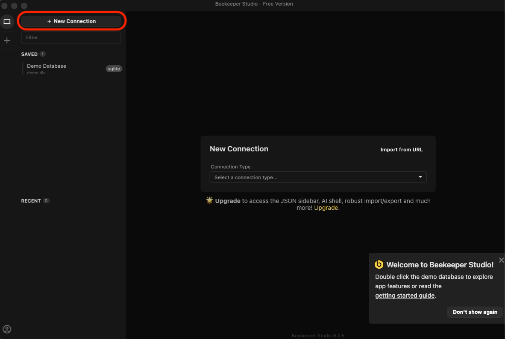
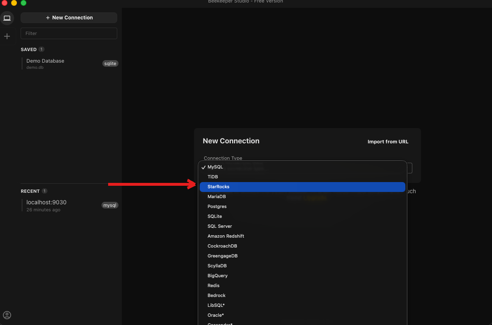
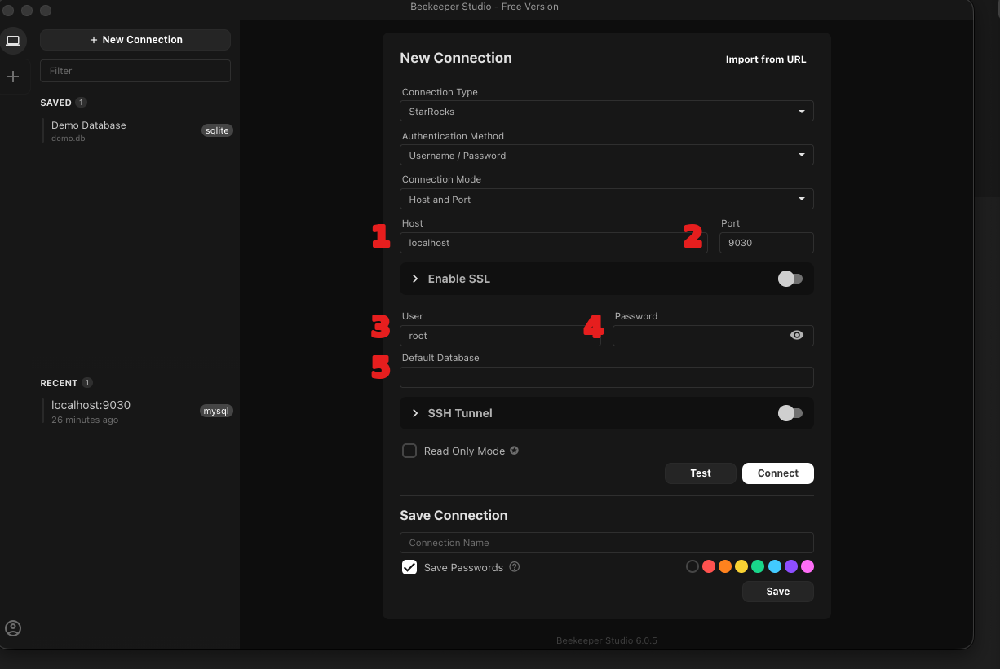
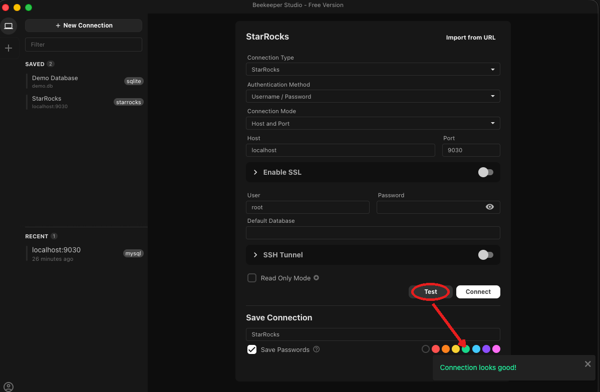
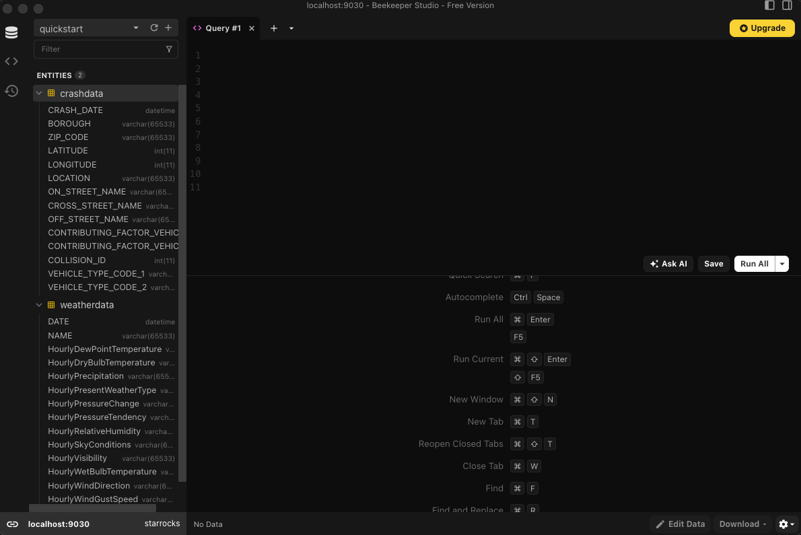

# Beekeeper Studio

[Beekeeper Studio](https://www.beekeeperstudio.io/) is a free, open-source SQL editor and database manager with a modern, easy-to-use interface. It is available for Windows, macOS, and Linux, and also offers a paid Ultimate tier with cloud sync and team-sharing features.

Beekeeper Studio has built-in support for connecting directly to StarRocks.

## Prerequisites

Make sure that you have installed Beekeeper Studio.

You can download Beekeeper Studio at [https://www.beekeeperstudio.io/get](https://www.beekeeperstudio.io/get).

## Integration

Follow these steps to connect to a StarRocks cluster:

1. Launch Beekeeper Studio.

2. On the connections screen, click **New Connection**.

   

3. Select **StarRocks** as the connection type.

   In the connection type dropdown, search for or select **StarRocks**.

   

4. Configure the connection to the database.

   Fill in the following connection settings:

   - **Host**: the FE host IP address of your StarRocks cluster.
   - **Port**: the FE query port of your StarRocks cluster, for example, `9030`.
   - **User**: the username that is used to log in to your StarRocks cluster, for example, `root`.
   - **Password**: the password that is used to log in to your StarRocks cluster.
   - **Default Database**: (optional) the target database in your StarRocks cluster.

   :::tip
   You can also click **Import from URL** and paste a full connection URL (for example, `mysql://root@<host>:9030`), and Beekeeper Studio will parse it into the fields above automatically.
   :::

   

5. Test the connection to the database.

   Click **Test** to verify the accuracy of the connection settings.

   

6. Connect to the database.

   Click **Connect** to save the connection and connect to your StarRocks cluster. Once connected, you can browse databases, tables, and views in the left-side sidebar, and run SQL queries against your StarRocks cluster.

   
