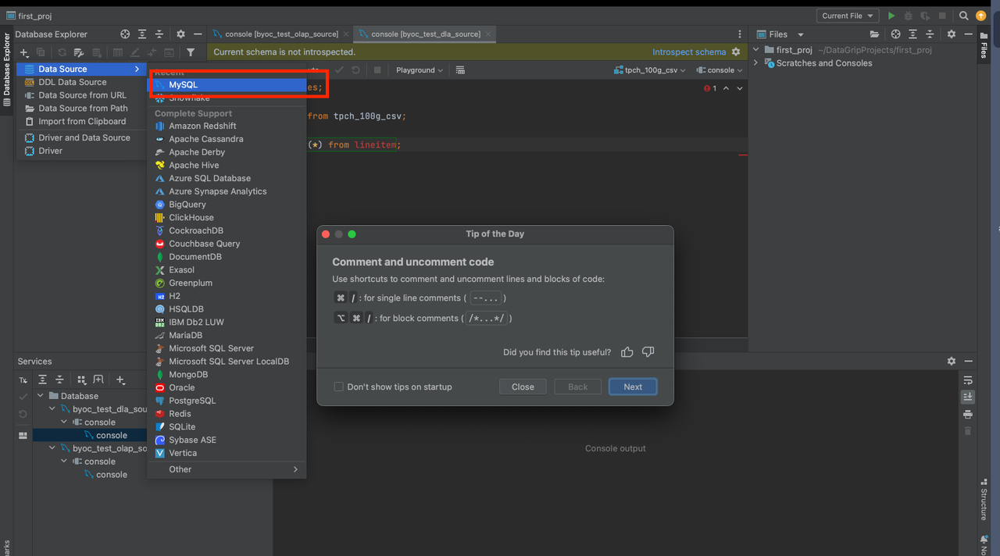

# DataGrip

DataGrip supports querying both internal data and external data in StarRocks.

Create a data source in DataGrip. Note that you must select MySQL as the data source.

The parameters that you need to configure are described as follows:

- **Host**: the FE host IP address of your StarRocks cluster.
- **Port**: the FE query port of your StarRocks cluster, for example, `9030`.
- **Authentication**: the authentication method that you want to use. Select **Username & Password**.
- **User**: the username that is used to log in to your StarRocks cluster, for example, `admin`.
- **Password**: the password that is used to log in to your StarRocks cluster.
- **Database**: the data source that you want to access in your StarRocks cluster. The value of this parameter is in the `<catalog_name>.<database_name>` format.
  - `catalog_name`: the name of the target catalog in your StarRocks cluster. Both internal and external catalogs are supported.
  - `database_name`: the name of the target database in your StarRocks cluster. Both internal and external databases are supported.
