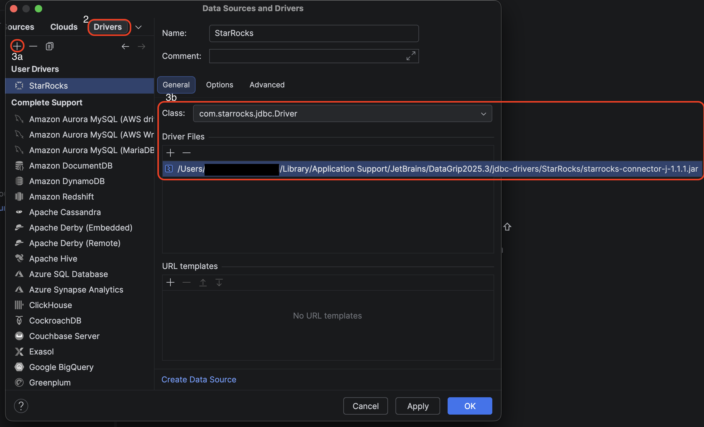
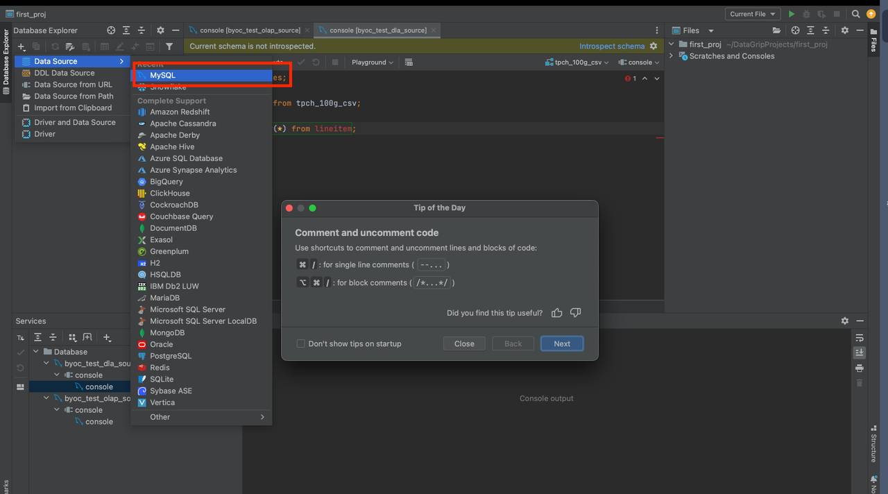

# DataGrip

DataGrip supports querying both internal data and external data in StarRocks.

:::tip
[DataGrip docs](https://www.jetbrains.com/help/datagrip/getting-started.html)
:::

You can connect to StarRocks from DataGrip using either the native StarRocks JDBC driver (recommended) or the MySQL driver.

## Connect using the StarRocks JDBC driver (recommended)

The StarRocks JDBC driver provides accurate metadata discovery, which enables schema browsing, auto-complete, and table introspection in DataGrip.

### Prerequisites

Download the StarRocks JDBC driver JAR. See [StarRocks JDBC Driver](../JDBC_driver.md) for download instructions.

### Steps

1. In DataGrip, go to **File** > **Data Sources** (or click the **Database** icon in the toolbar).

2. Click **+** and select **Driver and Data Source**.

3. In the **Drivers** tab, click **+** to create a new driver.

   - Set the **Name** to `StarRocks`.
   - Under **Driver Files**, click **+** and add the StarRocks JDBC driver JAR you downloaded.
   - Set the **Class** to `com.starrocks.cj.jdbc.Driver`.
   - Set the **URL template** to:
     ```
     jdbc:starrocks://{host}:{port}/{catalog}.{database}
     ```
   - Click **OK** to save the driver.

   

4. Back in the **Data Sources** tab, click **+** and select the **StarRocks** driver you just created.

5. Configure the connection settings:

   - **Host**: the FE host IP address of your StarRocks cluster.
   - **Port**: the FE query port of your StarRocks cluster, for example, `9030`.
   - **Catalog**: the name of the target catalog. Use `default_catalog` for internal tables, or the name of an external catalog.
   - **Database**: the name of the target database within the catalog.
   - **User**: the username to log in to your StarRocks cluster, for example, `admin`.
   - **Password**: the password to log in to your StarRocks cluster.

6. Click **Test Connection** to verify the settings, then click **OK**.

## Connect using the MySQL driver

The MySQL driver is a fallback for the StarRocks JDBC driver. 

Create a data source in DataGrip. Note that you must select MySQL as the data source.




The parameters that you need to configure are described as follows:

- **Host**: the FE host IP address of your StarRocks cluster.
- **Port**: the FE query port of your StarRocks cluster, for example, `9030`.
- **Authentication**: the authentication method that you want to use. Select **Username & Password**.
- **User**: the username that is used to log in to your StarRocks cluster, for example, `admin`.
- **Password**: the password that is used to log in to your StarRocks cluster.
- **Database**: the data source that you want to access in your StarRocks cluster. The value of this parameter is in the `<catalog_name>.<database_name>` format.
  - `catalog_name`: the name of the target catalog in your StarRocks cluster. Both internal and external catalogs are supported.
  - `database_name`: the name of the target database in your StarRocks cluster. Both internal and external databases are supported.
