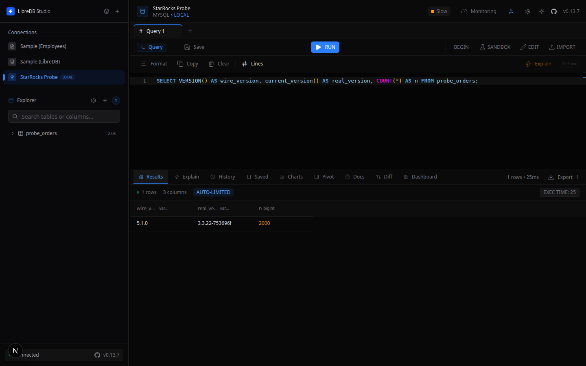

# LibreDB Studio

[LibreDB Studio](https://libredb.org) is an open source (MIT licensed) SQL IDE that runs in a
browser rather than installing as a desktop application. It ships as a Docker image, a Helm chart,
or an npm package, and connects to StarRocks over the MySQL wire protocol using its MySQL driver.

## Prerequisites

- A running StarRocks cluster reachable from wherever LibreDB Studio runs, and its FE query port
  (MySQL protocol, default `9030`).
- LibreDB Studio itself. Run it with Docker:

```sh
docker run -p 3000:3000 ghcr.io/libredb/libredb-studio:latest
```

  A Helm chart and an npm package (`npx @libredb/studio`) are also available; see the
  [LibreDB Studio repository](https://github.com/libredb/libredb-studio) for details.

## Integration

1. Open LibreDB Studio in your browser and sign in.
2. Click the **+** button to add a new connection.
3. Select **MySQL** as the connection type. StarRocks speaks the MySQL wire protocol, so there is
   no separate StarRocks driver to pick.
4. Fill in the connection settings:
   - **Host**: your FE hostname or IP address
   - **Port**: the FE query port, `9030` by default (not MySQL's `3306`)
   - **User** / **Password**: your StarRocks credentials
   - **Database**: the target database name
5. Click **Test Connection** to verify, then **Establish Connection** to save it.

The connection appears in the sidebar. The SQL editor, the table browser, and the table and
storage statistics all work against StarRocks, including correct row counts and sizes once
StarRocks' own background statistics collector has caught up with a freshly loaded table. A few
surfaces that a MySQL-protocol tool might expect are unavailable: StarRocks has no
`information_schema.PROCESSLIST`, so the active-sessions view and the connection health check do
not answer (the connection still works; only that one reading is unavailable); StarRocks has no
`performance_schema` database, so slow-query history is not available either; StarRocks exposes no
secondary-index catalog, so no index information is shown; and `EXPLAIN FORMAT='json'` is not
accepted, so the graphical query-plan view does not render (a plain `EXPLAIN` still runs from the
editor).


