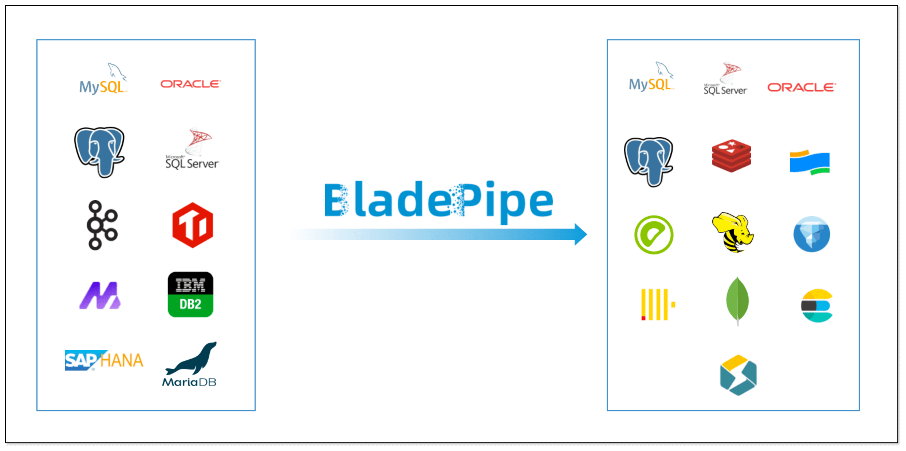
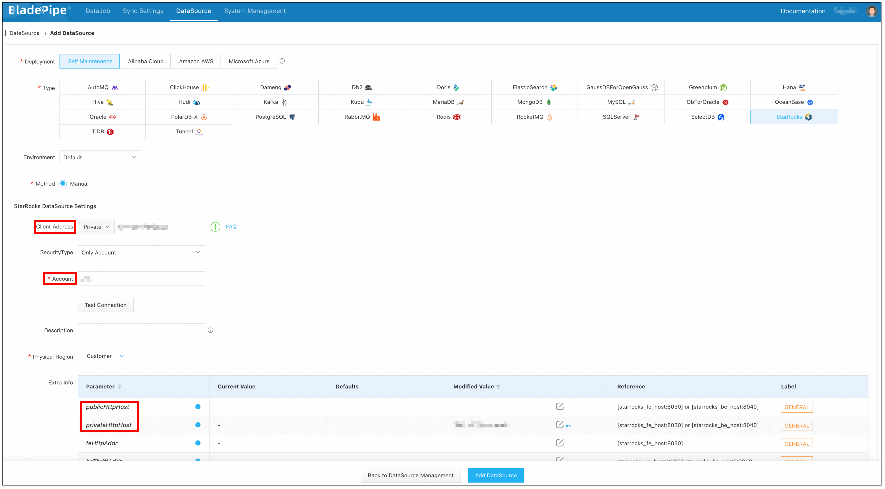
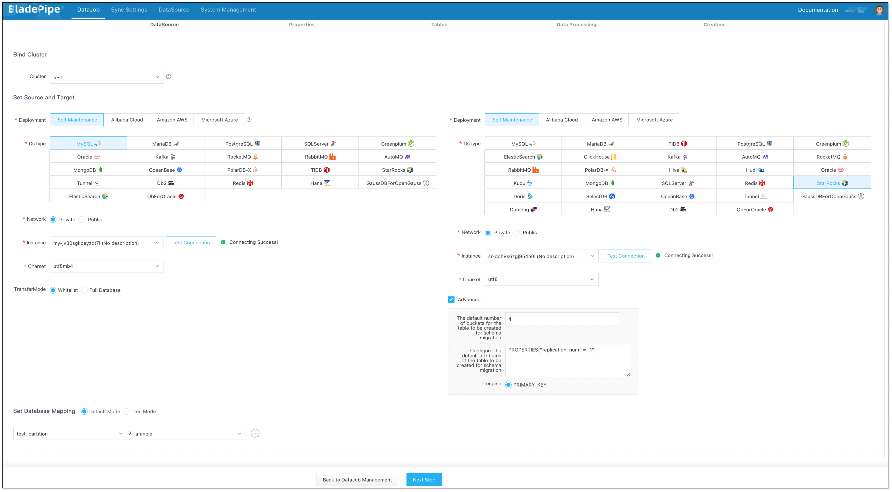
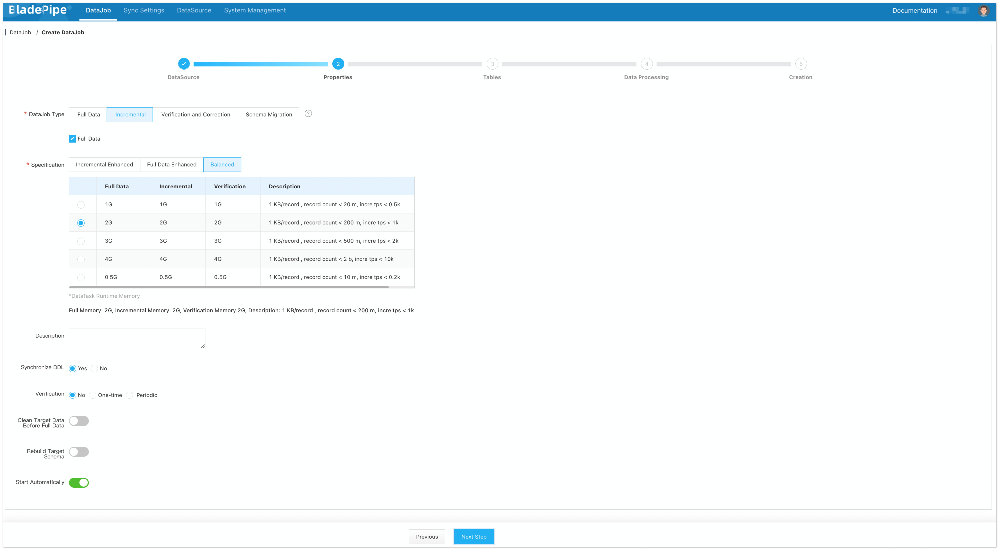
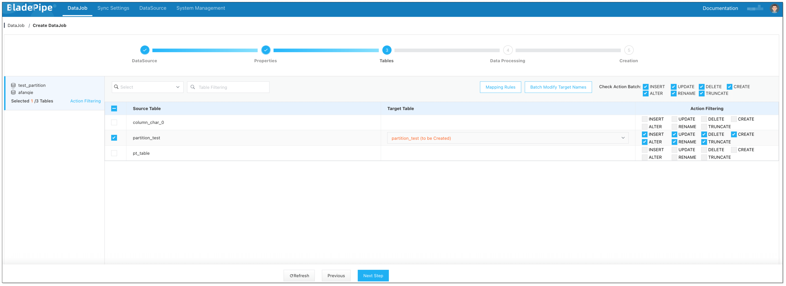
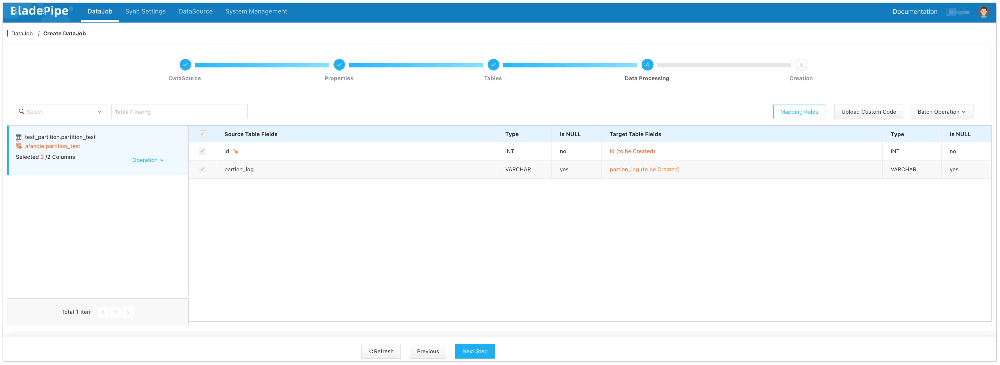
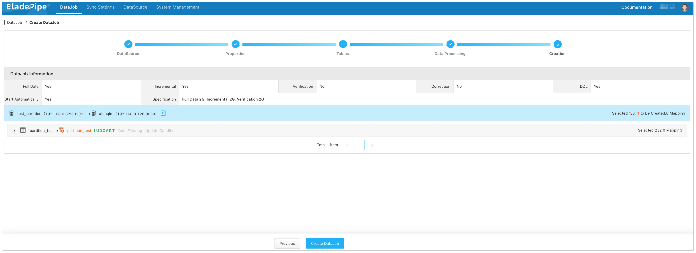
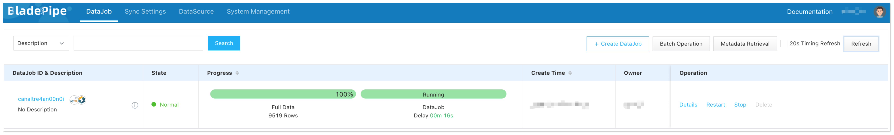

# BladePipe

## Introduction

BladePipe is a **real-time end-to-end data replication tool**, moving data between **30+** databases, message queues, search engines, caching systems, real-time data warehouses, data lakes and more, with **ultra-low latency**. It features efficiency, stability and scalability, compatibility with diverse database engines, one-stop management, enhanced security, and complex data transformation. BladePipe helps to break down data silos, increasing the value of data.

## Features

BladePipe presents a visualized management interface, allowing you to easily create DataJobs to achieve **schema migration, data migration, synchronization, verification and correction**, and more. In addition, it supports more refined and customized configurations by parameter settings. Now BladePipe supports data movement from the following source DataSources to StarRocks:

| Source DataSource           | Schema Migration | Data Migration | Data Sync | Verification & Correction |
| --------------------------- | ---------------- | -------------- | --------- | ------------------------- |
| MySQL/MariaDB/AuroraMySQL   | Yes              | Yes            | Yes       | Yes                       |
| Oracle                      | Yes              | Yes            | Yes       | Yes                       |
| PostgreSQL/AuroraPostgreSQL | Yes              | Yes            | Yes       | Yes                       |
| SQL Server                  | Yes              | Yes            | Yes       | Yes                       |
| Kafka                       | No               | No             | Yes       | No                        |
| AutoMQ                      | No               | No             | Yes       | No                        |
| TiDB                        | Yes              | Yes            | Yes       | Yes                       |
| Hana                        | Yes              | Yes            | Yes       | Yes                       |
| PolarDB for MySQL           | Yes              | Yes            | Yes       | Yes                       |
| Db2                         | Yes              | Yes            | Yes       | Yes                       |

:::info

For more information on supported functions and parameter settings, refer to [BladePipe Connections](https://doc.bladepipe.com/dataMigrationAndSync/connection/mysql2?target=StarRocks).

:::

## Installation

Follow the instructions in [Install BladePipe Worker (Docker)](https://doc.bladepipe.com/productOP/docker/install_worker_docker) or [Install BladePipe Worker (Binary)](https://doc.bladepipe.com/productOP/binary/install_worker_binary) to download and install a BladePipe Worker.

## Example

Taking a MySQL instance as an example, the following section describes how to migrate data from MySQL to StarRocks.

### Add DataSources

1. Log in to the [BladePipe Cloud](https://cloud.bladepipe.com/). Click **DataSource** > **Add DataSource**.
2. Select **StarRocks** as the **Type**, and fill in the setup form.
   - **Client Address**：The port StarRocks provided to MySQL Client. BladePipe queries the metadata in databases via it. 
   - **Account**: The user name of the StarRocks database. The INSERT privilege is required to write data to StarRocks. Follow the instruction provided in [GRANT](../../sql-reference/sql-statements/account-management/GRANT.md) to grant the database user the INSERT privilege.
   - **Http Address**：The port used to receive the request from BladePipe to write data to StarRocks.

   

3. Click **Test Connection**. After the connection is successful, click **Add DataSource** to add the DataSource.
4. Add a MySQL DataSource following the above steps.

### Create DataJob

1. Click **DataJob** > [**Create DataJob**](https://doc.bladepipe.com/operation/job_manage/create_job/create_full_incre_task).

2. Select the source and target DataSources, and click **Test Connection** to ensure the connection to the source and target DataSources are both successful.

   

3. Select **Incremental** for DataJob Type, together with the **Full Data** option.

   

4. Select the tables to be replicated. **Note that the target StarRocks tables automatically created after Schema Migration have primary keys, so source tables without primary keys are not supported currently**.

   

5. Select the columns to be replicated.

   

6. Confirm the DataJob creation.

   

7. The DataJob runs automatically. BladePipe will automatically run the following DataTasks:
   - **Schema Migration**: The schemas of the source tables will be migrated to the target instance.
   - **Full Data**: All existing data of the source tables will be fully migrated to the target instance.
   - **Incremental**: Ongoing data changes will be continuously synchronized to the target instance (with latency less than a minute).

