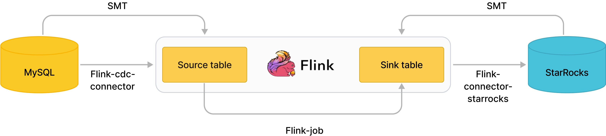

# StarRocks Migration Tool (SMT) 

StarRocks Migration Tool (SMT) is a data migration tool provided by StarRocks to load data from source databases through Flink into StarRocks. SMT mainly can:
- Generate statements to create tables in StarRocks based on information of the source database and the target StarRocks cluster.
- Generate SQL statements that can be executed in Flink's SQL client to submit Flink jobs for synchronizing data, which simplifies full or incremental data synchronization in the pipeline. Currently, SMT supports the following source databases:

| Source database | Generate statement to create table in StarRocks | Full data synchronization | Incremental data synchronization |
| --------------- | ----------------------------------------------- | ------------------------- | -------------------------------- |
| MySQL           | Supported                                         | Supported                   | Supported                          |
| PostgreSQL      | Supported                                         | Supported                   | Supported                          |
| Oracle          | Supported                                         | Supported                   | Supported                          |
| Hive            | Supported                                         | Supported                   | Not supported                      |
| ClickHouse      | Supported                                         | Supported                   | Not supported                      |
| SQL Server      | Supported                                         | Supported                   | Supported                          |
| TiDB            | Supported                                         | Supported                   | Supported                          |

Download link: https://cdn-thirdparty.starrocks.com/smt.tar.gz?r=2

## Steps to use SMT

The generally involved steps are as follows: 

1. Configure the **conf/config_prod.conf** file. 

2. Execute **starrocks-migration-tool**.

3. After execution, the SQL scripts are generated in the **result** directory by default.

   You can then use the SQL scripts in the **result** directory for metadata or data synchronization.

## Configurations of SMT 

- `[db]`: information to connect the data source. Configure the information to connect the data source corresponding to the database type specified in the `type` patameter.

- `[other]`: additional configurations. It is recommended to specify the actual number of BE nodes in the  `be_num` patameter.

- `flink.starrocks.sink.*`: configurations of flink-connector-starrocks. For detailed configurations and description, see [configuration description](https://github.com/StarRocks/flink-connector-starrocks#sink-options).

- `[table-rule.1]`: rule to match tables in the data source. The CREATE TABLE statement is generated based on the regular expressions configured in the rule to match the names of databases and tables in data source. Multiple rules can be configured, and each rule generates a corresponding result file, for example:

  - `[table-rule.1]` -> `result/starrocks-create.1.sql`
  - `[table-rule.2]` -> `result/starrocks-create.2.sql`

  Each rule needs to contain the configurations of database, table, and flink-connector-starrocks.

   ```Bash
   [table-rule.1]
   # pattern to match databases for setting properties
   database = ^ database1.*$
   # pattern to match tables for setting properties
   table = ^.*$
   schema = ^.*$
   ############################################
   ### flink sink configurations
   ### DO NOT set `connector`, `table-name`, `database-name`, they are auto-generated
   ############################################
   flink.starrocks.jdbc-url=jdbc:mysql://192.168.1.1:9030
   flink.starrocks.load-url= 192.168.1.1:8030
   flink.starrocks.username=root
   flink.starrocks.password=
   flink.starrocks.sink.max-retries=10
   flink.starrocks.sink.buffer-flush.interval-ms=15000
   flink.starrocks.sink.properties.format=json
   flink.starrocks.sink.properties.strip_outer_array=true
  
   [table-rule.2]
   # pattern to match databases for setting properties
   database = ^database2.*$
   # pattern to match tables for setting properties
   table = ^.*$
   schema = ^.*$
   ############################################
   ### flink sink configurations
   ### DO NOT set `connector`, `table-name`, `database-name`, they are auto-generated
   ############################################
   flink.starrocks.jdbc-url=jdbc:mysql://192.168.1.1:9030
   flink.starrocks.load-url= 192.168.1.1:8030
   flink.starrocks.username=root
   flink.starrocks.password=
   flink.starrocks.sink.max-retries=10
   flink.starrocks.sink.buffer-flush.interval-ms=15000
   flink.starrocks.sink.properties.format=json
   flink.starrocks.sink.properties.strip_outer_array=true
   ```

- A separate rule can be configured for a large table that is split into shards in databases. For example, suppose that the two databases `edu_db_1` and `edu_db_2` contain the tables `course_1` and `course_2` respectively, and these two tables have the same structure. You can use the following rule to load data from these two tables into one StarRocks table for analysis.

  ```Bash
  [table-rule.3]
  # pattern to match databases for setting properties
  database = ^edu_db_[0-9]*$
  # pattern to match tables for setting properties
  table = ^course_[0-9]*$
  schema = ^.*$
  ```

  This rule will automatically form a many-to-one loading relationship. The default name of the table that will be generated in StarRocks is `course__auto_shard`, and you can also modify the table name in the related SOL script, such as `result/starrocks-create.3.sql`.

## Synchronize MySQL to StarRocks

### Introduction

Flink CDC connector and SMT can synchronize data from MySQL within subsecond. 



As shown in the image, SMT can automatically generate CREATE TABLE statements of the Flink's source and sink tables based on the cluster information and table structure of MySQL and StarRocks. Flink CDC connector reads the MySQL Binlog and Flink-connector-starrocks writes data to StarRocks .

### Steps

1. Download [Flink](https://flink.apache.org/downloads.html). The version of Flink is supported to be 1.11 or later.

2. Download [Flink CDC connector](https://github.com/ververica/flink-cdc-connectors/releases). Make sure that you download the `flink-sql-connector-mysql-cdc-xxx.jar` corresponding to the version of Flink.

3. Download [Flink-connector-starrocks](https://github.com/StarRocks/flink-connector-starrocks).

4. Copy **flink-sql-connector-mysql-cdc-xxx.jar** and **flink-connector-starrocks-xxx.jar** to **flink-xxx/lib/**.

5. Download [smt.tar.gz](https://cdn-thirdparty.starrocks.com/smt.tar.gz?r=2).

6. Extract and modify the configuration file of SMT.

   ```Bash
   [db]
   host = 192.168.1.1
   port = 3306
   user = root
   password =  
   type = mysql
   
   [other]
   # number of backends in StarRocks
   be_num = 3
   # `decimal_v3` is supported since StarRocks-1.18.1
   use_decimal_v3 = false
   # directory to save the converted DDL SQL
   output_dir = ./result
   
   [table-rule.1]
   # pattern to match databases for setting properties
   database = ^db$
   # pattern to match tables for setting properties
   table = ^table$
   schema = ^.*$
   
   ############################################
   ### flink sink configurations
   ### DO NOT set `connector`, `table-name`, `database-name`, they are auto-generated
   ############################################
   flink.starrocks.jdbc-url=jdbc:mysql://192.168.1.1:9030
   flink.starrocks.load-url= 192.168.1.1:8030
   flink.starrocks.username=root
   flink.starrocks.password=
   flink.starrocks.sink.max-retries=10
   flink.starrocks.sink.buffer-flush.interval-ms=15000
   flink.starrocks.sink.properties.format=json
   flink.starrocks.sink.properties.strip_outer_array=true
   ```

7. Execute **starrocks-migrate-tool**. All SQL scripts are generated in the result directory.

   ```Bash
   $./starrocks-migrate-tool
   $ls result
   flink-create.1.sql    smt.tar.gz              starrocks-create.all.sql
   flink-create.all.sql  starrocks-create.1.sql  starrocks-external-create.all.sql
   ```

8. Use a SQL script whose prefix is **starrocks-create** to generate the table in StarRocks.

   ```Bash
   mysql -hxx.xx.xx.x -P9030 -uroot -p < starrocks-create.all.sql
   ```

9. Use a SQL script whose prefix is **flink-create** to generate the Flink source and sink tables, and start a Flink job to synchronize data.

   ```Bash
   bin/sql-client.sh embedded < flink-create.all.sql
   ```

   After the above command is successfully executed, the Flink job to synchronize data keeps running.

10. Observe the status of the Flink job.

    ```Bash
    bin/flink list 
    ```

    If the job execution encounters an error, you can view detailed error information in the Flink logs. Also, you can modify the Flink configurations in the file **conf/flink-conf.yaml**, such as memory and slot.

### Notes

- How to enable MySQL binlog?

  1. Modify /etc/my.cnf:

     ```plaintext
     # Enable binlog
     log-bin=/var/lib/mysql/mysql-bin
     
     #log_bin=ON
     ## Base name of binlog files
     #log_bin_basename=/var/lib/mysql/mysql-bin
     ## Index file for binlog files, managing all binlog files
     #log_bin_index=/var/lib/mysql/mysql-bin.index
     # Configure server id
     server-id=1
     binlog_format = row
     ```

  2. Restart mysqld. You can check whether MySQL binlog is enabled by executing `SHOW VARIABLES LIKE 'log_bin';`.

## Synchronize PostgreSQL to StarRocks

### Introduction

Flink CDC connector and SMT can synchronize data from PostgreSQL within subsecond.

SMT can automatically generate CREATE TABLE statements of the Flink's source and sink tables based on the cluster information and table structure of PostgreSQL and StarRocks.

Flink CDC connector reads the WAL of PostgreSQL and Flink-connector-starrocks writes data to StarRocks .

### Steps

1. Download [Flink](https://flink.apache.org/downloads.html). The version of Flink is supported to be 1.11 or later.

2. Download [Flink CDC connector](https://github.com/ververica/flink-cdc-connectors/releases). Make sure that you download the flink-sql-connector-postgres-cdc-xxx.jar corresponding to the version of Flink.

3. Download [Flink StarRocks connector](https://github.com/StarRocks/flink-connector-starrocks).

4. Copy **flink-sql-connector-postgres-cdc-xxx.jar** and **flink-connector-starrocks-xxx.jar** to **flink-xxx/lib/**.

5. Download [smt.tar.gz](https://cdn-thirdparty.starrocks.com/smt.tar.gz?r=2).

6. Extract and modify the configuration file of SMT.

   ```Bash
   [db]
   host = 192.168.1.1
   port = 5432
   user = xxx
   password = xxx
   type = pgsql
   
   [other]
   # number of backends in StarRocks
   be_num = 3
   # `decimal_v3` is supported since StarRocks-1.18.1
   use_decimal_v3 = false
   # directory to save the converted DDL SQL
   output_dir = ./result
   
   [table-rule.1]
   # pattern to match databases for setting properties
   database = ^db$
   # pattern to match tables for setting properties
   table = ^table$
   # pattern to match schemas for setting properties
   schema = ^.*$
   
   ############################################
   ### flink sink configurations
   ### DO NOT set `connector`, `table-name`, `database-name`, they are auto-generated
   ############################################
   flink.starrocks.jdbc-url=jdbc:mysql://192.168.1.1:9030
   flink.starrocks.load-url= 192.168.1.1:8030
   flink.starrocks.username=root
   flink.starrocks.password=
   flink.starrocks.sink.max-retries=10
   flink.starrocks.sink.buffer-flush.interval-ms=15000
   flink.starrocks.sink.properties.format=json
   flink.starrocks.sink.properties.strip_outer_array=true
   ```

7. Execute **starrocks-migrate-tool**. All SQL scripts are generated in the result directory.

   ```Bash
   $./starrocks-migrate-tool
   $ls result
   flink-create.1.sql    smt.tar.gz              starrocks-create.all.sql
   flink-create.all.sql  starrocks-create.1.sql 
   ```

8. Use a SQL script whose prefix is **starrocks-create** to generate the table in StarRocks.

   ```Bash
   mysql -hxx.xx.xx.x -P9030 -uroot -p < starrocks-create.all.sql
   ```

9. Use a SQL script whose prefix is **flink-create** to generate the Flink source and sink tables, and start a Flink job to synchronize data.

   ```Bash
   bin/sql-client.sh embedded < flink-create.all.sql
   ```

   After the above command is successfully executed, the Flink job to synchronize data keeps running.

10. Observe the status of the Flink job.

    ```Bash
    bin/flink list 
    ```

    If the job execution encounters an error, you can view detailed error information in the Flink logs. Also, you can modify the Flink configurations in the file **conf/flink-conf.yaml**, such as memory and slot.

### Notes

- For PostgreSQL `v9.*`, a special flink-cdc configuration as shown below is required (It is recommended to use PostgreSQL `v10.*` or later. Otherwise, you need to install WAL decoding plugins):

   ```Bash
   ############################################
   ############################################
   ### flink-cdc plugin configuration for `postgresql`
   ############################################
   ### for `9.*` decoderbufs, wal2json, wal2json_rds, wal2json_streaming, wal2json_rds_streaming
   ### refer to https://ververica.github.io/flink-cdc-connectors/master/content/connectors/postgres-cdc.html 
   ### and https://debezium.io/documentation/reference/postgres-plugins.html
   ### flink.cdc.decoding.plugin.name = decoderbufs
   ```

- How to enable PostgreSQL WAL?

   ```Bash
   # Open connection permissions
   echo "host all all 0.0.0.0/32 trust" >> pg_hba.conf
   echo "host replication all 0.0.0.0/32 trust" >> pg_hba.conf
   # Enable wal logical replication
   echo "wal_level = logical" >> postgresql.conf
   echo "max_wal_senders = 2" >> postgresql.conf
   echo "max_replication_slots = 8" >> postgresql.conf
   ```

   Specify replica identity FULL for the tables that need to be synchronized.

    ```SQL
    ALTER TABLE schema_name.table_name REPLICA IDENTITY FULL
    ```

    After making these changes, restart PostgreSQL .

## Synchronize Oracle to StarRocks

### Introduction

Flink CDC connector and SMT can synchronize data from Oracle within subsecond.

SMT can automatically generate CREATE TABLE statements of the Flink's source and sink tables based on the cluster information and table structure of Oracle and StarRocks.

Flink CDC connector reads the logminer of Oracle and Flink-connector-starrocks writes data to StarRocks.

### Steps

1. Download [Flink](https://flink.apache.org/downloads.html). The version of Flink is supported to be 1.11 or later.

2. Download [Flink CDC connector](https://github.com/ververica/flink-cdc-connectors/releases). Make sure that you download the flink-sql-connector-oracle-cdc-xxx.jar corresponding to the Flink version.

3. Download [Flink StarRocks connector](https://github.com/StarRocks/flink-connector-starrocks).

4. Copy `flink-sql-connector-oracle-cdc-xxx.jar` and `flink-connector-starrocks-xxx.jar` to `flink-xxx/lib/`.

5. Download [smt.tar.gz](https://cdn-thirdparty.starrocks.com/smt.tar.gz?r=2).

6. Extract and modify the configuration file of SMT.

   ```Bash
   [db]
   host = 192.168.1.1
   port = 1521
   user = xxx
   password = xxx
   type = oracle
   
   [other]
   # number of backends in StarRocks
   be_num = 3
   # `decimal_v3` is supported since StarRocks-1.18.1
   use_decimal_v3 = false
   # directory to save the converted DDL SQL
   output_dir = ./result
   
   [table-rule.1]
   # pattern to match databases for setting properties
   database = ^db$
   # pattern to match tables for setting properties
   table = ^table$
   # pattern to match schemas for setting properties
   schema = ^.*$
   
   ############################################
   ### flink sink configurations
   ### DO NOT set `connector`, `table-name`, `database-name`, they are auto-generated
   ############################################
   flink.starrocks.jdbc-url=jdbc:mysql://192.168.1.1:9030
   flink.starrocks.load-url= 192.168.1.1:8030
   flink.starrocks.username=root
   flink.starrocks.password=
   flink.starrocks.sink.max-retries=10
   flink.starrocks.sink.buffer-flush.interval-ms=15000
   flink.starrocks.sink.properties.format=json
   flink.starrocks.sink.properties.strip_outer_array=true
   ```

7. Execute **starrocks-migrate-tool**. All SQL scripts are generated in the result directory.

   ```Bash
   $./starrocks-migrate-tool
   $ls result
   flink-create.1.sql    smt.tar.gz              starrocks-create.all.sql
   flink-create.all.sql  starrocks-create.1.sql 
   ```

8. Use a SQL script whose prefix is starrocks-create to generate the table in StarRocks.

   ```Bash
   mysql -hxx.xx.xx.x -P9030 -uroot -p < starrocks-create.all.sql
   ```

9. Use a SQL script whose prefix is flink-create to generate the Flink source and sink tables, and start a Flink job to synchronize data.

   ```Bash
   bin/sql-client.sh embedded < flink-create.all.sql
   ```

   After the above command is successfully executed, the Flink job to synchronize data keeps running.

10. Observe the status of the Flink job.

    ```Bash
    bin/flink list 
    ```

 	If the job execution encounters an error, you can view detailed error information in the Flink logs. Also, you can modify the Flink configurations in the file **conf/flink-conf.yaml**, such as memory and slot.

### Notes

- Synchronize Oracle using logminer:

  ```SQL
  # Enable logging
  alter system set db_recovery_file_dest = '/home/oracle/data' scope=spfile;
  alter system set db_recovery_file_dest_size = 10G;
  shutdown immediate;
  startup mount;
  alter database archivelog;
  alter database open;
  
  ALTER TABLE schema_name.table_name ADD SUPPLEMENTAL LOG DATA (ALL) COLUMNS;
  ALTER DATABASE ADD SUPPLEMENTAL LOG DATA;
  
  # Authorize user creation and grant permissions
  GRANT CREATE SESSION TO flinkuser;
  GRANT SET CONTAINER TO flinkuser;
  GRANT SELECT ON V_$DATABASE TO flinkuser;
  GRANT FLASHBACK ANY TABLE TO flinkuser;
  GRANT SELECT ANY TABLE TO flinkuser;
  GRANT SELECT_CATALOG_ROLE TO flinkuser;
  GRANT EXECUTE_CATALOG_ROLE TO flinkuser;
  GRANT SELECT ANY TRANSACTION TO flinkuser;
  GRANT LOGMINING TO flinkuser;
  GRANT CREATE TABLE TO flinkuser;
  GRANT LOCK ANY TABLE TO flinkuser;
  GRANT ALTER ANY TABLE TO flinkuser;
  GRANT CREATE SEQUENCE TO flinkuser;
  GRANT EXECUTE ON DBMS_LOGMNR TO flinkuser;
  GRANT EXECUTE ON DBMS_LOGMNR_D TO flinkuser;
  GRANT SELECT ON V_$LOG TO flinkuser;
  GRANT SELECT ON V_$LOG_HISTORY TO flinkuser;
  GRANT SELECT ON V_$LOGMNR_LOGS TO flinkuser;
  GRANT SELECT ON V_$LOGMNR_CONTENTS TO flinkuser;
  GRANT SELECT ON V_$LOGMNR_PARAMETERS TO flinkuser;
  GRANT SELECT ON V_$LOGFILE TO flinkuser;
  GRANT SELECT ON V_$ARCHIVED_LOG TO flinkuser;
  GRANT SELECT ON V_$ARCHIVE_DEST_STATUS TO flinkuser;
  ```

- The database configurations in the [table-rule.1] does not support regular expression, so the complete database names need to be specified.
- Because Oracle12c supports CDB mode, SMT internally automatically determines whether CDB is enabled and modifies the flink-cdc configuration correspondingly. However, users need to pay attention to whether the c## prefix needs to be added to the configuration of `[db].user` to avoid issues of insufficient permission.

## Synchronize Hive to StarRocks

### Introduction

This guide explains how to use SMT to synchronize Hive data to StarRocks. During synchronization, a Duplicate table in StarRocks is created and a Flink job keeps running to synchronize data.

### Steps

#### Preparations

```SQL
[db]
# hiveserver2 service ip
host = 127.0.0.1
# hiveserver2 service port
port = 10000        
user = hive/emr-header-1.cluster-49148
password = 
type = hive
# only takes effect with `type = hive`.
# Available values: kerberos, none, nosasl, kerberos_http, none_http, zk, ldap
authentication = kerberos
```

 The supported authentication methods are as follows:

- nosasl, zk: do not need to specify the `user` and `password`.
- none, none_http, ldap:  specify the `user` and `password`.
- kerberos, kerberos_http: perform the following steps:
  - Execute `kadmin.local` on the Hive cluster and check `list_principals` to find the corresponding principal name. For example when the principal name is `hive/emr-header-1.cluster-49148@EMR.49148.COM`, the user needs to be set as `hive/emr-header-1.cluster-49148`, and the password is left empty.
  - Execute `kinit -kt /path/to/keytab principal` on the machine where SMT is executed and execute `klist` to see if the correct token is generated.

#### Data synchronization

1. Execute **starrocks-migrate-tool**.
2. Use a SQL script whose prefix is **starrocks-create** to generate the table in StarRocks.

   ```Bash
   mysql -hxx.xx.xx.x -P9030 -uroot -p < starrocks-create.all.sql
   ```

3. In **flink/conf/**, create and edit the file **sql-client-defaults.yaml**:

    ```YAML
    execution:
    planner: blink
    type: batch
    current-catalog: hive-starrocks
    catalogs:
    - name: hive-starrocks
    type: hive
    hive-conf-dir: /path/to/apache-hive-xxxx-bin/conf
    ```

4. Download the [dependency package](https://nightlies.apache.org/flink/flink-docs-release-1.13/zh/docs/connectors/table/hive/overview/) (flink-sql-connector-hive-xxxx) from the Hive page of the corresponding version of Flink and place it in the `flink/lib` directory.
5. Start the Flink cluster and execute `flink/bin/sql-client.sh embedded < result/flink-create.all.sql` to start data synchronization.

## Synchronize SQL Server to StarRocks

### Introduction

Flink CDC connector and SMT can synchronize data from SQL Server within subsecond.

SMT can automatically generate CREATE TABLE statements of the Flink's source and sink tables based on the cluster information and table structure of SQL Server and StarRocks.

Flink CDC connector captures and records row-level changes that occur in the SQL Server database server. The principle is to use the CDC feature provided by SQL Server itself. The CDC capability of SQL Server itself can archive specified changes in the database to specified change tables. The SQL Server CDC connector first reads historical data from the table using JDBC, and then fetches incremental changes from the change tables, thereby achieving full incremental synchronization. Then, Flink-connector-starrocks writes data to StarRocks.

### Steps

1. Download [Flink](https://flink.apache.org/downloads.html). The version of Flink is supported to be 1.11 or later.
2. Download [Flink CDC connector](https://github.com/ververica/flink-cdc-connectors/releases). Make sure that you download the **flink-sql-connector-sqlserver-cdc-xxx.jar** corresponding to the Flink version.
3. Download [Flink StarRocks connector](https://github.com/StarRocks/flink-connector-starrocks).
4. Copy **flink-sql-connector-sqlserver-cdc-xxx.jar**, **flink-connector-starrocks-xxx.jar** to **flink-xxx/lib/**.
5. Download [smt.tar.gz](https://cdn-thirdparty.starrocks.com/smt.tar.gz?r=2).
6. Extract and modify the configuration file of SMT.

    ```Bash
    [db]
    host = 127.0.0.1
    port = 1433
    user = xxx
    password = xxx 

    # currently available types: `mysql`, `pgsql`, `oracle`, `hive`, `clickhouse`
    type = sqlserver 

    [other]
    # number of backends in StarRocks
    be_num = 3
    # `decimal_v3` is supported since StarRocks-1.18.1
    use_decimal_v3 = false
    # directory to save the converted DDL SQL
    output_dir = ./result

    [table-rule.1]
    # pattern to match databases for setting properties
    database = ^db$
    # pattern to match tables for setting properties
    table = ^table$
    schema = ^.*$

    ############################################
    ### flink sink configurations
    ### DO NOT set `connector`, `table-name`, `database-name`, they are auto-generated
    ############################################
    flink.starrocks.jdbc-url=jdbc:mysql://192.168.1.1:9030
    flink.starrocks.load-url= 192.168.1.1:8030
    flink.starrocks.username=root
    flink.starrocks.password=
    flink.starrocks.sink.max-retries=10
    flink.starrocks.sink.buffer-flush.interval-ms=15000
    flink.starrocks.sink.properties.format=json
    flink.starrocks.sink.properties.strip_outer_array=true
    ```

7. Execute *starrocks-migrate-tool**. All SQL scripts are generated in the `result` directory.

​    ```Bash
    $./starrocks-migrate-tool
    $ls result
    flink-create.1.sql    smt.tar.gz              starrocks-create.all.sql
    flink-create.all.sql  starrocks-create.1.sql  starrocks-external-create.all.sql
    ```

8. Use a SQL script whose prefix is `starrocks-create` to generate the table in StarRocks.

    ```Bash
    mysql -hxx.xx.xx.x -P9030 -uroot -p < starrocks-create.all.sql
    ```

9. Use a SQL script whose prefix is `flink-create` to generate the Flink source and sink tables, and start a Flink job to synchronize data.

    ```Bash
    bin/sql-client.sh embedded < flink-create.all.sql     
    ```

    After the above command is successfully executed, the Flink job to synchronize data keeps running.

10. Observe the status of the Flink job. 

    ```Bash
    bin/flink list 
    ```
    If the job execution encounters an error, you can view detailed error information in the Flink logs. Also, you can modify the Flink configurations in the file **conf/flink-conf.yaml**, such as memory and slot.

### Notes

1. Make sure that the Server Agent Service is enabled.

    Check if the Server Agent Service is running normally.
    
    ```sql
    EXEC master.dbo.xp_servicecontrol N'QUERYSTATE', N'SQLSERVERAGENT'
    GO
    ```
  
    Enable the Server Agent Service.


    ```Bash
    /opt/mssql/bin/mssql-conf set sqlagent.enabled true
    ```

2. Make sure that CDC for the corresponding database is enabled.

    ​    Check if CDC for the corresponding database is enabled.

        ```sql
        select is_cdc_enabled, name from sys.databases where name = 'XXX_databases'
        GO
        ```

    ​    Enable CDC.

    ​    :::note

    ​    When executing this command, make sure that the user `serverRole` is `sysadmin`.

    ​    :::


        ```SQL
        USE XXX_databases
        GO
        EXEC sys.sp_cdc_enable_db
        GO
        ```

3. Make sure that CDC for the corresponding table is enabled.


    ```SQL
    EXEC sys.sp_cdc_enable_table 
    @source_schema = 'XXX_schema', 
    @source_name = 'XXX_table', 
    @role_name = NULL, 
    @supports_net_changes = 0;
    GO
    ```

## Synchronize TiDB to StarRocks

### Introduction

Flink CDC connector and SMT can synchronize data from TiDB within subsecond.

SMT can automatically generate DDL statements for  the Flink's source tables and sink tables based on the cluster information and table structure of TiDB and StarRocks.

The Flink CDC connector captures data by directly reading full and incremental data from the underlying TiKV storage. The full data is obtained from ranges partitioned based on keys, and the incremental data is obtained by using the CDC Client provided by TiDB. Subsequently, the data is written to StarRocks through Flink-connector-starrocks.

### Steps

1. Download [Flink](https://flink.apache.org/downloads.html). The version of Flink is supported to be 1.11 or later.
2. Download [Flink CDC connector](https://github.com/ververica/flink-cdc-connectors/releases). Make sure that you download the **flink-sql-connector-tidb-cdc-xxx.jar** corresponding to the Flink version.
3. Download [Flink StarRocks connector](https://github.com/StarRocks/flink-connector-starrocks).
4. Copy **flink-sql-connector-tidb-cdc-xxx.jar**, **flink-connector-starrocks-xxx.jar** to **flink-xxx/lib/**.
5. Download [smt.tar.gz](https://cdn-thirdparty.starrocks.com/smt.tar.gz?r=2).
6. Extract and modify the configuration file of SMT.

    ```Bash
    [db]
    host = 127.0.0.1
    port = 4000
    user = root
    password = 
    # currently available types: `mysql`, `pgsql`, `oracle`, `hive`, `clickhouse`, `sqlserver`, `tidb`
    type = tidb 
    # # only takes effect on `type == hive`. 
    # # Available values: kerberos, none, nosasl, kerberos_http, none_http, zk, ldap
    # authentication = kerberos

    [other]
    # number of backends in StarRocks
    be_num = 3
    # `decimal_v3` is supported since StarRocks-1.18.1
    use_decimal_v3 = false
    # directory to save the converted DDL SQL
    output_dir = ./result

    [table-rule.1]
    # pattern to match databases for setting properties
    database = ^db$
    # pattern to match tables for setting properties
    table = ^table$
    schema = ^.*$

    ############################################
    ### flink sink configurations
    ### DO NOT set `connector`, `table-name`, `database-name`, they are auto-generated
    ############################################
    flink.starrocks.jdbc-url=jdbc:mysql://192.168.1.1:9030
    flink.starrocks.load-url= 192.168.1.1:8030
    flink.starrocks.username=root
    flink.starrocks.password=
    flink.starrocks.sink.max-retries=10
    flink.starrocks.sink.buffer-flush.interval-ms=15000
    flink.starrocks.sink.properties.format=json
    flink.starrocks.sink.properties.strip_outer_array=true

    ############################################
    ### flink-cdc configuration for `tidb`
    ############################################
    # # Only takes effect on TiDB before v4.0.0. 
    # # TiKV cluster's PD address.
    # flink.cdc.pd-addresses = 127.0.0.1:2379
    ```

7. Execute *starrocks-migrate-tool**. All SQL scripts are generated in the `result` directory.
    
    ```Bash
    $./starrocks-migrate-tool
    $ls result
    flink-create.1.sql    smt.tar.gz              starrocks-create.all.sql
    flink-create.all.sql  starrocks-create.1.sql  starrocks-external-create.all.sql
    ```

8. Use a SQL script whose prefix is `starrocks-create` to generate the table in StarRocks.

    ```Bash
    mysql -hxx.xx.xx.x -P9030 -uroot -p < starrocks-create.all.sql
    ```

9. Use a SQL script whose prefix is `flink-create` to generate the Flink source and sink tables, and start a Flink job to synchronize data.

    ```Bash
    bin/sql-client.sh embedded < flink-create.all.sql     
    ```

​    After the above command is successfully executed, the Flink job to synchronize data keeps running.

10. Observe the status of the Flink job. 
    ```Bash
    bin/flink list 
    ```

    If the job execution encounters an error, you can view detailed error information in the Flink logs. Also, you can modify the Flink configurations in the file **conf/flink-conf.yaml**, such as memory and slot.

### Notes

For TiDB whose version is before v4.0.0, additional configuration of `flink.cdc.pd-addresses` is required.

````
```Bash
############################################
### flink-cdc configuration for `tidb`
############################################
# # Only takes effect on TiDB before v4.0.0. 
# # TiKV cluster's PD address.
# flink.cdc.pd-addresses = 127.0.0.1:2379
```
````
