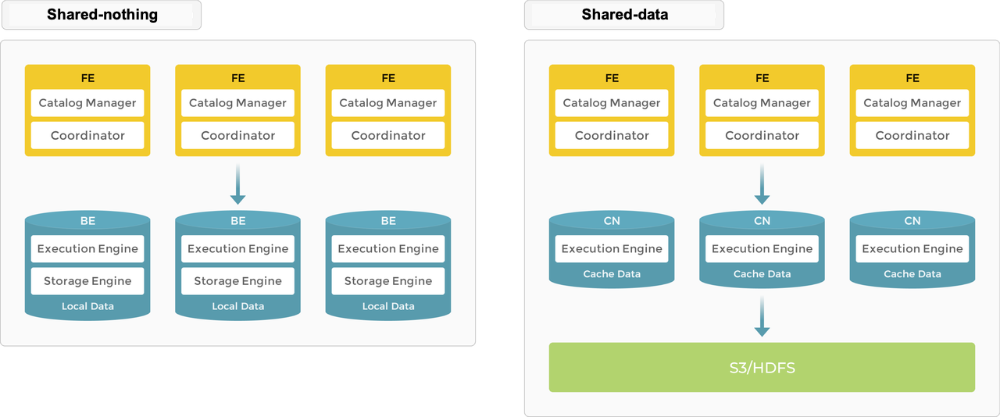

# Architecture

StarRocks has a simple architecture. The entire system consists of only two types of components; frontends and backends. The frontend nodes are called **FE**s. There are two types of backend nodes, **BE**s, and **CN**s (Compute Nodes). BEs are deployed when local storage for data is used, and CNs are deployed when data is stored on object storage or HDFS. StarRocks does not rely on any external components, simplifying deployment and maintenance. Nodes can be horizontally scaled without service downtime. In addition, StarRocks has a replica mechanism for metadata and service data, which increases data reliability and efficiently prevents single points of failure (SPOFs).

StarRocks is compatible with MySQL protocols and supports standard SQL. Users can easily connect to StarRocks from MySQL clients to gain instant and valuable insights.

## Architecture choices

StarRocks supports shared-nothing (Each BE has a portion of the data on its local storage) and shared-data (all data on object storage or HDFS and each CN has only cache on local storage). You can decide where the data is stored based on your needs. 

### Shared-nothing

Local storage provides improved query latency for real-time queries.

As a typical massively parallel processing (MPP) database StarRocks supports the shared-nothing architecture. In this architecture, BEs are responsible for both data storage and computation. Direct access to local data on the BE mode allows for local computation, avoiding data transfer and data copying, and providing ultra-fast query and analytics performance. This architecture supports multi-replica data storage, enhancing the cluster's ability to handle high-concurrency queries and ensuring data reliability. It is well-suited for scenarios that pursue optimal query performance.

#### Nodes

In the storage-nothing architecture, StarRocks consists of two types of nodes: FEs and BEs.

- FEs are responsible for metadata management and constructing execution plans.
- BEs execute query plans and store data. BEs utilize local storage to accelerate queries and the multi-replica mechanism to ensure high data availability.

##### FE

FEs are responsible for metadata management, client connection management, query planning, and query scheduling. Each FE stores and maintains a complete copy of the metadata in its memory, which guarantees indiscriminate services among the FEs. FEs can work as the leader, followers, and observers. Followers can elect a leader according to the Paxos-like BDB JE protocol. BDB JE is short for Berkeley DB Java Edition.

| **FE Role** | **Metadata management** | **Leader election**                |
| ----------- | ----------------------- | ---------------------------------- |
| Leader      | The leader FE reads and writes metadata. Follower and observer FEs can only read metadata. They route metadata write requests to the leader FE. The leader FE updates the metadata and then uses BDE JE to synchronize the metadata changes to the follower and observer FEs. Data writes are considered successful only after the metadata changes are synchronized to more than half of the follower FEs. | The leader FE, technically speaking, is also a follower node and is elected from follower FEs. To perform leader election, more than half of the follower FEs in the cluster must be active. When the leader FE fails, follower FEs will start another round of leader election. |
| Follower    | Followers can only read metadata. They synchronize and replay logs from the leader FE to update metadata. | Followers participate in leader election, which requires more than half of the followers in the cluster be active. |
| Observer   | Observers synchronize and replay logs from the leader FE to update metadata.     | Observers are mainly used to increase the query concurrency of the cluster. Observers do not participate in leader election and therefore, will not add leader selection pressure to the cluster.|

##### BE

BEs are responsible for data storage and SQL execution.

- Data storage: BEs have equivalent data storage capabilities. FEs distribute data to BEs based on predefined rules. BEs transform the ingested data, write the data into the required format, and generate indexes for the data.

- SQL execution: FEs parse each SQL query into a logical execution plan according to the semantics of the query, and then transform the logical plan into physical execution plans that can be executed on BEs. BEs that store the destination data execute the query. This eliminates the need for data transmission and copy, achieving high query performance.

### Shared-data

Object storage and HDFS provide cost, reliability, and scalability benefits. In addition to the scalability of storage, CN nodes can be added and removed without the need to rebalance data since storage and compute are separate. 

In the shared-data architecture, BEs are replaced with "compute nodes (CNs)" which are responsible only for data compute tasks and caching hot data. Data is stored in low-cost and reliable remote storage systems such as Amazon S3, GCP, Azure Blob Storage, MinIO, etc. When the cache is hit, query performance is comparable to that of the shared-nothing architecture. CN nodes can be added or removed on demand within seconds. This architecture reduces storage cost, ensures better resource isolation, and high elasticity and scalability.

The shared-data architecture maintains as simple an architecture as its shared-nothing counterpart. It consists of only two types of nodes: FE and CN. The only difference is users have to provision backend object storage.

#### Nodes

FEs in the shared-data architecture provide the same functions as in the shared-nothing architecture.

BEs are replaced with CNs (Compute Nodes), and the storage function is offloaded to object storage or HDFS. CNs are stateless compute nodes that perform all the functions of BEs, except for the storage of data.

#### Storage

StarRocks shared-data clusters support two storage solutions: object storage (for example, AWS S3, Google GCS, Azure Blob Storage, or MinIO) and HDFS.

In a shared-data cluster, the data file format remains consistent with that of a shared-nothing cluster (featuring coupled storage and compute). Data is organized into segment files, and various indexing technologies are reused in cloud-native tables, which are tables used specifically in shared-data clusters.

#### Cache

StarRocks shared-data clusters decouple data storage and computation, allowing each to scale independently, thereby reducing costs and enhancing elasticity. However, this architecture can affect query performance.

To mitigate the impact, StarRocks establishes a multi-tiered data access system encompassing memory, local disk, and remote storage to better meet various business needs.

Queries against hot data scan the cache directly and then the local disk, while cold data needs to be loaded from the object storage into the local cache to accelerate subsequent queries. By keeping hot data close to compute units, StarRocks achieves truly high-performance computation and cost-effective storage. Moreover, access to cold data has been optimized with data prefetch strategies, effectively eliminating performance limits for queries.

Caching can be enabled when creating tables. If caching is enabled, data will be written to both the local disk and backend object storage. During queries, the CN nodes first read data from the local disk. If the data is not found, it will be retrieved from the backend object storage and simultaneously cached on the local disk.

## Learn by doing

- Give [shared-data](../quick_start/shared-data.md) a try using MinIO for object storage.
- Kubernetes users can use the [Helm quick start](../quick_start/helm.md) and deploy three FEs and three BEs in a shared-nothing architecture using persistent volumes.