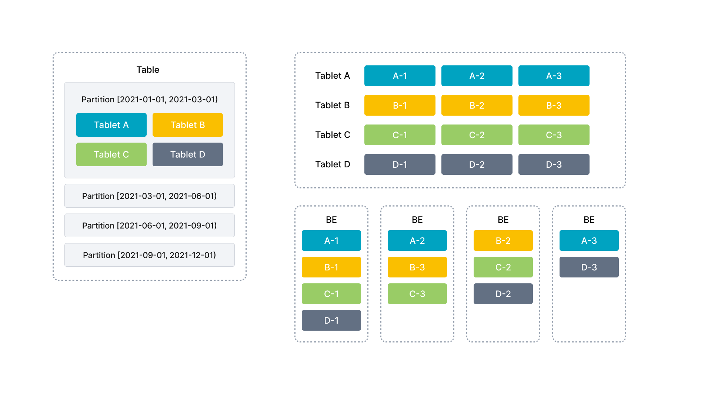
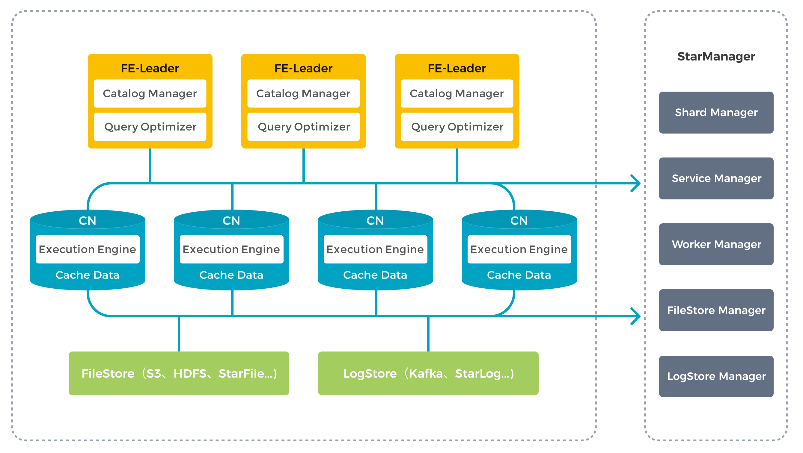

# Architecture

StarRocks has a simple architecture. The entire system consists of only two types of components, frontends (FEs), and backends (BEs) or compute nodes (CN). StarRocks does not rely on any external components, simplifying deployment and maintenance. Nodes can be horizontally scaled without service downtime. In addition, StarRocks has a replica mechanism for metadata and service data, which increases data reliability and efficiently prevents single points of failure (SPOFs).

StarRocks is compatible with MySQL protocols and supports standard SQL. Users can easily connect to StarRocks from MySQL clients to gain instant and valuable insights.

## Architecture evolution

As StarRocks continues to evolve, the system architecture has transitioned from the original storage-compute coupled architecture (shared-nothing) to the storage-compute separation architecture (shared-data).

- Prior to version 3.0, StarRocks uses the storage-compute coupled architecture. BE is responsible for both data storage and computation. Data access and computation are performed on local nodes to minimize data movement and reduce query latency, which offers ultra-fast query and analytics experience.

- Starting from version 3.0, StarRocks introduces the storage-compute separation architecture. Data storage is separated from BEs, and BEs are upgraded to stateless CN nodes. Data is persistently stored in remote object storage or HDFS, while CN local disks are used for caching hot data to accelerate queries. The storage-compute separation architecture supports dynamic addition and removal of compute nodes, enabling on-demand scaling.

The following diagram illustrates the evolution of the architecture.

## Storage-compute coupled

As a typical massively parallel processing (MPP) database, StarRocks uses the storage-compute coupled architecture in versions earlier than 3.0. In this architecture, BE is responsible for both data storage and computation. Direct access to local data on the BE mode allows for local computation, avoiding data transfer and data copying, thereby providing ultra-fast query and analytics performance. This architecture supports multi-replica data storage, enhancing cluster's ability to handle high-concurrency queries and ensuring data reliability. It is well-suited for scenarios that pursue optimal query performance.

### Nodes

In the storage-compute coupled architecture, StarRocks consists of two types of nodes: FEs and BEs.

- FE is responsible for metadata management and constructing execution plans.
- BE executes query plans and stores data. BE utilizes local storage to accelerate queries and the multi-replica mechanism to ensure high data availability.

### FE

FE is responsible for metadata management, client connection management, query planning, and query scheduling. Each FE stores and maintains a complete copy of metadata in its memory, which guarantees indiscriminate services among the FEs. FEs can work as the leader, followers, and observers. Followers can elect a leader according to the Paxos-like BDB JE protocol. BDB JE is short for Berkeley DB Java Edition.

| **FE Role** | **Metadata management**                                               | **Leader election**                                              |
| ----------- | ------------------------------------------------------------ | ------------------------------------------------------------ |
| Leader FE      | The leader FE reads and writes metadata. Follower and observer FEs can only read metadata. They route metadata write requests to the leader FE. The leader FE updates the metadata and then uses BDE JE to synchronize the metadata changes to the follower and observer FEs. Data writes are considered successful only after the metadata changes are synchronized to more than half of the follower FEs. | The leader FE is elected from follower FEs. To perform leader election, more than half of the follower FEs in the cluster must be active. When the leader FE fails, follower FEs will start another round of leader election. |
| Follower FE    | Followers can only read metadata. They synchronize and replay logs from the leader FE to update metadata. | Followers participate in leader election, which requires more than half of the followers in the cluster be active. |
| Observer FE   | Observers synchronize and replay logs from the leader FE to update metadata.     | Observers are mainly used to increase the query concurrency of the cluster. Observers do not participate in leader election and therefore, will not add leader selection pressure to the cluster.|

### BE

BEs are responsible for data storage and SQL execution.

- Data storage: BEs have equivalent data storage capabilities. FEs distribute data to BEs based on predefined rules. BEs transform the ingested data, write the data into the required format, and generate indexes for the data.

- SQL execution: When an SQL query arrives, FEs parse it into a logical execution plan according to the semantics of the query, and then transform the logical plan into physical execution plans that can be executed on BEs. BEs that store the destination data execute the query. This eliminates the need for data transmission and copy, achieving high query performance.

### Data management

StarRocks is a column-oriented database system. It uses the partitioning and bucketing mechanism to manage data. Data in a table is first divided into multiple partitions and then into multiple tablets. Tablets are the basic logical units of data management in StarRocks. Each tablet can have multiple replicas that can be stored across different BEs. You can specify the number of tablets and leave StarRocks to take care of the tablets.

Partitions and tablets reduce table scans and increase query concurrency. Replicas facilitate data backup and restoration, preventing data loss.

In the following figure, the table is divided into four partitions based on time. Data in the first partition is further split into four tablets. Each tablet has three replicas, which are stored on three different BEs.

Since one table is split into multiple tablets, StarRocks can schedule one SQL statement to all the tablets for parallel processing, fully utilizing the computing power of multiple physical machines and cores. This also helps offload the query pressure to multiple nodes, increasing service availability. You can add physical machines on demand to achieve high concurrency.

The distribution of tablets is not affected or confined by physical nodes. If the number of BEs changes (for example, when you add or remove a BE), ongoing services can proceed without any interruption. Node changes will trigger automatic migration of tablets. If BEs are added, some tablets will be automatically migrated to the new BEs for more even data distribution. If BEs are removed, tablets on these BEs will be automatically migrated to other BEs, ensuring unchanged number of replicas. Auto tablet migration helps easily achieve auto scaling of StarRocks clusters, eliminating the need for manual data re-distribution.

StarRocks uses a multi-replica mechanism (3 by default) for tablets. Replicas ensure high data reliability and service availability. The failure of one node will not affect the availability of the overall services. You can also increase the number of replicas to achieve high query concurrency.

### Limitations

This architecture comes with its own limitations:

- Growing cost: Users have to scale storage together with computing, increasing storage cost that are not desired. As data volume grows, the demand for storage and compute resources is increasing disproportionately, leading to low resource efficiency.
- Complex architecture: Maintaining data consistency across multiple replicas adds complexity to the system, increasing its risk of failure.
- Limited elasticity: Scaling operations will cause data re-balancing, resulting in an unsatisfactory user experience.

## Storage-compute separation

In the new storage-compute separation architecture, data storage functions are decoupled from BEs. BEs, now called "compute nodes (CNs)", are responsible only for data computing and caching only hot data. Data is stored in low-cost, reliable remote storage systems such as Amazon S3, GCP, Azure Blob Storage, and other S3-compatible storage like MinIO. When the cache is hit, the query performance is comparable to that of storage-compute couples architecture. CN nodes can be added or removed on demand within seconds. This architecture reduces storage cost, ensures better resource isolation, and high elasticity and scalability.

The storage-compute separation architecture maintains a simple architecture as its storage-compute coupled counterpart. It consists of only two types of nodes: FE and CN. The only difference is users have to provision backend object storage.

### Nodes

FEs in the storage-compute separation architecture provides the same functions as in the storage-compute coupled architecture.

The storage function of BEs are separated. Local storage is transitioned to shared storage. BE nodes are upgraded to stateless CN nodes that are responsible for tasks such as data loading, query computation, and cache management.

### Storage

Currently, the StarRocks shared-data cluster supports two storage solutions: object storage (for example, AWS S3, Google GCS, Azure Blob Storage, and MinIO) and HDFS deployed in traditional data centers. This technology unifies the storage of data in a specified bucket or HDFS directory.

In a shared-data cluster, the data file format remains consistent with that of a shared-nothing cluster (featuring coupled storage and compute). Data is organized into segment files, and various indexing technologies are reused in cloud-native tables, which are tables used specifically in shared-data clusters.

### Cache

StarRocks shared-data clusters decouple data storage and computation, allowing each to scale independently, thereby reducing costs and enhancing elasticity. However, this architecture can affect query performance.

To mitigate the impact, StarRocks establishes a multi-tiered data access system encompassing memory, local disk, and remote storage to better meet various business needs.

Queries against hot data scan the cache directly and then the local disk, while cold data needs to be loaded from the object storage into the local cache to accelerate subsequent queries. By keeping hot data close to compute units, StarRocks achieves truly high-performance computation and cost-effective storage. Moreover, access to cold data has been optimized with data prefetch strategies, effectively eliminating performance limits for queries.

Users can decide whether to enable caching when creating tables. If caching is enabled, data will be written to both the local disk and backend object storage. During queries, the CN nodes first read data from the local disk. If the data is not found, it will be retrieved from the backend object storage and simultaneously cached on the local disk.
