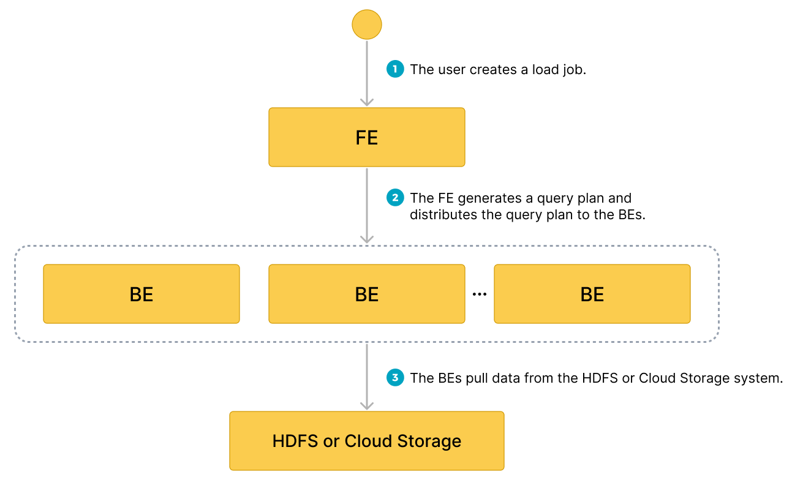

# Load data from HDFS or cloud storage

import InsertPrivNote from '../assets/commonMarkdown/insertPrivNote.md'

StarRocks provides the loading method MySQL-based Broker Load to help you load a large amount of data from HDFS or cloud storage into StarRocks.

Broker Load runs in asynchronous loading mode. After you submit a load job, StarRocks asynchronously runs the job. You need to use the [SHOW LOAD](../sql-reference/sql-statements/data-manipulation/SHOW_LOAD.md) statement or the `curl` command to check the result of the job.

Broker Load supports single-table loads and multi-table loads. You can load one or multiple data files into one or multiple destination tables by running one Broker Load job. Broker Load ensures the transactional atomicity of each load job that is run to load multiple data files. Atomicity means that the loading of multiple data files in one load job must all succeed or fail. It never happens that the loading of some data files succeeds while the loading of the other files fails.

Broker Load supports data transformation at data loading and supports data changes made by UPSERT and DELETE operations during data loading. For more information, see [Transform data at loading](../loading/Etl_in_loading.md) and [Change data through loading](../loading/Load_to_Primary_Key_tables.md).

<InsertPrivNote />

## Background information

In v2.4 and earlier, StarRocks depends on brokers to set up connections between your StarRocks cluster and your external storage system when it runs a Broker Load job. Therefore, you need to input `WITH BROKER "<broker_name>"` to specify the broker you want to use in the load statement. This is called "broker-based loading." A broker is an independent, stateless service that is integrated with a file-system interface. With brokers, StarRocks can access and read data files that are stored in your external storage system, and can use its own computing resources to pre-process and load the data of these data files.

From v2.5 onwards, StarRocks no longer depends on brokers to set up connections between your StarRocks cluster and your external storage system when it runs a Broker Load job. Therefore, you no longer need to specify a broker in the load statement, but you still need to retain the `WITH BROKER` keyword. This is called "broker-free loading."

When your data is stored in HDFS, you may encounter situations where broker-free loading does not work. This can happen when your data is stored across multiple HDFS clusters or when you have configured multiple Kerberos users. In these situations, you can resort to using broker-based loading instead. To do this successfully, make sure that at least one independent broker group is deployed. For information about how to specify authentication configuration and HA configuration in these situations, see [HDFS](../sql-reference/sql-statements/data-manipulation/BROKER_LOAD.md#hdfs).

> **NOTE**
>
> You can use the [SHOW BROKER](../sql-reference/sql-statements/Administration/SHOW_BROKER.md) statement to check for brokers that are deployed in your StarRocks cluster. If no brokers are deployed, you can deploy brokers by following the instructions provided in [Deploy a broker](../deployment/deploy_broker.md).

## Supported data file formats

Broker Load supports the following data file formats:

- CSV

- Parquet

- ORC

> **NOTE**
>
> For CSV data, take note of the following points:
>
> - You can use a UTF-8 string, such as a comma (,), tab, or pipe (|), whose length does not exceed 50 bytes as a text delimiter.
> - Null values are denoted by using `\N`. For example, a data file consists of three columns, and a record from that data file holds data in the first and third columns but no data in the second column. In this situation, you need to use `\N` in the second column to denote a null value. This means the record must be compiled as `a,\N,b` instead of `a,,b`. `a,,b` denotes that the second column of the record holds an empty string.

## Supported storage systems

Broker Load supports the following storage systems:

- HDFS

- AWS S3

- Google GCS

- Other S3-compatible storage system such as MinIO

- Microsoft Azure Storage

## How it works

After you submit a load job to an FE, the FE generates a query plan, splits the query plan into portions based on the number of available BEs and the size of the data file you want to load, and then assigns each portion of the query plan to an available BE. During the load, each involved BE pulls the data of the data file from your HDFS or cloud storage system, pre-processes the data, and then loads the data into your StarRocks cluster. After all BEs finish their portions of the query plan, the FE determines whether the load job is successful.

The following figure shows the workflow of a Broker Load job.



## Basic operations

### Create a multi-table load job

This topic uses CSV as an example to describe how to load multiple data files into multiple tables. For information about how to load data in other file formats and about the syntax and parameter descriptions for Broker Load, see [BROKER LOAD](../sql-reference/sql-statements/data-manipulation/BROKER_LOAD.md).

Note that in StarRocks some literals are used as reserved keywords by the SQL language. Do not directly use these keywords in SQL statements. If you want to use such a keyword in an SQL statement, enclose it in a pair of backticks (`). See [Keywords](../sql-reference/sql-statements/keywords.md).

#### Data examples

1. Create CSV files in your local file system.

   a. Create a CSV file named `file1.csv`. The file consists of three columns, which represent user ID, user name, and user score in sequence.

      ```Plain
      1,Lily,23
      2,Rose,23
      3,Alice,24
      4,Julia,25
      ```

   b. Create a CSV file named `file2.csv`. The file consists of two columns, which represent city ID and city name in sequence.

      ```Plain
      200,'Beijing'
      ```

2. Create StarRocks tables in your StarRocks database `test_db`.

   > **NOTE**
   >
   > Since v2.5.7, StarRocks can automatically set the number of buckets (BUCKETS) when you create a table or add a partition. You no longer need to manually set the number of buckets. For detailed information, see [set the number of buckets](../table_design/Data_distribution.md#set-the-number-of-buckets).

   a. Create a Primary Key table named `table1`. The table consists of three columns: `id`, `name`, and `score`, of which `id` is the primary key.

      ```SQL
      CREATE TABLE `table1`
      (
          `id` int(11) NOT NULL COMMENT "user ID",
          `name` varchar(65533) NULL DEFAULT "" COMMENT "user name",
          `score` int(11) NOT NULL DEFAULT "0" COMMENT "user score"
      )
      ENGINE=OLAP
      PRIMARY KEY(`id`)
      DISTRIBUTED BY HASH(`id`);
      ```

   b. Create a Primary Key table named `table2`. The table consists of two columns: `id` and `city`, of which `id` is the primary key.

      ```SQL
      CREATE TABLE `table2`
      (
          `id` int(11) NOT NULL COMMENT "city ID",
          `city` varchar(65533) NULL DEFAULT "" COMMENT "city name"
      )
      ENGINE=OLAP
      PRIMARY KEY(`id`)
      DISTRIBUTED BY HASH(`id`);
      ```

3. Upload `file1.csv` and `file2.csv` to the `/user/starrocks/` path of your HDFS cluster, to the `input` folder of your AWS S3 bucket `bucket_s3`, to the `input` folder of your Google GCS bucket `bucket_gcs`, to the `input` folder of your MinIO bucket `bucket_minio`, and to the specified paths of your Azure Storage.

#### Load data from HDFS

Execute the following statement to load `file1.csv` and `file2.csv` from the `/user/starrocks` path of your HDFS cluster into `table1` and `table2`, respectively:

```SQL
LOAD LABEL test_db.label1
(
    DATA INFILE("hdfs://<hdfs_host>:<hdfs_port>/user/starrocks/file1.csv")
    INTO TABLE table1
    COLUMNS TERMINATED BY ","
    (id, name, score)
    ,
    DATA INFILE("hdfs://<hdfs_host>:<hdfs_port>/user/starrocks/file2.csv")
    INTO TABLE table2
    COLUMNS TERMINATED BY ","
    (id, city)
)
WITH BROKER
(
    StorageCredentialParams
)
PROPERTIES
(
    "timeout" = "3600"
);
```

In the preceding example, `StorageCredentialParams` represents a group of authentication parameters which vary depending on the authentication method you choose. For more information, see [BROKER LOAD](../sql-reference/sql-statements/data-manipulation/BROKER_LOAD.md#hdfs).

#### Load data from AWS S3

Execute the following statement to load `file1.csv` and `file2.csv` from the `input` folder of your AWS S3 bucket `bucket_s3` into `table1` and `table2`, respectively:

```SQL
LOAD LABEL test_db.label2
(
    DATA INFILE("s3a://bucket_s3/input/file1.csv")
    INTO TABLE table1
    COLUMNS TERMINATED BY ","
    (id, name, score)
    ,
    DATA INFILE("s3a://bucket_s3/input/file2.csv")
    INTO TABLE table2
    COLUMNS TERMINATED BY ","
    (id, city)
)
WITH BROKER
(
    StorageCredentialParams
);
```

> **NOTE**
>
> Broker Load supports accessing AWS S3 only according to the S3A protocol. Therefore, when you load data from AWS S3, you must replace `s3://` in the S3 URI you pass as the file path with `s3a://`.

In the preceding example, `StorageCredentialParams` represents a group of authentication parameters which vary depending on the authentication method you choose. For more information, see [BROKER LOAD](../sql-reference/sql-statements/data-manipulation/BROKER_LOAD.md#aws-s3).

From v3.1 onwards, StarRocks supports directly loading the data of Parquet-formatted or ORC-formatted files from AWS S3 by using the INSERT command and the TABLE keyword, saving you from the trouble of creating an external table first. For more information, see [Load data using INSERT > Insert data directly from files in an external source using TABLE keyword](../loading/InsertInto.md#insert-data-directly-from-files-in-an-external-source-using-files).

#### Load data from Google GCS

Execute the following statement to load `file1.csv` and `file2.csv` from the `input` folder of your Google GCS bucket `bucket_gcs` into `table1` and `table2`, respectively:

```SQL
LOAD LABEL test_db.label3
(
    DATA INFILE("gs://bucket_gcs/input/file1.csv")
    INTO TABLE table1
    COLUMNS TERMINATED BY ","
    (id, name, score)
    ,
    DATA INFILE("gs://bucket_gcs/input/file2.csv")
    INTO TABLE table2
    COLUMNS TERMINATED BY ","
    (id, city)
)
WITH BROKER
(
    StorageCredentialParams
);
```

> **NOTE**
>
> Broker Load supports accessing Google GCS only according to the gs protocol. Therefore, when you load data from Google GCS, you must include `gs://` as the prefix in the GCS URI that you pass as the file path.

In the preceding example, `StorageCredentialParams` represents a group of authentication parameters which vary depending on the authentication method you choose. For more information, see [BROKER LOAD](../sql-reference/sql-statements/data-manipulation/BROKER_LOAD.md#google-gcs).

#### Load data from other S3-compatible storage system

Use MinIO as an example. You can execute the following statement to load `file1.csv` and `file2.csv` from the `input` folder of your MinIO bucket `bucket_minio` into `table1` and `table2`, respectively:

```SQL
LOAD LABEL test_db.label7
(
    DATA INFILE("obs://bucket_minio/input/file1.csv")
    INTO TABLE table1
    COLUMNS TERMINATED BY ","
    (id, name, score)
    ,
    DATA INFILE("obs://bucket_minio/input/file2.csv")
    INTO TABLE table2
    COLUMNS TERMINATED BY ","
    (id, city)
)
WITH BROKER
(
    StorageCredentialParams
);
```

In the preceding example, `StorageCredentialParams` represents a group of authentication parameters which vary depending on the authentication method you choose. For more information, see [BROKER LOAD](../sql-reference/sql-statements/data-manipulation/BROKER_LOAD.md#other-s3-compatible-storage-system).

#### Load data from Microsoft Azure Storage

Execute the following statement to load `file1.csv` and `file2.csv` from the specified paths of your Azure Storage:

```SQL
LOAD LABEL test_db.label8
(
    DATA INFILE("wasb[s]://<container>@<storage_account>.blob.core.windows.net/<path>/file1.csv")
    INTO TABLE table1
    COLUMNS TERMINATED BY ","
    (id, name, score)
    ,
    DATA INFILE("wasb[s]://<container>@<storage_account>.blob.core.windows.net/<path>/file2.csv")
    INTO TABLE table2
    COLUMNS TERMINATED BY ","
    (id, city)
)
WITH BROKER
(
    StorageCredentialParams
);
```

> **NOTICE**
  >
  > When you load data from Azure Storage, you need to determine which prefix to use based on the access protocol and specific storage service that you use. The preceding example uses Blob Storage as an example.
  >
  > - When you load data from Blob Storage, you must include `wasb://` or `wasbs://` as a prefix in the file path based on the protocol that is used to access your storage account:
  >   - If your Blob Storage allows access only through HTTP, use `wasb://` as the prefix, for example, `wasb://<container>@<storage_account>.blob.core.windows.net/<path>/<file_name>/*`.
  >   - If your Blob Storage allows access only through HTTPS, use `wasbs://` as the prefix, for example, `wasbs://<container>@<storage_account>.blob.core.windows.net/<path>/<file_name>/*`
  > - When you load data from Data Lake Storage Gen1, you must include `adl://` as a prefix in the file path, for example, `adl://<data_lake_storage_gen1_name>.azuredatalakestore.net/<path>/<file_name>`.
  > - When you load data from Data Lake Storage Gen2, you must include `abfs://` or `abfss://` as a prefix in the file path based on the protocol that is used to access your storage account:
  >   - If your Data Lake Storage Gen2 allows access only via HTTP, use `abfs://` as the prefix, for example, `abfs://<container>@<storage_account>.dfs.core.windows.net/<file_name>`.
  >   - If your Data Lake Storage Gen2 allows access only via HTTPS, use `abfss://` as the prefix, for example, `abfss://<container>@<storage_account>.dfs.core.windows.net/<file_name>`.

In the preceding example, `StorageCredentialParams` represents a group of authentication parameters which vary depending on the authentication method you choose. For more information, see [BROKER LOAD](../sql-reference/sql-statements/data-manipulation/BROKER_LOAD.md#microsoft-azure-storage).

#### Query data

After the load of data from your HDFS cluster, AWS S3 bucket, or Google GCS bucket is complete, you can use the SELECT statement to query the data of the StarRocks tables to verify that the load is successful.

1. Execute the following statement to query the data of `table1`:

   ```SQL
   MySQL [test_db]> SELECT * FROM table1;
   +------+-------+-------+
   | id   | name  | score |
   +------+-------+-------+
   |    1 | Lily  |    23 |
   |    2 | Rose  |    23 |
   |    3 | Alice |    24 |
   |    4 | Julia |    25 |
   +------+-------+-------+
   4 rows in set (0.00 sec)
   ```

1. Execute the following statement to query the data of `table2`:

   ```SQL
   MySQL [test_db]> SELECT * FROM table2;
   +------+--------+
   | id   | city   |
   +------+--------+
   | 200  | Beijing|
   +------+--------+
   4 rows in set (0.01 sec)
   ```

### Create a single-table load job

You can also load a single data file or all data files from a specified path into a single destination table. Suppose your AWS S3 bucket `bucket_s3` contains a folder named `input`. The `input` folder contains multiple data files, one of which is named `file1.csv`. These data files consist of the same number of columns as `table1` and the columns from each of these data files can be mapped one on one in sequence to the columns from `table1`.

To load `file1.csv` into `table1`, execute the following statement:

```SQL
LOAD LABEL test_db.label_7
(
    DATA INFILE("s3a://bucket_s3/input/file1.csv")
    INTO TABLE table1
    COLUMNS TERMINATED BY ","
    FORMAT AS "CSV"
)
WITH BROKER 
(
    StorageCredentialParams
);
```

To load all data files from the `input` folder into `table1`, execute the following statement:

```SQL
LOAD LABEL test_db.label_8
(
    DATA INFILE("s3a://bucket_s3/input/*")
    INTO TABLE table1
    COLUMNS TERMINATED BY ","
    FORMAT AS "CSV"
)
WITH BROKER 
(
    StorageCredentialParams
);
```

In the preceding examples, `StorageCredentialParams` represents a group of authentication parameters which vary depending on the authentication method you choose. For more information, see [BROKER LOAD](../sql-reference/sql-statements/data-manipulation/BROKER_LOAD.md#aws-s3).

### View a load job

Broker Load allows you to view a lob job by using the SHOW LOAD statement or the `curl` command.

#### Use SHOW LOAD

For more information, see [SHOW LOAD](../sql-reference/sql-statements/data-manipulation/SHOW_LOAD.md).

#### Use curl

The syntax is as follows:

```Bash
curl --location-trusted -u <username>:<password> \
    'http://<fe_host>:<fe_http_port>/api/<database_name>/_load_info?label=<label_name>'
```

> **NOTE**
>
> If you use an account for which no password is set, you need to input only `<username>:`.

For example, you can run the following command to view the information about a load job, whose label is `label1`, in the `test_db` database:

```Bash
curl --location-trusted -u <username>:<password> \
    'http://<fe_host>:<fe_http_port>/api/test_db/_load_info?label=label1'
```

The `curl` command returns the information about the load job as a JSON object `jobInfo`:

```JSON
{"jobInfo":{"dbName":"default_cluster:test_db","tblNames":["table1_simple"],"label":"label1","state":"FINISHED","failMsg":"","trackingUrl":""},"status":"OK","msg":"Success"}%
```

The following table describes the parameters in `jobInfo`.

| **Parameter** | **Description**                                              |
| ------------- | ------------------------------------------------------------ |
| dbName        | The name of the database into which data is loaded           |
| tblNames      | The name of the table into which data is loaded.             |
| label         | The label of the load job.                                   |
| state         | The status of the load job. Valid values:<ul><li>`PENDING`: The load job is in queue waiting to be scheduled.</li><li>`QUEUEING`: The load job is in the queue waiting to be scheduled.</li><li>`LOADING`: The load job is running.</li><li>`PREPARED`: The transaction has been committed.</li><li>`FINISHED`: The load job succeeded.</li><li>`CANCELLED`: The load job failed.</li></ul>For more information, see the "Asynchronous loading" section in [Overview of data loading](../loading/Loading_intro.md). |
| failMsg       | The reason why the load job failed. If the `state` value for the load job is `PENDING`, `LOADING`, or `FINISHED`, `NULL` is returned for the `failMsg` parameter. If the `state` value for the load job is `CANCELLED`, the value returned for the `failMsg` parameter consists of two parts: `type` and `msg`.<ul><li>The `type` part can be any of the following values:</li><ul><li>`USER_CANCEL`: The load job was manually canceled.</li><li>`ETL_SUBMIT_FAIL`: The load job failed to be submitted.</li><li>`ETL-QUALITY-UNSATISFIED`: The load job failed because the percentage of unqualified data exceeds the value of the `max-filter-ratio` parameter.</li><li>`LOAD-RUN-FAIL`: The load job failed in the `LOADING` stage.</li><li>`TIMEOUT`: The load job failed to finish within the specified timeout period.</li><li>`UNKNOWN`: The load job failed due to an unknown error.</li></ul><li>The `msg` part provides the detailed cause of the load failure.</li></ul> |
| trackingUrl   | The URL that is used to access the unqualified data detected in the load job. You can use the `curl` or `wget` command to access the URL and obtain the unqualified data. If no unqualified data is detected, `NULL` is returned for the `trackingUrl` parameter. |
| status        | The status of the HTTP request for the load job. Valid values: `OK` and `Fail`. |
| msg           | The error information of the HTTP request for the load job.  |

### Cancel a load job

When a load job is not in the **CANCELLED** or **FINISHED** stage, you can use the [CANCEL LOAD](../sql-reference/sql-statements/data-manipulation/CANCEL_LOAD.md) statement to cancel the job.

For example, you can execute the following statement to cancel a load job, whose label is `label1`, in the database `test_db`:

```SQL
CANCEL LOAD
FROM test_db
WHERE LABEL = "label";
```

## Job splitting and concurrent running

A Broker Load job can be split into one or more tasks that concurrently run. The tasks within a load job are run within a single transaction. They must all succeed or fail. StarRocks splits each load job based on how you declare `data_desc` in the `LOAD` statement:

- If you declare multiple `data_desc` parameters, each of which specifies a distinct table, a task is generated to load the data of each table.

- If you declare multiple `data_desc` parameters, each of which specifies a distinct partition for the same table, a task is generated to load the data of each partition.

Additionally, each task can be further split into one or more instances, which are evenly distributed to and concurrently run on the BEs of your StarRocks cluster. StarRocks splits each task based on the following [FE configurations](../administration/FE_configuration.md#fe-configuration-items):

- `min_bytes_per_broker_scanner`: the minimum amount of data processed by each instance. The default amount is 64 MB.

- `load_parallel_instance_num`: the number of concurrent instances allowed in each load job on an individual BE. The default number is 1.
  
  You can use the following formula to calculate the number of instances in an individual task:

  **Number of instances in an individual task = min(Amount of data to be loaded by an individual task/`min_bytes_per_broker_scanner`,`load_parallel_instance_num` x Number of BEs)**

In most cases, only one `data_desc` is declared for each load job, each load job is split into only one task, and the task is split into the same number of instances as the number of BEs.

## Related configuration items

The [FE configuration item](../administration/FE_configuration.md#fe-configuration-items) `max_broker_load_job_concurrency` specifies the maximum number of Broker Load jobs that can be concurrently run within your StarRocks cluster.

In StarRocks v2.4 and earlier, if the total number of Broker Load jobs that are submitted within a specific period of time exceeds the maximum number, excessive jobs are queued and scheduled based on their submission time.

Since StarRocks v2.5, if the total number of Broker Load jobs that are submitted within a specific period of time exceeds the maximum number, excessive jobs are queued and scheduled based on their priorities. You can specify a priority for a job by using the `priority` parameter at job creation. See [BROKER LOAD](../sql-reference/sql-statements/data-manipulation/BROKER_LOAD.md#opt_properties). You can also use [ALTER LOAD](../sql-reference/sql-statements/data-manipulation/ALTER_LOAD.md) to modify the priority of an existing job that is in the **QUEUEING** or **LOADING** state.
