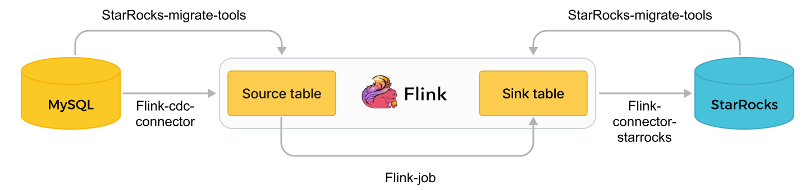
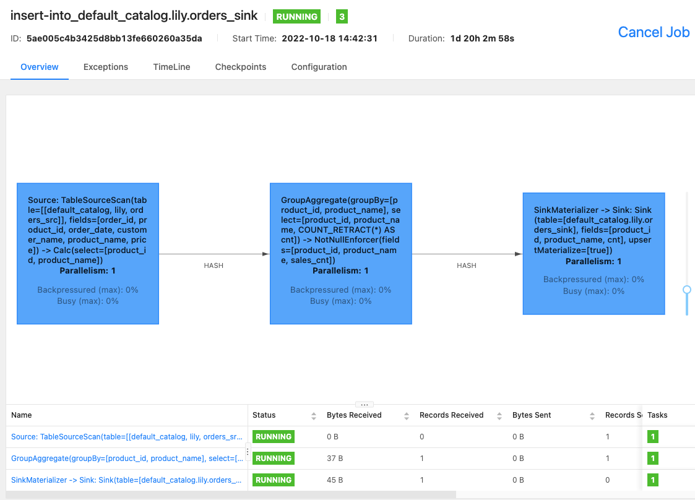

# Realtime synchronization from MySQL

import InsertPrivNote from '../assets/commonMarkdown/insertPrivNote.md'

StarRocks supports real-time data synchronization from MySQL within seconds, delivering ultra-low latency real-time analytics at scale and enabling users to query real-time data as they happen.

This tutorial helps you learn how you can bring real-time analytics to your business and users. It demonstrates how to synchronize data from MySQL to StarRocks in real time by using the following tools: StarRocks Migration Tools (SMT), Flink, Flink CDC Connector, and flink-starrocks-connector.

<InsertPrivNote />

## How it works

The following figure illustrates the entire synchronization process.



Real-time synchronization from MySQL is implemented in two stages: synchronizing database & table schema and synchronizing data. First, the SMT converts MySQL database & table schema into table creation statements for StarRocks. Then, the Flink cluster runs Flink jobs to synchronize full and incremental MySQL data to StarRocks.

> **Note**
>
> The synchronization process guarantees exactly-once semantics.

**Synchronization process**:

1. Synchronize database & table schema.

   The SMT reads the schema of the MySQL database & table to be synchronized and generates SQL files for creating a destination database & table in StarRocks. This operation is based on the MySQL and StarRocks information in SMT's configuration file.

2. Synchronize data.

   a. The Flink SQL client executes the data loading statement `INSERT INTO SELECT` to submit one or more Flink jobs to the Flink cluster.

   b. The Flink cluster runs the Flink jobs to obtain data. The [Flink CDC connector](https://github.com/ververica/flink-cdc-connectors/blob/master/docs/content/quickstart/build-real-time-data-lake-tutorial.md) first reads full historical data from the source database, then seamlessly switches to incremental reading, and sends the data to flink-starrocks-connector.

   c. flink-starrocks-connector accumulates data in mini-batches, and synchronizes each batch of data to StarRocks.

> **Note**
>
> Only data manipulation language (DML) operations in MySQL can be synchronized to StarRocks. Data definition language (DDL) operations cannot be synchronized.

## Scenarios

Real-time synchronization from MySQL has a broad range of use cases where data is constantly changed. Take a real-world use case "real-time ranking of commodity sales" as an example.

Flink calculates the real-time ranking of commodity sales based on the original order table in MySQL and synchronizes the ranking to StarRocks' Primary Key table in real time. Users can connect a visualization tool to StarRocks to view the ranking in real time to gain on-demand operational insights.

## Preparations

### Download and install synchronization tools

To synchronize data from MySQL, you need to install the following tools: SMT, Flink, Flink CDC connector, and flink-starrocks-connector.

1. Download and install Flink, and start the Flink cluster. You can also perform this step by following the instructions in [Flink official documentation](https://nightlies.apache.org/flink/flink-docs-release-1.13/docs/try-flink/local_installation/).

   a. Install Java 8 or Java 11 in your operating system before you run Flink. You can run the following command to check the installed Java version.

    ```Bash
        # View the Java version.
        java -version
        
        # Java 8 is installed if the following output is returned.
        java version "1.8.0_301"
        Java(TM) SE Runtime Environment (build 1.8.0_301-b09)
        Java HotSpot(TM) 64-Bit Server VM (build 25.301-b09, mixed mode)
    ```

   b. Download the [Flink installation package](https://flink.apache.org/downloads.html) and decompress it. We recommend that you use  Flink 1.14 or later. The minimum allowed version is Flink 1.11. This topic uses Flink 1.14.5.

   ```Bash
      # Download Flink.
      wget https://archive.apache.org/dist/flink/flink-1.14.5/flink-1.14.5-bin-scala_2.11.tgz
      # Decompress Flink.  
      tar -xzf flink-1.14.5-bin-scala_2.11.tgz
      # Go to the Flink directory.
      cd flink-1.14.5
    ```

   c. Start the Flink cluster.

   ```Bash
      # Start the Flink cluster.
      ./bin/start-cluster.sh
      
      # The Flink cluster is started if the following output is returned.
      Starting cluster.
      Starting standalonesession daemon on host.
      Starting taskexecutor daemon on host.
    ```

2. Download [Flink CDC connector](https://github.com/ververica/flink-cdc-connectors/releases). This topic uses MySQL as the data source and therefore, `flink-sql-connector-mysql-cdc-x.x.x.jar` is downloaded. The connector version must match the [Flink](https://github.com/ververica/flink-cdc-connectors/releases) version. For detailed version mapping, see [Supported Flink Versions](https://ververica.github.io/flink-cdc-connectors/release-2.2/content/about.html#supported-flink-versions). This topic uses Flink 1.14.5 and you can download `flink-sql-connector-mysql-cdc-2.2.0.jar`.

    ```Bash
    wget https://repo1.maven.org/maven2/com/ververica/flink-sql-connector-mysql-cdc/2.1.1/flink-sql-connector-mysql-cdc-2.2.0.jar
    ```

3. Download [flink-connector-starrocks](https://search.maven.org/artifact/com.starrocks/flink-connector-starrocks). The version must match the Flink version.

    > The flink-connector-starrocks package `x.x.x_flink-y.yy _ z.zz.jar` contains three version numbers:
    >
    > - `x.x.x` is the version number of flink-connector-starrocks.
    > - `y.yy` is the supported Flink version.
    > - `z.zz` is the Scala version supported by Flink. If the Flink version is 1.14.x or earlier, you must download a package that has the Scala version.
    >
    > This topic uses Flink 1.14.5 and Scala 2.11. Therefore, you can download the following package: `1.2.3_flink-14_2.11.jar`.

4. Move the JAR packages of Flink CDC connector (`flink-sql-connector-mysql-cdc-2.2.0.jar`) and flink-connector-starrocks (`1.2.3_flink-1.14_2.11.jar`) to the `lib` directory of Flink.

    > **Note**
    >
    > If a Flink cluster is already running in your system, you must stop the Flink cluster and restart it to load and validate the JAR packages.
    >
    > ```Bash
    > $ ./bin/stop-cluster.sh
    > $ ./bin/start-cluster.sh
    > ```

5. Download and decompress the [SMT package](https://www.starrocks.io/download/community) and place it in the `flink-1.14.5` directory. StarRocks provides SMT packages for Linux x86 and macos ARM64. You can choose one based on your operating system and CPU.

    ```Bash
    # for Linux x86
    wget https://releases.starrocks.io/resources/smt.tar.gz
    # for macOS ARM64
    wget https://releases.starrocks.io/resources/smt_darwin_arm64.tar.gz
    ```

### Enable MySQL binary log

To synchronize data from MySQL in real time, the system needs to read data from MySQL binary log (binlog), parse the data, and then synchronize the data to StarRocks. Make sure that MySQL binary log is enabled.

1. Edit the MySQL configuration file `my.cnf` (default path: `/etc/my.cnf`) to enable MySQL binary log.

    ```Bash
    # Enable MySQL Binlog.
    log_bin = ON
    # Configure the save path for the Binlog.
    log_bin =/var/lib/mysql/mysql-bin
    # Configure server_id.
    # If server_id is not configured for MySQL 5.7.3 or later, the MySQL service cannot be used. 
    server_id = 1
    # Set the Binlog format to ROW. 
    binlog_format = ROW
    # The base name of the Binlog file. An identifier is appended to identify each Binlog file.
    log_bin_basename =/var/lib/mysql/mysql-bin
    # The index file of Binlog files, which manages the directory of all Binlog files.  
    log_bin_index =/var/lib/mysql/mysql-bin.index
    ```

2. Run one of the following commands to restart MySQL for the modified configuration file to take effect.

    ```Bash
    # Use service to restart MySQL.
    service mysqld restart
    # Use mysqld script to restart MySQL.
    /etc/init.d/mysqld restart
    ```

3. Connect to MySQL and check whether MySQL binary log is enabled.

    ```Plain
    -- Connect to MySQL.
    mysql -h xxx.xx.xxx.xx -P 3306 -u root -pxxxxxx

    -- Check whether MySQL binary log is enabled.
    mysql> SHOW VARIABLES LIKE 'log_bin'; 
    +---------------+-------+
    | Variable_name | Value |
    +---------------+-------+
    | log_bin       | ON    |
    +---------------+-------+
    1 row in set (0.00 sec)
    ```

## Synchronize database & table schema

1. Edit the SMT configuration file.
   Go to the SMT `conf` directory and edit the configuration file `config_prod.conf`, such as MySQL connection information, the matching rules of the database & table to be synchronized, and configuration information of flink-starrocks-connector.

    ```Bash
    [db]
    type = mysql
    host = xxx.xx.xxx.xx
    port = 3306
    user = user1
    password = xxxxxx

    [other]
    # Number of BEs in StarRocks
    be_num = 3
    # `decimal_v3` is supported since StarRocks-1.18.1.
    use_decimal_v3 = true
    # File to save the converted DDL SQL
    output_dir = ./result

    [table-rule.1]
    # Pattern to match databases for setting properties
    database = ^demo.*$
    # Pattern to match tables for setting properties
    table = ^.*$

    ############################################
    ### Flink sink configurations
    ### DO NOT set `connector`, `table-name`, `database-name`. They are auto-generated.
    ############################################
    flink.starrocks.jdbc-url=jdbc:mysql://<fe_host>:<fe_query_port>
    flink.starrocks.load-url= <fe_host>:<fe_http_port>
    flink.starrocks.username=user2
    flink.starrocks.password=xxxxxx
    flink.starrocks.sink.properties.format=csv
    flink.starrocks.sink.properties.column_separator=\x01
    flink.starrocks.sink.properties.row_delimiter=\x02
    flink.starrocks.sink.buffer-flush.interval-ms=15000
    ```

    - `[db]`: information used to access the source database.
       - `type`: type of the source database. In this topic, the source database is `mysql`.
       - `host`: IP address of the MySQL server.
       - `port`: port number of the MySQL database, defaults to `3306`
       - `user`: username for accessing the MySQL database
       - `password`: password of the username

    - `[table-rule]`: database & table matching rules and the corresponding flink-connector-starrocks configuration.

       - `Database`, `table`: the names of the database & table in MySQL. Regular expressions are supported.
       - `flink.starrocks.*`: configuration information of flink-connector-starrocks. For more configurations and information, see [flink-connector-starrocks](../loading/Flink-connector-starrocks.md).

       > If you need to use different flink-connector-starrocks configurations for different tables. For example, if some tables are frequently updated and you need to accelerate data loading, see [Use different flink-connector-starrocks configurations for different tables](#use-different-flink-connector-starrocks-configurations-for-different-tables). If you need to load multiple tables obtained from MySQL sharding into the same StarRocks table, see [Synchronize multiple tables after MySQL sharding to one table in StarRocks](#synchronize-multiple-tables-after-mysql-sharding-to-one-table-in-starrocks).

    - `[other]`: other information
       - `be_num`: The number of BEs in your StarRocks cluster (This parameter will be used for setting a reasonable number of tablets in subsequent StarRocks table creation).
       - `use_decimal_v3`: Whether to enable [Decimal V3](../sql-reference/sql-statements/data-types/DECIMAL.md). After Decimal V3 is enabled, MySQL decimal data will be converted into Decimal V3 data when data is synchronized to StarRocks.
       - `output_dir`: The path to save the SQL files to be generated. The SQL files will be used to create a database & table in StarRocks and submit a Flink job to the Flink cluster. The default path is `./result` and we recommend that you retain the default settings.

2. Run the SMT to read the database & table schema in MySQL and generate SQL files in the `./result` directory based on the configuration file. The `starrocks-create.all.sql` file is used to create a database & table in StarRocks and the `flink-create.all.sql` file is used to submit a Flink job to the Flink cluster.

    ```Bash
    # Run the SMT.
    ./starrocks-migrate-tool

    # Go to the result directory and check the files in this directory.
    cd result
    ls result
    flink-create.1.sql    smt.tar.gz              starrocks-create.all.sql
    flink-create.all.sql  starrocks-create.1.sql
    ```

3. Run the following command to connect to StarRocks and execute the `starrocks-create.all.sql` file to create a database and table in StarRocks. We recommend that you use the default table creation statement in the SQL file to create a table of the [Primary Key table](../table_design/table_types/primary_key_table.md).

    > **Note**
    >
    > You can also modify the table creation statement based on your business needs and create a table that does not use the Primary Key table. However, the DELETE operation in the source MySQL database cannot be synchronized to the non- Primary Key table. Exercise caution when you create such a table.

    ```Bash
    mysql -h <fe_host> -P <fe_query_port> -u user2 -pxxxxxx < starrocks-create.all.sql
    ```

    If the data needs to be processed by Flink before it is written to the destination StarRocks table, the table schema will be different between the source and destination tables. In this case, you must modify the table creation statement. In this example, the destination table requires only the `product_id` and `product_name` columns and real-time ranking of commodity sales. You can use the following table creation statement.

    ```Bash
    CREATE DATABASE IF NOT EXISTS `demo`;

    CREATE TABLE IF NOT EXISTS `demo`.`orders` (
    `product_id` INT(11) NOT NULL COMMENT "",
    `product_name` STRING NOT NULL COMMENT "",
    `sales_cnt` BIGINT NOT NULL COMMENT ""
    ) ENGINE=olap
    PRIMARY KEY(`product_id`)
    DISTRIBUTED BY HASH(`product_id`)
    PROPERTIES (
    "replication_num" = "3"
    );
    ```

    > **NOTICE**
    >
    > Since v2.5.7, StarRocks can automatically set the number of buckets (BUCKETS) when you create a table or add a partition. You no longer need to manually set the number of buckets. For detailed information, see [set the number of buckets](../table_design/Data_distribution.md#set-the-number-of-buckets).

## Synchronize data

Run the Flink cluster and submit a Flink job to continuously synchronize full and incremental data from MySQL to StarRocks.

1. Go to the Flink directory and run the following command to run the `flink-create.all.sql` file on your Flink SQL client.

    ```Bash
    ./bin/sql-client.sh -f flink-create.all.sql
    ```

    This SQL file defines dynamic tables `source table` and `sink table`, query statement `INSERT INTO SELECT`, and specifies the connector, source database, and destination database. After this file is executed, a Flink job is submitted to the Flink cluster to start data synchronization.

    > **Note**
    >
    > - Make sure that the Flink cluster has been started. You can start the Flink cluster by running `flink/bin/start-cluster.sh`.
    > - If your Flink version is earlier than 1.13, you may not be able to directly run the SQL file `flink-create.all.sql`. You need to execute SQL statements one by one in this file in the command line interface (CLI) of the SQL client. You also need to escape the `\` character.
    >
    > ```Bash
    > 'sink.properties.column_separator' = '\\x01'
    > 'sink.properties.row_delimiter' = '\\x02'  
    > ```

    **Process data during synchronization**:

    If you need to process data during synchronization, such as performing GROUP BY or JOIN on the data, you can modify the `flink-create.all.sql` file. The following example calculates real-time ranking of commodity sales by executing COUNT (*) and GROUP BY.

    ```Bash
        $ ./bin/sql-client.sh -f flink-create.all.sql
        No default environment is specified.
        Searching for '/home/disk1/flink-1.13.6/conf/sql-client-defaults.yaml'...not found.
        [INFO] Executing SQL from file.

        Flink SQL> CREATE DATABASE IF NOT EXISTS `default_catalog`.`demo`;
        [INFO] Execute statement succeed.

        -- Create a dynamic table `source table` based on the order table in MySQL.
        Flink SQL> 
        CREATE TABLE IF NOT EXISTS `default_catalog`.`demo`.`orders_src` (`order_id` BIGINT NOT NULL,
        `product_id` INT NULL,
        `order_date` TIMESTAMP NOT NULL,
        `customer_name` STRING NOT NULL,
        `product_name` STRING NOT NULL,
        `price` DECIMAL(10, 5) NULL,
        PRIMARY KEY(`order_id`)
        NOT ENFORCED
        ) with ('connector' = 'mysql-cdc',
        'hostname' = 'xxx.xx.xxx.xxx',
        'port' = '3306',
        'username' = 'root',
        'password' = '',
        'database-name' = 'demo',
        'table-name' = 'orders'
        );
        [INFO] Execute statement succeed.

        -- Create a dynamic table `sink table`.
        Flink SQL> 
        CREATE TABLE IF NOT EXISTS `default_catalog`.`demo`.`orders_sink` (`product_id` INT NOT NULL,
        `product_name` STRING NOT NULL,
        `sales_cnt` BIGINT NOT NULL,
        PRIMARY KEY(`product_id`)
        NOT ENFORCED
        ) with ('sink.max-retries' = '10',
        'jdbc-url' = 'jdbc:mysql://<fe_host>:<fe_query_port>',
        'password' = '',
        'sink.properties.strip_outer_array' = 'true',
        'sink.properties.format' = 'json',
        'load-url' = '<fe_host>:<fe_http_port>',
        'username' = 'root',
        'sink.buffer-flush.interval-ms' = '15000',
        'connector' = 'starrocks',
        'database-name' = 'demo',
        'table-name' = 'orders'
        );
        [INFO] Execute statement succeed.

        -- Implement real-time ranking of commodity sales, where `sink table` is dynamically updated to reflect data changes in `source table`.
        Flink SQL> 
        INSERT INTO `default_catalog`.`demo`.`orders_sink` select product_id,product_name, count(*) as cnt from `default_catalog`.`demo`.`orders_src` group by product_id,product_name;
        [INFO] Submitting SQL update statement to the cluster...
        [INFO] SQL update statement has been successfully submitted to the cluster:
        Job ID: 5ae005c4b3425d8bb13fe660260a35da
    ```

    If you only need to synchronize only a portion of the data, such as data whose payment time is later than December 21, 2021, you can use the `WHERE` clause in `INSERT INTO SELECT` to set a filter condition, such as `WHERE pay_dt > '2021-12-21'`. Data that does not meet this condition will not be synchronized to StarRocks.

    If the following result is returned, the Flink job has been submitted for full and incremental synchronization.

    ```SQL
    [INFO] Submitting SQL update statement to the cluster...
    [INFO] SQL update statement has been successfully submitted to the cluster:
    Job ID: 5ae005c4b3425d8bb13fe660260a35da
    ```

2. You can use the [Flink WebUI](https://nightlies.apache.org/flink/flink-docs-master/docs/try-flink/flink-operations-playground/#flink-webui) or run the `bin/flink list -running` command on  your Flink SQL client to view Flink jobs that are running in the Flink cluster and the job IDs.

    - Flink WebUI
      

    - `bin/flink list -running`

    ```Bash
        $ bin/flink list -running
        Waiting for response...
        ------------------ Running/Restarting Jobs -------------------
        13.10.2022 15:03:54 : 040a846f8b58e82eb99c8663424294d5 : insert-into_default_catalog.lily.example_tbl1_sink (RUNNING)
        --------------------------------------------------------------
    ```

    > **Note**
    >
    > If the job is abnormal, you can perform troubleshooting by using Flink WebUI or by viewing the log file in the `/log` directory of Flink 1.14.5.

## FAQ

### Use different flink-connector-starrocks configurations for different tables

If some tables in the data source are frequently updated and you want to accelerate the loading speed of flink-connector-starrocks, you must set a separate flink-connector-starrocks configuration for each table in the SMT configuration file `config_prod.conf`.

```Bash
[table-rule.1]
# Pattern to match databases for setting properties
database = ^order.*$
# Pattern to match tables for setting properties
table = ^.*$

############################################
### Flink sink configurations
### DO NOT set `connector`, `table-name`, `database-name`. They are auto-generated
############################################
flink.starrocks.jdbc-url=jdbc:mysql://<fe_host>:<fe_query_port>
flink.starrocks.load-url= <fe_host>:<fe_http_port>
flink.starrocks.username=user2
flink.starrocks.password=xxxxxx
flink.starrocks.sink.properties.format=csv
flink.starrocks.sink.properties.column_separator=\x01
flink.starrocks.sink.properties.row_delimiter=\x02
flink.starrocks.sink.buffer-flush.interval-ms=15000[table-rule.2]
# Pattern to match databases for setting properties
database = ^order2.*$
# Pattern to match tables for setting properties
table = ^.*$

############################################
### Flink sink configurations
### DO NOT set `connector`, `table-name`, `database-name`. They are auto-generated
############################################
flink.starrocks.jdbc-url=jdbc:mysql://<fe_host>:<fe_query_port>
flink.starrocks.load-url= <fe_host>:<fe_http_port>
flink.starrocks.username=user2
flink.starrocks.password=xxxxxx
flink.starrocks.sink.properties.format=csv
flink.starrocks.sink.properties.column_separator=\x01
flink.starrocks.sink.properties.row_delimiter=\x02
flink.starrocks.sink.buffer-flush.interval-ms=10000
```

### Synchronize multiple tables after MySQL sharding to one table in StarRocks

After sharding is performed, data in one MySQL table may be split into multiple tables or even distributed to multiple databases. All the tables have the same schema. In this case, you can set `[table-rule]` to synchronize these tables to one StarRocks table. For example, MySQL has two databases `edu_db_1` and `edu_db_2`, each of which has two tables `course_1 and course_2`, and the schema of all tables is the same. You can use the following `[table-rule]` configuration to synchronize all the tables to one StarRocks table.

> **Note**
>
> The name of the StarRocks table defaults to `course__auto_shard`. If you need to use a different name, you can modify it in the SQL files `starrocks-create.all.sql` and `flink-create.all.sql`

```Bash
[table-rule.1]
# Pattern to match databases for setting properties
database = ^edu_db_[0-9]*$
# Pattern to match tables for setting properties
table = ^course_[0-9]*$

############################################
### Flink sink configurations
### DO NOT set `connector`, `table-name`, `database-name`. They are auto-generated
############################################
flink.starrocks.jdbc-url = jdbc: mysql://xxx.xxx.x.x:xxxx
flink.starrocks.load-url = xxx.xxx.x.x:xxxx
flink.starrocks.username = user2
flink.starrocks.password = xxxxxx
flink.starrocks.sink.properties.format=csv
flink.starrocks.sink.properties.column_separator =\x01
flink.starrocks.sink.properties.row_delimiter =\x02
flink.starrocks.sink.buffer-flush.interval-ms = 5000
```

### Import data in JSON format

Data in the preceding example is imported in CSV format. If you are unable to choose a suitable delimiter, you need to replace the following parameters of `flink.starrocks.*` in `[table-rule]`.

```Plain
flink.starrocks.sink.properties.format=csv
flink.starrocks.sink.properties.column_separator =\x01
flink.starrocks.sink.properties.row_delimiter =\x02
```

Data is imported in JSON format after the following parameters are passed in.

```Plain
flink.starrocks.sink.properties.format=json
flink.starrocks.sink.properties.strip_outer_array=true
```

> **Note**
>
> This method slightly slows down the loading speed.

### Execute multiple INSERT INTO statements as one Flink job

You can use the [STATEMENT SET](https://nightlies.apache.org/flink/flink-docs-master/docs/dev/table/sqlclient/#execute-a-set-of-sql-statements) syntax in the `flink-create.all.sql` file to execute multiple INSERT INTO statements as one Flink job, which prevents multiple statements from taking up too many Flink job resources and improves the efficiency of executing multiple queries.

> **Note**
>
> Flink supports the STATEMENT SET syntax from 1.13 onwards.

1. Open the `result/flink-create.all.sql` file.

2. Modify the SQL statements in the file. Move all the INSERT INTO statements to the end of the file. Place `EXECUTE STATEMENT SET BEGIN` before the first INSERT INTO statement and place `END;` after the last INSERT INTO statement.

> **Note**
>
> The positions of CREATE DATABASE and CREATE TABLE remain unchanged.

```SQL
CREATE DATABASE IF NOT EXISTS db;
CREATE TABLE IF NOT EXISTS db.a1;
CREATE TABLE IF NOT EXISTS db.b1;
CREATE TABLE IF NOT EXISTS db.a2;
CREATE TABLE IF NOT EXISTS db.b2;
EXECUTE STATEMENT SET 
BEGIN-- one or more INSERT INTO statements
INSERT INTO db.a1 SELECT * FROM db.b1;
INSERT INTO db.a2 SELECT * FROM db.b2;
END;
```
