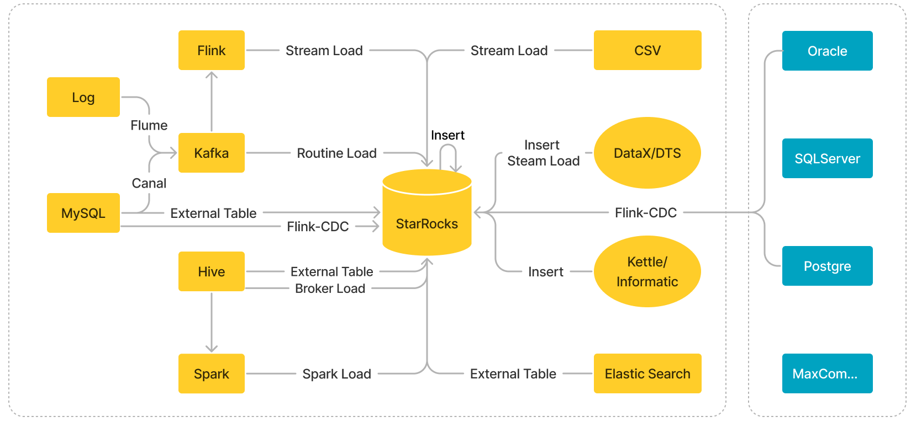

# Loading methods

StarRocks provides five loading methods to help you load data in various business scenarios: [Stream Load](../sql-reference/sql-statements/data-manipulation/STREAM_LOAD.md), [Broker Load](../sql-reference/sql-statements/data-manipulation/BROKER_LOAD.md), [Routine Load](../sql-reference/sql-statements/data-manipulation/CREATE_ROUTINE_LOAD.md), [Spark Load](../sql-reference/sql-statements/data-manipulation/SPARK_LOAD.md), and [INSERT](../sql-reference/sql-statements/data-manipulation/INSERT.md).

| Loading method     | Data source                                        | Business scenario                                            | Data volume per load job                                     | Data file format                                | Loading mode | Protocol |
| ------------------ | -------------------------------------------------- | ------------------------------------------------------------ | ------------------------------------------------------------ | ----------------------------------------------- | ------------ | -------- |
| Stream Load        |  <ul><li>Local files</li><li>Data streams</li></ul>| Load data files from local file systems or load data streams by using programs. | 10 GB or less                             |<ul><li>CSV</li><li>JSON</li></ul>               | Synchronous  | HTTP     |
| Broker Load        | <ul><li>HDFS</li><li>Amazon S3</li><li>Google GCS</li><li>Microsoft Azure Storage</li><li>Alibaba Cloud OSS</li><li>Tencent Cloud COS</li><li>Huawei Cloud OBS</li><li>Other S3-compatible storage system (such as MinIO)</li></ul>| Load data from HDFS or cloud storage.                        | Dozens of GB to hundreds of GB                               | <ul><li>CSV</li><li>Parquet</li><li>ORC</li></ul>| Asynchronous | MySQL    |
| Routine Load       | Apache Kafka®                                       | Load data in real time from Kafka.                   | MBs to GBs of data as mini-batches                           |<ul><li>CSV</li><li>JSON</li><li>Avro (supported since v3.0.1)</li></ul>          | Asynchronous | MySQL    |
| Spark Load         | <ul><li>HDFS</li><li>Hive</li></ul>     |<ul><li>Migrate large amounts of data from HDFS or Hive by using Apache Spark™ clusters.</li><li>Load data while using a global data dictionary for deduplication.</li></ul>| Dozens of GB to TBs                                         |<ul><li>CSV</li><li>ORC (supported since v2.0)</li><li>Parquet (supported since v2.0)</li></ul>       | Asynchronous | MySQL    |
| INSERT INTO SELECT | <ul><li>StarRocks tables</li><li>External tables</li><li>AWS S3</li></ul>**NOTICE** When you load data from AWS S3, only Parquet-formatted or ORC-formatted files are supported.     |<ul><li>Load data from external tables.</li><li>Load data between StarRocks tables.</li></ul>| Not fixed (The data volume varies based on the memory size.) | StarRocks tables      | Synchronous  | MySQL    |
| INSERT INTO VALUES | <ul><li>Programs</li><li>ETL tools</li></ul>    |<ul><li>Insert small amounts of data as individual records.</li><li>Load data by using APIs such as JDBC.</li></ul>| In small quantities                                          | SQL                   | Synchronous  | MySQL    |

You can determine the loading method of your choice based on your business scenario, data volume, data source, data file format, and loading frequency. Additionally, take note of the following points when you select a loading method:

- When you load data from Kafka, we recommend that you use [Routine Load](../loading/RoutineLoad.md). However, if the data requires multi-table joins and extract, transform and load (ETL) operations, you can use Apache Flink® to read and pre-process the data from Kafka and then use [flink-connector-starrocks](../loading/Flink-connector-starrocks.md) to load the data into StarRocks.

- When you load data from Hive, Iceberg, Hudi, or Delta Lake, we recommend that you create a [Hive catalog](../data_source/catalog/hive_catalog.md), [Iceberg catalog](../data_source/catalog/iceberg_catalog.md), [Hudi Catalog](../data_source/catalog/hudi_catalog.md), or [Delta Lake Catalog](../data_source/catalog/deltalake_catalog.md) and then use [INSERT](../loading/InsertInto.md) to load the data.

- When you load data from another StarRocks cluster or from an Elasticsearch cluster, we recommend that you create a [StarRocks external table](../data_source/External_table.md#starrocks-external-table) or an [Elasticsearch external table](../data_source/External_table.md#deprecated-elasticsearch-external-table) and then use [INSERT](../loading/InsertInto.md) to load the data.

  > **NOTICE**
  >
  > StarRocks external tables only support data writes. They do not support data reads.

- When you load data from MySQL databases, we recommend that you create a [MySQL external table](../data_source/External_table.md#deprecated-mysql-external-table) and then use [INSERT](../loading/InsertInto.md) to load the data. If you want to load data in real time, we recommend that you load the data by following the instructions provided in [Realtime synchronization from MySQL](../loading/Flink_cdc_load.md).

- When you load data from other data sources such as Oracle, PostgreSQL, and SQL Server, we recommend that you create a [JDBC external table](../data_source/External_table.md#external-table-for-a-jdbc-compatible-database) and then use [INSERT](../loading/InsertInto.md) to load the data.

The following figure provides an overview of various data sources supported by StarRocks and the loading methods that you can use to load data from these data sources.

