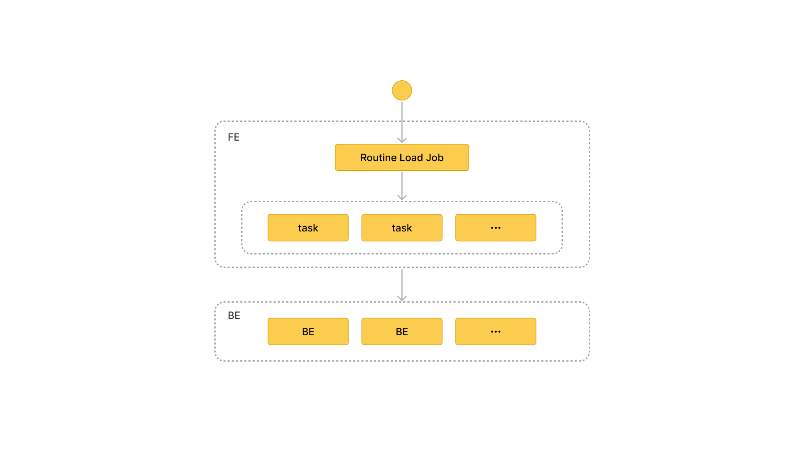

# Load data using Routine Load

import InsertPrivNote from '../assets/commonMarkdown/insertPrivNote.md'

This topic introduces how to create a Routine Load job to stream Kafka messages (events) into StarRocks, and familiarizes you with some basic concepts about Routine Load.

To continuously load messages of a stream into StarRocks, you can store the message stream in a Kafka topic, and create a Routine Load job to consume the messages. The Routine Load job persists in StarRocks, generates a series of load tasks to consume the messages in all or part of the partitions in the topic, and loads the messages into StarRocks.

A Routine Load job supports exactly-once delivery semantics to guarantee the data loaded into StarRocks is neither lost nor duplicated.

Routine Load supports data transformation at data loading and supports data changes made by UPSERT and DELETE operations during data loading. For more information, see [Transform data at loading](../loading/Etl_in_loading.md) and [Change data through loading](../loading/Load_to_Primary_Key_tables.md).

<InsertPrivNote />

## Supported data formats

Routine Load now supports consuming CSV, JSON, and Avro (supported since v3.0.1) formatted data from a Kafka cluster.

> **NOTE**
>
> For CSV data, take note of the following points:
>
> - You can use a UTF-8 string, such as a comma (,), tab, or pipe (|), whose length does not exceed 50 bytes as a text delimiter.
> - Null values are denoted by using `\N`. For example, a data file consists of three columns, and a record from that data file holds data in the first and third columns but no data in the second column. In this situation, you need to use `\N` in the second column to denote a null value. This means the record must be compiled as `a,\N,b` instead of `a,,b`. `a,,b` denotes that the second column of the record holds an empty string.

## Basic concepts



### Terminology

- **Load job**

   A Routine Load job is a long-running job. As long as its status is RUNNING, a load job continuously generates one or multiple concurrent load tasks which consume the messages in a topic of a Kafka cluster and load the data into StarRocks.

- **Load task**

  A load job is split into multiple load tasks by certain rules. A load task is the basic unit of data loading. As an individual event, a load task implements the load mechanism based on [Stream Load](../loading/StreamLoad.md). Multiple load tasks concurrently consume the messages from different partitions of a topic, and load the data into StarRocks.

### Workflow

1. **Create a Routine Load job.**
   To load data from Kafka, you need to create a Routine Load job by running the [CREATE ROUTINE LOAD](../sql-reference/sql-statements/data-manipulation/CREATE_ROUTINE_LOAD.md) statement. The FE parses the statement, and creates the job according to the properties you have specified.

2. **The FE splits the job into multiple load tasks.**

    The FE split the job into multiple load tasks based on certain rules. Each load task is an individual transaction.
    The splitting rules are as follows:
    - The FE calculates the actual concurrent number of the load tasks according to the desired concurrent number `desired_concurrent_number`, the partition number in the Kafka topic, and the number of the BE nodes that are alive.
    - The FE splits the job into load tasks based on the actual concurrent number calculated, and arranges the tasks in the task queue.

    Each Kafka topic consists of multiple partitions. The relation between the topic partition and the load task is as follows:
    - A partition is uniquely assigned to a load task, and all messages from the partition are consumed by the load task.
    - A load task can consume messages from one or more partitions.
    - All partitions are distributed evenly among load tasks.

3. **Multiple load tasks run concurrently to consume the messages from multiple Kafka topic partitions, and load the data into StarRocks**

   1. **The FE schedules and submits load tasks**: the FE schedules the load tasks in the queue on a timely basis, and assigns them to selected Coordinator BE nodes. The interval between load tasks is defined by the configuration item `max_batch_interval`. The FE distributes the load tasks evenly to all BE nodes. See [CREATE ROUTINE LOAD](../sql-reference/sql-statements/data-manipulation/CREATE_ROUTINE_LOAD.md#example) for more information about `max_batch_interval`.

   2. The Coordinator BE starts the load task, consumes messages in partitions, parses and filters the data. A load task lasts until the pre-defined amount of messages are consumed or the pre-defined time limit is reached. The message batch size and time limit are defined in the FE configurations `max_routine_load_batch_size` and `routine_load_task_consume_second`. For detailed information, see [Configuration](../administration/Configuration.md). The Coordinator BE then distributes the messages to the Executor BEs. The Executor BEs write the messages to disks.

         > **NOTE**
         >
         > StarRocks supports access to Kafka via security protocols including SASL_SSL, SAS_PLAINTEXT, SSL, and PLAINTEXT. This topic uses connecting to Kafka via PLAINTEXT as an example. If you need to connect to Kafka via other security protocols, see [CREATE ROUTINE LOAD](../sql-reference/sql-statements/data-manipulation/CREATE_ROUTINE_LOAD.md).

4. **The FE generates new load tasks to load data continuously.**
   After the Executor BEs has written the data to disks, the Coordinator BE reports the result of the load task to the FE. Based on the result, the FE then generates new load tasks to load the data continuously. Or the FE retries the failed tasks to make sure the data loaded into StarRocks is neither lost nor duplicated.

## Create a Routine Load job

The following three examples describe how to consume CSV-format, JSON-format and Avro-format data in Kafka, and load the data into StarRocks by creating a Routine Load job. For detailed syntax and parameter descriptions, see [CREATE ROUTINE LOAD](../sql-reference/sql-statements/data-manipulation/CREATE_ROUTINE_LOAD.md).

### Load CSV-format data

This section describes how to create a Routine Load job to consume CSV-format data in a Kafka cluster, and load the data into StarRocks.

#### Prepare a dataset

Suppose there is a CSV-format dataset in the topic `ordertest1` in a Kafka cluster. Every message in the dataset includes six fields: order ID, payment date, customer name, nationality, gender, and price.

```Plain
2020050802,2020-05-08,Johann Georg Faust,Deutschland,male,895
2020050802,2020-05-08,Julien Sorel,France,male,893
2020050803,2020-05-08,Dorian Grey,UK,male,1262
2020050901,2020-05-09,Anna Karenina",Russia,female,175
2020051001,2020-05-10,Tess Durbeyfield,US,female,986
2020051101,2020-05-11,Edogawa Conan,japan,male,8924
```

#### Create a table

According to the fields of CSV-format data, create the table `example_tbl1` in the database `example_db`. The following example creates a table with 5 fields excluding the field of customer gender in the CSV-format data.

```SQL
CREATE TABLE example_db.example_tbl1 ( 
    `order_id` bigint NOT NULL COMMENT "Order ID",
    `pay_dt` date NOT NULL COMMENT "Payment date", 
    `customer_name` varchar(26) NULL COMMENT "Customer name", 
    `nationality` varchar(26) NULL COMMENT "Nationality", 
    `price`double NULL COMMENT "Price"
) 
ENGINE=OLAP 
DUPLICATE KEY (order_id,pay_dt) 
DISTRIBUTED BY HASH(`order_id`); 
```

> **NOTICE**
>
> Since v2.5.7, StarRocks can automatically set the number of buckets (BUCKETS) when you create a table or add a partition. You no longer need to manually set the number of buckets. For detailed information, see [determine the number of buckets](../table_design/Data_distribution.md#determine-the-number-of-buckets).

#### Submit a Routine Load job

Execute the following statement to submit a Routine Load job named `example_tbl1_ordertest1` to consume the messages in the topic `ordertest1` and load the data into the table `example_tbl1`. The load task consumes the messages from the initial offset in the specified partitions of the topic.

```SQL
CREATE ROUTINE LOAD example_db.example_tbl1_ordertest1 ON example_tbl1
COLUMNS TERMINATED BY ",",
COLUMNS (order_id, pay_dt, customer_name, nationality, temp_gender, price)
PROPERTIES
(
    "desired_concurrent_number" = "5"
)
FROM KAFKA
(
    "kafka_broker_list" = "<kafka_broker1_ip>:<kafka_broker1_port>,<kafka_broker2_ip>:<kafka_broker2_port>",
    "kafka_topic" = "ordertest1",
    "kafka_partitions" = "0,1,2,3,4",
    "property.kafka_default_offsets" = "OFFSET_BEGINNING"
);
```

After submitting the load job, you can execute the [SHOW ROUTINE LOAD](../sql-reference/sql-statements/data-manipulation/SHOW_ROUTINE_LOAD.md) statement to check the status of the load job.

- **load job name**

  There could be multiple load job on a table. Therefore, we recommend you name a load job with the corresponding Kafka topic and the time when the load job is submitted. It helps you distinguish the load job on each table.

- **Column separator**

  The property `COLUMN TERMINATED BY` defines the column separator of the CSV-format data. The default is `\t`.

- **Kafka topic partition and offset**

  You can specify the properties `kafka_partitions` and `kafka_offsets` to specify the partitions and offsets to consume the messages. For example, if you want the load job to consume messages from the Kafka partitions `"0,1,2,3,4"` of the topic `ordertest1` all with the initial offsets, you can specify the properties as follows: If you want the load job to consume messages from the Kafka partitions `"0,1,2,3,4"`and you need to specify a separate starting offset for each partition, you can configure as follows:

    ```SQL
    "kafka_partitions" ="0,1,2,3,4",
    "kafka_offsets" = "OFFSET_BEGINNING, OFFSET_END, 1000, 2000, 3000"
    ```

  You can also set the default offsets of all partitions with the property `property.kafka_default_offsets`.

    ```SQL
    "kafka_partitions" ="0,1,2,3,4",
    "property.kafka_default_offsets" = "OFFSET_BEGINNING"
    ```

  For detailed information, see [CREATE ROUTINE LOAD](../sql-reference/sql-statements/data-manipulation/CREATE_ROUTINE_LOAD.md).

- **Data mapping and transformation**

  To specify the mapping and transformation relationship between the CSV-format data, and the StarRocks table, you need to use the `COLUMNS` parameter.

  **Data mapping:**

  - StarRocks extracts the columns in the CSV-format data and maps them **in sequence** onto the fields declared in the `COLUMNS` parameter.

  - StarRocks extracts the fields declared in the `COLUMNS` parameter and maps them **by name** onto the columns of StarRocks table.

  **Data transformation:**

  And because the example excludes the column of customer gender from the CSV-format data, the field `temp_gender` in `COLUMNS` parameter is used as a placeholder for this field. The other fields are mapped to columns of the StarRocks table `example_tbl1` directly.

  For more information about data transformation, see [Transform data at loading](./Etl_in_loading.md).

    > **NOTE**
    >
    > You do not need to specify the  `COLUMNS` parameter if the names, number, and order of the columns in the CSV-format data completely correspond to those of the StarRocks table.

- **Task concurrency**

  When there are many Kafka topic partitions and enough BE nodes, you can accelerate the loading by increasing the task concurrency.

  To increase the actual load task concurrency, you can increase the desired load task concurrency `desired_concurrent_number` when you create a routine load job. You can also set the dynamic configuration item of FE `max_routine_load_task_concurrent_num` ( default maximum load task currency ) to a larger value. For more information about `max_routine_load_task_concurrent_num`, please see [FE configuration items](../administration/Configuration.md#fe-configuration-items).

  The actual task concurrency is defined by the minimum value among the number of BE nodes that are alive, the number of the pre-specified Kafka topic partitions, and the values of `desired_concurrent_number` and `max_routine_load_task_concurrent_num`.

  In the example, the number of BE nodes that are alive is `5`, the number of the pre-specified Kafka topic partitions is `5`, and the value of `max_routine_load_task_concurrent_num` is `5`. To increase the actual load task concurrency, you can increase the `desired_concurrent_number` from the default value `3` to `5`.

  For more about the properties, see [CREATE ROUTINE LOAD](../sql-reference/sql-statements/data-manipulation/CREATE_ROUTINE_LOAD.md). For detailed instructions on accelerating the loading, see [Routine Load FAQ](../faq/loading/Routine_load_faq.md).

### Load JSON-format data

This section describes how to create a Routine Load job to consume JSON-format data in a Kafka cluster, and load the data into StarRocks.

#### Prepare a dataset

Suppose there is a JSON-format dataset in the topic `ordertest2` in a Kafka cluster. The dataset includes six keys: commodity ID, customer name, nationality, payment time, and price. Besides, you want to transform the payment time column into the DATE type, and load it into the `pay_dt` column in the StarRocks table.

```JSON
{"commodity_id": "1", "customer_name": "Mark Twain", "country": "US","pay_time": 1589191487,"price": 875}
{"commodity_id": "2", "customer_name": "Oscar Wilde", "country": "UK","pay_time": 1589191487,"price": 895}
{"commodity_id": "3", "customer_name": "Antoine de Saint-Exupéry","country": "France","pay_time": 1589191487,"price": 895}
```

> **CAUTION** Each JSON object in a row must be in one Kafka message, otherwise a JSON parsing error is returned.

#### Create a table

According to the keys of the JSON-format data, create the table `example_tbl2` in the database `example_db`.

```SQL
CREATE TABLE `example_tbl2` ( 
    `commodity_id` varchar(26) NULL COMMENT "Commodity ID", 
    `customer_name` varchar(26) NULL COMMENT "Customer name", 
    `country` varchar(26) NULL COMMENT "Country", 
    `pay_time` bigint(20) NULL COMMENT "Payment time", 
    `pay_dt` date NULL COMMENT "Payment date", 
    `price`double SUM NULL COMMENT "Price"
) 
ENGINE=OLAP
AGGREGATE KEY(`commodity_id`,`customer_name`,`country`,`pay_time`,`pay_dt`) 
DISTRIBUTED BY HASH(`commodity_id`); 
```

> **NOTICE**
>
> Since v2.5.7, StarRocks can automatically set the number of buckets (BUCKETS) when you create a table or add a partition. You no longer need to manually set the number of buckets. For detailed information, see [determine the number of buckets](../table_design/Data_distribution.md#determine-the-number-of-buckets).

#### Submit a Routine Load job

Execute the following statement to submit a Routine Load job named `example_tbl2_ordertest2` to consume the messages in the topic `ordertest2` and load the data into the table `example_tbl2`. The load task consumes the messages from the initial offset in the specified partitions of the topic.

```SQL
CREATE ROUTINE LOAD example_db.example_tbl2_ordertest2 ON example_tbl2
COLUMNS(commodity_id, customer_name, country, pay_time, price, pay_dt=from_unixtime(pay_time, '%Y%m%d'))
PROPERTIES
(
    "desired_concurrent_number" = "5",
    "format" = "json",
    "jsonpaths" = "[\"$.commodity_id\",\"$.customer_name\",\"$.country\",\"$.pay_time\",\"$.price\"]"
 )
FROM KAFKA
(
    "kafka_broker_list" ="<kafka_broker1_ip>:<kafka_broker1_port>,<kafka_broker2_ip>:<kafka_broker2_port>",
    "kafka_topic" = "ordertest2",
    "kafka_partitions" ="0,1,2,3,4",
    "property.kafka_default_offsets" = "OFFSET_BEGINNING"
);
```

After submitting the load job, you can execute the [SHOW ROUTINE LOAD](../sql-reference/sql-statements/data-manipulation/SHOW_ROUTINE_LOAD.md) statement to check the status of the load job.

- **Data format**

  You need to specify `"format" = "json"` in the clause `PROPERTIES` to define that the data format is JSON.

- **Data mapping and transformation**

  To specify the mapping and transformation relationship between the JSON-format data, and the StarRocks table, you need to specify the paramter `COLUMNS` and property`jsonpaths`. The order of fields specified in the `COLUMNS` parameter must match that of the JSON-format data, and the name of fields must match that of the StarRocks table. The property `jsonpaths` is used to extract the required fields from the JSON data. These fields are then named by the property `COLUMNS`.

  Because the example needs to transform the payment time field to the DATE data type, and load the data into the `pay_dt` column in the StarRocks table, you need to use the from_unixtime function. The other fields are mapped to fields of the table `example_tbl2` directly.

  **Data mapping:**

  - StarRocks extracts the `name` and `code` keys of JSON-format data and maps them onto the keys declared in the `jsonpaths` property.

  - StarRocks extracts the keys declared in the `jsonpaths` property and maps them **in sequence** onto the fields declared in the `COLUMNS` parameter.

  - StarRocks extracts the fields declared in the `COLUMNS` parameter and maps them **by name** onto the columns of StarRocks table.

  **Data transformation**:

  - Because the example needs to transform the  key `pay_time` to the DATE data type, and load the data into the `pay_dt` column in the StarRocks table, you need to use the from_unixtime function in `COLUMNS` parameter. The other fields are mapped to fields of the table `example_tbl2` directly.

  - And because the example excludes the column of customer gender from the JSON-format data, the field `temp_gender` in `COLUMNS` parameter  is used as a placeholder for this field. The other fields are mapped to columns of the StarRocks table `example_tbl1` directly.

    For more information about data transformation, see [Transform data at loading](./Etl_in_loading.md).

    > **NOTE**
    >
    > You do not need to specify the `COLUMNS` parameter if the names and number of the keys in the JSON object completely match those of fields in the StarRocks table.

### Load Avro-format data

Since v3.0.1, StarRocks supports loading Avro data by using Routine Load.

#### Prepare a dataset

- **Avro schema**

1. Create the following  Avro schema file `avro_schema.avsc`:

      ```JSON
      {
          "type": "record",
          "name": "sensor_log",
          "fields" : [
              {"name": "id", "type": "long"},
              {"name": "name", "type": "string"},
              {"name": "checked", "type" : "boolean"},
              {"name": "data", "type": "double"},
              {"name": "sensor_type", "type": {"type": "enum", "name": "sensor_type_enum", "symbols" : ["TEMPERATURE", "HUMIDITY", "AIR-PRESSURE"]}}  
          ]
      }
      ```

2. Register the Avro schema in the [Schema Registry](https://docs.confluent.io/cloud/current/get-started/schema-registry.html#create-a-schema).

- **Avro data**

Prepare the Avro data and send it to the Kafka topic `topic_0`.

#### Create a table

According to the fields of Avro data, create a table `sensor_log` in the target database `example_db` in the StarRocks cluster. The column names of the table must match the field names in the Avro data. For the data type mapping between the table columns and the Avro data fields, see [Data types mapping](#Data types mapping).

```SQL
CREATE TABLE example_db.sensor_log ( 
    `id` bigint NOT NULL COMMENT "sensor id",
    `name` varchar(26) NOT NULL COMMENT "sensor name", 
    `checked` boolean NOT NULL COMMENT "checked", 
    `data` double NULL COMMENT "sensor data", 
    `sensor_type` varchar(26) NOT NULL COMMENT "sensor type"
) 
ENGINE=OLAP 
DUPLICATE KEY (id) 
DISTRIBUTED BY HASH(`id`); 
```

> **NOTICE**
>
> Since v2.5.7, StarRocks can automatically set the number of buckets (BUCKETS) when you create a table or add a partition. You no longer need to manually set the number of buckets. For detailed information, see [determine the number of buckets](../table_design/Data_distribution.md#determine-the-number-of-buckets).

#### Submit a Routine Load job

Execute the following statement to submit a Routine Load job named `sensor_log_load_job` to consume the Avro messages in the Kafka topic `topic_0` and load the data into the table `sensor_log` in the database `sensor`. The load job consumes the messages from the initial offset in the specified partitions of the topic.

```SQL
CREATE ROUTINE LOAD example_db.sensor_log_load_job ON sensor_log  
PROPERTIES  
(  
    "format" = "avro"  
)  
FROM KAFKA  
(  
    "kafka_broker_list" = "<kafka_broker1_ip>:<kafka_broker1_port>,<kafka_broker2_ip>:<kafka_broker2_port>,...",
    "confluent.schema.registry.url" = "http://172.xx.xxx.xxx:8081",  
    "kafka_topic" = "topic_0",  
    "kafka_partitions" = "0,1,2,3,4,5",  
    "property.kafka_default_offsets" = "OFFSET_BEGINNING"  
);
```

- Data Format

  You need to specify `"format = "avro"` in the clause `PROPERTIES` to define that the data format is Avro.

- Schema Registry

  You need to configure `confluent.schema.registry.url` to specify the URL of the Schema Registry where the Avro schema is registered. StarRocks retrieves the Avro schema by using this URL. The format is as follows:

  ```Plaintext
  confluent.schema.registry.url = http[s]://[<schema-registry-api-key>:<schema-registry-api-secret>@]<hostname|ip address>[:<port>]
  ```

- Data mapping and transformation

  To specify the mapping and transformation relationship between the Avro-format data and the StarRocks table, you need to specify the paramter `COLUMNS` and property `jsonpaths`. The order of fields specified in the `COLUMNS` parameter must match that of the fields in the property `jsonpaths`, and the names of fields must match these of the StarRocks table. The property `jsonpaths` is used to extract the required fields from the Avro data. These fields are then named by the property `COLUMNS`.

  For more information about data transformation, see [Transform data at loading](https://docs.starrocks.io/en-us/latest/loading/Etl_in_loading).

  > NOTE
  >
  > You do not need to specify the `COLUMNS` parameter if the names and number of the fields in the Avro record completely match those of columns in the StarRocks table.

After submitting the load job, you can execute the [SHOW ROUTINE LOAD](../sql-reference/sql-statements/data-manipulation/SHOW_ROUTINE_LOAD.md) statement to check the status of the load job.

#### Data types mapping

The data type mapping between the Avro data fields you want to load and the StarRocks table columns is as follows:

- **Primitive types**

| Avro    | StarRocks |
| ------- | --------- |
| nul     | NULL      |
| boolean | BOOLEAN   |
| int     | INT       |
| long    | BIGINT    |
| float   | FLOAT     |
| double  | DOUBLE    |
| bytes   | STRING    |
| string  | STRING    |

- **Complex types**

| Avro           | StarRocks                                                    |
| -------------- | ------------------------------------------------------------ |
| record         | Load the entire RECORD or its subfields into StarRocks as JSON. |
| enums          | STRING                                                       |
| arrays         | ARRAY                                                        |
| maps           | JSON                                                         |
| union(T, null) | NULLABLE(T)                                                  |
| fixed          | STRING                                                       |

#### Limits

- Currently, StarRocks does not support schema evolution.
- Each Kafka message must only contain a single Avro data record.

## Check a load job and task

### Check a load job

Execute the [SHOW ROUTINE LOAD](../sql-reference/sql-statements/data-manipulation/SHOW_ROUTINE_LOAD.md) statement to check the status of the load job `example_tbl2_ordertest2`. StarRocks returns the execution state `State`, the statistical information (including the total rows consumed and the total rows loaded) `Statistics`,  and the progress of the load job `progress`.

If the state of the load job is automatically changed to **PAUSED**, it is possibly because the number of error rows has exceeded the threshold. For detailed instructions on setting this threshold, see [CREATE ROUTINE LOAD](../sql-reference/sql-statements/data-manipulation/CREATE_ROUTINE_LOAD.md). You can check the files `ReasonOfStateChanged` and `ErrorLogUrls` to identify and troubleshoot the problem. Having fixed the problem, you can then execute the [RESUME ROUTINE LOAD](../sql-reference/sql-statements/data-manipulation/RESUME_ROUTINE_LOAD.md) statement to resume the **PAUSED** load job.

If the state of the load job is **CANCELLED**, it is possibly because the load job encounters an exception (such as the table has been dropped). You can check the files `ReasonOfStateChanged` and `ErrorLogUrls` to identify and troubleshoot the problem. However, you cannot resume a **CANCELLED** load job.

```SQL
MySQL [example_db]> SHOW ROUTINE LOAD FOR example_tbl2_ordertest2 \G
*************************** 1. row ***************************
                  Id: 63013
                Name: example_tbl2_ordertest2
          CreateTime: 2022-08-10 17:09:00
           PauseTime: NULL
             EndTime: NULL
              DbName: default_cluster:example_db
           TableName: example_tbl2
               State: RUNNING
      DataSourceType: KAFKA
      CurrentTaskNum: 3
       JobProperties: {"partitions":"*","partial_update":"false","columnToColumnExpr":"commodity_id,customer_name,country,pay_time,pay_dt=from_unixtime(`pay_time`, '%Y%m%d'),price","maxBatchIntervalS":"20","whereExpr":"*","dataFormat":"json","timezone":"Asia/Shanghai","format":"json","json_root":"","strict_mode":"false","jsonpaths":"[\"$.commodity_id\",\"$.customer_name\",\"$.country\",\"$.pay_time\",\"$.price\"]","desireTaskConcurrentNum":"3","maxErrorNum":"0","strip_outer_array":"false","currentTaskConcurrentNum":"3","maxBatchRows":"200000"}
DataSourceProperties: {"topic":"ordertest2","currentKafkaPartitions":"0,1,2,3,4","brokerList":"<kafka_broker1_ip>:<kafka_broker1_port>,<kafka_broker2_ip>:<kafka_broker2_port>"}
    CustomProperties: {"kafka_default_offsets":"OFFSET_BEGINNING"}
           Statistic: {"receivedBytes":230,"errorRows":0,"committedTaskNum":1,"loadedRows":2,"loadRowsRate":0,"abortedTaskNum":0,"totalRows":2,"unselectedRows":0,"receivedBytesRate":0,"taskExecuteTimeMs":522}
            Progress: {"0":"1","1":"OFFSET_ZERO","2":"OFFSET_ZERO","3":"OFFSET_ZERO","4":"OFFSET_ZERO"}
ReasonOfStateChanged: 
        ErrorLogUrls: 
            OtherMsg: 
```

> **CAUTION**
>
> You cannot check a load job that has stopped or has not yet started.

### Check a load task

Execute the [SHOW ROUTINE LOAD TASK](../sql-reference/sql-statements/data-manipulation/SHOW_ROUTINE_LOAD_TASK.md) statement to check the load tasks of the load job `example_tbl2_ordertest2`, such as how many tasks are currently running, the Kafka topic partitions that are consumed and the consumption progress `DataSourceProperties`, and the corresponding Coordinator BE node `BeId`.

```SQL
MySQL [example_db]> SHOW ROUTINE LOAD TASK WHERE JobName = "example_tbl2_ordertest2" \G
*************************** 1. row ***************************
              TaskId: 18c3a823-d73e-4a64-b9cb-b9eced026753
               TxnId: -1
           TxnStatus: UNKNOWN
               JobId: 63013
          CreateTime: 2022-08-10 17:09:05
   LastScheduledTime: 2022-08-10 17:47:27
    ExecuteStartTime: NULL
             Timeout: 60
                BeId: -1
DataSourceProperties: {"1":0,"4":0}
             Message: there is no new data in kafka, wait for 20 seconds to schedule again
*************************** 2. row ***************************
              TaskId: f76c97ac-26aa-4b41-8194-a8ba2063eb00
               TxnId: -1
           TxnStatus: UNKNOWN
               JobId: 63013
          CreateTime: 2022-08-10 17:09:05
   LastScheduledTime: 2022-08-10 17:47:26
    ExecuteStartTime: NULL
             Timeout: 60
                BeId: -1
DataSourceProperties: {"2":0}
             Message: there is no new data in kafka, wait for 20 seconds to schedule again
*************************** 3. row ***************************
              TaskId: 1a327a34-99f4-4f8d-8014-3cd38db99ec6
               TxnId: -1
           TxnStatus: UNKNOWN
               JobId: 63013
          CreateTime: 2022-08-10 17:09:26
   LastScheduledTime: 2022-08-10 17:47:27
    ExecuteStartTime: NULL
             Timeout: 60
                BeId: -1
DataSourceProperties: {"0":2,"3":0}
             Message: there is no new data in kafka, wait for 20 seconds to schedule again
```

## Pause a load job

You can execute the [PAUSE ROUTINE LOAD](../sql-reference/sql-statements/data-manipulation/PAUSE_ROUTINE_LOAD.md) statement to pause a load job. The state of the load job will be **PAUSED** after the statement is executed. However, it has not stopped. You can execute the [RESUME ROUTINE LOAD](../sql-reference/sql-statements/data-manipulation/RESUME_ROUTINE_LOAD.md) statement to resume it. You can also check its status with the [SHOW ROUTINE LOAD](../sql-reference/sql-statements/data-manipulation/SHOW_ROUTINE_LOAD.md) statement.

The following example pauses the load job `example_tbl2_ordertest2`:

```SQL
PAUSE ROUTINE LOAD FOR example_tbl2_ordertest2;
```

## Resume a load job

You can execute the [RESUME ROUTINE LOAD](../sql-reference/sql-statements/data-manipulation/RESUME_ROUTINE_LOAD.md) statement to resume a paused load job. The state of the load job will be **NEED_SCHEDULE** temporarily (because the load job is being re-scheduled), and then become **RUNNING**. You can check its status with the [SHOW ROUTINE LOAD](../sql-reference/sql-statements/data-manipulation/SHOW_ROUTINE_LOAD.md) statement.

The following example resumes the paused load job `example_tbl2_ordertest2`:

```SQL
RESUME ROUTINE LOAD FOR example_tbl2_ordertest2;
```

## Alter a load job

Before altering a load job, you must pause it with the [PAUSE ROUTINE LOAD](../sql-reference/sql-statements/data-manipulation/PAUSE_ROUTINE_LOAD.md) statement. Then you can execute the [ALTER ROUTINE LOAD](../sql-reference/sql-statements/data-manipulation/ALTER_ROUTINE_LOAD.md). After altering it, you can execute the [RESUME ROUTINE LOAD](../sql-reference/sql-statements/data-manipulation/RESUME_ROUTINE_LOAD.md) statement to resume it, and check its status with the [SHOW ROUTINE LOAD](../sql-reference/sql-statements/data-manipulation/SHOW_ROUTINE_LOAD.md) statement.

Suppose the number of the BE nodes that are alive increases to `6` and the Kafka topic partitions to be consumed is `"0,1,2,3,4,5,6,7"`. If you want to increase the actual load task concurrency, you can execute the following statement to increase the number of desired task concurrency `desired_concurrent_number` to `6` (greater than or equal to the number of BE nodes that are alive), and specify the Kafka topic partitions and initial offsets.

> **NOTE**
>
> Because the actual task concurrency is determined by the minimum value of multiple parameters, you must make sure that the value of the FE dynamic parameter `max_routine_load_task_concurrent_num` is greater than or equal to `6`.

```SQL
ALTER ROUTINE LOAD FOR example_tbl2_ordertest2
PROPERTIES
(
    "desired_concurrent_number" = "6"
)
FROM kafka
(
    "kafka_partitions" = "0,1,2,3,4,5,6,7",
    "kafka_offsets" = "OFFSET_BEGINNING,OFFSET_BEGINNING,OFFSET_BEGINNING,OFFSET_BEGINNING,OFFSET_END,OFFSET_END,OFFSET_END,OFFSET_END"
);
```

## Stop a load job

You can execute the [STOP ROUTINE LOAD](../sql-reference/sql-statements/data-manipulation/STOP_ROUTINE_LOAD.md) statement to stop a load job. The state of the load job will be **STOPPED** after the statement is executed, and you cannot resume a stopped load job. You cannot check the status of a stopped load job with the [SHOW ROUTINE LOAD](../sql-reference/sql-statements/data-manipulation/SHOW_ROUTINE_LOAD.md) statement.

The following example stops the load job `example_tbl2_ordertest2`:

```SQL
STOP ROUTINE LOAD FOR example_tbl2_ordertest2;
```

## FAQ

Please see [Routine Load FAQ](../faq/loading/Routine_load_faq.md).
