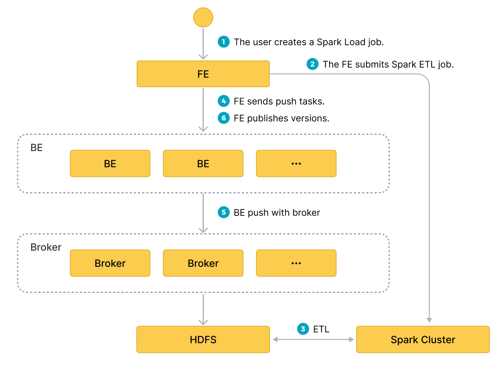

# Load data in bulk using Spark Load

This load uses external Apache Spark™ resources to pre-process imported data, which improves import performance and saves compute resources. It is mainly used for **initial migration** and **large data import** into StarRocks (data volume up to TB level).

Spark load is an **asynchronous** import method that requires users to create Spark-type import jobs via the MySQL protocol and view the import results using `SHOW LOAD`.

> **NOTICE**
>
> - Only users with the INSERT privilege on a StarRocks table can load data into this table. You can follow the instructions provided in [GRANT](../sql-reference/sql-statements/account-management/GRANT.md) to grant the required privilege.
> - Spark Load can not be used to load data into a Primary Key table.

## Terminology explanation

- **Spark ETL**: Mainly responsible for ETL of data in the import process, including global dictionary construction (BITMAP type), partitioning, sorting, aggregation, etc.
- **Broker**: Broker is an independent stateless process. It encapsulates the file system interface and provides StarRocks with the ability to read files from remote storage systems.
- **Global Dictionary**: Saves the data structure that maps data from the original value to the encoded value. The original value can be any data type, while the encoded value is an integer. The global dictionary is mainly used in scenarios where exact count distinct is precomputed.

## Background information

In StarRocks v2.4 and earlier, Spark Load depends on Broker process to set up connections between your StarRocks cluster and your storage system. When you create a Spark Load job, you need to input `WITH BROKER "<broker_name>"` to specify the Broker you want to use. A Broker is an independent, stateless process that is integrated with a file-system interface. With Broker process, StarRocks can access and read data files that are stored in your storage system, and can use its own computing resources to pre-process and load the data of these data files.

From StarRocks v2.5 onwards, Spark Load no longer needs to depend on Broker process to set up connections between your StarRocks cluster and your storage system. When you create a Spark Load job, you no longer need to specify the Broker, but you still need to retain the `WITH BROKER` keyword.

> **NOTE**
>
> Loading without Broker process may not work in certain circumstances, such as when you have multiple HDFS clusters or multiple Kerberos users. In this situation, you can still load data by using Broker process.

## Fundamentals

The user submits a Spark type import job through the MySQL client;the FE records the metadata and returns the submission result.

The execution of the spark load task is divided into the following main phases.

1. The user submits the spark load job to the FE.
2. The FE schedules the submission of the ETL task to the Apache Spark™ cluster for execution.
3. The Apache Spark™ cluster executes the ETL task that includes global dictionary construction (BITMAP type), partitioning, sorting, aggregation, etc.
4. After the ETL task is completed, the FE gets the data path of each preprocessed slice and schedules the relevant BE to execute the Push task.
5. The BE reads data through Broker process from HDFS and converts it into StarRocks storage format.
    > If you choose not to use Broker process, the BE reads data from HDFS directly.
6. The FE schedules the effective version and completes the import job.

The following diagram illustrates the main flow of spark load.



---

## Global Dictionary

### Applicable Scenarios

Currently, the BITMAP column in StarRocks is implemented using the Roaringbitmap, which only has integer to be the input data type. So if you want to implement precomputation for the BITMAP column in the import process, then you need to convert the input data type to integer.

In the existing import process of StarRocks, the data structure of the global dictionary is implemented based on the Hive table, which saves the mapping from the original value to the encoded value.

### Build Process

1. Read the data from the upstream data source and generate a temporary Hive table, named `hive-table`.
2. Extract the values of the de-emphasized fields of `hive-table` to generate a new Hive table named `distinct-value-table`.
3. Create a new global dictionary table named `dict-table` with one column for the original values and one column for the encoded values.
4. Left join between `distinct-value-table` and `dict-table`, and then use the window function to encode this set. Finally both the original value and the encoded value of the de-duplicated column are written back to `dict-table`.
5. Join between `dict-table` and `hive-table` to finish the job of replacing the original value in `hive-table` with the integer encoded value.
6. `hive-table` will be read by the next time data pre-processing, and then imported into StarRocks after calculation.

## Data Pre-processing

The basic process of data pre-processing is as follows:

1. Read data from the upstream data source (HDFS file or Hive table).
2. Complete field mapping and calculation for the read data, then generate `bucket-id` based on the partition information.
3. Generate RollupTree based on the Rollup metadata of StarRocks table.
4. Iterate through the RollupTree and perform hierarchical aggregation operations. The Rollup of the next hierarchy can be calculated from the Rollup of the previous hierarchy.
5. Each time the aggregation calculation is completed, the data is bucketed according to `bucket-id` and then written to HDFS.
6. The subsequent Broker process will pull the files from HDFS and import them into the StarRocks BE node.

## Basic Operations

### Prerequisites

If you continue to load data through Broker process, you must ensure that Broker process are deployed in your StarRocks cluster.

You can use the [SHOW BROKER](../sql-reference/sql-statements/Administration/SHOW_BROKER.md) statement to check for Broker that are deployed in your StarRocks cluster. If no Broker are deployed, you must deploy Broker by following the instructions provided in [Deploy Broker](../deployment/deploy_broker.md).

### Configuring ETL Clusters

Apache Spark™ is used as an external computational resource in StarRocks for ETL work. There may be other external resources added to StarRocks, such as Spark/GPU for query, HDFS/S3 for external storage, MapReduce for ETL, etc. Therefore, we introduce `Resource Management` to manage these external resources used by StarRocks.

Before submitting a Apache Spark™ import job, configure the Apache Spark™ cluster for performing ETL tasks. The syntax for operation is as follows:

~~~sql
-- create Apache Spark™ resource
CREATE EXTERNAL RESOURCE resource_name
PROPERTIES
(
 type = spark,
 spark_conf_key = spark_conf_value,
 working_dir = path,
 broker = broker_name,
 broker.property_key = property_value
);

-- drop Apache Spark™ resource
DROP RESOURCE resource_name;

-- show resources
SHOW RESOURCES
SHOW PROC "/resources";

-- privileges
GRANT USAGE_PRIV ON RESOURCE resource_name TO user_identityGRANT USAGE_PRIV ON RESOURCE resource_name TO ROLE role_name;
REVOKE USAGE_PRIV ON RESOURCE resource_name FROM user_identityREVOKE USAGE_PRIV ON RESOURCE resource_name FROM ROLE role_name;
~~~

- Create resource

**For example**:

~~~sql
-- yarn cluster mode
CREATE EXTERNAL RESOURCE "spark0"
PROPERTIES
(
    "type" = "spark",
    "spark.master" = "yarn",
    "spark.submit.deployMode" = "cluster",
    "spark.jars" = "xxx.jar,yyy.jar",
    "spark.files" = "/tmp/aaa,/tmp/bbb",
    "spark.executor.memory" = "1g",
    "spark.yarn.queue" = "queue0",
    "spark.hadoop.yarn.resourcemanager.address" = "127.0.0.1:9999",
    "spark.hadoop.fs.defaultFS" = "hdfs://127.0.0.1:10000",
    "working_dir" = "hdfs://127.0.0.1:10000/tmp/starrocks",
    "broker" = "broker0",
    "broker.username" = "user0",
    "broker.password" = "password0"
);

-- yarn HA cluster mode
CREATE EXTERNAL RESOURCE "spark1"
PROPERTIES
(
    "type" = "spark",
    "spark.master" = "yarn",
    "spark.submit.deployMode" = "cluster",
    "spark.hadoop.yarn.resourcemanager.ha.enabled" = "true",
    "spark.hadoop.yarn.resourcemanager.ha.rm-ids" = "rm1,rm2",
    "spark.hadoop.yarn.resourcemanager.hostname.rm1" = "host1",
    "spark.hadoop.yarn.resourcemanager.hostname.rm2" = "host2",
    "spark.hadoop.fs.defaultFS" = "hdfs://127.0.0.1:10000",
    "working_dir" = "hdfs://127.0.0.1:10000/tmp/starrocks",
    "broker" = "broker1"
);
~~~

`resource-name` is the name of the Apache Spark™ resource configured in StarRocks.

`PROPERTIES` inclueds parameters relating to the Apache Spark™ resource, as follows:
> **Note**
>
> For detailed description of Apache Spark™ resource PROPERTIES, please see [CREATE RESOURCE](../sql-reference/sql-statements/data-definition/CREATE_RESOURCE.md)

- Spark related parameters:
  - `type`: Resource type, required, currently only supports `spark`.
  - `spark.master`: Required, currently only supports `yarn`.
    - `spark.submit.deployMode`: The deployment mode of the Apache Spark™ program, required, currently supports both `cluster` and `client`.
    - `spark.hadoop.fs.defaultFS`: Required if master is yarn.
    - Parameters related to yarn resource manager, required.
      - one ResourceManager on a single node
        `spark.hadoop.yarn.resourcemanager.address`: Address of the single point resource manager.
      - ResourceManager HA
        >  You can choose to specify ResourceManager's hostname or address.
        - `spark.hadoop.yarn.resourcemanager.ha.enabled`: Enable the resource manager HA, set to `true`.
        - `spark.hadoop.yarn.resourcemanager.ha.rm-ids`: list of resource manager logical ids.
        - `spark.hadoop.yarn.resourcemanager.hostname.rm-id`: For each rm-id, specify the hostname corresponding to the resource manager.
        - `spark.hadoop.yarn.resourcemanager.address.rm-id`: For each rm-id, specify `host:port` for the client to submit jobs to.

- `*working_dir`: The directory used by ETL. Required if Apache Spark™ is used as an ETL resource. For example: `hdfs://host:port/tmp/starrocks`.

- Broker related parameters:
  - `broker`: Broker name. Required if Apache Spark™ is used as an ETL resource. You need to use the `ALTER SYSTEM ADD BROKER` command to complete the configuration in advance.
  - `broker.property_key`: Information (e.g.authentication information) to be specified when Broker process reads the intermediate file generated by the ETL.

**Precaution**:

The above is a description of parameters for loading through Broker process. If you intend to load data without Broker process, the following should be noted.

- You do not need to specify `broker`.
- If you need to configure user authentication, and HA for NameNode nodes, you need to configure the parameters in the hdfs-site.xml file in the HDFS cluster, see [broker_properties](../sql-reference/sql-statements/data-manipulation/BROKER_LOAD.md#hdfs) for descriptions of parameters. and you need to move the **hdfs-site.xml** file under **$FE_HOME/conf** for each FE and **$BE_HOME/conf** for each BE.

> Note
>
> If the HDFS file can only be accessed by a specific user, you still need to specify the HDFS username in `broker.name` and the user password in `broker.password`.

- View resources

Regular accounts can only view resources to which they have `USAGE-PRIV` access. The root and admin accounts can view all resources.

- Resource Permissions

Resource permissions are managed through `GRANT REVOKE`, which currently only supports `USAGE-PRIV` permissions. You can give `USAGE-PRIV` permissions to a user or a role.

~~~sql
-- Grant access to spark0 resources to user0
GRANT USAGE_PRIV ON RESOURCE "spark0" TO "user0"@"%";

-- Grant access to spark0 resources to role0
GRANT USAGE_PRIV ON RESOURCE "spark0" TO ROLE "role0";

-- Grant access to all resources to user0
GRANT USAGE_PRIV ON RESOURCE* TO "user0"@"%";

-- Grant access to all resources to role0
GRANT USAGE_PRIV ON RESOURCE* TO ROLE "role0";

-- Revoke the use privileges of spark0 resources from user user0
REVOKE USAGE_PRIV ON RESOURCE "spark0" FROM "user0"@"%";
~~~

### Configuring Spark Client

Configure the Spark client for FE so that the latter can submit Spark tasks by executing the `spark-submit` command. It is recommended to use the official version of Spark2 2.4.5 or above     [spark download address](https://archive.apache.org/dist/spark/). After downloading, please use the following steps to complete the configuration.

- Configure `SPARK-HOME`
  
Place the Spark client in a directory on the same machine as the FE, and configure `spark_home_default_dir` in the FE configuration file to this directory, which by default is the `lib/spark2x` path in the FE root directory, and cannot be empty.

- **Configure SPARK dependency package**
  
To configure the dependency package, zip and archive all jar files in the jars folder under the Spark client, and configure the `spark_resource_path` item in the FE configuration to this zip file. If this configuration is empty, the FE will try to find the `lib/spark2x/jars/spark-2x.zip` file in the FE root directory. If the FE fails to find it, it will report an error.

When the spark load job is submitted, the archived dependency files will be uploaded to the remote repository. The default repository path is under the `working_dir/{cluster_id}` directory named with `--spark-repository--{resource-name}`, which means that a resource in the cluster corresponds to a remote repository. The directory structure is referenced as follows:

~~~bash
---spark-repository--spark0/

   |---archive-1.0.0/

   |        |\---lib-990325d2c0d1d5e45bf675e54e44fb16-spark-dpp-1.0.0\-jar-with-dependencies.jar

   |        |\---lib-7670c29daf535efe3c9b923f778f61fc-spark-2x.zip

   |---archive-1.1.0/

   |        |\---lib-64d5696f99c379af2bee28c1c84271d5-spark-dpp-1.1.0\-jar-with-dependencies.jar

   |        |\---lib-1bbb74bb6b264a270bc7fca3e964160f-spark-2x.zip

   |---archive-1.2.0/

   |        |-...

~~~

In addition to the spark dependencies (named `spark-2x.zip` by default), the FE also uploads the DPP dependencies to the remote repository. If all the dependencies submitted by the spark load already exist in the remote repository, then there is no need to upload the dependencies again, saving the time of repeatedly uploading a large number of files each time.

### Configuring YARN Client

Configure the yarn client for FE so that the FE can execute      yarn commands to get the status of the running application or      kill it.It is recommended to use the official version of H     adoop2 2.5.2 or above ([hadoop download address](https://archive.apache.org/dist/hadoop/common/)). After downloading, please use the following steps to complete the configuration:

- **Configure the YARN executable path**
  
Place the downloaded yarn client in a directory on the same machine as the FE, and configure the `yarn_client_path` item in the FE configuration file to the binary executable file of yarn, which by default is the `lib/yarn-client/hadoop/bin/yarn` path in the FE root directory.

- **Configure the path to the configuration file needed to generate YARN (optional)**
  
When the FE goes through the yarn client to get the status of the application, or to kill the application, by default StarRocks generates the configuration file required to execute the yarn command in the `lib/yarn-config` path of the FE root directory This path can be modified by configuring the `yarn_config_dir` entry in the FE configuration file, which currently includes `core-site.xml` and `yarn-site.xml`.

### Create Import Job

**Syntax:**

~~~sql
LOAD LABEL load_label
    (data_desc, ...)
WITH RESOURCE resource_name 
[resource_properties]
[PROPERTIES (key1=value1, ... )]

* load_label:
    db_name.label_name

* data_desc:
    DATA INFILE ('file_path', ...)
    [NEGATIVE]
    INTO TABLE tbl_name
    [PARTITION (p1, p2)]
    [COLUMNS TERMINATED BY separator ]
    [(col1, ...)]
    [COLUMNS FROM PATH AS (col2, ...)]
    [SET (k1=f1(xx), k2=f2(xx))]
    [WHERE predicate]

    DATA FROM TABLE hive_external_tbl
    [NEGATIVE]
    INTO TABLE tbl_name
    [PARTITION (p1, p2)]
    [SET (k1=f1(xx), k2=f2(xx))]
    [WHERE predicate]

* resource_properties:
 (key2=value2, ...)
~~~

**Example 1**: The case where the upstream data source is HDFS

~~~sql
LOAD LABEL db1.label1
(
    DATA INFILE("hdfs://abc.com:8888/user/starrocks/test/ml/file1")
    INTO TABLE tbl1
    COLUMNS TERMINATED BY ","
    (tmp_c1,tmp_c2)
    SET
    (
        id=tmp_c2,
        name=tmp_c1
    ),
    DATA INFILE("hdfs://abc.com:8888/user/starrocks/test/ml/file2")
    INTO TABLE tbl2
    COLUMNS TERMINATED BY ","
    (col1, col2)
    where col1 > 1
)
WITH RESOURCE 'spark0'
(
    "spark.executor.memory" = "2g",
    "spark.shuffle.compress" = "true"
)
PROPERTIES
(
    "timeout" = "3600"
);
~~~

**Example 2**: The case where the upstream data source is Hive.

- Step 1: Create a new hive resource

~~~sql
CREATE EXTERNAL RESOURCE hive0
properties
( 
    "type" = "hive",
    "hive.metastore.uris" = "thrift://0.0.0.0:8080"
);
 ~~~

- Step 2: Create a new hive external table

~~~sql
CREATE EXTERNAL TABLE hive_t1
(
    k1 INT,
    K2 SMALLINT,
    k3 varchar(50),
    uuid varchar(100)
)
ENGINE=hive
properties
( 
    "resource" = "hive0",
    "database" = "tmp",
    "table" = "t1"
);
 ~~~

- Step 3: Submit the load command, requiring that the columns in the imported StarRocks table exist in the hive external table.

~~~sql
LOAD LABEL db1.label1
(
    DATA FROM TABLE hive_t1
    INTO TABLE tbl1
    SET
    (
        uuid=bitmap_dict(uuid)
    )
)
WITH RESOURCE 'spark0'
(
    "spark.executor.memory" = "2g",
    "spark.shuffle.compress" = "true"
)
PROPERTIES
(
    "timeout" = "3600"
);
 ~~~

Introduction to the parameters in the Spark load:

- **Label**
  
Label of the import job. Each import job has a Label that is unique within the database, following the same rules as broker load.

- **Data description class parameters**
  
Currently, supported data sources are CSV and Hive table. Other rules are the same as broker load.

- **Import Job Parameters**
  
Import job parameters refer to the parameters belonging to the `opt_properties` section of the import statement. These parameters are applicable to the entire import job. The rules are the same as broker load.

- **Spark Resource Parameters**
  
Spark resources need to be configured into StarRocks in advance and users need to be given USAGE-PRIV permissions before they can apply the resources to Spark load.
Spark resource parameters can be set when the user has a temporary need, such as adding resources for a job and modifying Spark configs. The setting only takes effect on this job and does not affect the existing configurations in the StarRocks cluster.

~~~sql
WITH RESOURCE 'spark0'
(
    "spark.driver.memory" = "1g",
    "spark.executor.memory" = "3g"
)
~~~

- **Import when the data source is Hive**
  
Currently, to use a Hive table in the import process, you need to create an external table of the `Hive` type and then specify its name when submitting the import command.

- **Import process to build a global dictionary**
  
In the load command, you can specify the required fields for building the global dictionary in the following format: `StarRocks field name=bitmap_dict(hive table field name)` Note that currently **the global dictionary is only supported when the upstream data source is a Hive table**.

- **Import of bitmap binary type columns**

The data type applicable to the StarRocks table aggregate column is bitmap type, and the data type of the corresponding column in the data source Hive table or HDFS file type is binary (through com.starrocks.load.loadv2.dpp.BitmapValue in spark-dpp in FE class serialization) type.

There is no need to build a global dictionary, just specify the corresponding fields in the load command. The format is: ```StarRocks field name=bitmap_from_binary(Hive table field name)```

## Viewing Import Jobs

The Spark load import is asynchronous, as is the broker load. The user must record the label of the import job and use it in the `SHOW LOAD` command to view the import results. The command to view the import is common to all import methods. The example is as follows.

Refer to Broker Load for a detailed explanation of returned parameters.The differences are as follows.

~~~sql
mysql> show load order by createtime desc limit 1\G
*************************** 1. row ***************************
  JobId: 76391
  Label: label1
  State: FINISHED
 Progress: ETL:100%; LOAD:100%
  Type: SPARK
 EtlInfo: unselected.rows=4; dpp.abnorm.ALL=15; dpp.norm.ALL=28133376
 TaskInfo: cluster:cluster0; timeout(s):10800; max_filter_ratio:5.0E-5
 ErrorMsg: N/A
 CreateTime: 2019-07-27 11:46:42
 EtlStartTime: 2019-07-27 11:46:44
 EtlFinishTime: 2019-07-27 11:49:44
 LoadStartTime: 2019-07-27 11:49:44
LoadFinishTime: 2019-07-27 11:50:16
  URL: http://1.1.1.1:8089/proxy/application_1586619723848_0035/
 JobDetails: {"ScannedRows":28133395,"TaskNumber":1,"FileNumber":1,"FileSize":200000}
~~~

- **State**
  
The current stage of the imported job.
PENDING: The job is committed.
ETL: Spark ETL is committed.
LOADING: The FE schedule an BE to execute push operation.
FINISHED: The push is completed and the version is effective.

There are two final stages of the import job –      `CANCELLED` and `FINISHED`, both indicating the load job is completed. `CANCELLED` indicates import failure and `FINISHED` indicates import success.

- **Progress**
  
Description of the import job progress. There are two types of progress –ETL and LOAD, which correspond to the two phases of the import process, ETL and LOADING.

- The range of progress for LOAD is 0~100%.
  
`LOAD progress = the number of currently completed tablets of all replications imports / the total number of tablets of this import job * 100%`.

- If all tables have been imported, the LOAD progress is 99%, and changes to 100% when the import enters the final validation phase.

- The import progress is not linear. If there is no change in progress for a period of time, it does not mean that the import is not executing.

- **Type**

 The type of the import job. SPARK for spark load.

- **CreateTime/EtlStartTime/EtlFinishTime/LoadStartTime/LoadFinishTime**

These values represent the time when the import was created, when the ETL phase started, when the ETL phase completed,      when the LOADING phase started, and when the entire import job was completed.

- **JobDetails**

Displays the detailed running status of the job, including the number of imported files, total size (in bytes), number of subtasks, number of raw rows being processed, etc. For example:

~~~json
 {"ScannedRows":139264,"TaskNumber":1,"FileNumber":1,"FileSize":940754064}
~~~

- **URL**

You can copy the input to your browser to access  the web interface of the corresponding application.

### View Apache Spark™ Launcher commit logs

Sometimes users need to view the detailed logs generated during a Apache Spark™ job commit. By  default, the logs are saved in the path `log/spark_launcher_log` in the FE root directory      named as `spark-launcher-{load-job-id}-{label}.log`. The logs are      saved in this directory for a period of time and will be erased when the import information in FE metadata is cleaned up. The default retention time is 3 days.

### Cancel Import

When the Spark load job status is not `CANCELLED` or `FINISHED`, it can be cancelled manually by the user by specifying the Label of the import job.

---

## Related System Configurations

**FE Configuration:** The following configuration is the system-level configuration of Spark load, which applies to all Spark load import jobs. The configuration values can be adjusted mainly by modifying `fe.conf`.

- enable-spark-load: Enable Spark load and resource creation with a default value of false.
- spark-load-default-timeout-second: The default timeout for the job is 259200 seconds (3 days).
- spark-home-default-dir: The Spark client path (`fe/lib/spark2x`).
- spark-resource-path: The path to the packaged S     park dependency file (empty by default).
- spark-launcher-log-dir: The directory where the commit log of the Spark client is stored (`fe/log/spark-launcher-log`).
- yarn-client-path: The path to the yarn binary executable (`fe/lib/yarn-client/hadoop/bin/yarn`).
- yarn-config-dir: Yarn's configuration file path (`fe/lib/yarn-config`).

---

## Best Practices

The most suitable scenario for using Spark load is when the raw data is in the file system (HDFS) and the data volume is in the tens of GB to TB level. Use Stream Load or Broker Load for smaller data volumes.

For the full spark load import example, refer to the demo on github: [https://github.com/StarRocks/demo/blob/master/docs/03_sparkLoad2StarRocks.md](https://github.com/StarRocks/demo/blob/master/docs/03_sparkLoad2StarRocks.md)

## FAQs

- `Error: When running with master 'yarn' either HADOOP-CONF-DIR or YARN-CONF-DIR must be set in the environment.`

 Using Spark Load without configuring the `HADOOP-CONF-DIR` environment variable in `spark-env.sh` of the Spark client.

- `Error: Cannot run program "xxx/bin/spark-submit": error=2, No such file or directory`

 The `spark_home_default_dir` configuration item does not specify the Spark client root directory when using Spark Load.

- `Error: File xxx/jars/spark-2x.zip does not exist.`

 The `spark-resource-path` configuration item does not point to the packed zip file when using Spark load.

- `Error: yarn client does not exist in path: xxx/yarn-client/hadoop/bin/yarn`

 The yarn-client-path configuration item does not specify the yarn executable when using Spark load.

- `ERROR: Cannot execute hadoop-yarn/bin/... /libexec/yarn-config.sh`

 When using Hadoop with CDH, you need to configure the `HADOOP_LIBEXEC_DIR` environment variable.
 Since `hadoop-yarn` and hadoop directories are different, the default `libexec` directory will look for `hadoop-yarn/bin/... /libexec`, while `libexec` is in the hadoop directory.
 The ```yarn application status`` command to get the Spark task status reported an error causing the import job to fail.
