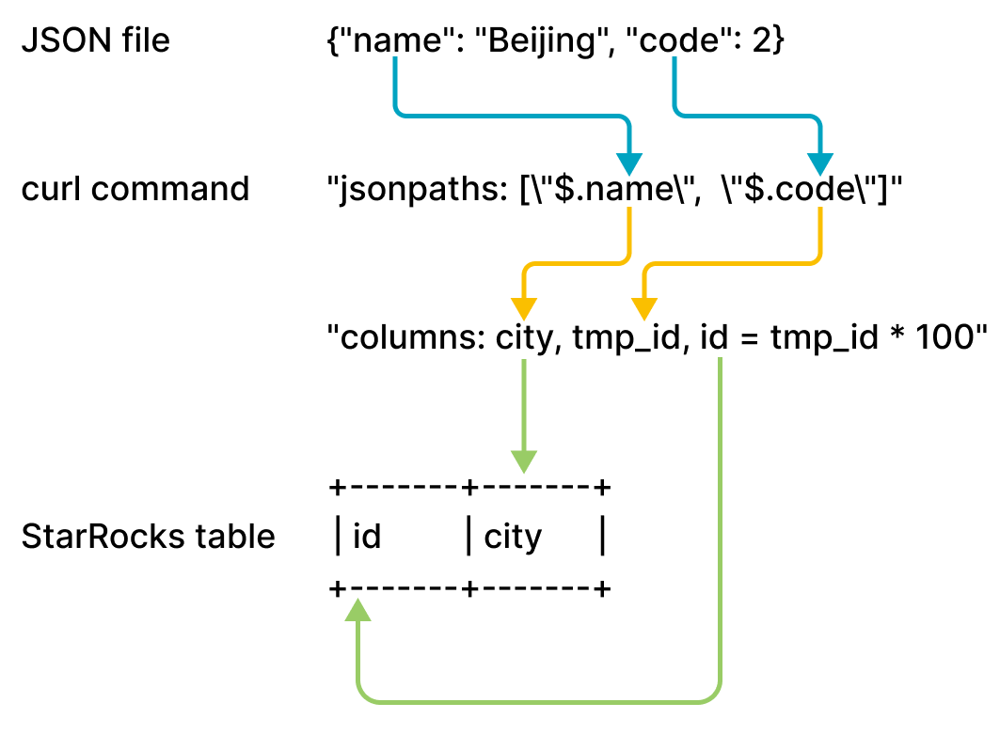

# Load data from a local file system

import InsertPrivNote from '../_assets/commonMarkdown/insertPrivNote.md'

StarRocks provides two methods of loading data from a local file system:

- Synchronous loading using [Stream Load](../sql-reference/sql-statements/loading_unloading/STREAM_LOAD.md)
- Asynchronous loading using [Broker Load](../sql-reference/sql-statements/loading_unloading/BROKER_LOAD.md)

Each of these options has its own advantages:

- Stream Load supports CSV and JSON file formats. This method is recommended if you want to load data from a small number of files whose individual sizes do not exceed 10 GB.
- Broker Load supports Parquet, ORC, CSV, and JSON file formats (JSON file format is supported from v3.2.3 onwards). This method is recommended if you want to load data from a large number of files whose individual sizes exceed 10 GB, or if the files are stored in a network attached storage (NAS) device. **Using Broker Load to load data from a local file system is supported from v2.5 onwards.**

For CSV data, take note of the following points:

- You can use a UTF-8 string, such as a comma (,), tab, or pipe (|), whose length does not exceed 50 bytes as a text delimiter.
- Null values are denoted by using `\N`. For example, a data file consists of three columns, and a record from that data file holds data in the first and third columns but no data in the second column. In this situation, you need to use `\N` in the second column to denote a null value. This means the record must be compiled as `a,\N,b` instead of `a,,b`. `a,,b` denotes that the second column of the record holds an empty string.

Stream Load and Broker Load both support data transformation at data loading and supports data changes made by UPSERT and DELETE operations during data loading. For more information, see [Transform data at loading](../loading/Etl_in_loading.md) and [Change data through loading](../loading/Load_to_Primary_Key_tables.md).

## Before you begin

### Check privileges

<InsertPrivNote />

#### Check network configuration

Make sure that the machine on which the data you want to load resides can access the FE and BE nodes of the StarRocks cluster via the [`http_port`](../administration/management/FE_configuration.md#http_port) (default: `8030`) and [`be_http_port`](../administration/management/BE_configuration.md#be_http_port) (default: `8040`) , respectively.

## Loading from a local file system via Stream Load

Stream Load is an HTTP PUT-based synchronous loading method. After you submit a load job, StarRocks synchronously runs the job, and returns the result of the job after the job finishes. You can determine whether the job is successful based on the job result.

> **NOTICE**
>
> After you load data into a StarRocks table by using Stream Load, the data of the materialized views that are created on that table is also updated.

### How it works

You can submit a load request on your client to an FE according to HTTP, and the FE then uses an HTTP redirect to forward the load request to a specific BE or CN. You can also directly submit a load request on your client to a BE or CN of your choice.

:::note

If you submit load requests to an FE, the FE uses a polling mechanism to decide which BE or CN will serve as a coordinator to receive and process the load requests. The polling mechanism helps achieve load balancing within your StarRocks cluster. Therefore, we recommend that you send load requests to an FE.

:::

The BE or CN that receives the load request runs as the Coordinator BE or CN to split data based on the used schema into portions and assign each portion of the data to the other involved BEs or CNs. After the load finishes, the Coordinator BE or CN returns the result of the load job to your client. Note that if you stop the Coordinator BE or CN during the load, the load job fails.

The following figure shows the workflow of a Stream Load job.


### Limits

Stream Load does not support loading the data of a CSV file that contains a JSON-formatted column.

### Typical example

This section uses curl as an example to describe how to load the data of a CSV or JSON file from your local file system into StarRocks. For detailed syntax and parameter descriptions, see [STREAM LOAD](../sql-reference/sql-statements/loading_unloading/STREAM_LOAD.md).

Note that in StarRocks some literals are used as reserved keywords by the SQL language. Do not directly use these keywords in SQL statements. If you want to use such a keyword in an SQL statement, enclose it in a pair of backticks (`). See [Keywords](../sql-reference/sql-statements/keywords.md).

#### Load CSV data

##### Prepare datasets

In your local file system, create a CSV file named `example1.csv`. The file consists of three columns, which represent the user ID, user name, and user score in sequence.

```Plain
1,Lily,23
2,Rose,23
3,Alice,24
4,Julia,25
```

##### Create a database and a table

Create a database and switch to it:

```SQL
CREATE DATABASE IF NOT EXISTS mydatabase;
USE mydatabase;
```

Create a Primary Key table named `table1`. The table consists of three columns: `id`, `name`, and `score`, of which `id` is the primary key.

```SQL
CREATE TABLE `table1`
(
    `id` int(11) NOT NULL COMMENT "user ID",
    `name` varchar(65533) NULL COMMENT "user name",
    `score` int(11) NOT NULL COMMENT "user score"
)
ENGINE=OLAP
PRIMARY KEY(`id`)
DISTRIBUTED BY HASH(`id`);
```

:::note

Since v2.5.7, StarRocks can automatically set the number of buckets (BUCKETS) when you create a table or add a partition. You no longer need to manually set the number of buckets. For detailed information, see [set the number of buckets](../table_design/Data_distribution.md#set-the-number-of-buckets).

:::

##### Start a Stream Load

Run the following command to load the data of `example1.csv` into `table1`:

```Bash
curl --location-trusted -u <username>:<password> -H "label:123" \
    -H "Expect:100-continue" \
    -H "column_separator:," \
    -H "columns: id, name, score" \
    -T example1.csv -XPUT \
    http://<fe_host>:<fe_http_port>/api/mydatabase/table1/_stream_load
```

:::note

- If you use an account for which no password is set, you need to input only `<username>:`.
- You can use [SHOW FRONTENDS](../sql-reference/sql-statements/cluster-management/nodes_processes/SHOW_FRONTENDS.md) to view the IP address and HTTP port of the FE node.

:::

`example1.csv` consists of three columns, which are separated by commas (,) and can be mapped in sequence onto the `id`, `name`, and `score` columns of `table1`. Therefore, you need to use the `column_separator` parameter to specify the comma (,) as the column separator. You also need to use the `columns` parameter to temporarily name the three columns of `example1.csv` as `id`, `name`, and `score`, which are mapped in sequence onto the three columns of `table1`.

After the load is complete, you can query `table1` to verify that the load is successful:

```SQL
SELECT * FROM table1;
+------+-------+-------+
| id   | name  | score |
+------+-------+-------+
|    1 | Lily  |    23 |
|    2 | Rose  |    23 |
|    3 | Alice |    24 |
|    4 | Julia |    25 |
+------+-------+-------+
4 rows in set (0.00 sec)
```

#### Load JSON data

Since v3.2.7, Stream Load supports compressing JSON data during transmission, reducing network bandwidth overhead. Users can specify different compression algorithms using parameters `compression` and `Content-Encoding`. Supported compression algorithms including GZIP, BZIP2, LZ4_FRAME, and ZSTD. For the syntax, see [STREAM LOAD](../sql-reference/sql-statements/loading_unloading/STREAM_LOAD.md).

##### Prepare datasets

In your local file system, create a JSON file named `example2.json`. The file consists of two columns, which represent city ID and city name in sequence.

```JSON
{"name": "Beijing", "code": 2}
```

##### Create a database and a table

Create a database and switch to it:

```SQL
CREATE DATABASE IF NOT EXISTS mydatabase;
USE mydatabase;
```

Create a Primary Key table named `table2`. The table consists of two columns: `id` and `city`, of which `id` is the primary key.

```SQL
CREATE TABLE `table2`
(
    `id` int(11) NOT NULL COMMENT "city ID",
    `city` varchar(65533) NULL COMMENT "city name"
)
ENGINE=OLAP
PRIMARY KEY(`id`)
DISTRIBUTED BY HASH(`id`);
```

:::note

Since v2.5.7, StarRocks can set the number of(BUCKETS) automatically when you create a table or add a partition. You no longer need to manually set the number of buckets. For detailed information, see [set the number of buckets](../table_design/Data_distribution.md#set-the-number-of-buckets).

:::

##### Start a Stream Load

Run the following command to load the data of `example2.json` into `table2`:

```Bash
curl -v --location-trusted -u <username>:<password> -H "strict_mode: true" \
    -H "Expect:100-continue" \
    -H "format: json" -H "jsonpaths: [\"$.name\", \"$.code\"]" \
    -H "columns: city,tmp_id, id = tmp_id * 100" \
    -T example2.json -XPUT \
    http://<fe_host>:<fe_http_port>/api/mydatabase/table2/_stream_load
```

:::note

- If you use an account for which no password is set, you need to input only `<username>:`.
- You can use [SHOW FRONTENDS](../sql-reference/sql-statements/cluster-management/nodes_processes/SHOW_FRONTENDS.md) to view the IP address and HTTP port of the FE node.

:::

`example2.json` consists of two keys, `name` and `code`, which are mapped onto the `id` and `city` columns of `table2`, as shown in the following figure.



The mappings shown in the preceding figure are described as follows:

- StarRocks extracts the `name` and `code` keys of `example2.json` and maps them onto the `name` and `code` fields declared in the `jsonpaths` parameter.

- StarRocks extracts the `name` and `code` fields declared in the `jsonpaths` parameter and **maps them in sequence** onto the `city` and `tmp_id` fields declared in the `columns` parameter.

- StarRocks extracts the `city` and `tmp_id` fields declared in the `columns` parameter and **maps them by name** onto the `city` and `id` columns of `table2`.

:::note

In the preceding example, the value of `code` in `example2.json` is multiplied by 100 before it is loaded into the `id` column of `table2`.

:::

For detailed mappings between `jsonpaths`, `columns`, and the columns of the StarRocks table, see the "Column mappings" section in [STREAM LOAD](../sql-reference/sql-statements/loading_unloading/STREAM_LOAD.md).

After the load is complete, you can query `table2` to verify that the load is successful:

```SQL
SELECT * FROM table2;
+------+--------+
| id   | city   |
+------+--------+
| 200  | Beijing|
+------+--------+
4 rows in set (0.01 sec)
```

#### Check Stream Load progress

After a load job is complete, StarRocks returns the result of the job in JSON format. For more information, see the "Return value" section in [STREAM LOAD](../sql-reference/sql-statements/loading_unloading/STREAM_LOAD.md).

Stream Load does not allow you to query the result of a load job by using the SHOW LOAD statement.

#### Cancel a Stream Load job

Stream Load does not allow you to cancel a load job. If a load job times out or encounters errors, StarRocks automatically cancels the job.

### Parameter configurations

This section describes some system parameters that you need to configure if you choose the loading method Stream Load. These parameter configurations take effect on all Stream Load jobs.

- `streaming_load_max_mb`: the maximum size of each data file you want to load. The default maximum size is 10 GB. For more information, see [Configure BE or CN dynamic parameters](../administration/management/BE_configuration.md).
  
  We recommend that you do not load more than 10 GB of data at a time. If the size of a data file exceeds 10 GB, we recommend that you split the data file into small files that each are less than 10 GB in size and then load these files one by one. If you cannot split a data file greater than 10 GB, you can increase the value of this parameter based on the file size.

  After you increase the value of this parameter, the new value can take effect only after you restart the BEs or CNs of your StarRocks cluster. Additionally, system performance may deteriorate, and the costs of retries in the event of load failures also increase.

  :::note
  
  When you load the data of a JSON file, take note of the following points:
  
  - The size of each JSON object in the file cannot exceed 4 GB. If any JSON object in the file exceeds 4 GB, StarRocks throws an error "This parser can't support a document that big."
  
  - By default, the JSON body in an HTTP request cannot exceed 100 MB. If the JSON body exceeds 100 MB, StarRocks throws an error "The size of this batch exceed the max size [104857600] of json type data data [8617627793]. Set ignore_json_size to skip check, although it may lead huge memory consuming." To prevent this error, you can add `"ignore_json_size:true"` in the HTTP request header to ignore the check on the JSON body size.

  :::

- `stream_load_default_timeout_second`: the timeout period of each load job. The default timeout period is 600 seconds. For more information, see [Configure FE dynamic parameters](../administration/management/FE_configuration.md#configure-fe-dynamic-parameters).
  
  If many of the load jobs that you create time out, you can increase the value of this parameter based on the calculation result that you obtain from the following formula:

  **Timeout period of each load job > Amount of data to be loaded/Average loading speed**

  For example, if the size of the data file that you want to load is 10 GB and the average loading speed of your StarRocks cluster is 100 MB/s, set the timeout period to more than 100 seconds.

  :::note
  
  **Average loading speed** in the preceding formula is the average loading speed of your StarRocks cluster. It varies depending on the disk I/O and the number of BEs  or CNs in your StarRocks cluster.

  :::

  Stream Load also provides the `timeout` parameter, which allows you to specify the timeout period of an individual load job. For more information, see [STREAM LOAD](../sql-reference/sql-statements/loading_unloading/STREAM_LOAD.md).

### Usage notes

If a field is missing for a record in the data file you want to load and the column onto which the field is mapped in your StarRocks table is defined as `NOT NULL`, StarRocks automatically fills a `NULL` value in the mapping column of your StarRocks table during the load of the record. You can also use the `ifnull()` function to specify the default value that you want to fill.

For example, if the field that represents city ID in the preceding `example2.json` file is missing and you want to fill an `x` value in the mapping column of `table2`, you can specify `"columns: city, tmp_id, id = ifnull(tmp_id, 'x')"`.

## Loading from a local file system via Broker Load

In addition to Stream Load, you can also use Broker Load to load data from a local file system. This feature is supported from v2.5 onwards.

Broker Load is an asynchronous loading method. After you submit a load job, StarRocks asynchronously runs the job and does not immediately return the job result. You need to query the job result by hand. See [Check Broker Load progress](#check-broker-load-progress).

### Limits

- Currently Broker Load supports loading from a local file system only through a single broker whose version is v2.5 or later.
- Highly concurrent queries against a single broker may cause issues such as timeout and OOM. To mitigate the impact, you can use the `pipeline_dop` variable (see [System variable](../sql-reference/System_variable.md#pipeline_dop)) to set the query parallelism for Broker Load. For queries against a single broker, we recommend that you set `pipeline_dop` to a value smaller than `16`.

### Typical example

Broker Load supports loading from a single data file to a single table, loading from multiple data files to a single table, and loading from multiple data files to multiple tables. This section uses loading from multiple data files to a single table as an example.

Note that in StarRocks some literals are used as reserved keywords by the SQL language. Do not directly use these keywords in SQL statements. If you want to use such a keyword in an SQL statement, enclose it in a pair of backticks (`). See [Keywords](../sql-reference/sql-statements/keywords.md).

#### Prepare datasets

Use the CSV file format as an example. Log in to your local file system, and create two CSV files, `file1.csv` and `file2.csv`, in a specific storage location (for example, `/home/disk1/business/`). Both files consist of three columns, which represent the user ID, user name, and user score in sequence.

- `file1.csv`

  ```Plain
  1,Lily,21
  2,Rose,22
  3,Alice,23
  4,Julia,24
  ```

- `file2.csv`

  ```Plain
  5,Tony,25
  6,Adam,26
  7,Allen,27
  8,Jacky,28
  ```

#### Create a database and a table

Create a database and switch to it:

```SQL
CREATE DATABASE IF NOT EXISTS mydatabase;
USE mydatabase;
```

Create a Primary Key table named `mytable`. The table consists of three columns: `id`, `name`, and `score`, of which `id` is the primary key.

```SQL
CREATE TABLE `mytable`
(
    `id` int(11) NOT NULL COMMENT "User ID",
    `name` varchar(65533) NULL DEFAULT "" COMMENT "User name",
    `score` int(11) NOT NULL DEFAULT "0" COMMENT "User score"
)
ENGINE=OLAP
PRIMARY KEY(`id`)
DISTRIBUTED BY HASH(`id`)
PROPERTIES("replication_num"="1");
```

#### Start a Broker Load

Run the following command to start a Broker Load job that loads data from all data files (`file1.csv` and `file2.csv`) stored in the `/home/disk1/business/` path of your local file system to the StarRocks table `mytable`:

```SQL
LOAD LABEL mydatabase.label_local
(
    DATA INFILE("file:///home/disk1/business/csv/*")
    INTO TABLE mytable
    COLUMNS TERMINATED BY ","
    (id, name, score)
)
WITH BROKER "sole_broker"
PROPERTIES
(
    "timeout" = "3600"
);
```

This job has four main sections:

- `LABEL`: A string used when querying the state of the load job.
- `LOAD` declaration: The source URI, source data format, and destination table name.
- `PROPERTIES`: The timeout value and any other properties to apply to the load job.

For detailed syntax and parameter descriptions, see [BROKER LOAD](../sql-reference/sql-statements/loading_unloading/BROKER_LOAD.md).

#### Check Broker Load progress

In v3.0 and earlier, use the [SHOW LOAD](../sql-reference/sql-statements/loading_unloading/SHOW_LOAD.md) statement or the curl command to view the progress of Broker Load jobs.

In v3.1 and later, you can view the progress of Broker Load jobs from the [`information_schema.loads`](../sql-reference/information_schema/loads.md) view:

```SQL
SELECT * FROM information_schema.loads;
```

If you have submitted multiple load jobs, you can filter on the `LABEL` associated with the job. Example:

```SQL
SELECT * FROM information_schema.loads WHERE LABEL = 'label_local';
```

After you confirm that the load job has finished, you can query table to see if the data has been successfully loaded. Example:

```SQL
SELECT * FROM mytable;
+------+-------+-------+
| id   | name  | score |
+------+-------+-------+
|    3 | Alice |    23 |
|    5 | Tony  |    25 |
|    6 | Adam  |    26 |
|    1 | Lily  |    21 |
|    2 | Rose  |    22 |
|    4 | Julia |    24 |
|    7 | Allen |    27 |
|    8 | Jacky |    28 |
+------+-------+-------+
8 rows in set (0.07 sec)
```

#### Cancel a Broker Load job

When a load job is not in the **CANCELLED** or **FINISHED** stage, you can use the [CANCEL LOAD](../sql-reference/sql-statements/loading_unloading/CANCEL_LOAD.md) statement to cancel the job.

For example, you can execute the following statement to cancel a load job, whose label is `label_local`, in the database `mydatabase`:

```SQL
CANCEL LOAD
FROM mydatabase
WHERE LABEL = "label_local";
```

## Loading from NAS via Broker Load

There are two ways to load data from NAS by using Broker Load:

- Consider NAS as a local file system, and run a load job with a broker. See the previous section "[Loading from a local system via Broker Load](#loading-from-a-local-file-system-via-broker-load)".
- (Recommended) Consider NAS as a cloud storage system, and run a load job without a broker.

This section introduces the second way. Detailed operations are as follows:

1. Mount your NAS device to the same path on all the BE  or CN nodes and FE nodes of your StarRocks cluster. As such, all BEs  or CNs can access the NAS device like they access their own locally stored files.

2. Use Broker Load to load data from the NAS device to the destination StarRocks table. Example:

   ```SQL
   LOAD LABEL test_db.label_nas
   (
       DATA INFILE("file:///home/disk1/sr/*")
       INTO TABLE mytable
       COLUMNS TERMINATED BY ","
   )
   WITH BROKER
   PROPERTIES
   (
       "timeout" = "3600"
   );
   ```

   This job has four main sections:

   - `LABEL`: A string used when querying the state of the load job.
   - `LOAD` declaration: The source URI, source data format, and destination table name. Note that `DATA INFILE` in the declaration is used to specify the mount point folder path of the NAS device, as shown in the above example in which `file:///` is the prefix and `/home/disk1/sr` is the mount point folder path.
   - `BROKER`: You do not need to specify the broker name.
   - `PROPERTIES`: The timeout value and any other properties to apply to the load job.

   For detailed syntax and parameter descriptions, see [BROKER LOAD](../sql-reference/sql-statements/loading_unloading/BROKER_LOAD.md).

After you submit a job, you can view the load progress or cancel the job as needed. For detailed operations, see "[Check Broker Load progress](#check-broker-load-progress)" and "[Cancel a Broker Load job](#cancel-a-broker-load-job) in this topic.
