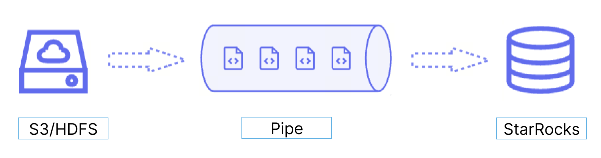

# Load data from HDFS

import LoadMethodIntro from '../_assets/commonMarkdown/loadMethodIntro.md'

import InsertPrivNote from '../_assets/commonMarkdown/insertPrivNote.md'

import PipeAdvantages from '../_assets/commonMarkdown/pipeAdvantages.md'

StarRocks provides the following options for loading data from HDFS:

<LoadMethodIntro />

## Before you begin

### Make source data ready

Make sure the source data you want to load into StarRocks is properly stored in your HDFS cluster. This topic assumes that you want to load `/user/amber/user_behavior_ten_million_rows.parquet` from HDFS into StarRocks.

### Check privileges

<InsertPrivNote />

### Gather authentication details

You can use the simple authentication method to establish connections with your HDFS cluster. To use simple authentication, you need to gather the username and password of the account that you can use to access the NameNode of the HDFS cluster.

## Use INSERT+FILES()

This method is available from v3.1 onwards and currently supports only the Parquet, ORC, and CSV (from v3.3.0 onwards) file formats.

### Advantages of INSERT+FILES()

[`FILES()`](../sql-reference/sql-functions/table-functions/files.md) can read the file stored in cloud storage based on the path-related properties you specify, infer the table schema of the data in the file, and then return the data from the file as data rows.

With `FILES()`, you can:

- Query the data directly from HDFS using [SELECT](../sql-reference/sql-statements/table_bucket_part_index/SELECT.md).
- Create and load a table using [CREATE TABLE AS SELECT](../sql-reference/sql-statements/table_bucket_part_index/CREATE_TABLE_AS_SELECT.md) (CTAS).
- Load the data into an existing table using [INSERT](../sql-reference/sql-statements/table_bucket_part_index/SELECT.md).

### Typical examples

#### Querying directly from HDFS using SELECT

Querying directly from HDFS using SELECT+`FILES()` can give a good preview of the content of a dataset before you create a table. For example:

- Get a preview of the dataset without storing the data.
- Query for the min and max values and decide what data types to use.
- Check for `NULL` values.

The following example queries the data file `/user/amber/user_behavior_ten_million_rows.parquet` stored in the HDFS cluster:

```SQL
SELECT * FROM FILES
(
    "path" = "hdfs://<hdfs_ip>:<hdfs_port>/user/amber/user_behavior_ten_million_rows.parquet",
    "format" = "parquet",
    "hadoop.security.authentication" = "simple",
    "username" = "<hdfs_username>",
    "password" = "<hdfs_password>"
)
LIMIT 3;
```

The system returns the following query result:

```Plaintext
+--------+---------+------------+--------------+---------------------+
| UserID | ItemID  | CategoryID | BehaviorType | Timestamp           |
+--------+---------+------------+--------------+---------------------+
| 543711 |  829192 |    2355072 | pv           | 2017-11-27 08:22:37 |
| 543711 | 2056618 |    3645362 | pv           | 2017-11-27 10:16:46 |
| 543711 | 1165492 |    3645362 | pv           | 2017-11-27 10:17:00 |
+--------+---------+------------+--------------+---------------------+
```

> **NOTE**
>
> Notice that the column names as returned above are provided by the Parquet file.

#### Creating and loading a table using CTAS

This is a continuation of the previous example. The previous query is wrapped in CREATE TABLE AS SELECT (CTAS) to automate the table creation using schema inference. This means StarRocks will infer the table schema, create the table you want, and then load the data into the table. The column names and types are not required to create a table when using the `FILES()` table function with Parquet files as the Parquet format includes the column names.

> **NOTE**
>
> The syntax of CREATE TABLE when using schema inference does not allow setting the number of replicas, so set it before creating the table. The example below is for a system with three replicas:
>
> ```SQL
> ADMIN SET FRONTEND CONFIG ('default_replication_num' = "3");
> ```

Create a database and switch to it:

```SQL
CREATE DATABASE IF NOT EXISTS mydatabase;
USE mydatabase;
```

Use CTAS to create a table and load the data of the data file `/user/amber/user_behavior_ten_million_rows.parquet` into the table:

```SQL
CREATE TABLE user_behavior_inferred AS
SELECT * FROM FILES
(
    "path" = "hdfs://<hdfs_ip>:<hdfs_port>/user/amber/user_behavior_ten_million_rows.parquet",
    "format" = "parquet",
    "hadoop.security.authentication" = "simple",
    "username" = "<hdfs_username>",
    "password" = "<hdfs_password>"
);
```

After creating the table, you can view its schema by using [DESCRIBE](../sql-reference/sql-statements/table_bucket_part_index/DESCRIBE.md):

```SQL
DESCRIBE user_behavior_inferred;
```

The system returns the following query result:

```Plain
+--------------+-----------+------+-------+---------+-------+
| Field        | Type      | Null | Key   | Default | Extra |
+--------------+-----------+------+-------+---------+-------+
| UserID       | bigint    | YES  | true  | NULL    |       |
| ItemID       | bigint    | YES  | true  | NULL    |       |
| CategoryID   | bigint    | YES  | true  | NULL    |       |
| BehaviorType | varbinary | YES  | false | NULL    |       |
| Timestamp    | varbinary | YES  | false | NULL    |       |
+--------------+-----------+------+-------+---------+-------+
```

Query the table to verify that the data has been loaded into it. Example:

```SQL
SELECT * from user_behavior_inferred LIMIT 3;
```

The following query result is returned, indicating that the data has been successfully loaded:

```Plaintext
+--------+--------+------------+--------------+---------------------+
| UserID | ItemID | CategoryID | BehaviorType | Timestamp           |
+--------+--------+------------+--------------+---------------------+
|     84 |  56257 |    1879194 | pv           | 2017-11-26 05:56:23 |
|     84 | 108021 |    2982027 | pv           | 2017-12-02 05:43:00 |
|     84 | 390657 |    1879194 | pv           | 2017-11-28 11:20:30 |
+--------+--------+------------+--------------+---------------------+
```

#### Loading into an existing table using INSERT

You may want to customize the table that you are inserting into, for example, the:

- column data type, nullable setting, or default values
- key types and columns
- data partitioning and bucketing

> **NOTE**
>
> Creating the most efficient table structure requires knowledge of how the data will be used and the content of the columns. This topic does not cover table design. For information about table design, see [Table types](../table_design/StarRocks_table_design.md).

In this example, we are creating a table based on knowledge of how the table will be queried and the data in the Parquet file. The knowledge of the data in the Parquet file can be gained by querying the file directly in HDFS.

- Since a query of the dataset in HDFS indicates that the `Timestamp` column contains data that matches a VARBINARY data type, the column type is specified in the following DDL.
- By querying the data in HDFS, you can find that there are no `NULL` values in the dataset, so the DDL does not set any columns as nullable.
- Based on knowledge of the expected query types, the sort key and bucketing column are set to the column `UserID`. Your use case might be different for this data, so you might decide to use `ItemID` in addition to or instead of `UserID` for the sort key.

Create a database and switch to it:

```SQL
CREATE DATABASE IF NOT EXISTS mydatabase;
USE mydatabase;
```

Create a table by hand (we recommend that the table have the same schema as the Parquet file you want to load from HDFS):

```SQL
CREATE TABLE user_behavior_declared
(
    UserID int(11),
    ItemID int(11),
    CategoryID int(11),
    BehaviorType varchar(65533),
    Timestamp varbinary
)
ENGINE = OLAP 
DUPLICATE KEY(UserID)
DISTRIBUTED BY HASH(UserID);
```

Display the schema so that you can compare it with the inferred schema produced by the `FILES()` table function:

```sql
DESCRIBE user_behavior_declared;
```

```plaintext
+--------------+----------------+------+-------+---------+-------+
| Field        | Type           | Null | Key   | Default | Extra |
+--------------+----------------+------+-------+---------+-------+
| UserID       | int            | NO   | true  | NULL    |       |
| ItemID       | int            | NO   | false | NULL    |       |
| CategoryID   | int            | NO   | false | NULL    |       |
| BehaviorType | varchar(65533) | NO   | false | NULL    |       |
| Timestamp    | varbinary      | NO   | false | NULL    |       |
+--------------+----------------+------+-------+---------+-------+
5 rows in set (0.00 sec)
```

:::tip

Compare the schema you just created with the schema inferred earlier using the `FILES()` table function. Look at:

- data types
- nullable
- key fields

To better control the schema of the destination table and for better query performance, we recommend that you specify the table schema by hand in production environments.

:::

After creating the table, you can load it with INSERT INTO SELECT FROM FILES():

```SQL
INSERT INTO user_behavior_declared
SELECT * FROM FILES
(
    "path" = "hdfs://<hdfs_ip>:<hdfs_port>/user/amber/user_behavior_ten_million_rows.parquet",
    "format" = "parquet",
    "hadoop.security.authentication" = "simple",
    "username" = "<hdfs_username>",
    "password" = "<hdfs_password>"
);
```

After the load is complete, you can query the table to verify that the data has been loaded into it. Example:

```SQL
SELECT * from user_behavior_declared LIMIT 3;
```

The following query result is returned, indicating that the data has been successfully loaded:

```Plaintext
+--------+---------+------------+--------------+---------------------+
| UserID | ItemID  | CategoryID | BehaviorType | Timestamp           |
+--------+---------+------------+--------------+---------------------+
|    107 | 1568743 |    4476428 | pv           | 2017-11-25 14:29:53 |
|    107 |  470767 |    1020087 | pv           | 2017-11-25 14:32:31 |
|    107 |  358238 |    1817004 | pv           | 2017-11-25 14:43:23 |
+--------+---------+------------+--------------+---------------------+
```

#### Check load progress

You can query the progress of INSERT jobs from the [`loads`](../sql-reference/information_schema/loads.md) view in the StarRocks Information Schema. This feature is supported from v3.1 onwards. Example:

```SQL
SELECT * FROM information_schema.loads ORDER BY JOB_ID DESC;
```

For information about the fields provided in the `loads` view, see [`loads`](../sql-reference/information_schema/loads.md).

If you have submitted multiple load jobs, you can filter on the `LABEL` associated with the job. Example:

```SQL
SELECT * FROM information_schema.loads WHERE LABEL = 'insert_0d86c3f9-851f-11ee-9c3e-00163e044958' \G
*************************** 1. row ***************************
              JOB_ID: 10214
               LABEL: insert_0d86c3f9-851f-11ee-9c3e-00163e044958
       DATABASE_NAME: mydatabase
               STATE: FINISHED
            PROGRESS: ETL:100%; LOAD:100%
                TYPE: INSERT
            PRIORITY: NORMAL
           SCAN_ROWS: 10000000
       FILTERED_ROWS: 0
     UNSELECTED_ROWS: 0
           SINK_ROWS: 10000000
            ETL_INFO:
           TASK_INFO: resource:N/A; timeout(s):300; max_filter_ratio:0.0
         CREATE_TIME: 2023-11-17 15:58:14
      ETL_START_TIME: 2023-11-17 15:58:14
     ETL_FINISH_TIME: 2023-11-17 15:58:14
     LOAD_START_TIME: 2023-11-17 15:58:14
    LOAD_FINISH_TIME: 2023-11-17 15:58:18
         JOB_DETAILS: {"All backends":{"0d86c3f9-851f-11ee-9c3e-00163e044958":[10120]},"FileNumber":0,"FileSize":0,"InternalTableLoadBytes":311710786,"InternalTableLoadRows":10000000,"ScanBytes":581574034,"ScanRows":10000000,"TaskNumber":1,"Unfinished backends":{"0d86c3f9-851f-11ee-9c3e-00163e044958":[]}}
           ERROR_MSG: NULL
        TRACKING_URL: NULL
        TRACKING_SQL: NULL
REJECTED_RECORD_PATH: NULL
```

> **NOTE**
>
> INSERT is a synchronous command. If an INSERT job is still running, you need to open another session to check its execution status.

## Use Broker Load

An asynchronous Broker Load process handles making the connection to HDFS, pulling the data, and storing the data in StarRocks.

This method supports the following file formats:

- Parquet
- ORC
- CSV
- JSON (supported from v3.2.3 onwards)

### Advantages of Broker Load

- Broker Load runs in the background and clients do not need to stay connected for the job to continue.
- Broker Load is preferred for long-running jobs, with the default timeout spanning 4 hours.
- In addition to Parquet and ORC file format, Broker Load supports CSV file format and JSON file format (JSON file format is supported from v3.2.3 onwards).

### Data flow


1. The user creates a load job.
2. The frontend (FE) creates a query plan and distributes the plan to the backend nodes (BEs) or compute nodes (CNs).
3. The BEs or CNs pull the data from the source and load the data into StarRocks.

### Typical example

Create a table, start a load process that pulls the data file `/user/amber/user_behavior_ten_million_rows.parquet` from HDFS, and verify the progress and success of the data loading.

#### Create a database and a table

Create a database and switch to it:

```SQL
CREATE DATABASE IF NOT EXISTS mydatabase;
USE mydatabase;
```

Create a table by hand (we recommend that the table has the same schema as the Parquet file that you want to load from HDFS):

```SQL
CREATE TABLE user_behavior
(
    UserID int(11),
    ItemID int(11),
    CategoryID int(11),
    BehaviorType varchar(65533),
    Timestamp varbinary
)
ENGINE = OLAP 
DUPLICATE KEY(UserID)
DISTRIBUTED BY HASH(UserID);
```

#### Start a Broker Load

Run the following command to start a Broker Load job that loads data from the data file `/user/amber/user_behavior_ten_million_rows.parquet` to the `user_behavior` table:

```SQL
LOAD LABEL user_behavior
(
    DATA INFILE("hdfs://<hdfs_ip>:<hdfs_port>/user/amber/user_behavior_ten_million_rows.parquet")
    INTO TABLE user_behavior
    FORMAT AS "parquet"
 )
 WITH BROKER
(
    "hadoop.security.authentication" = "simple",
    "username" = "<hdfs_username>",
    "password" = "<hdfs_password>"
)
PROPERTIES
(
    "timeout" = "72000"
);
```

This job has four main sections:

- `LABEL`: A string used when querying the state of the load job.
- `LOAD` declaration: The source URI, source data format, and destination table name.
- `BROKER`: The connection details for the source.
- `PROPERTIES`: The timeout value and any other properties to apply to the load job.

For detailed syntax and parameter descriptions, see [BROKER LOAD](../sql-reference/sql-statements/loading_unloading/BROKER_LOAD.md).

#### Check load progress

You can query the progress of Broker Load jobs from the `information_schema.loads` view. This feature is supported from v3.1 onwards.

```SQL
SELECT * FROM information_schema.loads;
```

For information about the fields provided in the `loads` view, see [Information Schema](../sql-reference/information_schema/loads.md)).

If you have submitted multiple load jobs, you can filter on the `LABEL` associated with the job. Example:

```SQL
SELECT * FROM information_schema.loads WHERE LABEL = 'user_behavior';
```

In the output below there are two entries for the load job `user_behavior`:

- The first record shows a state of `CANCELLED`. Scroll to `ERROR_MSG`, and you can see that the job has failed due to `listPath failed`.
- The second record shows a state of `FINISHED`, which means that the job has succeeded.

```Plaintext
JOB_ID|LABEL                                      |DATABASE_NAME|STATE    |PROGRESS           |TYPE  |PRIORITY|SCAN_ROWS|FILTERED_ROWS|UNSELECTED_ROWS|SINK_ROWS|ETL_INFO|TASK_INFO                                           |CREATE_TIME        |ETL_START_TIME     |ETL_FINISH_TIME    |LOAD_START_TIME    |LOAD_FINISH_TIME   |JOB_DETAILS                                                                                                                                                                                                                                                    |ERROR_MSG                             |TRACKING_URL|TRACKING_SQL|REJECTED_RECORD_PATH|
------+-------------------------------------------+-------------+---------+-------------------+------+--------+---------+-------------+---------------+---------+--------+----------------------------------------------------+-------------------+-------------------+-------------------+-------------------+-------------------+---------------------------------------------------------------------------------------------------------------------------------------------------------------------------------------------------------------------------------------------------------------+--------------------------------------+------------+------------+--------------------+
 10121|user_behavior                              |mydatabase   |CANCELLED|ETL:N/A; LOAD:N/A  |BROKER|NORMAL  |        0|            0|              0|        0|        |resource:N/A; timeout(s):72000; max_filter_ratio:0.0|2023-08-10 14:59:30|                   |                   |                   |2023-08-10 14:59:34|{"All backends":{},"FileNumber":0,"FileSize":0,"InternalTableLoadBytes":0,"InternalTableLoadRows":0,"ScanBytes":0,"ScanRows":0,"TaskNumber":0,"Unfinished backends":{}}                                                                                        |type:ETL_RUN_FAIL; msg:listPath failed|            |            |                    |
 10106|user_behavior                              |mydatabase   |FINISHED |ETL:100%; LOAD:100%|BROKER|NORMAL  | 86953525|            0|              0| 86953525|        |resource:N/A; timeout(s):72000; max_filter_ratio:0.0|2023-08-10 14:50:15|2023-08-10 14:50:19|2023-08-10 14:50:19|2023-08-10 14:50:19|2023-08-10 14:55:10|{"All backends":{"a5fe5e1d-d7d0-4826-ba99-c7348f9a5f2f":[10004]},"FileNumber":1,"FileSize":1225637388,"InternalTableLoadBytes":2710603082,"InternalTableLoadRows":86953525,"ScanBytes":1225637388,"ScanRows":86953525,"TaskNumber":1,"Unfinished backends":{"a5|                                      |            |            |                    |
```

After you confirm that the load job has finished, you can check a subset of the destination table to see if the data has been successfully loaded. Example:

```SQL
SELECT * from user_behavior LIMIT 3;
```

The following query result is returned, indicating that the data has been successfully loaded:

```Plaintext
+--------+---------+------------+--------------+---------------------+
| UserID | ItemID  | CategoryID | BehaviorType | Timestamp           |
+--------+---------+------------+--------------+---------------------+
|    142 | 2869980 |    2939262 | pv           | 2017-11-25 03:43:22 |
|    142 | 2522236 |    1669167 | pv           | 2017-11-25 15:14:12 |
|    142 | 3031639 |    3607361 | pv           | 2017-11-25 15:19:25 |
+--------+---------+------------+--------------+---------------------+
```

## Use Pipe

Starting from v3.2, StarRocks provides the Pipe loading method, which currently supports only the Parquet and ORC file formats.

### Advantages of Pipe

<PipeAdvantages menu=" HDFS uses LastModifiedTime "/>

Pipe is ideal for continuous data loading and large-scale data loading:

- **Large-scale data loading in micro-batches helps reduce the cost of retries caused by data errors.**

  With the help of Pipe, StarRocks enables the efficient loading of a large number of data files with a significant data volume in total. Pipe automatically splits the files based on their number or size, breaking down the load job into smaller, sequential tasks. This approach ensures that errors in one file do not impact the entire load job. The load status of each file is recorded by Pipe, allowing you to easily identify and fix files that contain errors. By minimizing the need for retries due to data errors, this approach helps to reduce costs.

- **Continuous data loading helps reduce manpower.**

  Pipe helps you write new or updated data files to a specific location and continuously load the new data from these files into StarRocks. After you create a Pipe job with `"AUTO_INGEST" = "TRUE"` specified, it will constantly monitor changes to the data files stored in the specified path and automatically load new or updated data from the data files into the destination StarRocks table.

Additionally, Pipe performs file uniqueness checks to help prevent duplicate data loading. During the loading process, Pipe checks the uniqueness of each data file based on the file name and digest. If a file with a specific file name and digest has already been processed by a Pipe job, the Pipe job will skip all subsequent files with the same file name and digest. Note that HDFS uses `LastModifiedTime` as file digest.

The load status of each data file is recorded and saved to the `information_schema.pipe_files` view. After a Pipe job associated with the view is deleted, the records about the files loaded in that job will also be deleted.

### Data flow



### Differences between Pipe and INSERT+FILES()

A Pipe job is split into one or more transactions based on the size and number of rows in each data file. Users can query the intermediate results during the loading process. In contrast, an INSERT+`FILES()` job is processed as a single transaction, and users are unable to view the data during the loading process.

### File loading sequence

For each Pipe job, StarRocks maintains a file queue, from which it fetches and loads data files as micro-batches. Pipe does not ensure that the data files are loaded in the same order as they are uploaded. Therefore, newer data may be loaded prior to older data.

### Typical example

#### Create a database and a table

Create a database and switch to it:

```SQL
CREATE DATABASE IF NOT EXISTS mydatabase;
USE mydatabase;
```

Create a table by hand (we recommend that the table have the same schema as the Parquet file you want to load from HDFS):

```SQL
CREATE TABLE user_behavior_replica
(
    UserID int(11),
    ItemID int(11),
    CategoryID int(11),
    BehaviorType varchar(65533),
    Timestamp varbinary
)
ENGINE = OLAP 
DUPLICATE KEY(UserID)
DISTRIBUTED BY HASH(UserID);
```

#### Start a Pipe job

Run the following command to start a Pipe job that loads data from the data file `/user/amber/user_behavior_ten_million_rows.parquet` to the `user_behavior_replica` table:

```SQL
CREATE PIPE user_behavior_replica
PROPERTIES
(
    "AUTO_INGEST" = "TRUE"
)
AS
INSERT INTO user_behavior_replica
SELECT * FROM FILES
(
    "path" = "hdfs://<hdfs_ip>:<hdfs_port>/user/amber/user_behavior_ten_million_rows.parquet",
    "format" = "parquet",
    "hadoop.security.authentication" = "simple",
    "username" = "<hdfs_username>",
    "password" = "<hdfs_password>"
); 
```

This job has four main sections:

- `pipe_name`: The name of the pipe. The pipe name must be unique within the database to which the pipe belongs.
- `INSERT_SQL`: The INSERT INTO SELECT FROM FILES statement that is used to load data from the specified source data file to the destination table.
- `PROPERTIES`: A set of optional parameters that specify how to execute the pipe. These include `AUTO_INGEST`, `POLL_INTERVAL`, `BATCH_SIZE`, and `BATCH_FILES`. Specify these properties in the `"key" = "value"` format.

For detailed syntax and parameter descriptions, see [CREATE PIPE](../sql-reference/sql-statements/loading_unloading/pipe/CREATE_PIPE.md).

#### Check load progress

- Query the progress of Pipe jobs by using [SHOW PIPES](../sql-reference/sql-statements/loading_unloading/pipe/SHOW_PIPES.md).

  ```SQL
  SHOW PIPES;
  ```

  If you have submitted multiple load jobs, you can filter on the `NAME` associated with the job. Example:

  ```SQL
  SHOW PIPES WHERE NAME = 'user_behavior_replica' \G
  *************************** 1. row ***************************
  DATABASE_NAME: mydatabase
        PIPE_ID: 10252
      PIPE_NAME: user_behavior_replica
          STATE: RUNNING
     TABLE_NAME: mydatabase.user_behavior_replica
    LOAD_STATUS: {"loadedFiles":1,"loadedBytes":132251298,"loadingFiles":0,"lastLoadedTime":"2023-11-17 16:13:22"}
     LAST_ERROR: NULL
   CREATED_TIME: 2023-11-17 16:13:15
  1 row in set (0.00 sec)
  ```

- Query the progress of Pipe jobs from the [`pipes`](../sql-reference/information_schema/pipes.md) view in the StarRocks Information Schema.

  ```SQL
  SELECT * FROM information_schema.pipes;
  ```

  If you have submitted multiple load jobs, you can filter on the `PIPE_NAME` associated with the job. Example:

  ```SQL
  SELECT * FROM information_schema.pipes WHERE pipe_name = 'user_behavior_replica' \G
  *************************** 1. row ***************************
  DATABASE_NAME: mydatabase
        PIPE_ID: 10252
      PIPE_NAME: user_behavior_replica
          STATE: RUNNING
     TABLE_NAME: mydatabase.user_behavior_replica
    LOAD_STATUS: {"loadedFiles":1,"loadedBytes":132251298,"loadingFiles":0,"lastLoadedTime":"2023-11-17 16:13:22"}
     LAST_ERROR:
   CREATED_TIME: 2023-11-17 16:13:15
  1 row in set (0.00 sec)
  ```

#### Check file status

You can query the load status of the files loaded from the [`pipe_files`](../sql-reference/information_schema/pipe_files.md) view in the StarRocks Information Schema.

```SQL
SELECT * FROM information_schema.pipe_files;
```

If you have submitted multiple load jobs, you can filter on the `PIPE_NAME` associated with the job. Example:

```SQL
SELECT * FROM information_schema.pipe_files WHERE pipe_name = 'user_behavior_replica' \G
*************************** 1. row ***************************
   DATABASE_NAME: mydatabase
         PIPE_ID: 10252
       PIPE_NAME: user_behavior_replica
       FILE_NAME: hdfs://172.26.195.67:9000/user/amber/user_behavior_ten_million_rows.parquet
    FILE_VERSION: 1700035418838
       FILE_SIZE: 132251298
   LAST_MODIFIED: 2023-11-15 08:03:38
      LOAD_STATE: FINISHED
     STAGED_TIME: 2023-11-17 16:13:16
 START_LOAD_TIME: 2023-11-17 16:13:17
FINISH_LOAD_TIME: 2023-11-17 16:13:22
       ERROR_MSG:
1 row in set (0.02 sec)
```

#### Manage Pipes

You can alter, suspend or resume, drop, or query the pipes you have created and retry to load specific data files. For more information, see [ALTER PIPE](../sql-reference/sql-statements/loading_unloading/pipe/ALTER_PIPE.md), [SUSPEND or RESUME PIPE](../sql-reference/sql-statements/loading_unloading/pipe/SUSPEND_or_RESUME_PIPE.md), [DROP PIPE](../sql-reference/sql-statements/loading_unloading/pipe/DROP_PIPE.md), [SHOW PIPES](../sql-reference/sql-statements/loading_unloading/pipe/SHOW_PIPES.md), and [RETRY FILE](../sql-reference/sql-statements/loading_unloading/pipe/RETRY_FILE.md).
