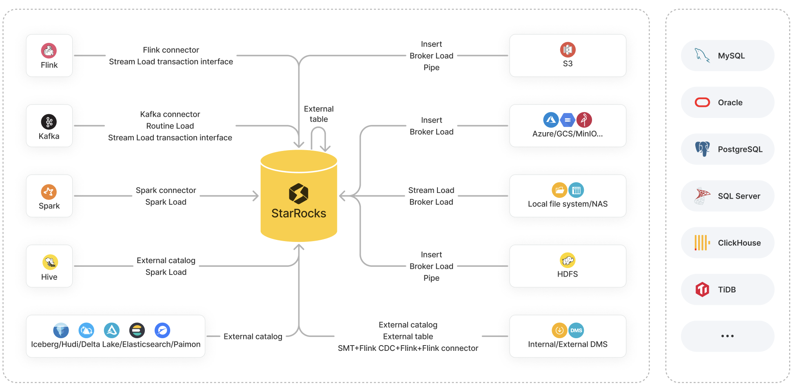

# Loading options

Data loading is the process of cleansing and transforming raw data from various data sources based on your business requirements and loading the resulting data into StarRocks to facilitate analysis.

StarRocks provides a variety of options for data loading:

- Loading methods: Insert, Stream Load, Broker Load, Pipe, Routine Load, and Spark Load
- Ecosystem tools: StarRocks Connector for Apache Kafka® (Kafka connector for short), StarRocks Connector for Apache Spark™ (Spark connector for short), StarRocks Connector for Apache Flink® (Flink connector for short), and other tools such as SMT, DataX, CloudCanal, and Kettle Connector
- API: Stream Load transaction interface

These options each have its own advantages and support its own set of data source systems to pull from.

This topic provides an overview of these options, along with comparisons between them to help you determine the loading option of your choice based on your data source, business scenario, data volume, data file format, and loading frequency.

## Introduction to loading options

This section mainly describes the characteristics and business scenarios of the loading options available in StarRocks.

:::note

In the following sections, "batch" or "batch loading" refers to the loading of a large amount of data from a specified source all at a time into StarRocks, whereas "stream" or "streaming" refers to the continuous loading of data in real time.

:::

## Loading methods

### [Insert](../InsertInto.md)

**Business scenario:**

- INSERT INTO VALUES: Append to an internal table with small amounts of data.
- INSERT INTO SELECT:
  - INSERT INTO SELECT FROM `<table_name>`: Append to a table with the result of a query on an internal or external table.
  - INSERT INTO SELECT FROM FILES(): Append to a table with the result of a query on data files in remote storage.

    :::note

    For AWS S3, this feature is supported from v3.1 onwards. For HDFS, Microsoft Azure Storage, Google GCS, and S3-compatible storage (such as MinIO), this feature is supported from v3.2 onwards.

    :::

**File format:**

- INSERT INTO VALUES: SQL
- INSERT INTO SELECT:
  - INSERT INTO SELECT FROM `<table_name>`: StarRocks tables
  - INSERT INTO SELECT FROM FILES(): Parquet and ORC

**Data volume:** Not fixed (The data volume varies based on the memory size.)

### [Stream Load](../StreamLoad.md)

**Business scenario:** Batch load data from a local file system.

**File format:** CSV and JSON

**Data volume:** 10 GB or less

### [Broker Load](../../sql-reference/sql-statements/loading_unloading/BROKER_LOAD.md)

**Business scenario:**

- Batch load data from HDFS or cloud storage like AWS S3, Microsoft Azure Storage, Google GCS, and S3-compatible storage (such as MinIO).
- Batch load data from a local file system or NAS.

**File format:** CSV, Parquet, ORC, and JSON (supported since v3.2.3)

**Data volume:** Dozens of GB to hundreds of GB

### [Pipe](../../sql-reference/sql-statements/loading_unloading/pipe/CREATE_PIPE.md)

**Business scenario:** Batch load or stream data from HDFS or AWS S3.

:::note

This loading method is supported from v3.2 onwards.

:::

**File format:** Parquet and ORC

**Data volume:** 100 GB to 1 TB or more

### [Routine Load](../../sql-reference/sql-statements/loading_unloading/routine_load/CREATE_ROUTINE_LOAD.md)

**Business scenario:** Stream data from Kafka.

**File format:** CSV, JSON, and Avro (supported since v3.0.1)

**Data volume:** MBs to GBs of data as mini-batches

### [Spark Load](../../sql-reference/sql-statements/loading_unloading/SPARK_LOAD.md)

**Business scenario:** Batch load data of Apache Hive™ tables stored in HDFS by using Spark clusters.

**File format:** CSV, Parquet (supported since v2.0), and ORC (supported since v2.0)

**Data volume:** Dozens of GB to TBs

## Ecosystem tools

### [Kafka connector](../Kafka-connector-starrocks.md)

**Business scenario:** Stream data from Kafka.

### [Spark connector](../Spark-connector-starrocks.md)

**Business scenario:** Batch load data from Spark.

### [Flink connector](../Flink-connector-starrocks.md)

**Business scenario:** Stream data from Flink.

### [SMT](../../integrations/loading_tools/SMT.md)

**Business scenario:** Load data from data sources such as MySQL, PostgreSQL, SQL Server, Oracle, Hive, ClickHouse, and TiDB through Flink.

### [DataX](../../integrations/loading_tools/DataX-starrocks-writer.md)

**Business scenario:** Synchronize data between various heterogeneous data sources, including relational databases (for example, MySQL and Oracle), HDFS, and Hive.

### [CloudCanal](../../integrations/loading_tools/CloudCanal.md)

**Business scenario:** Migrate or synchronize data from source databases (for example, MySQL, Oracle, and PostgreSQL) to StarRocks.

### [Kettle Connector](https://github.com/StarRocks/starrocks-connector-for-kettle)

**Business scenario:** Integrate with Kettle. By combining Kettle's robust data processing and transformation capabilities with StarRocks's high-performance data storage and analytical abilities, more flexible and efficient data processing workflows can be achieved.

## API

### [Stream Load transaction interface](../Stream_Load_transaction_interface.md)

**Business scenario:** Implement two-phase commit (2PC) for transactions that are run to load data from external systems such as Flink and Kafka, while improving the performance of highly concurrent stream loads. This feature is supported from v2.4 onwards.

**File format:** CSV and JSON

**Data volume:** 10 GB or less

## Choice of loading options

This section lists the loading options available for common data sources, helping you choose the option that best suits your situation.

### Object storage

| **Data source**                       | **Available loading options**                                |
| ------------------------------------- | ------------------------------------------------------------ |
| AWS S3                                | <ul><li>(Batch) INSERT INTO SELECT FROM FILES() (supported since v3.1)</li><li>(Batch) Broker Load</li><li>(Batch or streaming) Pipe (supported since v3.2)</li></ul>See [Load data from AWS S3](../s3.md). |
| Microsoft Azure Storage               | <ul><li>(Batch) INSERT INTO SELECT FROM FILES() (supported since v3.2)</li><li>(Batch) Broker Load</li></ul>See [Load data from Microsoft Azure Storage](../azure.md). |
| Google GCS                            | <ul><li>(Batch) INSERT INTO SELECT FROM FILES() (supported since v3.2)</li><li>(Batch) Broker Load</li></ul>See [Load data from GCS](../gcs.md). |
| S3-compatible storage (such as MinIO) | <ul><li>(Batch) INSERT INTO SELECT FROM FILES() (supported since v3.2)</li><li>(Batch) Broker Load</li></ul>See [Load data from MinIO](../minio.md). |

### Local file system (including NAS)

| **Data source**                   | **Available loading options**                                |
| --------------------------------- | ------------------------------------------------------------ |
| Local file system (including NAS) | <ul><li>(Batch) Stream Load</li><li>(Batch) Broker Load</li></ul>See [Load data from a local file system](../StreamLoad.md). |

### HDFS

| **Data source** | **Available loading options**                                |
| --------------- | ------------------------------------------------------------ |
| HDFS            | <ul><li>(Batch) INSERT INTO SELECT FROM FILES() (supported since v3.2)</li><li>(Batch) Broker Load</li><li>(Batch or streaming) Pipe (supported since v3.2)</li></ul>See [Load data from HDFS](../hdfs_load.md). |

### Flink, Kafka, and Spark

| **Data source** | **Available loading options**                                |
| --------------- | ------------------------------------------------------------ |
| Apache Flink®   | <ul><li>[Flink connector](../Flink-connector-starrocks.md)</li><li>[Stream Load transaction interface](../Stream_Load_transaction_interface.md)</li></ul> |
| Apache Kafka®   | <ul><li>(Streaming) [Kafka connector](../Kafka-connector-starrocks.md)</li><li>(Streaming) [Routine Load](../RoutineLoad.md)</li><li>[Stream Load transaction interface](../Stream_Load_transaction_interface.md)</li></ul> **NOTE** If the source data requires multi-table joins and extract, transform and load (ETL) operations, you can use Flink to read and pre-process the data and then use [Flink connector](../Flink-connector-starrocks.md) to load the data into StarRocks. |
| Apache Spark™   | <ul><li>[Spark connector](../Spark-connector-starrocks.md)</li><li>[Spark Load](../SparkLoad.md)</li></ul> |

### Data lakes

| **Data source** | **Available loading options**                                |
| --------------- | ------------------------------------------------------------ |
| Apache Hive™    | <ul><li>(Batch) Create a [Hive catalog](../../data_source/catalog/hive_catalog.md) and then use [INSERT INTO SELECT FROM `<table_name>`](../InsertInto.md#insert-data-from-an-internal-or-external-table-into-an-internal-table).</li><li>(Batch) [Spark Load](https://docs.starrocks.io/docs/loading/SparkLoad/).</li></ul> |
| Apache Iceberg  | (Batch) Create an [Iceberg catalog](../../data_source/catalog/iceberg_catalog.md) and then use [INSERT INTO SELECT FROM `<table_name>`](../InsertInto.md#insert-data-from-an-internal-or-external-table-into-an-internal-table). |
| Apache Hudi     | (Batch) Create a [Hudi catalog](../../data_source/catalog/hudi_catalog.md) and then use [INSERT INTO SELECT FROM `<table_name>`](../InsertInto.md#insert-data-from-an-internal-or-external-table-into-an-internal-table). |
| Delta Lake      | (Batch) Create a [Delta Lake catalog](../../data_source/catalog/deltalake_catalog.md) and then use [INSERT INTO SELECT FROM `<table_name>`](../InsertInto.md#insert-data-from-an-internal-or-external-table-into-an-internal-table). |
| Elasticsearch   | (Batch) Create an [Elasticsearch catalog](../../data_source/catalog/elasticsearch_catalog.md) and then use [INSERT INTO SELECT FROM `<table_name>`](../InsertInto.md#insert-data-from-an-internal-or-external-table-into-an-internal-table). |
| Apache Paimon   | (Batch) Create a [Paimon catalog](../../data_source/catalog/paimon_catalog.md) and then use [INSERT INTO SELECT FROM `<table_name>`](../InsertInto.md#insert-data-from-an-internal-or-external-table-into-an-internal-table). |

Note that StarRocks provides [unified catalogs](https://docs.starrocks.io/docs/data_source/catalog/unified_catalog/) from v3.2 onwards to help you handle tables from Hive, Iceberg, Hudi, and Delta Lake data sources as a unified data source without ingestion.

### Internal and external databases

| **Data source**                                              | **Available loading options**                                |
| ------------------------------------------------------------ | ------------------------------------------------------------ |
| StarRocks                                                    | (Batch) Create a [StarRocks external table](../../data_source/External_table.md#starrocks-external-table) and then use [INSERT INTO VALUES](../InsertInto.md#insert-data-via-insert-into-values) to insert a few data records or [INSERT INTO SELECT FROM `<table_name>`](../InsertInto.md#insert-data-from-an-internal-or-external-table-into-an-internal-table) to insert the data of a table. **NOTE** StarRocks external tables only support data writes. They do not support data reads. |
| MySQL                                                        | <ul><li>(Batch) Create a [JDBC catalog](../../data_source/catalog/jdbc_catalog.md) (recommended) or a [MySQL external table](../../data_source/External_table.md#deprecated-mysql-external-table) and then use [INSERT INTO SELECT FROM `<table_name>`](../InsertInto.md#insert-data-from-an-internal-or-external-table-into-an-internal-table).</li><li>(Streaming) Use [SMT, Flink CDC connector, Flink, and Flink connector](../Flink_cdc_load.md).</li></ul> |
| Other databases such as Oracle, PostgreSQL, SQL Server, ClickHouse, and TiDB | <ul><li>(Batch) Create a [JDBC catalog](../../data_source/catalog/jdbc_catalog.md) (recommended) or a [JDBC external table](../../data_source/External_table.md#external-table-for-a-jdbc-compatible-database) and then use [INSERT INTO SELECT FROM `<table_name>`](../InsertInto.md#insert-data-from-an-internal-or-external-table-into-an-internal-table).</li><li>(Streaming) Use [SMT, Flink CDC connector, Flink, and Flink connector](../loading_tools.md).</li></ul> |
