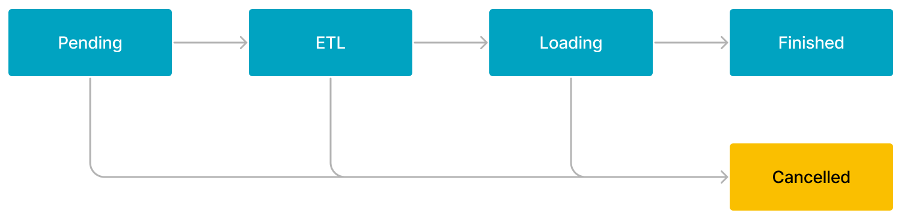

# Loading concepts

import InsertPrivNote from '../../_assets/commonMarkdown/insertPrivNote.md'

This topic introduces common concepts and information about data loading.

## Privileges

<InsertPrivNote />

## Labeling

You can load data into StarRocks by running load jobs. Each load job has a unique label that is specified by the user or automatically generated by StarRocks to identify the job. Each label can be used only for one load job. After a load job is complete, its label cannot be reused for any other load jobs. Only the labels of failed load jobs can be reused.

## Atomicity

All the loading methods provided by StarRocks guarantee atomicity. Atomicity means that the qualified data within a load job must be all successfully loaded or none of the qualified data is successfully loaded. It never happens that some of the qualified data is loaded while the other data is not. Note that the qualified data does not include the data that is filtered out due to quality issues such as data type conversion errors.

## Protocols

StarRocks supports two communication protocols that can be used to submit load jobs: MySQL and HTTP. Of all the loading methods supported by StarRocks, only Stream Load uses HTTP, whereas all the others use MySQL.

## Data types

StarRocks supports loading data of all data types. You only need to take note of the limits on the loading of a few specific data types. For more information, see [Data types](../../sql-reference/data-types/README.md).

## Strict mode

Strict mode is an optional property that you can configure for data loads. It affects the loading behavior and the final loaded data. For details, see [Strict mode](../load_concept/strict_mode.md).

## Loading modes

StarRocks supports two loading modes: synchronous loading mode and asynchronous loading mode.

:::note

If you load data by using external programs, you must choose a loading mode that best suits your business requirements before you decide the loading method of your choice.

:::

### Synchronous loading

In synchronous loading mode, after you submit a load job, StarRocks synchronously runs the job to load data, and returns the result of the job after the job finishes. You can check whether the job is successful based on the job result.

StarRocks provides two loading methods that support synchronous loading: [Stream Load](../StreamLoad.md) and [INSERT](../InsertInto.md).

The process of synchronous loading is as follows:

1. Create a load job.

2. View the job result returned by StarRocks.

3. Check whether the job is successful based on the job result. If the job result indicates a load failure, you can retry the job.

### Asynchronous loading

In asynchronous loading mode, after you submit a load job, StarRocks immediately returns the job creation result.

- If the result indicates a job creation success, StarRocks asynchronously runs the job. However, that does not mean that the data has been successfully loaded. You must use statements or commands to check the status of the job. Then, you can determine whether the data is successfully loaded based on the job status.

- If the result indicates a job creation failure, you can determine whether you need to retry the job based on the failure information.

:::tip

You can set different write quorum for tables, that is, how many replicas are required to return loading success before StarRocks can determine the loading task is successful. You can specify write quorum by adding the property `write_quorum` when you [CREATE TABLE](../../sql-reference/sql-statements/table_bucket_part_index/CREATE_TABLE.md), or add this property to an existing table using [ALTER TABLE](../../sql-reference/sql-statements/table_bucket_part_index/ALTER_TABLE.md).

:::

StarRocks provides four loading methods that support asynchronous loading: [Broker Load](../../sql-reference/sql-statements/loading_unloading/BROKER_LOAD.md), [Pipe](../../sql-reference/sql-statements/loading_unloading/pipe/CREATE_PIPE.md), [Routine Load](../../sql-reference/sql-statements/loading_unloading/routine_load/CREATE_ROUTINE_LOAD.md), and [Spark Load](../../sql-reference/sql-statements/loading_unloading/SPARK_LOAD.md).

The process of asynchronous loading is as follows:

1. Create a load job.

2. View the job creation result returned by StarRocks and determine whether the job is successfully created.

   - If the job creation succeeds, go to Step 3.

   - If the job creation fails, return to Step 1.

3. Use statements or commands to check the status of the job until the job status shows **FINISHED** or **CANCELLED**.

#### Workflow of Broker Load or Spark Load

The workflow of a Broker Load or Spark Load job consists of five stages, as shown in the following figure.

The workflow is described as follows:

1. **PENDING**

   The job is in queue waiting to be scheduled by an FE.

2. **ETL**

   The FE pre-processes the data, including cleansing, partitioning, sorting, and aggregation.

   Only a Spark Load job has the ETL stage. A Broker Load job skips this stage.

3. **LOADING**

   The FE cleanses and transforms the data, and then sends the data to the BEs or CNs. After all data is loaded, the data is in queue waiting to take effect. At this time, the status of the job remains **LOADING**.

4. **FINISHED**

   When loading finishes and all data involved takes effect, the status of the job becomes **FINISHED**. At this time, the data can be queried. **FINISHED** is a final job state.

5. **CANCELLED**

   Before the status of the job becomes **FINISHED**, you can cancel the job at any time. Additionally, StarRocks can automatically cancel the job in case of load errors. After the job is canceled, the status of the job becomes **CANCELLED**, and all data updates made before the cancellation are reverted. **CANCELLED** is also a final job state.

#### Workflow of Pipe

The workflow of a Pipe job is described as follows:

1. The job is submitted to an FE from a MySQL client.

2. The FE splits the data files stored in the specified path based on their number or size, breaking down job into smaller, sequential tasks. The tasks enter a queue, waiting to be scheduled, after they are created.

3. The FE obtains the tasks from the queue, and invokes the INSERT INTO SELECT FROM FILES statement to execute each task.

4. The data loading finishes:

   - If `"AUTO_INGEST" = "FALSE"` is specified for the job at job creation, the job finishes after the data of all the data files stored in the specified path is loaded.

   - If `"AUTO_INGEST" = "TRUE"` is specified for the job at job creation, the FE will continue to monitor changes to the data files and automatically loads new or updated data from the data files into the destination StarRocks table.

#### Workflow of Routine Load

The workflow of a Routine Load job is described as follows:

1. The job is submitted to an FE from a MySQL client.

2. The FE splits the job into multiple tasks. Each task is engineered to load data from multiple partitions.

3. The FE distributes the tasks to specified BEs or CNs.

4. The BEs or CNs execute the tasks, and report to the FE after they finish the tasks.

5. The FE generates subsequent tasks, retries failed tasks if there are any, or suspends task scheduling based on the reports from the BEs.
