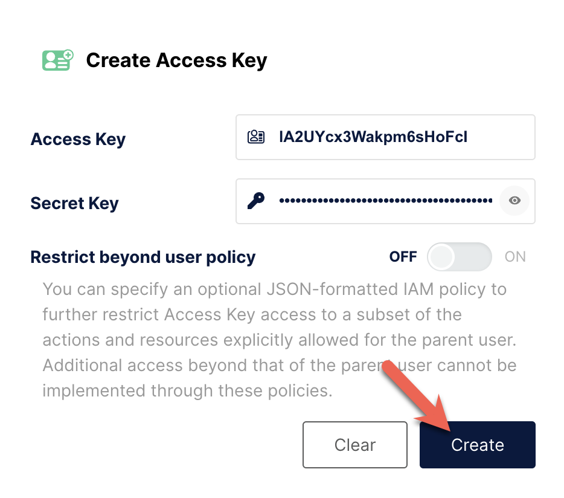

# Load data from MinIO



```sql
SELECT * FROM FILES
(
    "path" = "s3://starrocks/user_behavior_ten_million_rows.parquet",
    "format" = "parquet",
    "aws.s3.endpoint" = "http://minio:9000",
    "aws.s3.use_aws_sdk_default_behavior" = "false",
    "aws.s3.enable_ssl" = "false",
    "aws.s3.use_instance_profile" = "false",
    "aws.s3.enable_path_style_access" = "true",
    "aws.s3.access_key" = "IA2UYcx3Wakpm6sHoFcl",
    "aws.s3.secret_key" = "hBVjPlh4lw6lJzJwB99GNYpjWF6VIqMz8NSJFPaI"
)
LIMIT 3;
```

```plaintext
+--------+---------+------------+--------------+---------------------+
| UserID | ItemID  | CategoryID | BehaviorType | Timestamp           |
+--------+---------+------------+--------------+---------------------+
| 543711 |  829192 |    2355072 | pv           | 2017-11-27 08:22:37 |
| 543711 | 2056618 |    3645362 | pv           | 2017-11-27 10:16:46 |
| 543711 | 1165492 |    3645362 | pv           | 2017-11-27 10:17:00 |
+--------+---------+------------+--------------+---------------------+
3 rows in set (0.41 sec)
```

```sql
CREATE DATABASE IF NOT EXISTS mydatabase;
USE mydatabase;
```

:::tip

The default number of replicas is 3. If you are using less than 3 BEs
then set the `default_replication_num` to the number of BEs in use.

:::

```sql
ADMIN SET FRONTEND CONFIG ('default_replication_num' = '1');
```

```sql
CREATE TABLE user_behavior_inferred AS
SELECT * FROM FILES
(
    "path" = "s3://starrocks/user_behavior_ten_million_rows.parquet",
    "format" = "parquet",
    "aws.s3.endpoint" = "http://minio:9000",
    "aws.s3.use_aws_sdk_default_behavior" = "false",
    "aws.s3.enable_ssl" = "false",
    "aws.s3.use_instance_profile" = "false",
    "aws.s3.enable_path_style_access" = "true",
    "aws.s3.access_key" = "IA2UYcx3Wakpm6sHoFcl",
    "aws.s3.secret_key" = "hBVjPlh4lw6lJzJwB99GNYpjWF6VIqMz8NSJFPaI"
);
```

```plaintext
Query OK, 10000000 rows affected (3.17 sec)
{'label':'insert_a5da3ff5-9ee4-11ee-90b0-02420a060004', 'status':'VISIBLE', 'txnId':'17'}
```

```sql
DESCRIBE user_behavior_inferred;
```

```plaintext
+--------------+------------------+------+-------+---------+-------+
| Field        | Type             | Null | Key   | Default | Extra |
+--------------+------------------+------+-------+---------+-------+
| UserID       | bigint           | YES  | true  | NULL    |       |
| ItemID       | bigint           | YES  | true  | NULL    |       |
| CategoryID   | bigint           | YES  | true  | NULL    |       |
| BehaviorType | varchar(1048576) | YES  | false | NULL    |       |
| Timestamp    | varchar(1048576) | YES  | false | NULL    |       |
+--------------+------------------+------+-------+---------+-------+
5 rows in set (0.03 sec)
```

```sql
CREATE TABLE user_behavior
(
    UserID int(11),
    ItemID int(11),
    CategoryID int(11),
    BehaviorType varchar(65533),
    Timestamp datetime
)
ENGINE = OLAP 
DUPLICATE KEY(UserID)
DISTRIBUTED BY HASH(UserID)
PROPERTIES
(
    "replication_num" = "1"
);
```

```sql
LOAD LABEL userbehavior
(
    DATA INFILE("s3://starrocks/user_behavior_ten_million_rows.parquet")
    INTO TABLE user_behavior
 )
 WITH BROKER
 (
    "aws.s3.endpoint" = "http://minio:9000",
    "aws.s3.use_aws_sdk_default_behavior" = "false",
    "aws.s3.enable_ssl" = "false",
    "aws.s3.use_instance_profile" = "false",
    "aws.s3.enable_path_style_access" = "true",
    "aws.s3.access_key" = "IA2UYcx3Wakpm6sHoFcl",
    "aws.s3.secret_key" = "hBVjPlh4lw6lJzJwB99GNYpjWF6VIqMz8NSJFPaI"
 )
PROPERTIES
(
    "timeout" = "72000"
);
```

```sql
StarRocks > SELECT * FROM information_schema.loads
WHERE LABEL = 'userbehavior'\G
```

```plaintext
*************************** 1. row ***************************
              JOB_ID: 10176
               LABEL: userbehavior
       DATABASE_NAME: mydatabase
               STATE: FINISHED
            PROGRESS: ETL:100%; LOAD:100%
                TYPE: BROKER
            PRIORITY: NORMAL
           SCAN_ROWS: 10000000
       FILTERED_ROWS: 0
     UNSELECTED_ROWS: 0
           SINK_ROWS: 10000000
            ETL_INFO:
           TASK_INFO: resource:N/A; timeout(s):72000; max_filter_ratio:0.0
         CREATE_TIME: 2023-12-19 23:02:41
      ETL_START_TIME: 2023-12-19 23:02:44
     ETL_FINISH_TIME: 2023-12-19 23:02:44
     LOAD_START_TIME: 2023-12-19 23:02:44
    LOAD_FINISH_TIME: 2023-12-19 23:02:46
         JOB_DETAILS: {"All backends":{"4aeec563-a91e-4c1e-b169-977b660950d1":[10004]},"FileNumber":1,"FileSize":132251298,"InternalTableLoadBytes":311710786,"InternalTableLoadRows":10000000,"ScanBytes":132251298,"ScanRows":10000000,"TaskNumber":1,"Unfinished backends":{"4aeec563-a91e-4c1e-b169-977b660950d1":[]}}
           ERROR_MSG: NULL
        TRACKING_URL: NULL
        TRACKING_SQL: NULL
REJECTED_RECORD_PATH: NULL
1 row in set (0.02 sec)
```

```sql
CREATE PIPE user_behavior_replica
PROPERTIES
(
    "AUTO_INGEST" = "TRUE"
)
AS
INSERT INTO user_behavior_replica
SELECT * FROM FILES
(
    "path" = "s3://starrocks/user_behavior_ten_million_rows.parquet",
    "format" = "parquet",
    "aws.s3.endpoint" = "http://minio:9000",
    "aws.s3.use_aws_sdk_default_behavior" = "false",
    "aws.s3.enable_ssl" = "false",
    "aws.s3.use_instance_profile" = "false",
    "aws.s3.enable_path_style_access" = "true",
    "aws.s3.access_key" = "IA2UYcx3Wakpm6sHoFcl",
    "aws.s3.secret_key" = "hBVjPlh4lw6lJzJwB99GNYpjWF6VIqMz8NSJFPaI"
);
```

```sql
SHOW PIPES\G
```

```plaintext
*************************** 1. row ***************************
DATABASE_NAME: mydatabase
      PIPE_ID: 10204
    PIPE_NAME: user_behavior_replica
        STATE: RUNNING
   TABLE_NAME: mydatabase.user_behavior_replica
  LOAD_STATUS: {"loadedFiles":1,"loadedBytes":132251298,"loadingFiles":0,"lastLoadedTime":"2023-12-20 03:20:58"}
   LAST_ERROR: NULL
 CREATED_TIME: 2023-12-20 03:20:53
1 row in set (0.00 sec)
```
