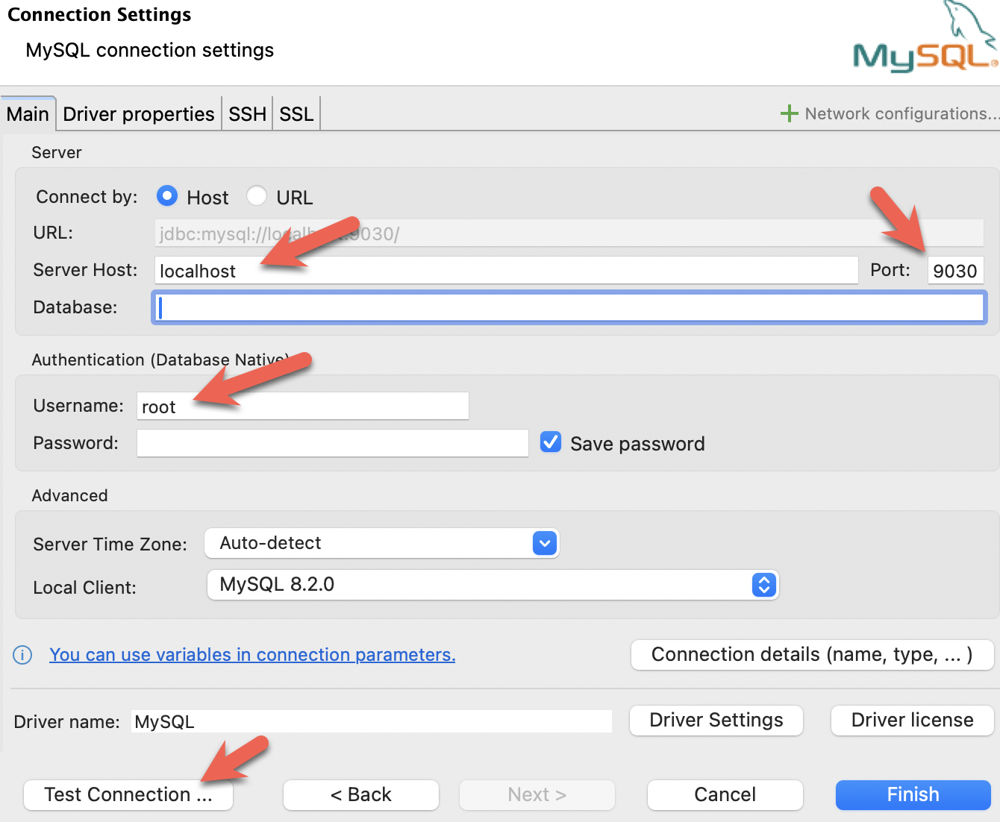
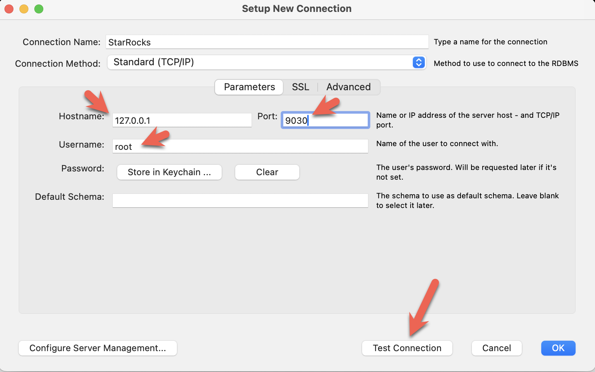

import Tabs from '@theme/Tabs';
import TabItem from '@theme/TabItem';
import OperatorPrereqs from '../assets/deployment/_OperatorPrereqs.mdx'
import DDL from '../assets/quick-start/_DDL.mdx'
import Clients from '../assets/quick-start/_clientsAllin1.mdx'
import SQL from '../assets/quick-start/_SQL.mdx'
import Curl from '../assets/quick-start/_curl.mdx'

# StarRocks with Helm

This tutorial covers:

- Deploying the StarRocks Kubernetes Operator and a StarRocks deployment with Helm
- Loading two public datasets including basic transformation of the data
- Analyzing the data with SELECT and JOIN
- Basic data transformation (the **T** in ETL)

:::tip
The datasets and queries are the same as the ones used in the Basic Quick Start. The main difference here is deploying with Helm and the StarRocks Operator.
:::

The data used is provided by NYC OpenData and the National Centers for Environmental Information.

Both of these datasets are large, and because this tutorial is intended to help you get exposed to working with StarRocks we are not going to load data for the past 120 years. You can run this with a GKE Kubernetes cluster built on three e2-standard-4 machines (or similar) with 80GB disk. For larger fault-tolerant and scalable deployments we have other documentation and will provide that later.

There is a lot of information in this document, and it is presented with step-by-step content at the beginning, and the technical details at the end. This is done to serve these purposes in this order:

1. Allow the reader to load data in StarRocks and analyze that data.
2. Explain the basics of data transformation during loading.

---

## Prerequisites

<OperatorPrereqs />

### SQL client

You can use the SQL client provided in the Kubernetes environment, or use one on your system. Many MySQL-compatible clients will work, and this guide covers the configuration of DBeaver and MySQL WorkBench.

### curl

`curl` is used to issue the data load job to StarRocks, and to download the datasets. Check to see if you have it installed by running `curl` or `curl.exe` at your OS prompt. If curl is not installed, [get curl here](https://curl.se/dlwiz/?type=bin).

---

## Terminology

### FE

Frontend nodes are responsible for metadata management, client connection management, query planning, and query scheduling. Each FE stores and maintains a complete copy of metadata in its memory, which guarantees indiscriminate services among the FEs.

### BE

Backend nodes are responsible for both data storage and executing query plans.

---

## Deploy StarRocks with Helm

## Procedure

1. Add the Helm Chart Repo for StarRocks. The Helm Chart contains the definitions of the StarRocks Operator and the custom resource StarRocksCluster.
   1. Add the Helm Chart Repo.

      ```Bash
      helm repo add starrocks-community https://starrocks.github.io/starrocks-kubernetes-operator
      ```

   2. Update the Helm Chart Repo to the latest version.

      ```Bash
      helm repo update
      ```

   3. View the Helm Chart Repo that you added.

      ```Bash
      $ helm search repo starrocks-community
      NAME                                    CHART VERSION    APP VERSION  DESCRIPTION
      starrocks-community/kube-starrocks      1.8.0            3.1-latest   kube-starrocks includes two subcharts, starrock...
      starrocks-community/operator            1.8.0            1.8.0        A Helm chart for StarRocks operator
      starrocks-community/starrocks           1.8.0            3.1-latest   A Helm chart for StarRocks cluster
      ```

2. Download the default **[values.yaml](https://github.com/StarRocks/starrocks-kubernetes-operator/blob/main/helm-charts/charts/kube-starrocks/values.yaml)**

   3. Deployment with custom configurations
      - Create a YAML file, for example, **my-values.yaml**, and customize the configurations for the StarRocks Operator and StarRocks cluster in the YAML file. For the supported parameters and descriptions, see the comments in the default **[values.yaml](https://github.com/StarRocks/starrocks-kubernetes-operator/blob/main/helm-charts/charts/kube-starrocks/values.yaml)** of the Helm Chart.
      - Run the following command to deploy the StarRocks Operator and StarRocks cluster with the custom configurations in **my-values.yaml**.

        ```Bash
        helm install -f my-values.yaml starrocks starrocks-community/kube-starrocks
        ```

    Deployment takes a while. During this period, you can check the deployment status with:

    ```Bash
    kubectl --namespace default get starrockscluster -l "cluster=kube-starrocks"

    ```bash
    # If the following result is returned, the deployment has been successfully completed.
    NAME             PHASE     FESTATUS   BESTATUS   CNSTATUS   FEPROXYSTATUS
    kube-starrocks   running   running    running
    ```

    You can also run `kubectl get pods` to check the deployment status. If all Pods are in the `Running` state and all containers within the Pods are `READY`, the deployment has been successfully completed.

    ```Bash
    kubectl get pods
    ```

    ```bash
    NAME                                       READY   STATUS    RESTARTS   AGE
    kube-starrocks-be-0                        1/1     Running   0          2m50s
    kube-starrocks-fe-0                        1/1     Running   0          4m31s
    kube-starrocks-operator-69c5c64595-pc7fv   1/1     Running   0          4m50s
    ```

---

## SQL clients

These three clients are tested with this tutorial, you only need one:

- MySQL CLI: You can run this from the Docker environment or your machine.
- [DBeaver](https://dbeaver.io/download/) is available as a community version and a Pro version. 
- [MySQL Workbench](https://dev.mysql.com/downloads/workbench/)

#### Configuring the client

<Tabs groupId="client">
<TabItem value="mysqlCLI" label="mysql CLI" default>

The easiest way to use the MySQL CLI is to run it from the StarRocks FE pod `kube-starrocks-fe-0`:

```bash
kubectl exec --stdin --tty kube-starrocks-fe-0 -- \
  mysql -P9030 -h127.0.0.1 -u root --prompt="StarRocks > "
```

:::tip
All `docker compose` commands must be run from the directory containing the `docker-compose.yml` file.
:::

If you would like to install the mysql CLI expand **mysql client install** below:

<details>

<summary>mysql client install</summary>

- macOS: If you use Homebrew and do not need MySQL Server run `brew install mysql` to install the CLI.
- Linux: Check your repository system for the `mysql` client. For example, `yum install mariadb`.
- Microsoft Windows: Install the [MySQL Community Server](https://dev.mysql.com/downloads/mysql/) and run the provided client, or run `mysql` from WSL.

</details>

</TabItem>

<TabItem value="DBeaver" label="DBeaver" >

- Install [DBeaver](https://dbeaver.io/download/), and add a connection:

- Configure the port, IP, and username. Test the connection, and click Finish if the test succeeds:


</TabItem>
<TabItem value="MySQLWorkbench" label="MySQL Workbench">

- Install the [MySQL Workbench](https://dev.mysql.com/downloads/workbench/), and add a connection.
- Configure the port, IP, and username and then test the connection:

- You will see warnings from the Workbench as it is checking for a specific MySQL version. You can ignore the warnings and when prompted, you can configure Workbench to stop displaying the warnings:

</TabItem>

</Tabs>

---

## Download the data

Download these two datasets to your machine.

### New York City crash data

```bash
curl -O https://raw.githubusercontent.com/StarRocks/demo/master/documentation-samples/quickstart/datasets/NYPD_Crash_Data.csv
```

### Weather data

```bash
curl -O https://raw.githubusercontent.com/StarRocks/demo/master/documentation-samples/quickstart/datasets/72505394728.csv
```

---

### Connect to StarRocks with a SQL client

:::tip

If you are using a client other than the mysql CLI, open that now.
:::

This command will run the `mysql` command in the Docker container:

```sql
kubectl exec --stdin --tty kube-starrocks-fe-0 -- \
  mysql -P9030 -h127.0.0.1 -u root --prompt="StarRocks > "
```

---

## Create some tables

<DDL />

---

## Load two datasets

There are many ways to load data into StarRocks. For this tutorial the simplest way is to use curl and StarRocks Stream Load.

:::tip
Open a new shell as these curl commands are run at the operating system prompt, not in the `mysql` client. The commands refer to the datasets that you downloaded, so run them from the directory where you downloaded the files.

You will be prompted for a password. You probably have not assigned a password to the MySQL `root` user, so just hit enter.
:::

The `curl` commands look complex, but they are explained in detail at the end of the tutorial. For now, we recommend running the commands and running some SQL to analyze the data, and then reading about the data loading details at the end.

### New York City collision data - Crashes

```bash
curl --location-trusted -u root             \
    -T ./NYPD_Crash_Data.csv                \
    -H "label:crashdata-0"                  \
    -H "column_separator:,"                 \
    -H "skip_header:1"                      \
    -H "enclose:\""                         \
    -H "max_filter_ratio:1"                 \
    -H "columns:tmp_CRASH_DATE, tmp_CRASH_TIME, CRASH_DATE=str_to_date(concat_ws(' ', tmp_CRASH_DATE, tmp_CRASH_TIME), '%m/%d/%Y %H:%i'),BOROUGH,ZIP_CODE,LATITUDE,LONGITUDE,LOCATION,ON_STREET_NAME,CROSS_STREET_NAME,OFF_STREET_NAME,NUMBER_OF_PERSONS_INJURED,NUMBER_OF_PERSONS_KILLED,NUMBER_OF_PEDESTRIANS_INJURED,NUMBER_OF_PEDESTRIANS_KILLED,NUMBER_OF_CYCLIST_INJURED,NUMBER_OF_CYCLIST_KILLED,NUMBER_OF_MOTORIST_INJURED,NUMBER_OF_MOTORIST_KILLED,CONTRIBUTING_FACTOR_VEHICLE_1,CONTRIBUTING_FACTOR_VEHICLE_2,CONTRIBUTING_FACTOR_VEHICLE_3,CONTRIBUTING_FACTOR_VEHICLE_4,CONTRIBUTING_FACTOR_VEHICLE_5,COLLISION_ID,VEHICLE_TYPE_CODE_1,VEHICLE_TYPE_CODE_2,VEHICLE_TYPE_CODE_3,VEHICLE_TYPE_CODE_4,VEHICLE_TYPE_CODE_5" \
    -XPUT http://localhost:8030/api/quickstart/crashdata/_stream_load
```

Here is the output of the preceding command. The first highlighted section shows what you should expect to see (OK and all but one row inserted). One row was filtered out because it does not contain the correct number of columns.

```bash
Enter host password for user 'root':
{
    "TxnId": 2,
    "Label": "crashdata-0",
    "Status": "Success",
    # highlight-start
    "Message": "OK",
    "NumberTotalRows": 423726,
    "NumberLoadedRows": 423725,
    # highlight-end
    "NumberFilteredRows": 1,
    "NumberUnselectedRows": 0,
    "LoadBytes": 96227746,
    "LoadTimeMs": 1013,
    "BeginTxnTimeMs": 21,
    "StreamLoadPlanTimeMs": 63,
    "ReadDataTimeMs": 563,
    "WriteDataTimeMs": 870,
    "CommitAndPublishTimeMs": 57,
    # highlight-start
    "ErrorURL": "http://127.0.0.1:8040/api/_load_error_log?file=error_log_da41dd88276a7bfc_739087c94262ae9f"
    # highlight-end
}%
```

If there was an error the output provides a URL to see the error messages. Open this in a browser to find out what happened. Expand the detail to see the error message:

<details>

<summary>Reading error messages in the browser</summary>

```bash
Error: Value count does not match column count. Expect 29, but got 32.

Column delimiter: 44,Row delimiter: 10.. Row: 09/06/2015,14:15,,,40.6722269,-74.0110059,"(40.6722269, -74.0110059)",,,"R/O 1 BEARD ST. ( IKEA'S 
09/14/2015,5:30,BRONX,10473,40.814551,-73.8490955,"(40.814551, -73.8490955)",TORRY AVENUE                    ,NORTON AVENUE                   ,,0,0,0,0,0,0,0,0,Driver Inattention/Distraction,Unspecified,,,,3297457,PASSENGER VEHICLE,PASSENGER VEHICLE,,,
```

</details>

### Weather data

Load the weather dataset in the same manner as you loaded the crash data.

```bash
curl --location-trusted -u root             \
    -T ./72505394728.csv                    \
    -H "label:weather-0"                    \
    -H "column_separator:,"                 \
    -H "skip_header:1"                      \
    -H "enclose:\""                         \
    -H "max_filter_ratio:1"                 \
    -H "columns: STATION, DATE, LATITUDE, LONGITUDE, ELEVATION, NAME, REPORT_TYPE, SOURCE, HourlyAltimeterSetting, HourlyDewPointTemperature, HourlyDryBulbTemperature, HourlyPrecipitation, HourlyPresentWeatherType, HourlyPressureChange, HourlyPressureTendency, HourlyRelativeHumidity, HourlySkyConditions, HourlySeaLevelPressure, HourlyStationPressure, HourlyVisibility, HourlyWetBulbTemperature, HourlyWindDirection, HourlyWindGustSpeed, HourlyWindSpeed, Sunrise, Sunset, DailyAverageDewPointTemperature, DailyAverageDryBulbTemperature, DailyAverageRelativeHumidity, DailyAverageSeaLevelPressure, DailyAverageStationPressure, DailyAverageWetBulbTemperature, DailyAverageWindSpeed, DailyCoolingDegreeDays, DailyDepartureFromNormalAverageTemperature, DailyHeatingDegreeDays, DailyMaximumDryBulbTemperature, DailyMinimumDryBulbTemperature, DailyPeakWindDirection, DailyPeakWindSpeed, DailyPrecipitation, DailySnowDepth, DailySnowfall, DailySustainedWindDirection, DailySustainedWindSpeed, DailyWeather, MonthlyAverageRH, MonthlyDaysWithGT001Precip, MonthlyDaysWithGT010Precip, MonthlyDaysWithGT32Temp, MonthlyDaysWithGT90Temp, MonthlyDaysWithLT0Temp, MonthlyDaysWithLT32Temp, MonthlyDepartureFromNormalAverageTemperature, MonthlyDepartureFromNormalCoolingDegreeDays, MonthlyDepartureFromNormalHeatingDegreeDays, MonthlyDepartureFromNormalMaximumTemperature, MonthlyDepartureFromNormalMinimumTemperature, MonthlyDepartureFromNormalPrecipitation, MonthlyDewpointTemperature, MonthlyGreatestPrecip, MonthlyGreatestPrecipDate, MonthlyGreatestSnowDepth, MonthlyGreatestSnowDepthDate, MonthlyGreatestSnowfall, MonthlyGreatestSnowfallDate, MonthlyMaxSeaLevelPressureValue, MonthlyMaxSeaLevelPressureValueDate, MonthlyMaxSeaLevelPressureValueTime, MonthlyMaximumTemperature, MonthlyMeanTemperature, MonthlyMinSeaLevelPressureValue, MonthlyMinSeaLevelPressureValueDate, MonthlyMinSeaLevelPressureValueTime, MonthlyMinimumTemperature, MonthlySeaLevelPressure, MonthlyStationPressure, MonthlyTotalLiquidPrecipitation, MonthlyTotalSnowfall, MonthlyWetBulb, AWND, CDSD, CLDD, DSNW, HDSD, HTDD, NormalsCoolingDegreeDay, NormalsHeatingDegreeDay, ShortDurationEndDate005, ShortDurationEndDate010, ShortDurationEndDate015, ShortDurationEndDate020, ShortDurationEndDate030, ShortDurationEndDate045, ShortDurationEndDate060, ShortDurationEndDate080, ShortDurationEndDate100, ShortDurationEndDate120, ShortDurationEndDate150, ShortDurationEndDate180, ShortDurationPrecipitationValue005, ShortDurationPrecipitationValue010, ShortDurationPrecipitationValue015, ShortDurationPrecipitationValue020, ShortDurationPrecipitationValue030, ShortDurationPrecipitationValue045, ShortDurationPrecipitationValue060, ShortDurationPrecipitationValue080, ShortDurationPrecipitationValue100, ShortDurationPrecipitationValue120, ShortDurationPrecipitationValue150, ShortDurationPrecipitationValue180, REM, BackupDirection, BackupDistance, BackupDistanceUnit, BackupElements, BackupElevation, BackupEquipment, BackupLatitude, BackupLongitude, BackupName, WindEquipmentChangeDate" \
    -XPUT http://localhost:8030/api/quickstart/weatherdata/_stream_load
```

---

## Answer some questions

<SQL />

---

## Summary

In this tutorial you:

- Deployed StarRocks in Docker
- Loaded crash data provided by New York City and weather data provided by NOAA
- Analyzed the data using SQL JOINs to find out that driving in low visibility or icy streets is a bad idea

There is more to learn; we intentionally glossed over the data transformation done during the Stream Load. The details on that are in the notes on the curl commands below.

---

## Notes on the curl commands

<Curl />

---

## More information

[StarRocks table design](../table_design/StarRocks_table_design.md)

[Materialized views](../cover_pages/mv_use_cases.mdx)

[Stream Load](../sql-reference/sql-statements/data-manipulation/STREAM_LOAD.md)

The [Motor Vehicle Collisions - Crashes](https://data.cityofnewyork.us/Public-Safety/Motor-Vehicle-Collisions-Crashes/h9gi-nx95) dataset is provided by New York City subject to these [terms of use](https://www.nyc.gov/home/terms-of-use.page) and [privacy policy](https://www.nyc.gov/home/privacy-policy.page).

The [Local Climatological Data](https://www.ncdc.noaa.gov/cdo-web/datatools/lcd)(LCD) is provided by NOAA with this [disclaimer](https://www.noaa.gov/disclaimer) and this [privacy policy](https://www.noaa.gov/protecting-your-privacy).

[Helm](https://helm.sh/) is a package manager for Kubernetes. A [Helm Chart](https://helm.sh/docs/topics/charts/) is a Helm package and contains all of the resource definitions necessary to run an application on a Kubernetes cluster. This topic describes how to use Helm to automatically deploy a StarRocks cluster on a Kubernetes cluster.


## Next steps

- Access StarRocks cluster

  You can access the StarRocks cluster from inside and outside the Kubernetes cluster. For detailed instructions, see [Access StarRocks Cluster./sr_operator.md#access-starrocks-cluster).

- Manage StarRocks operator and StarRocks cluster

  - If you need to update the configurations of the StarRocks operator and StarRocks cluster, see [Helm Upgrade](https://helm.sh/docs/helm/helm_upgrade/).
  - If you need to uninstall the StarRocks Operator and StarRocks cluster, run the following command:

    ```bash
    helm uninstall starrocks
    ```

## More information

- The address of the GitHub repository: [starrocks-kubernetes-operator and kube-starrocks Helm Chart](https://github.com/StarRocks/starrocks-kubernetes-operator).

- The docs in the GitHub repository provide more information, for example:

  - If you need to manage objects like the StarRocks cluster via the Kubernetes API, see [API reference](https://github.com/StarRocks/starrocks-kubernetes-operator/blob/main/doc/api.md).

  - If you need to mount persistent volumes to FE and BE pods to store FE metadata and logs, as well as BE data and logs, see [Mount Persistent Volumes by Helm Chart](https://github.com/StarRocks/starrocks-kubernetes-operator/blob/main/doc/mount_persistent_volume_howto.md#2-mounting-persistent-volumes-by-helm-chart).

    :::danger

    If persistent volumes are not mounted, the StarRocks Operator will use emptyDir to store FE metadata and logs, as well as BE data and logs. When containers restart, data will be lost.

    :::

  - If you need to set the root user password:

    - Manually set the root user's password after deploying the StarRocks cluster, see [Change root user password HOWTO](https://github.com/StarRocks/starrocks-kubernetes-operator/blob/main/doc/change_root_password_howto.md).

    - Automatically set the root user's password when deploying the StarRocks cluster, see [Initialize root user password](https://github.com/StarRocks/starrocks-kubernetes-operator/blob/main/doc/initialize_root_password_howto.md).


- The address of Helm Chart maintained by StarRocks on Artifact Hub: [kube-starrocks](https://artifacthub.io/packages/helm/kube-starrocks/kube-starrocks).
