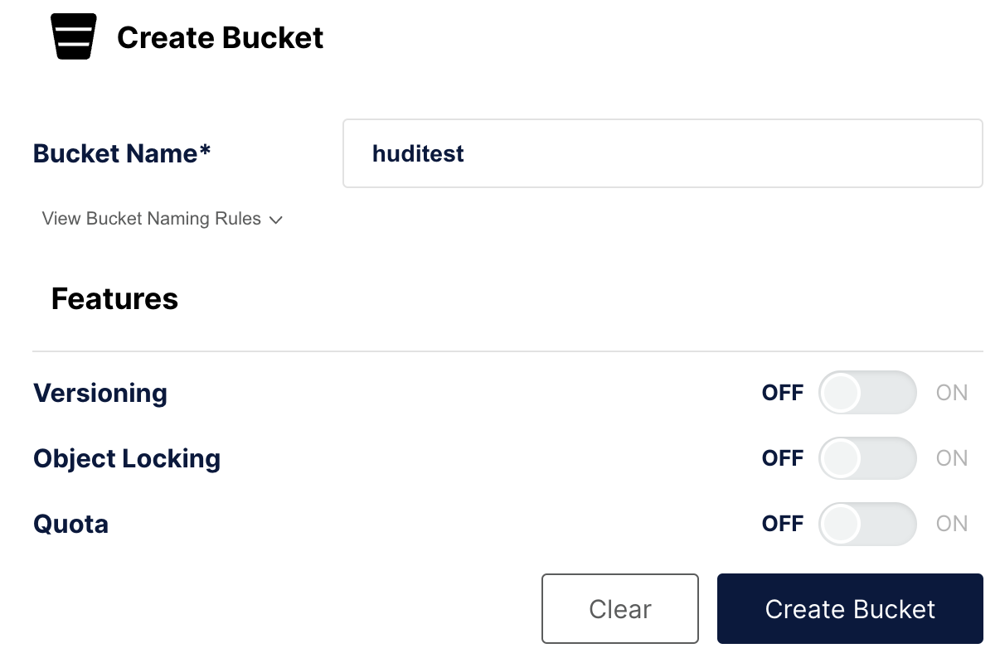

import DataLakeIntro from '../assets/commonMarkdown/datalakeIntro.md'
import Clients from '../assets/quick-start/_clientsCompose.mdx'
import Tabs from '@theme/Tabs';
import TabItem from '@theme/TabItem';

# Data Lakehouse with Apache Hudi


## Prerequisites

### StarRocks `demo` repository

Clone the [StarRocks demo repository](https://github.com/StarRocks/demo/) to your local machine.

All of the steps in this guide will be run from either the `demo/documentation-samples/hudi/` directory in the directory where you cloned the `demo` github repo.

### Docker

- Docker Setup: For Mac, Please follow the steps as defined in [Install Docker Desktop on Mac](https://docs.docker.com/desktop/install/mac-install/). For running Spark-SQL queries, please ensure at least 8 GB memory and 4 CPUs are allocated to Docker (See Docker -> Preferences -> Advanced). Otherwise, spark-SQL queries could be killed because of memory issues.
- 20 GB free disk space assigned to Docker
  
### SQL client

You can use the SQL client provided in the Docker environment, or use one on your system. Many MySQL compatible clients will work, and this guide covers the configuration of DBeaver and MySQL WorkBench.

## Configuration

Change directory into `demo/documentation-samples/hudi` and look at the files:

### `docker-compose.yml`

Starts these services:

#### `starrocks-fe`

#### `starrocks-be`

#### `metastore_db`

#### `hive_metastore`

#### `minio` and `mc`

#### `spark-hudi`

The `spark-hudi` service mounts the files `conf/spark-defaults.conf` and `conf/core-site.xml`

### `conf/core-site.xml`

Use the new plugin to import the file here

### `conf/spark-defaults.conf`

Use the new plugin to import the file here

## Bringing up Demo Cluster

The next step is to run the Docker compose script and setup configs for bringing up the cluster:

```bash
docker compose up --detach --wait --wait-timeout 60
```

```plaintext
[+] Running 8/8
 ✔ Network hudi                     Created                                                   0.0s
 ✔ Container hudi-starrocks-fe-1    Healthy                                                   0.1s
 ✔ Container hudi-minio-1           Healthy                                                   0.1s
 ✔ Container hudi-metastore_db-1    Healthy                                                   0.1s
 ✔ Container hudi-starrocks-be-1    Healthy                                                   0.0s
 ✔ Container hudi-mc-1              Healthy                                                   0.0s
 ✔ Container hudi-hive-metastore-1  Healthy                                                   0.0s
 ✔ Container hudi-spark-hudi-1      Healthy                                                   0.1s
 ``` 

:::tip

With many containers running, `docker ps` output is easier to read if you pipe it to `jq`:

```bash
docker compose ps --format json | jq '{Name: .Names, State: .State, Status: .Status}'
```

```json
{
  "Name": "hudi-hive-metastore-1",
  "State": "running",
  "Status": "Up 3 minutes (healthy)"
}
{
  "Name": "hudi-mc-1",
  "State": "running",
  "Status": "Up 3 minutes"
}
{
  "Name": "hudi-metastore_db-1",
  "State": "running",
  "Status": "Up 3 minutes"
}
{
  "Name": "hudi-minio-1",
  "State": "running",
  "Status": "Up 3 minutes"
}
{
  "Name": "hudi-spark-hudi-1",
  "State": "running",
  "Status": "Up 2 minutes (healthy)"
}
{
  "Name": "hudi-starrocks-be-1",
  "State": "running",
  "Status": "Up 3 minutes (healthy)"
}
{
  "Name": "hudi-starrocks-fe-1",
  "State": "running",
  "Status": "Up 3 minutes (healthy)"
}
```

:::

## Demo

### Configure MinIO

In the configuration files above there is configuration for ??? to interact with Minio. In there the path `huditest` is specified. In this step you will create that path (bucket).

The MinIO console is running on port `9000`. 

#### Authenticate to MinIO

Open a browser to [http://localhost:9000/](http://localhost:9000/) and authenticate. The username and password are specified in `docker-compose.yml`; they are `admin` and `password`.

#### Create a bucket

In the left navigation select **Buckets**, and then **Create Bucket +**. Name the bucket `huditest` and select **Create Bucket**



### Spark commands

:::tip
Run this command, and any other `docker compose` commands, from the directory containing the `docker-compose.yml` file.
:::

1. Open `spark-shell` in the `spark-hudi` service

```
docker compose exec spark-hudi \
  /spark-3.2.1-bin-hadoop3.2/bin/spark-shell
```

:::note
There will be warnings when `spark-shell` starts about illegal reflective access. You can ignore these warnings.
:::

Run these commands at the `scala>` prompt:

```java
import org.apache.spark.sql.functions._
import org.apache.spark.sql.types._
import org.apache.spark.sql.Row
import org.apache.spark.sql.SaveMode._
import org.apache.hudi.DataSourceReadOptions._
import org.apache.hudi.DataSourceWriteOptions._
import org.apache.hudi.config.HoodieWriteConfig._
import scala.collection.JavaConversions._

val schema = StructType( Array(
                 StructField("language", StringType, true),
                 StructField("users", StringType, true),
                 StructField("id", StringType, true)
             ))

val rowData= Seq(Row("Java", "20000", "a"), 
               Row("Python", "100000", "b"), 
               Row("Scala", "3000", "c"))


val df = spark.createDataFrame(rowData,schema)

val tableName = "hudi_coders_hive"
val basePath = "s3a://huditest/hudi_coders"

df.write.format("hudi").
  option(TABLE_NAME, tableName).
  option(RECORDKEY_FIELD_OPT_KEY, "id").
  option(PARTITIONPATH_FIELD_OPT_KEY, "language").
  option(PRECOMBINE_FIELD_OPT_KEY, "users").
  option("hoodie.datasource.write.hive_style_partitioning", "true").
  option("hoodie.datasource.hive_sync.enable", "true").
  option("hoodie.datasource.hive_sync.mode", "hms").
  option("hoodie.datasource.hive_sync.database", "default").
  option("hoodie.datasource.hive_sync.table", tableName).
  option("hoodie.datasource.hive_sync.partition_fields", "language").
  option("hoodie.datasource.hive_sync.partition_extractor_class", "org.apache.hudi.hive.MultiPartKeysValueExtractor").
  option("hoodie.datasource.hive_sync.metastore.uris", "thrift://hive-metastore:9083").
  mode(Overwrite).
  save(basePath)

```

:::note
You will see a warning:
```java
WARN
org.apache.hudi.metadata.HoodieBackedTableMetadata - 
Metadata table was not found at path 
s3a://huditest/hudi_coders/.hoodie/metadata
```

This can be ignored, the file will be created automatically during this `spark-shell` session.

There will also be a warning:

```bash
78184 [main] WARN  org.apache.hadoop.fs.s3a.S3ABlockOutputStream  - 
Application invoked the Syncable API against stream writing to 
hudi_coders/.hoodie/metadata/files/.files-0000_00000000000000.log.1_0-0-0. 
This is unsupported
```

This warning informs you that the log file may not be current in object storage as the file will only be synced when it is closed. See [Stack Overflow](https://stackoverflow.com/a/74886836/10424890).
:::

To exit the spark-shell:

```java
:quit
```

### Configure StarRocks

```bash
docker compose exec starrocks-fe \
  mysql -P 9030 -h 127.0.0.1 -u root --prompt="StarRocks > "
```

```sql
CREATE EXTERNAL CATALOG hudi_catalog_hms
PROPERTIES
(
    "type" = "hudi",
    "hive.metastore.type" = "hive",
    "hive.metastore.uris" = "thrift://hive-metastore:9083",
    "aws.s3.use_instance_profile" = "false",
    "aws.s3.access_key" = "admin",
    "aws.s3.secret_key" = "password",
    "aws.s3.region" = "us-east-1",
    "aws.s3.enable_ssl" = "false",
    "aws.s3.enable_path_style_access" = "true",
    "aws.s3.endpoint" = "http://minio:9000"
);
```

```plaintext
Query OK, 0 rows affected (0.59 sec)
```

```sql
SET CATALOG hudi_catalog_hms;
```

```plaintext
Query OK, 0 rows affected (0.01 sec)
```

```sql
SHOW DATABASES;
```

```plaintext
+--------------------+
| Database           |
+--------------------+
| default            |
| information_schema |
+--------------------+
2 rows in set (0.40 sec)
```

```sql
USE default;
```

```plaintext
Reading table information for completion of table and column names
You can turn off this feature to get a quicker startup with -A

Database changed
```

```sql
show tables;
```

```plaintext
+-------------------+
| Tables_in_default |
+-------------------+
| hudi_coders_hive  |
+-------------------+
1 row in set (0.07 sec)
```

```sql
SELECT * from hudi_coders_hive\G
```

:::tip
Some of the SQL queries in the StarRocks documentation end with `\G` instead
of a semicolon. The `\G` causes the mysql CLI to render the query results vertically.

Many SQL clients do not interpret vertical formatting output, so you should replace `\G` with `;` if you are not using the mysql CLI.
:::

```plaintext
*************************** 1. row ***************************
   _hoodie_commit_time: 20240208165522561
  _hoodie_commit_seqno: 20240208165522561_0_0
    _hoodie_record_key: c
_hoodie_partition_path: language=Scala
     _hoodie_file_name: bb29249a-b69d-4c32-843b-b7142d8dc51c-0_0-27-1221_20240208165522561.parquet
              language: Scala
                 users: 3000
                    id: c
*************************** 2. row ***************************
   _hoodie_commit_time: 20240208165522561
  _hoodie_commit_seqno: 20240208165522561_2_0
    _hoodie_record_key: a
_hoodie_partition_path: language=Java
     _hoodie_file_name: 12fc14aa-7dc4-454c-b710-1ad0556c9386-0_2-27-1223_20240208165522561.parquet
              language: Java
                 users: 20000
                    id: a
*************************** 3. row ***************************
   _hoodie_commit_time: 20240208165522561
  _hoodie_commit_seqno: 20240208165522561_1_0
    _hoodie_record_key: b
_hoodie_partition_path: language=Python
     _hoodie_file_name: 51977039-d71e-4dd6-90d4-0c93656dafcf-0_1-27-1222_20240208165522561.parquet
              language: Python
                 users: 100000
                    id: b
3 rows in set (0.15 sec)
```