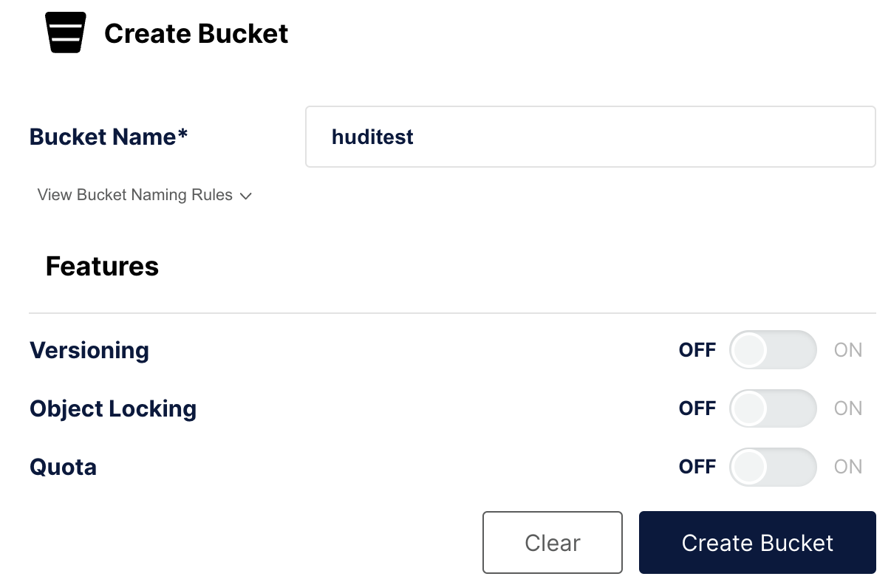

import DataLakeIntro from '../_assets/commonMarkdown/datalakeIntro.md'
import Clients from '../_assets/quick-start/_clientsCompose.mdx'
import Tabs from '@theme/Tabs';
import TabItem from '@theme/TabItem';

# Apache Hudi Lakehouse

## Overview

- Deploy Object Storage, Apache Spark, Hudi, and StarRocks using Docker compose
- Load a tiny dataset into Hudi with Apache Spark
- Configure StarRocks to access the Hive Metastore using an external catalog
- Query the data with StarRocks where the data sits

<DataLakeIntro />

## Prerequisites

### StarRocks `demo` repository

Clone the [StarRocks demo repository](https://github.com/StarRocks/demo/) to your local machine.

All the steps in this guide will be run from the `demo/documentation-samples/hudi/` directory in the directory where you cloned the `demo` GitHub repo.

### Docker

- Docker Setup: For Mac, Please follow the steps as defined in [Install Docker Desktop on Mac](https://docs.docker.com/desktop/install/mac-install/). For running Spark-SQL queries, please ensure at least 5 GB memory and 4 CPUs are allocated to Docker (See Docker → Preferences → Advanced). Otherwise, spark-SQL queries could be killed because of memory issues.
- 20 GB free disk space assigned to Docker
  
### SQL client

You can use the SQL client provided in the Docker environment, or use one on your system. Many MySQL compatible clients will work.

## Configuration

Change directory into `demo/documentation-samples/hudi` and look at the files. This is not a tutorial on Hudi, so not every configuration file will be described; but it is important for the reader to know where to look to see how things are configured. In the `hudi/` directory you will find the `docker-compose.yml` file which is used to launch and configure the services in Docker. Here is a list of those services and a brief description:

### Docker services

| Service                  | Responsibilities                                                    |
|--------------------------|---------------------------------------------------------------------|
| **`starrocks-fe`**       | Metadata management, client connections, query plans and scheduling |
| **`starrocks-be`**       | Running query plans                                                 |
| **`metastore_db`**       | Postgres DB used to store the Hive metadata                         |
| **`hive_metastore`**     | Provides the Apache Hive metastore                                  |
| **`minio`** and **`mc`** | MinIO Object Storage and MinIO command line client                  |
| **`spark-hudi`**         | MinIO Object Storage                                                |

### Configuration files

In the `hudi/conf/` directory you will find configuration files that get mounted in the `spark-hudi`
container.

##### `core-site.xml`

This file contains the object storage related settings. Links for this and other items in More information at the end of this document.

##### `spark-defaults.conf`

Settings for Hive, MinIO, and Spark SQL.

##### `hudi-defaults.conf`

Default file used to silence warnings in the `spark-shell`.

##### `hadoop-metrics2-hbase.properties`

Empty file used to silence warnings in the `spark-shell`.

##### `hadoop-metrics2-s3a-file-system.properties`

Empty file used to silence warnings in the `spark-shell`.

## Bringing up Demo Cluster

This demo system consists of StarRocks, Hudi, MinIO, and Spark services. Run Docker compose to bring up the cluster:

```bash
docker compose up --detach --wait --wait-timeout 60
```

```plaintext
[+] Running 8/8
 ✔ Network hudi                     Created                                                   0.0s
 ✔ Container hudi-starrocks-fe-1    Healthy                                                   0.1s
 ✔ Container hudi-minio-1           Healthy                                                   0.1s
 ✔ Container hudi-metastore_db-1    Healthy                                                   0.1s
 ✔ Container hudi-starrocks-be-1    Healthy                                                   0.0s
 ✔ Container hudi-mc-1              Healthy                                                   0.0s
 ✔ Container hudi-hive-metastore-1  Healthy                                                   0.0s
 ✔ Container hudi-spark-hudi-1      Healthy                                                   0.1s
 ```

:::tip

With many containers running, `docker compose ps` output is easier to read if you pipe it to `jq`:

```bash
docker compose ps --format json | \
jq '{Service: .Service, State: .State, Status: .Status}'
```

```json
{
  "Service": "hive-metastore",
  "State": "running",
  "Status": "Up About a minute (healthy)"
}
{
  "Service": "mc",
  "State": "running",
  "Status": "Up About a minute"
}
{
  "Service": "metastore_db",
  "State": "running",
  "Status": "Up About a minute"
}
{
  "Service": "minio",
  "State": "running",
  "Status": "Up About a minute"
}
{
  "Service": "spark-hudi",
  "State": "running",
  "Status": "Up 33 seconds (healthy)"
}
{
  "Service": "starrocks-be",
  "State": "running",
  "Status": "Up About a minute (healthy)"
}
{
  "Service": "starrocks-fe",
  "State": "running",
  "Status": "Up About a minute (healthy)"
}
```

:::

## Configure MinIO

When you run the Spark commands you will set the basepath for the table being created to an `s3a` URI:

```java
val basePath = "s3a://huditest/hudi_coders"
```

In this step you will create the bucket `huditest` in MinIO. The MinIO console is running on port `9000`.

### Authenticate to MinIO

Open a browser to [http://localhost:9000/](http://localhost:9000/) and authenticate. The username and password are specified in `docker-compose.yml`; they are `admin` and `password`.

### Create a bucket

In the left navigation select **Buckets**, and then **Create Bucket +**. Name the bucket `huditest` and select **Create Bucket**



## Create and populate a table, then sync it to Hive

:::tip

Run this command, and any other `docker compose` commands, from the directory containing the `docker-compose.yml` file.
:::

Open `spark-shell` in the `spark-hudi` service

```bash
docker compose exec spark-hudi spark-shell
```

:::note
There will be warnings when `spark-shell` starts about illegal reflective access. You can ignore these warnings.
:::

Run these commands at the `scala>` prompt to:

- Configure this Spark session to load, process, and write data
- Create a dataframe and write that to a Hudi table
- Sync to the Hive Metastore

```scala
import org.apache.spark.sql.functions._
import org.apache.spark.sql.types._
import org.apache.spark.sql.Row
import org.apache.spark.sql.SaveMode._
import org.apache.hudi.DataSourceReadOptions._
import org.apache.hudi.DataSourceWriteOptions._
import org.apache.hudi.config.HoodieWriteConfig._
import scala.collection.JavaConversions._

val schema = StructType( Array(
                 StructField("language", StringType, true),
                 StructField("users", StringType, true),
                 StructField("id", StringType, true)
             ))

val rowData= Seq(Row("Java", "20000", "a"),
               Row("Python", "100000", "b"),
               Row("Scala", "3000", "c"))


val df = spark.createDataFrame(rowData,schema)

val databaseName = "hudi_sample"
val tableName = "hudi_coders_hive"
val basePath = "s3a://huditest/hudi_coders"

df.write.format("hudi").
  option(org.apache.hudi.config.HoodieWriteConfig.TABLE_NAME, tableName).
  option(RECORDKEY_FIELD_OPT_KEY, "id").
  option(PARTITIONPATH_FIELD_OPT_KEY, "language").
  option(PRECOMBINE_FIELD_OPT_KEY, "users").
  option("hoodie.datasource.write.hive_style_partitioning", "true").
  option("hoodie.datasource.hive_sync.enable", "true").
  option("hoodie.datasource.hive_sync.mode", "hms").
  option("hoodie.datasource.hive_sync.database", databaseName).
  option("hoodie.datasource.hive_sync.table", tableName).
  option("hoodie.datasource.hive_sync.partition_fields", "language").
  option("hoodie.datasource.hive_sync.partition_extractor_class", "org.apache.hudi.hive.MultiPartKeysValueExtractor").
  option("hoodie.datasource.hive_sync.metastore.uris", "thrift://hive-metastore:9083").
  mode(Overwrite).
  save(basePath)
System.exit(0)
```

:::note
You will see a warning:

```java
WARN
org.apache.hudi.metadata.HoodieBackedTableMetadata - 
Metadata table was not found at path 
s3a://huditest/hudi_coders/.hoodie/metadata
```

This can be ignored, the file will be created automatically during this `spark-shell` session.

There will also be a warning:

```bash
78184 [main] WARN  org.apache.hadoop.fs.s3a.S3ABlockOutputStream  - 
Application invoked the Syncable API against stream writing to 
hudi_coders/.hoodie/metadata/files/.files-0000_00000000000000.log.1_0-0-0. 
This is unsupported
```

This warning informs you that syncing a log file that is open for writes is not supported when using object storage. The file will only be synced when it is closed. See [Stack Overflow](https://stackoverflow.com/a/74886836/10424890).
:::

The final command in the above spark-shell session should exit the container, if it doesn't press enter and it will exit.

## Configure StarRocks

### Connect to StarRocks

Connect to StarRocks with the provided MySQL client provided by the `starrocks-fe` service, or use your favorite SQL client and configure it to connect using the MySQL protocol on `localhost:9030`.

```bash
docker compose exec starrocks-fe \
  mysql -P 9030 -h 127.0.0.1 -u root --prompt="StarRocks > "
```

### Create the linkage between StarRocks and Hudi

There is a link at the end of this guide with more information on external catalogs. The external catalog created in this step acts as the linkage to the Hive Metastore (HMS) running in Docker.

```sql
CREATE EXTERNAL CATALOG hudi_catalog_hms
PROPERTIES
(
    "type" = "hudi",
    "hive.metastore.type" = "hive",
    "hive.metastore.uris" = "thrift://hive-metastore:9083",
    "aws.s3.use_instance_profile" = "false",
    "aws.s3.access_key" = "admin",
    "aws.s3.secret_key" = "password",
    "aws.s3.enable_ssl" = "false",
    "aws.s3.enable_path_style_access" = "true",
    "aws.s3.endpoint" = "http://minio:9000"
);
```

```plaintext
Query OK, 0 rows affected (0.59 sec)
```

### Use the new catalog

```sql
SET CATALOG hudi_catalog_hms;
```

```plaintext
Query OK, 0 rows affected (0.01 sec)
```

### Navigate to the data inserted with Spark

```sql
SHOW DATABASES;
```

```plaintext
+--------------------+
| Database           |
+--------------------+
| default            |
| hudi_sample        |
| information_schema |
+--------------------+
2 rows in set (0.40 sec)
```

```sql
USE hudi_sample;
```

```plaintext
Reading table information for completion of table and column names
You can turn off this feature to get a quicker startup with -A

Database changed
```

```sql
SHOW TABLES;
```

```plaintext
+-----------------------+
| Tables_in_hudi_sample |
+-----------------------+
| hudi_coders_hive      |
+-----------------------+
1 row in set (0.07 sec)
```

### Query the data in Hudi with StarRocks

Run this query twice, the first time may take around five seconds to complete as data is not yet cached in StarRocks. The second query will be very quick.

```sql
SELECT * from hudi_coders_hive\G
```

:::tip
Some of the SQL queries in the StarRocks documentation end with `\G` instead
of a semicolon. The `\G` causes the mysql CLI to render the query results vertically.

Many SQL clients do not interpret vertical formatting output, so you should replace `\G` with `;` if you are not using the mysql CLI.
:::

```plaintext
*************************** 1. row ***************************
   _hoodie_commit_time: 20240208165522561
  _hoodie_commit_seqno: 20240208165522561_0_0
    _hoodie_record_key: c
_hoodie_partition_path: language=Scala
     _hoodie_file_name: bb29249a-b69d-4c32-843b-b7142d8dc51c-0_0-27-1221_20240208165522561.parquet
              language: Scala
                 users: 3000
                    id: c
*************************** 2. row ***************************
   _hoodie_commit_time: 20240208165522561
  _hoodie_commit_seqno: 20240208165522561_2_0
    _hoodie_record_key: a
_hoodie_partition_path: language=Java
     _hoodie_file_name: 12fc14aa-7dc4-454c-b710-1ad0556c9386-0_2-27-1223_20240208165522561.parquet
              language: Java
                 users: 20000
                    id: a
*************************** 3. row ***************************
   _hoodie_commit_time: 20240208165522561
  _hoodie_commit_seqno: 20240208165522561_1_0
    _hoodie_record_key: b
_hoodie_partition_path: language=Python
     _hoodie_file_name: 51977039-d71e-4dd6-90d4-0c93656dafcf-0_1-27-1222_20240208165522561.parquet
              language: Python
                 users: 100000
                    id: b
3 rows in set (0.15 sec)
```

## Summary

This tutorial exposed you to the use of a StarRocks external catalog to show you that you can query your data where it sits using the Hudi external catalog. Many other integrations are available using Iceberg, Delta Lake, and JDBC catalogs.

In this tutorial you:

- Deployed StarRocks and a Hudi/Spark/MinIO environment in Docker
- Loaded a tiny dataset into Hudi with Apache Spark
- Configured a StarRocks external catalog to provide access to the Hudi catalog
- Queried the data with SQL in StarRocks without copying the data from the data lake

## More information

[StarRocks Catalogs](../data_source/catalog/catalog_overview.md)

[Apache Hudi quickstart](https://hudi.apache.org/docs/quick-start-guide/) (includes Spark)

[Apache Hudi S3 configuration](https://hudi.apache.org/docs/s3_hoodie/)

[Apache Spark configuration docs](https://spark.apache.org/docs/latest/configuration.html)
