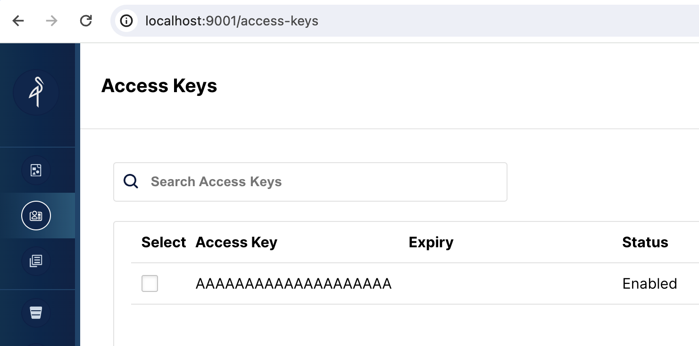

# Loading with Redpanda to StarRocks using shared-data storage

import Clients from '../assets/quick-start/_clientsCompose.mdx'
import SQL from '../assets/quick-start/_SQL.mdx'

## About Routine Load

Routine load is a method using Apache Kafka, or in this lab, Redpanda, to continuously stream data into StarRocks. The data is streamed into a Kafka topic, and a Routine Load job consumes the data into StarRocks. More details on Routine Load are provided at the end of the lab.

## About shared-data

In systems that separate storage from compute data is stored in low-cost reliable remote storage systems such as Amazon S3, Google Cloud Storage, Azure Blob Storage, and other S3-compatible storage like MinIO. Hot data is cached locally and When the cache is hit, the query performance is comparable to that of storage-compute coupled architecture. Compute nodes (CN) can be added or removed on demand within seconds. This architecture reduces storage costs, ensures better resource isolation, and provides elasticity and scalability.

This tutorial covers:

- Running StarRocks, Redpanda, and MinIO with Docker Compose
- Using MinIO as the StarRocks storage layer
- Configuring StarRocks for shared-data
- Adding a Routine Load job to consume data from Redpanda

The data used is synthetic.

There is a lot of information in this document, and it is presented with step-by-step content at the beginning, and the technical details at the end. This is done to serve these purposes in this order:

1. Configure Routine Load.
2. Allow the reader to load data in a shared-data deployment and analyze that data.
3. Provide the configuration details for shared-data deployments.

---

## Prerequisites

### Docker

- [Docker](https://docs.docker.com/engine/install/)
- 4 GB RAM assigned to Docker
- 10 GB free disk space assigned to Docker

### SQL client

You can use the SQL client provided in the Docker environment, or use one on your system. Many MySQL-compatible clients will work, and this guide covers the configuration of DBeaver and MySQL WorkBench.

### curl

`curl` is used to download the Compose file and script to generate the data. Check to see if you have it installed by running `curl` or `curl.exe` at your OS prompt. If curl is not installed, [get curl here](https://curl.se/dlwiz/?type=bin).

### Python

Python 3 and the Python client for Apache Kafka, `kafka-python`, are required.

- [Python](https://www.python.org/)
- [`kafka-python`](https://pypi.org/project/kafka-python/)

---

## Terminology

### FE

Frontend nodes are responsible for metadata management, client connection management, query planning, and query scheduling. Each FE stores and maintains a complete copy of metadata in its memory, which guarantees indiscriminate services among the FEs.

### CN

Compute Nodes are responsible for executing query plans in shared-data deployments.

### BE

Backend nodes are responsible for both data storage and executing query plans in shared-nothing deployments.

:::note
This guide does not use BEs, this information is included here so that you understand the difference between BEs and CNs.
:::

---

## Launch StarRocks

To run StarRocks with shared-data using Object Storage we need:

- A frontend engine (FE)
- A compute node (CN)
- Object Storage

This guide uses MinIO, which is S3 compatible Object Storage provider. MinIO is provided under the GNU Affero General Public License.

### Download the lab files

#### `docker-compose.yml`

```bash
mkdir routineload
cd routineload
curl -O https://raw.githubusercontent.com/StarRocks/demo/master/documentation-samples/routine-load-shared-data/docker-compose.yml
```

#### `gen.py`

`gen.py` is a script that uses the Python client for Apache Kafka to publish (produce) data to a Kafka topic. The script has been written with the address and port of the Redpanda container.

```bash
curl -O https://raw.githubusercontent.com/StarRocks/demo/master/documentation-samples/routine-load-shared-data/gen.py
```

## Start StarRocks, MinIO, and Redpanda

```bash
docker compose up --detach --wait --wait-timeout 120
```

Check the progress of the services. It should take around 30 seconds for the FE and CN to become healthy. The MinIO container will not show a health indicator, but you will be using the MinIO web UI and that will verify its health.

Run `docker compose ps` until MinIO, the FE, and the CN services show a status of `healthy`:

```bash
docker compose ps
```

```plaintext
WARN[0000] /Users/droscign/routineload/docker-compose.yml: `version` is obsolete
[+] Running 6/7
 ✔ Network routineload_default       Crea...          0.0s
 ✔ Container minio                   Healthy          5.6s
 ✔ Container redpanda                Healthy          3.6s
 ✔ Container redpanda-console        Healt...         1.1s
 ⠧ Container routineload-minio_mc-1  Waiting          23.1s
 ✔ Container starrocks-fe            Healthy          11.1s
 ✔ Container starrocks-cn            Healthy          23.0s
container routineload-minio_mc-1 exited (0)
```

---

## Examine MinIO credentials

In order to use MinIO for Object Storage with StarRocks, StarRocks needs a MinIO access key. The access key was generated during the startup of the Docker services. To help you better understand the way that StarRocks connects to MinIO you should verify that the key exists.

### Open the MinIO web UI

Browse to http://localhost:9001/access-keys The username and password are specified in the Docker compose file, and are `miniouser` and `miniopassword`. You should see that there is one access key. The Key is `AAAAAAAAAAAAAAAAAAAA`, you cannot see the secret in the MinIO Console, but it is in the Docker compose file and is `BBBBBBBBBBBBBBBBBBBBBBBBBBBBBBBBBBBBBBBB`:



---

## SQL Clients

<Clients />

---


---

## StarRocks configuration for shared-data

At this point you have StarRocks, Redpanda, and MinIO running. A MinIO access key is used to connect StarRocks and Minio. When StarRocks started up, it established the connection with MinIO and created the default storage volume in MinIO.

This is the configuration used to set the default storage volume to use MinIO (this is also in the Docker compose file). The configuration will be described in detail at the end of this guide, for now just note that the `aws_s3_access_key` is set to the string that you saw in the MinIO Console and that the `run_mode` is set to `shared_data`.

```bash
docker compose exec starrocks-fe cat fe/conf/fe.conf
```

:::tip

Run all `docker compose` commands from the directory containing the `docker-compose.yml` file.

:::

```plaintext
#highlight-start
# enable shared data, set storage type, set endpoint
run_mode = shared_data
#highlight-end
cloud_native_storage_type = S3
aws_s3_endpoint = minio:9000

# set the path in MinIO
aws_s3_path = starrocks

#highlight-start
# credentials for MinIO object read/write
aws_s3_access_key = AAAAAAAAAAAAAAAAAAAA
aws_s3_secret_key = BBBBBBBBBBBBBBBBBBBBBBBBBBBBBBBBBBBBBBBB
#highlight-end
aws_s3_use_instance_profile = false
aws_s3_use_aws_sdk_default_behavior = false

# Set this to false if you do not want default
# storage created in the object storage using
# the details provided above
enable_load_volume_from_conf = true
```

### Connect to StarRocks with a SQL client

:::tip

Run this command from the directory containing the `docker-compose.yml` file.

If you are using a client other than the mysql CLI, open that now.
:::

```sql
docker compose exec starrocks-fe \
mysql -P9030 -h127.0.0.1 -uroot --prompt="StarRocks > "
```

#### Examine the storage volume

```sql
SHOW STORAGE VOLUMES;
```

```plaintext
+------------------------+
| Storage Volume         |
+------------------------+
| builtin_storage_volume |
+------------------------+
1 row in set (0.00 sec)
```

```sql
DESC STORAGE VOLUME builtin_storage_volume\G
```

:::tip
Some of the SQL in this document, and many other documents in the StarRocks documentation, and with `\G` instead
of a semicolon. The `\G` causes the mysql CLI to render the query results vertically.

Many SQL clients do not interpret vertical formatting output, so you should replace `\G` with `;`.
:::

```plaintext
*************************** 1. row ***************************
     Name: builtin_storage_volume
     Type: S3
IsDefault: true
#highlight-start
 Location: s3://starrocks
   Params: {"aws.s3.access_key":"******","aws.s3.secret_key":"******","aws.s3.endpoint":"minio:9000","aws.s3.region":"","aws.s3.use_instance_profile":"false","aws.s3.use_aws_sdk_default_behavior":"false"}
#highlight-end
  Enabled: true
  Comment:
1 row in set (0.03 sec)
```

Verify that the parameters match the configuration.

:::note
The folder `builtin_storage_volume` will not be visible in the MinIO object list until data is written to the bucket.
:::

---

## Create a table

These SQL commands are run in your SQL client.

```SQL
CREATE DATABASE quickstart;
```

```SQL
USE quickstart;
```

```SQL
CREATE TABLE site_clicks (
    `uid` bigint NOT NULL COMMENT "uid",
    `site` string NOT NULL COMMENT "site url",
    `vtime` bigint NOT NULL COMMENT "vtime"
)
DISTRIBUTED BY HASH(`uid`)
PROPERTIES("replication_num"="1");
```


---


### Open the Redpanda Console

There will be no topics yet, a topic will be created in the next step.

`http://localhost:8080/overview`

### Publish data to a Redpanda topic

From a command shell in the `routineload/` folder run this command to generate data:

:::tip

On your system, you might need to use `python3` in place of `python` in the command.

:::

```python
python gen.py 5
```

```plaintext
b'{ "uid": 6926, "site": "https://docs.starrocks.io/", "vtime": 1718034793 } '
b'{ "uid": 3303, "site": "https://www.starrocks.io/product/community", "vtime": 1718034793 } '
b'{ "uid": 227, "site": "https://docs.starrocks.io/", "vtime": 1718034243 } '
b'{ "uid": 7273, "site": "https://docs.starrocks.io/", "vtime": 1718034794 } '
b'{ "uid": 4666, "site": "https://www.starrocks.io/", "vtime": 1718034794 } '
```

### Verify in the Redpanda Console

Navigate to `http://localhost:8080/topics` in the Redpanda Console, and you will see one topic named `test2`. Select that topic and you will see five messages matching the output of `gen.py`.

## Verify in StarRocks

### Create a Routine Load job

```SQL
CREATE ROUTINE LOAD quickstart.clicks ON site_clicks
PROPERTIES
(
    "format" = "json",
    "jsonpaths" ="[\"$.uid\",\"$.site\",\"$.vtime\"]"
)
FROM KAFKA
(     
    "kafka_broker_list" = "redpanda:29092",
    "kafka_topic" = "test2",
    "kafka_offsets" = "OFFSET_BEGINNING",
    "kafka_partitions" = "0" 
);
```

### Verify the Routine Load job

```SQL
SHOW ROUTINE LOAD\G
```

Verify the three highlighted lines:

1. The state should be `RUNNING`
2. The topic should be `test2` and the broker should be `redpanda:2092`
3. The statistics should show either 0 or 5 loaded rows depending on how soon you ran the `SHOW ROUTINE LOAD` command. If there are 0 loaded rows run it again.

```SQL
*************************** 1. row ***************************
                  Id: 10078
                Name: clicks
          CreateTime: 2024-06-12 15:51:12
           PauseTime: NULL
             EndTime: NULL
              DbName: quickstart
           TableName: site_clicks
           -- highlight-next-line
               State: RUNNING
      DataSourceType: KAFKA
      CurrentTaskNum: 1
       JobProperties: {"partitions":"*","partial_update":"false","columnToColumnExpr":"*","maxBatchIntervalS":"10","partial_update_mode":"null","whereExpr":"*","dataFormat":"json","timezone":"Etc/UTC","format":"json","log_rejected_record_num":"0","taskTimeoutSecond":"60","json_root":"","maxFilterRatio":"1.0","strict_mode":"false","jsonpaths":"[\"$.uid\",\"$.site\",\"$.vtime\"]","taskConsumeSecond":"15","desireTaskConcurrentNum":"5","maxErrorNum":"0","strip_outer_array":"false","currentTaskConcurrentNum":"1","maxBatchRows":"200000"}
       -- highlight-next-line
DataSourceProperties: {"topic":"test2","currentKafkaPartitions":"0","brokerList":"redpanda:29092"}
    CustomProperties: {"group.id":"clicks_ea38a713-5a0f-4abe-9b11-ff4a241ccbbd"}
    -- highlight-next-line
           Statistic: {"receivedBytes":0,"errorRows":0,"committedTaskNum":0,"loadedRows":0,"loadRowsRate":0,"abortedTaskNum":0,"totalRows":0,"unselectedRows":0,"receivedBytesRate":0,"taskExecuteTimeMs":1}
            Progress: {"0":"OFFSET_ZERO"}
   TimestampProgress: {}
ReasonOfStateChanged:
        ErrorLogUrls:
         TrackingSQL:
            OtherMsg:
LatestSourcePosition: {}
1 row in set (0.00 sec)
```

```SQL
SHOW ROUTINE LOAD\G
```

```SQL
*************************** 1. row ***************************
                  Id: 10075
                Name: example_tbl2_test2
          CreateTime: 2024-06-10 15:53:30
           PauseTime: NULL
             EndTime: NULL
              DbName: quickstart
           TableName: site_clicks
               State: RUNNING
      DataSourceType: KAFKA
      CurrentTaskNum: 1
       JobProperties: {"partitions":"*","partial_update":"false","columnToColumnExpr":"*","maxBatchIntervalS":"10","partial_update_mode":"null","whereExpr":"*","dataFormat":"json","timezone":"Etc/UTC","format":"json","log_rejected_record_num":"0","taskTimeoutSecond":"60","json_root":"","maxFilterRatio":"1.0","strict_mode":"false","jsonpaths":"[\"$.uid\",\"$.site\",\"$.vtime\"]","taskConsumeSecond":"15","desireTaskConcurrentNum":"5","maxErrorNum":"0","strip_outer_array":"false","currentTaskConcurrentNum":"1","maxBatchRows":"200000"}
DataSourceProperties: {"topic":"test2","currentKafkaPartitions":"0","brokerList":"redpanda:29092"}
    CustomProperties: {"group.id":"example_tbl2_test2_9ce0e896-a17f-43ff-86e1-5e413c7baabf"}
    -- highlight-next-line
           Statistic: {"receivedBytes":392,"errorRows":0,"committedTaskNum":1,"loadedRows":5,"loadRowsRate":0,"abortedTaskNum":0,"totalRows":5,"unselectedRows":0,"receivedBytesRate":0,"taskExecuteTimeMs":535}
            Progress: {"0":"9"}
   TimestampProgress: {"0":"1718034896098"}
ReasonOfStateChanged:
        ErrorLogUrls:
         TrackingSQL:
            OtherMsg: [2024-06-10 16:08:02] [task id: cbd7a02a-1a94-4fab-b5fe-e6dffda8861a] [txn id: -1] there is no new data in kafka, wait for 10 seconds to schedule again
LatestSourcePosition: {"0":"10"}
1 row in set (0.01 sec)
```

### Notes on the Routine Load command

---

## Verify that data is stored in MinIO

Open MinIO [http://localhost:9001/browser/](http://localhost:9001/browser/) and verify that there are objects stored under `starrocks`.

---

## Simple query

```SQL
USE quickstart;
SELECT * FROM site_clicks;
```

```SQL
+------+--------------------------------------------+------------+
| uid  | site                                       | vtime      |
+------+--------------------------------------------+------------+
| 4607 | https://www.starrocks.io/blog              | 1718031441 |
| 1575 | https://www.starrocks.io/                  | 1718031523 |
| 2398 | https://docs.starrocks.io/                 | 1718033630 |
| 3741 | https://www.starrocks.io/product/community | 1718030845 |
| 4792 | https://www.starrocks.io/                  | 1718033413 |
+------+--------------------------------------------+------------+
5 rows in set (0.07 sec)
```

## Publish additional data

Running `gen.py` again will publish another five records to Redpanda.

```bash
python gen.py 5
```

### Verify that data is added

Since the Routine Load job runs on a schedule (every 10 seconds by default), the data will be loaded within a few seconds.

```SQL
SELECT * FROM site_clicks;
````

```
+------+--------------------------------------------+------------+
| uid  | site                                       | vtime      |
+------+--------------------------------------------+------------+
| 6648 | https://www.starrocks.io/blog              | 1718205970 |
| 7914 | https://www.starrocks.io/                  | 1718206760 |
| 9854 | https://www.starrocks.io/blog              | 1718205676 |
| 1186 | https://www.starrocks.io/                  | 1718209083 |
| 3305 | https://docs.starrocks.io/                 | 1718209083 |
| 2288 | https://www.starrocks.io/blog              | 1718206759 |
| 7879 | https://www.starrocks.io/product/community | 1718204280 |
| 2666 | https://www.starrocks.io/                  | 1718208842 |
| 5801 | https://www.starrocks.io/                  | 1718208783 |
| 8409 | https://www.starrocks.io/                  | 1718206889 |
+------+--------------------------------------------+------------+
10 rows in set (0.02 sec)
```

---

## Configuration details

Now that you have experienced using StarRocks with shared-data it is important to understand the configuration. 

### CN configuration

The CN configuration used here is the default, as the CN is designed for shared-data use. The default configuration is shown below. You do not need to make any changes.

```bash
sys_log_level = INFO

# ports for admin, web, heartbeat service
be_port = 9060
be_http_port = 8040
heartbeat_service_port = 9050
brpc_port = 8060
starlet_port = 9070
```

### FE configuration

The FE configuration is slightly different from the default as the FE must be configured to expect that data is stored in Object Storage rather than on local disks on BE nodes.

The `docker-compose.yml` file generates the FE configuration in the `command`.

```plaintext
# enable shared data, set storage type, set endpoint
run_mode = shared_data
cloud_native_storage_type = S3
aws_s3_endpoint = minio:9000

# set the path in MinIO
aws_s3_path = starrocks

# credentials for MinIO object read/write
aws_s3_access_key = AAAAAAAAAAAAAAAAAAAA
aws_s3_secret_key = BBBBBBBBBBBBBBBBBBBBBBBBBBBBBBBBBBBBBBBB
aws_s3_use_instance_profile = false
aws_s3_use_aws_sdk_default_behavior = false

# Set this to false if you do not want default
# storage created in the object storage using
# the details provided above
enable_load_volume_from_conf = true
```

:::note
This config file does not contain the default entries for an FE, only the shared-data configuration is shown.
:::

The non-default FE configuration settings:

:::note
Many configuration parameters are prefixed with `s3_`. This prefix is used for all Amazon S3 compatible storage types (for example: S3, GCS, and MinIO). When using Azure Blob Storage the prefix is `azure_`.
:::

#### `run_mode=shared_data`

This enables shared-data use.

#### `cloud_native_storage_type=S3`

This specifies whether S3 compatible storage or Azure Blob Storage is used. For MinIO this is always S3.

#### `aws_s3_endpoint=minio:9000`

The MinIO endpoint, including port number.

#### `aws_s3_path=starrocks`

The bucket name.

#### `aws_s3_access_key=AA`

The MinIO access key.

#### `aws_s3_secret_key=BB`

The MinIO access key secret.

#### `aws_s3_use_instance_profile=false`

When using MinIO an access key is used, and so instance profiles are not used with MinIO.

#### `aws_s3_use_aws_sdk_default_behavior=false`

When using MinIO this parameter is always set to false.

#### `enable_load_volume_from_conf=true`

When this is true, a StarRocks storage volume named `builtin_storage_volume` is created using MinIO object storage, and it is set to be the default storage volume for the tables that you create.

---

## Summary

In this tutorial you:

- Deployed StarRocks, Reedpanda, and Minio in Docker
- Created a Routine Load job to consume data from a Kafka topic
- Learned how to configure a StarRocks Storage Volume that uses MinIO

## More information

[StarRocks Architecture](../introduction/Architecture.md)

[Routine Load](../loading/RoutineLoad.md)