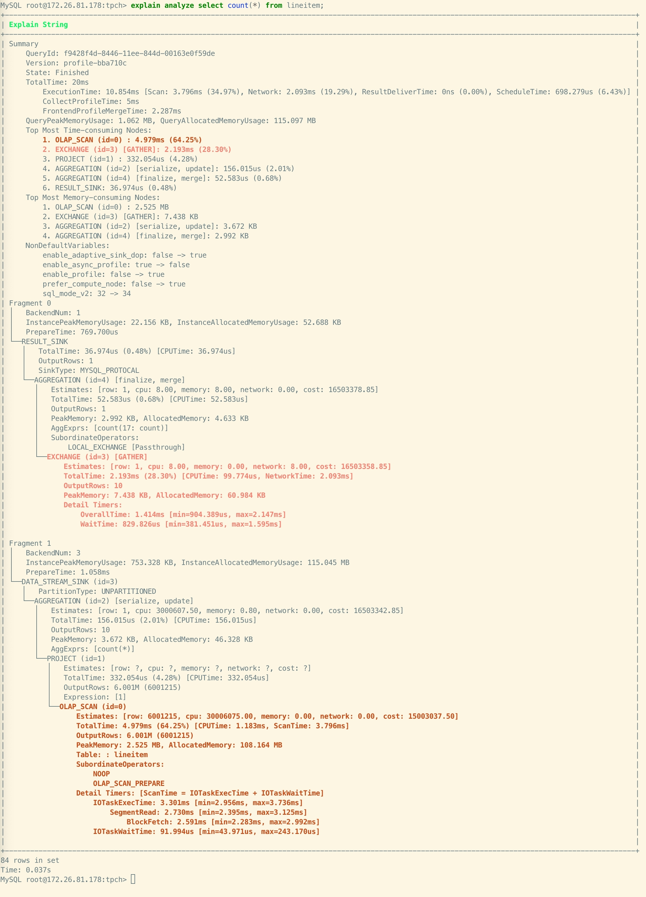
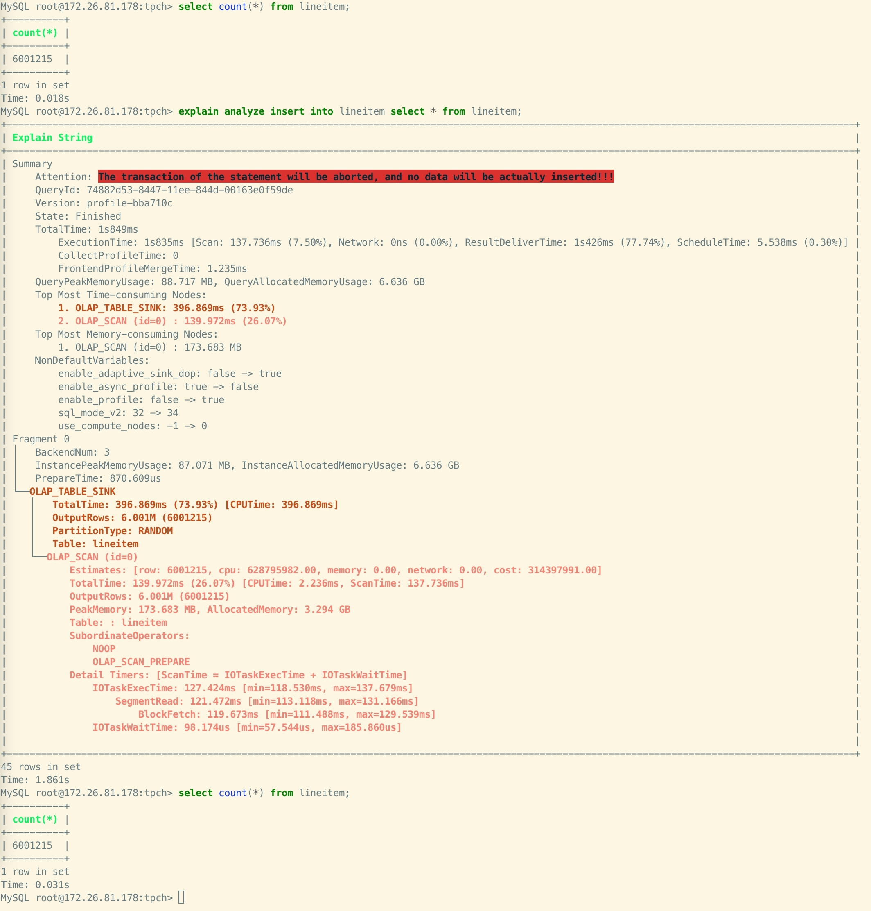

# EXPLAIN ANALYZE

## Description

Executes the specified SQL statement, and shows the query profile of this statement. For more information about query profile, see [Query Profile Overview](../../../administration/query_profile_overview.md).

This feature is supported from v3.1 onwards.

> **CAUTION**
>
> Only users with the SELECT or INSERT privilege on a specific table can perform this operation.

## Syntax

```SQL
EXPLAIN ANALYZE <statement>
```

## Parameters

`statement`: the SQL statement of which to show the query profile. Both [SELECT](../data-manipulation/SELECT.md) and [INSERT INTO](../data-manipulation/INSERT.md) are supported.

## Usage notes

Please note that when you analyze the profiles of an INSERT INTO statement, no data will actually be inserted. By default, the transaction is aborted, ensuring that no unintended changes are made to the data in the process of profile analysis.

## Examples

Example 1: Simulate and analyze a SELECT statement. The query result are discarded.



Example 2: Simulate and analyze an INSERT INTO statement. The loading transaction will be aborted.



## Relevant SQLs

- [SHOW PROFILELIST](./SHOW_PROFILELIST.md)
- [ANALYZE PROFILE](./EXPLAIN_ANALYZE.md)
