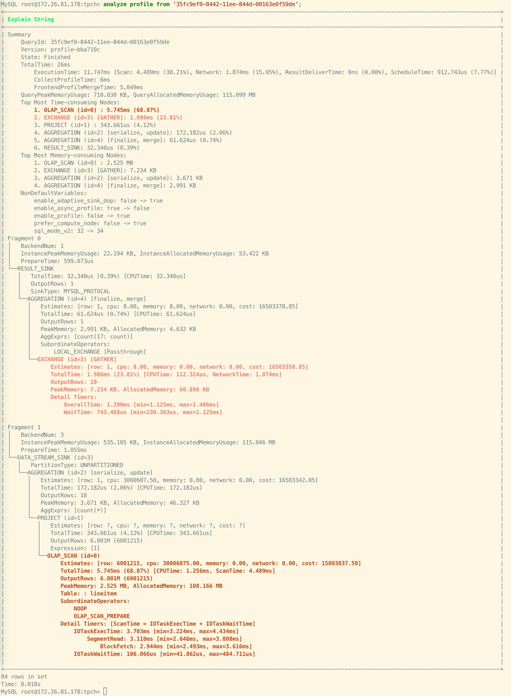

# ANALYZE PROFILE

## Description

Analyzes a specific query profile on a per-fragment basis, and displays it in a tree structure. For more information about query profile, see [Query Profile Overview](../../../../administration/query_profile_overview.md).

This feature is supported from v3.1 onwards.

> **CAUTION**
>
> Only users with the SELECT privilege on a specific table can perform this operation.

## Syntax

```SQL
ANALYZE PROFILE FROM '<query_id>', [<plan_node_id>[, ...] ]
```

## Parameters

| **Parameter** | **Description**                                              |
| ------------- | ------------------------------------------------------------ |
| query_id      | The ID of the query. You can obtain it using [SHOW PROFILELIST](./SHOW_PROFILELIST.md). |
| plan_node_id  | The ID of the plan node in the profile. You can specify this parameter to view the detailed metrics of the corresponding plan node(s). If this parameter is not specified, only the summary metrics of all plan nodes are displayed. |

## Examples

Example 1: Querying the Query Profile without specifying node ID.



Example 2: Querying the Query Profile and specifying node ID as `0`. StarRocks returns all detailed metrics for Node ID `0` and highlights metrics with high usage for easier problem identification.


## Relevant SQLs

- [SHOW PROFILELIST](./SHOW_PROFILELIST.md)
- [EXPLAIN ANALYZE](./EXPLAIN_ANALYZE.md)
