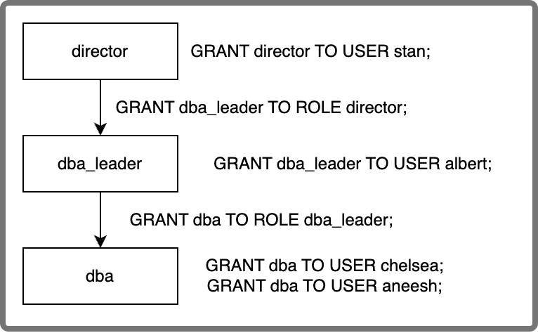

# role_edges

You can view the grantees of roles by querying the view `role_edges`.

:::note

By default, only users or roles with the `user_admin` role can access this view. You can grant other users the SELECT privilege on this view using [GRANT](../../sql-reference/sql-statements/account-management/GRANT.md).

:::

The following fields are provided in `role_edges`:

| **Field** | **Description**                                              |
| --------- | ------------------------------------------------------------ |
| FROM_ROLE | The role that is granted. Multiple records with the same `FROM_ROLE` can be returned because a role can be granted to multiple roles and users. |
| TO_ROLE   | The role to whom the current `FROM_ROLE` is granted. `NULL` is returned if the current `FROM_ROLE` is granted to a user. |
| TO_USER   | The user to whom the current `FROM_ROLE` is granted. `NULL` is returned if the current `FROM_ROLE` is granted to a role. |

Example:

```Plain
MySQL > SELECT * FROM sys.role_edges;
+------------+------------+---------------+
| FROM_ROLE  | TO_ROLE    | TO_USER       |
+------------+------------+---------------+
| dba_leader | director   | NULL          |
| dba        | dba_leader | NULL          |
| dba        | NULL       | 'aneesh'@'%'  |
| dba        | NULL       | 'chelsea'@'%' |
| dba_leader | NULL       | 'albert'@'%'  |
| director   | NULL       | 'stan'@'%'    |
| root       | NULL       | 'root'@'%'    |
+------------+------------+---------------+
```

The following diagram illustrates the nesting relation of the granted roles in the preceding example:

