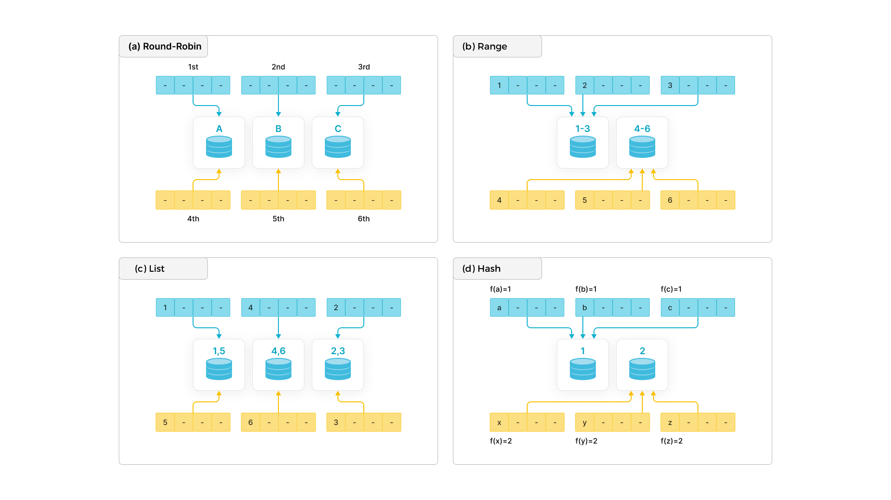

# Data distribution

When you create a table, you must specify the data distribution method by configuring the number of partitions and the number of tablets in a table. An appropriate data distribution method helps evenly distribute data across the nodes of your StarRocks cluster, reduces table scans, makes full use of the concurrency of the cluster, thereby improving query performance.

## Basic concepts

Before you dive into the details of designing and managing data distribution, familiarize yourself with the following concepts:

- Partitioning

  Partitioning divides a table into multiple segments called partitions based on the partitioning column you specified. You can set a storage strategy for partitions, including the number of replicas, strategy of storing hot or cold data, and storage medium. StarRocks allows you to use multiple storage mediums within a cluster. For example, you can store the latest data on solid-state drives (SSD) to improve query performance, and historical data on SATA hard drives to reduce storage costs.

- Bucketing

  Bucketing divides a partition into multiple more manageable parts called tablets, which is the smallest unit of storage that you can use and allocate. StarRocks uses a hash algorithm to bucket data. Data with the same hash value of the bucketing column is distributed to the same tablet. StarRocks creates multiple replicas (three by default) for each tablet to prevent data loss. These replicas are managed by a separate local storage engine. You must specify the bucketing column when you create a table.

## Partitioning methods

Modern distributed database systems generally use four basic partitioning methods: round-robin, range, list, and hash.



- **Round-robin**: distributes data across different nodes in a cyclic.
- **Range**: distributes data across different nodes based on the value range of partitioning columns.
- **List**: distributes data across different nodes based on the discrete values of partitioning columns, such as age.
- **Hash**: distributes data across different nodes based on a hash algorithm.

To achieve more flexible data distribution, you can combine the preceding four partitioning methods based on your business requirements, such as hash-hash, range-hash, and hash-list. **StarRocks offers the following two partitioning methods:**

- **Hash**: A hash-partitioned table has only one partition (the entire table is considered a partition). The partition is divided into tablets based on the bucketing column and the number of tablets that you specified.

  For example, the following statement creates a table `site_access`. The table is divided into 10 tablets based on the `site_id` column.

  ```SQL
  CREATE TABLE site_access(
      site_id INT DEFAULT '10',
      city_code SMALLINT,
      user_name VARCHAR(32) DEFAULT '',
      pv BIGINT SUM DEFAULT '0'
  )
  AGGREGATE KEY(site_id, city_code, user_name)
  DISTRIBUTED BY HASH(site_id) BUCKETS 10;
  ```

- **Range-hash**: A range-hash partitioned table divides data into multiple partitions based on the partitioning column. Each partition is further divided into tablets based on the bucketing column and the number of tablets that you specified.

  For example, the following statement creates a table `site_access` that is partitioned by the `event_day` column. The table contains 3 partitions: `p1`, `p2`, and `p3`. Each partition is divided into 10 tablets based on the `site_id` column.

  ```SQL
  CREATE TABLE site_access(
      event_day DATE,
      site_id INT DEFAULT '10',
      city_code VARCHAR(100),
      user_name VARCHAR(32) DEFAULT '',
      pv BIGINT SUM DEFAULT '0'
  )
  AGGREGATE KEY(event_day, site_id, city_code, user_name)
  PARTITION BY RANGE(event_day)
  (
      PARTITION p1 VALUES LESS THAN ("2020-01-31"),
      PARTITION p2 VALUES LESS THAN ("2020-02-29"),
      PARTITION p3 VALUES LESS THAN ("2020-03-31")
  )
  DISTRIBUTED BY HASH(site_id) BUCKETS 10;
  ```

## Design partitioning and bucketing rules

Before you partition a table, determine the partitioning column, bucketing column, and the number of tablets.

### Choose partitioning columns

Data in a partitioned table is divided based on partitioning columns, also called partition keys. Generally, date or area is used as the partitioning column. In StarRocks, only the column of the DATE, DATETIME or INT type can be used as the partitioning column. We recommend that you follow the suggestions below to decide the partitioning column:

- The column with low cardinality.
- The column that is often used as a filter in queries.
- The amount of data in each partition must be less than 100 GB.

### Choose bucketing columns

Data in a partition is divided into multiple tablets based on bucketing columns. We recommend that you follow the suggestions below to decide the bucketing column:

- The column with high cardinality such as ID.
- The column that is often used as a filter in queries.

If partition data cannot be evenly distributed into each tablet by using one bucketing column, you can choose multiple bucketing columns. You can decide on the number of bucketing columns based on the following scenarios:

- One bucketing column: This method can reduce data transmission between nodes. It improves the performance of short-running query because short-running query only runs on one server and scan a small amount of data.
- Multiple bucketing columns: This method makes the most of the concurrency performance of a distributed cluster. It improves the performance of long-running query because long-running query runs across multiple servers and scan a large amount of data by using multiple servers in parallel. We recommend that you choose three bucketing columns at most.

#### Examples

The following statement creates a table named `site_access`.

```SQL
CREATE TABLE site_access(
    event_day DATE,
    site_id INT DEFAULT '10',
    city_code VARCHAR(100),
    user_name VARCHAR(32) DEFAULT '',
    pv BIGINT SUM DEFAULT '0'
)
AGGREGATE KEY(event_day, site_id, city_code, user_name)
PARTITION BY RANGE(event_day)
(
    PARTITION p1 VALUES LESS THAN ("2020-01-31"),
    PARTITION p2 VALUES LESS THAN ("2020-02-29"),
    PARTITION p3 VALUES LESS THAN ("2020-03-31")
)
DISTRIBUTED BY HASH(site_id) BUCKETS 10;
```

In this example, `site_access` uses `site_id` as the bucketing column because this column is always used as a filter in queries. When the bucketing column is used as a filter in queries, StarRocks only scans the relevant tablets, which greatly improves query performance.

Suppose you execute the following statement to query `site_access`. After you send the query, StarRocks only scans data in one tablet of `site_access`. The overall query speed is much faster than scanning 10 tablets.

```SQL
select sum(pv)
from site_access
where site_id = 54321;
```

However, if `site_id` is unevenly distributed and a large number of queries are destined for only a few sites, the preceding bucketing method will cause severe data skew, causing system performance bottlenecks. In this case, you can use a combination of bucketing columns. For example, the following statement uses `site_id` and `city_code` as bucketing columns.

```SQL
CREATE TABLE site_access
(
    site_id INT DEFAULT '10',
    city_code SMALLINT,
    user_name VARCHAR(32) DEFAULT '',
    pv BIGINT SUM DEFAULT '0'
)
AGGREGATE KEY(site_id, city_code, user_name)
DISTRIBUTED BY HASH(site_id,city_code) BUCKETS 10;
```

### Determine the number of tablets

Tablets reflect how data files are organized in StarRocks. The number of tablets determines the parallelism of a query. We recommend that you set an appropriate number of tablets to ensure that the tablet data occupies a reasonable proportion of disk resources after the data is compressed (in LZ4) and written to disks.

We recommend that you decide the number of tablets based on the number of nodes in your StarRocks cluster.

- If you deploy your StarRocks cluster on one machine and load 20 GB of raw data into a table, you can create 10 tablets in the table. Before data compression, each tablet contains about 2 GB of raw data. After data is written into the disk, each tablet occupies about 200-500 MB of disk space.
- If you deploy your StarRocks cluster on 20 machines and load 20 GB of raw data into a table, you can create more tablets, such as 40 tablets, and reduce the data size of each tablet. Before data compression, each tablet contains about 500 MB of raw data. After data is written into the disk,  each tablet occupies about no less than 100 GB of disk space.

> Note:
>
> - We recommend that the data files of tablets are compressed to 100-1000 MB.
> - You cannot modify the number of tablets for an existing partition. You can only modify the number of tablets when you add a partition by using the ALTER TABLE statement.

If you do not have sufficient machines and want to fully utilize machine resources, you can set the number of tablets based on the following formula:

Number of tablets = Number of BE nodes x Number of cores of CPU/2

For example, you want to load a CSV file of 100 GB to a StarRocks cluster with 4 BEs and the machine on which each BE resides has 64 CPU cores. The table into which you want to load data has only one partition. The number of tablets for a partition calculated using the preceding formula is 128, which means each tablet contains 781 MB of data.

## Manage  partitions

### Create partitions

You can partition a table in threes ways by using `PARTITION BY RANGE` clause:

- Partition a table with the LESS THAN clause. For more information, see [CREATE TABLE](../sql-reference/sql-statements/data-definition/CREATE_TABLE.md).

  ```SQL
  PARTITION BY RANGE (k1, k2, ...)
  (
      PARTITION partition_name1 VALUES LESS THAN ("value1", "value2", ...),
      PARTITION partition_name2 VALUES LESS THAN ("value1", "value2", ...),
      PARTITION partition_name3 VALUES LESS THAN (MAXVALUE)
  )
  ```

- Partition a table by specifying values of a fixed range. For more information, see CREATE TABLE.

  ```SQL
  PARTITION BY RANGE (k1, k2, k3, ...)
  (
      PARTITION partition_name1 VALUES [("k1-lower1", "k2-lower1", "k3-lower1",...), ("k1-upper1", "k2-upper1", "k3-upper1", ...)],
      PARTITION partition_name2 VALUES [("k1-lower1-2", "k2-lower1-2", ...), ("k1-upper1-2", MAXVALUE, )],
      "k3-upper1-2", ...
  )
  ```

- Partition a table by specifying START, END, and EVERY. You can create multiple partitions at a time by using this method. For more information, see CREATE TABLE.

  ```SQL
  PARTITION BY RANGE (k1, k2, ...) 
  (
      START ("value1") END ("value2") EVERY (INTERVAL value3 day)
  )
  ```

#### Examples

The following examples demonstrate how to partition a table by specifying START, END, and EVERY.

- The data type of the partitioning column is DATE and you specify the time range of partitioning via START and END and define the time range via EVERY. Example:

   ```SQL
  CREATE TABLE site_access (
      datekey DATE,
      site_id INT,
      city_code SMALLINT,
      user_name VARCHAR(32),
      pv BIGINT DEFAULT '0'
  )
  ENGINE=olap
  DUPLICATE KEY(datekey, site_id, city_code, user_name)
  PARTITION BY RANGE (datekey) (
      START ("2021-01-01") END ("2021-01-04") EVERY (INTERVAL 1 DAY)
  )
  DISTRIBUTED BY HASH(site_id) BUCKETS 10
  PROPERTIES ("replication_num" = "1" 
  );
  ```

  The PARTITION BY RANGE clause in this example is equal to the following:

  ```SQL
  PARTITION BY RANGE (datekey) (
  PARTITION p20210101 VALUES [('2021-01-01'), ('2021-01-02')),
  PARTITION p20210102 VALUES [('2021-01-02'), ('2021-01-03')),
  PARTITION p20210103 VALUES [('2021-01-03'), ('2021-01-04'))
  )
  ```

- The data type of the partitioning column is DATE and you specify different EVERY clauses for different time ranges (which cannot overlap with each other). Example:

  ```SQL
  CREATE TABLE site_access(
      datekey DATE,
      site_id INT,
      city_code SMALLINT,
      user_name VARCHAR(32),
      pv BIGINT DEFAULT '0'
  )
  ENGINE=olap
  DUPLICATE KEY(datekey, site_id, city_code, user_name)
  PARTITION BY RANGE (datekey) 
  (
      START ("2019-01-01") END ("2021-01-01") EVERY (INTERVAL 1 YEAR),
      START ("2021-01-01") END ("2021-05-01") EVERY (INTERVAL 1 MONTH),
      START ("2021-05-01") END ("2021-05-04") EVERY (INTERVAL 1 DAY)
  )
  DISTRIBUTED BY HASH(site_id) BUCKETS 10
  PROPERTIES(
      "replication_num" = "1"
  );
  ```

  The PARTITION BY RANGE clause in this example is equal to the following:

  ```SQL
  PARTITION BY RANGE (datekey) (
  PARTITION p2019 VALUES [('2019-01-01'), ('2020-01-01')),
  PARTITION p2020 VALUES [('2020-01-01'), ('2021-01-01')),
  PARTITION p202101 VALUES [('2021-01-01'), ('2021-02-01')),
  PARTITION p202102 VALUES [('2021-02-01'), ('2021-03-01')),
  PARTITION p202103 VALUES [('2021-03-01'), ('2021-04-01')),
  PARTITION p202104 VALUES [('2021-04-01'), ('2021-05-01')),
  PARTITION p20210501 VALUES [('2021-05-01'), ('2021-05-02')),
  PARTITION p20210502 VALUES [('2021-05-02'), ('2021-05-03')),
  PARTITION p20210503 VALUES [('2021-05-03'), ('2021-05-04'))
  )
  ```

- The data type of the partitioning column is INT and you specify the value range of partitioning by using START and END and define the incremental value via EVERY. Example:
  > Note: Do not double quote the incremental value defined by EVERY.

  ```SQL
  CREATE TABLE site_access (
      datekey INT,
      site_id INT,
      city_code SMALLINT,
      user_name VARCHAR(32),
      pv BIGINT DEFAULT '0'
  )
  ENGINE=olap
  DUPLICATE KEY(datekey, site_id, city_code, user_name)
  PARTITION BY RANGE (datekey) (START ("1") END ("5") EVERY (1)
  )
  DISTRIBUTED BY HASH(site_id) BUCKETS 10
  PROPERTIES ("replication_num" = "1"
  );
  ```

  The PARTITION BY RANGE clause in this example is equal to the following:

   ```SQL
  PARTITION BY RANGE (datekey) (
  PARTITION p2019 VALUES [('2019-01-01'), ('2020-01-01')),
  PARTITION p2020 VALUES [('2020-01-01'), ('2021-01-01')),
  PARTITION p202101 VALUES [('2021-01-01'), ('2021-02-01')),
  PARTITION p202102 VALUES [('2021-02-01'), ('2021-03-01')),
  PARTITION p202103 VALUES [('2021-03-01'), ('2021-04-01')),
  PARTITION p202104 VALUES [('2021-04-01'), ('2021-05-01')),
  PARTITION p20210501 VALUES [('2021-05-01'), ('2021-05-02')),
  PARTITION p20210502 VALUES [('2021-05-02'), ('2021-05-03')),
  PARTITION p20210503 VALUES [('2021-05-03'), ('2021-05-04'))
  )
  ```

- After a table is created, you can use the [ALTER TABLE](../sql-reference/sql-statements/data-definition/ALTER_TABLE.md) statement to add partitions for the table.

  ```SQL
  ALTER TABLE site_access 
  ADD PARTITIONS START ("2021-01-04") END ("2021-01-06") EVERY (INTERVAL 1 DAY);
  ```

### Add a partition

You can add new partitions to store input data in a table. By default, the number of tablets in the new partition is equal to the number of tablets in the existing partitions. You can also adjust the number of tablets according to the amount of data in the new partition.

The following statement adds a new partition `p4` to table `site_access` to store data generated in April.

```SQL
ALTER TABLE site_access
ADD PARTITION p4 VALUES LESS THAN ("2020-04-30")
DISTRIBUTED BY HASH(site_id) BUCKETS 20;
```

### Delete a partition

The following statement deletes partition `p1` from table `site_access`.

```SQL
ALTER TABLE site_access
DROP PARTITION p1;
```

> Note: If a partition is deleted within 24 hours, the data of the partition remains in Trash. During the period, you can execute the [RECOVER](../sql-reference/sql-statements/data-definition/RECOVER.md) statement to restore this data.

### Restore a partition

The following statement restores partition `p1` to table `site_access`.

```SQL
RECOVER PARTITION p1 FROM site_access;
```

### View partitions

The following statement displays all partitions in table `site_access`.

```SQL
SHOW PARTITIONS FROM site_access;
```

## Dynamic partitioning

StarRocks supports dynamic partitioning, which can automatically manage the time to life (TTL) of partitions, such as partitioning new input data in tables and deleting expired partitions. This feature significantly reduces maintenance costs.

### Enable dynamic partitioning

Take table `site_access` as an example. To enable dynamic partitioning, you need to configure the PROPERTIES parameter. For information about the configuration items, see [CREATE TABLE](../sql-reference/sql-statements/data-definition/CREATE_TABLE.md).

```SQL
CREATE TABLE site_access(
    event_day DATE,
    site_id INT DEFAULT '10',
    city_code VARCHAR(100),
    user_name VARCHAR(32) DEFAULT '',
    pv BIGINT DEFAULT '0'
)
DUPLICATE KEY(event_day, site_id, city_code, user_name)
PARTITION BY RANGE(event_day)(
    PARTITION p20200321 VALUES LESS THAN ("2020-03-22"),
    PARTITION p20200322 VALUES LESS THAN ("2020-03-23"),
    PARTITION p20200323 VALUES LESS THAN ("2020-03-24"),
    PARTITION p20200324 VALUES LESS THAN ("2020-03-25")
)
DISTRIBUTED BY HASH(event_day, site_id) BUCKETS 32
PROPERTIES(
    "dynamic_partition.enable" = "true",
    "dynamic_partition.time_unit" = "DAY",
    "dynamic_partition.start" = "-3",
    "dynamic_partition.end" = "3",
    "dynamic_partition.prefix" = "p",
    "dynamic_partition.buckets" = "32"
);
```

### View partitions

After you enable dynamic partitions for a table, the input data is continuously and automatically partitioned. You can view the current partitions by using the following statement. For example, if the current date is 2020-03-25, you can only see partitions in the time range from 2020-03-22 to 2020-03-28.

```SQL
SHOW PARTITIONS FROM site_access;

[types: [DATE]; keys: [2020-03-22]; ‥types: [DATE]; keys: [2020-03-23]; )
[types: [DATE]; keys: [2020-03-23]; ‥types: [DATE]; keys: [2020-03-24]; )
[types: [DATE]; keys: [2020-03-24]; ‥types: [DATE]; keys: [2020-03-25]; )
[types: [DATE]; keys: [2020-03-25]; ‥types: [DATE]; keys: [2020-03-26]; )
[types: [DATE]; keys: [2020-03-26]; ‥types: [DATE]; keys: [2020-03-27]; )
[types: [DATE]; keys: [2020-03-27]; ‥types: [DATE]; keys: [2020-03-28]; )
[types: [DATE]; keys: [2020-03-28]; ‥types: [DATE]; keys: [2020-03-29]; )
```

### Modify properties of dynamic partitioning

You can use the [ALTER TABLE](../sql-reference/sql-statements/data-definition/ALTER_TABLE.md) statement to modify properties of dynamic partitioning, such as disabling dynamic partitioning. Take the following statement as an example.

```SQL
ALTER TABLE site_access 
SET("dynamic_partition.enable"="false");
```

> Note:
>
> - To check the properties of dynamic partitioning of a table, execute the [SHOW CREATE TABLE](../sql-reference/sql-statements/data-manipulation/SHOW_CREATE_TABLE.md) statement.
> - You can also use the ALTER TABLE statement to modify other properties of a table.
