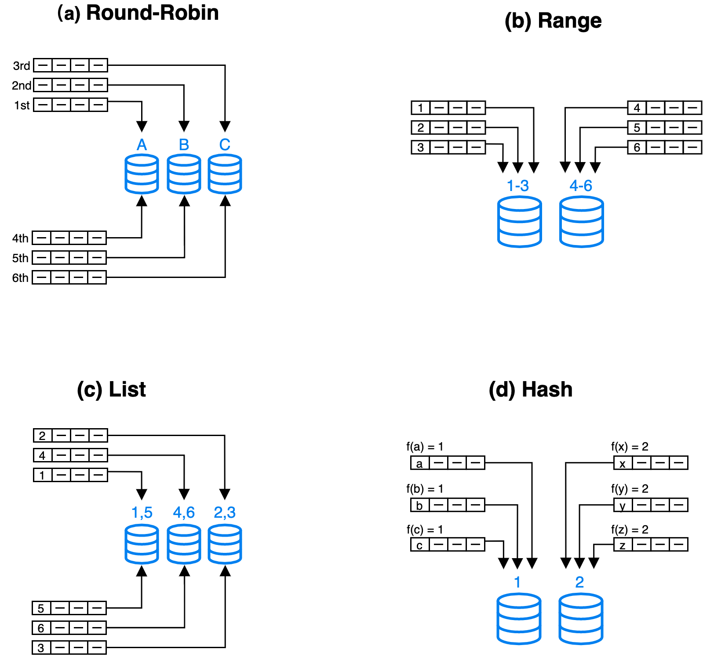

# Data distribution

import Tabs from '@theme/Tabs';
import TabItem from '@theme/TabItem';

Configuring appropriate partitioning and bucketing at table creation can help to achieve even data distribution. Even data distribution means dividing the data into subsets according to certain rules and distributing them evenly across different nodes. It can also reduce the amount of data scanned and make full use of the cluster's parallel processing capability, thereby improving query performance.

> **NOTE**
>
> - After the data distribution is specified at table creation and query patterns or data characteristics in the business scenario evolves, since v3.2 StarRocks supports [modifying certain data distribution-related properties after table creation](#optimize-data-distribution-after-table-creation-since-32) to meet the requirements for query performance in the latest business scenarios.
> - Since v3.1, you do not need to specify the bucketing key in the DISTRIBUTED BY clause when creating a table or adding a partition. StarRocks supports random bucketing, which randomly distributes data across all buckets. For more information, see [Random bucketing](#random-bucketing-since-v31).
> - Since v2.5.7, you can choose not to manually set the number of buckets when you create a table or add a partition. StarRocks can automatically set the number of buckets (BUCKETS). However, if the performance does not meet your expectations after StarRocks automatically sets the number of buckets, and you are familiar with the bucketing mechanism, you can still [manually set the number of buckets](#set-the-number-of-buckets).

## Introduction

### Distribution methods in general

Modern distributed database systems generally use the following basic distribution methods: Round-Robin, Range, List, and Hash.



- **Round-Robin**: distributes data across different nodes in a cyclic.
- **Range**: distributes data across different nodes based on the ranges of partitioning column values. As shown in the diagram, the ranges [1-3] and [4-6] correspond to different nodes.
- **List**: distributes data across different nodes based on the discrete values of partitioning columns, such as gender and province. Each discrete value is mapped to a node, and multiple different values might be mapped to the same node.
- **Hash**: distributes data across different nodes based on a hash function.

To achieve more flexible data partitioning, in addition to using one of the above data distribution methods, you can also combine these methods based on specific business requirements. Common combinations include Hash+Hash, Range+Hash, and Hash+List.

### Distribution methods in StarRocks

StarRocks supports both separate and composite use of data distribution methods.

> **NOTE**
>
> In addition to the general distribution methods, StarRocks also supports Random distribution to simplify bucketing configuration.

Also, StarRocks distributes data by implementing the two-level partitioning + bucketing method.

- The first level is partitioning: Data within a table can be partitioned. Supported partitioning methods are expression partitioning, range partitioning, and list partitioning. Or you can choose not to use partitioning (the entire table is regarded as one partition).
- The second level is bucketing: Data in a partition needs to be further distributed into smaller buckets. Supported bucketing methods are hash and random bucketing.

| **Distribution method**   | **Partitioning and bucketing method**                        | **Description**                                              |
| ------------------------- | ------------------------------------------------------------ | ------------------------------------------------------------ |
| Random distribution       | Random bucketing                                             | The entire table is considered a partition. The data in the table is randomly distributed into different buckets. This is the default data distribution method. |
| Hash distribution         | Hash bucketing                                               | The entire table is considered a partition. The data in the table is distributed to the corresponding buckets, which is based on the hash values of the data's bucketing key by using a hash function. |
| Range+Random distribution | <ol><li>Expression partitioning or range partitioning </li><li>Random bucketing </li></ol> | <ol><li>The data in the table is distributed to the corresponding partitions, which is based on the ranges where partitioning column values fall in. </li><li>The data in the partition is randomly distributed across different buckets. </li></ol> |
| Range+Hash distribution   | <ol><li>Expression partitioning or range partitioning</li><li>Hash bucketing </li></ol> | <ol><li>The data in the table is distributed to the corresponding partitions, which is based on the ranges where partitioning column values fall in.</li><li>The data in the partition is distributed to the corresponding buckets, which is based on the hash values of the data's bucketing key by using a hash function. </li></ol> |
| List+Random distribution  | <ol><li>Expression partitioning or list partitioning</li><li>Random bucketing </li></ol> | <ol><li>The data in the table is distributed to the corresponding partitions, which is based on the ranges where partitioning column values fall in.</li><li>The data in the partition is randomly distributed across different buckets.</li></ol> |
| List+Hash distribution    | <ol><li>Expression partitioning or List partitioning</li><li>Hash bucketing </li></ol> | <ol><li>The data in the table is partitioned based on the value lists that the partitioning columns values belongs to.</li><li>The data in the partition is distributed to the corresponding buckets, which is based on the hash values of the data's bucketing key by using a hash function.</li></ol> |

- **Random distribution**

  If you do not configure partitioning and bucketing methods at table creation, random distribution is used by default. This distribution method currently can only be used to create a Duplicate Key table.

  ```SQL
  CREATE TABLE site_access1 (
      event_day DATE,
      site_id INT DEFAULT '10', 
      pv BIGINT DEFAULT '0' ,
      city_code VARCHAR(100),
      user_name VARCHAR(32) DEFAULT ''
  )
  DUPLICATE KEY (event_day,site_id,pv);
  -- Because the partitioning and bucketing methods are not configured, random distribution is used by default.
  ```

- **Hash distribution**

  ```SQL
  CREATE TABLE site_access2 (
      event_day DATE,
      site_id INT DEFAULT '10',
      city_code SMALLINT,
      user_name VARCHAR(32) DEFAULT '',
      pv BIGINT SUM DEFAULT '0'
  )
  AGGREGATE KEY (event_day, site_id, city_code, user_name)
  -- Use hash bucketing as the bucketing method and must specify the bucketing key.
  DISTRIBUTED BY HASH(event_day,site_id); 
  ```

- **Range+Random distribution** (This distribution method currently can only be used to create a Duplicate Key table.)

  ```SQL
  CREATE TABLE site_access3 (
      event_day DATE,
      site_id INT DEFAULT '10', 
      pv BIGINT DEFAULT '0' ,
      city_code VARCHAR(100),
      user_name VARCHAR(32) DEFAULT ''
  )
  DUPLICATE KEY(event_day,site_id,pv)
  -- Use expression partitioning as the partitioning method and configure a time function expression.
  -- You can also use range partitioning.
  PARTITION BY date_trunc('day', event_day);
  -- Because the bucketing method is not configured, random bucketing is used by default.
  ```

- **Range+Hash distribution**

  ```SQL
  CREATE TABLE site_access4 (
      event_day DATE,
      site_id INT DEFAULT '10',
      city_code VARCHAR(100),
      user_name VARCHAR(32) DEFAULT '',
      pv BIGINT SUM DEFAULT '0'
  )
  AGGREGATE KEY(event_day, site_id, city_code, user_name)
  -- Use expression partitioning as the partitioning method and configure a time function expression.
  -- You can also use range partitioning.
  PARTITION BY date_trunc('day', event_day)
  -- Use hash bucketing as the bucketing method and must specify the bucketing key.
  DISTRIBUTED BY HASH(event_day, site_id);
  ```

- **List+Random distribution** (This distribution method currently can only be used to create a Duplicate Key table.)

  ```SQL
  CREATE TABLE t_recharge_detail1 (
      id bigint,
      user_id bigint,
      recharge_money decimal(32,2), 
      city varchar(20) not null,
      dt date not null
  )
  DUPLICATE KEY(id)
  -- Use expression partitioning as the partitioning method and specify the partitioning column.
  -- You can also use list partitioning.
  PARTITION BY (city);
  -- Because the bucketing method is not configured, random bucketing is used by default.
  ```

- **List+Hash distribution**

  ```SQL
  CREATE TABLE t_recharge_detail2 (
      id bigint,
      user_id bigint,
      recharge_money decimal(32,2), 
      city varchar(20) not null,
      dt date not null
  )
  DUPLICATE KEY(id)
  -- Use expression partitioning as the partitioning method and specify the partitioning column.
  -- You can also use list partitionifng.
  PARTITION BY (city)
  -- Use hash bucketing as the bucketing method and must specify the bucketing key.
  DISTRIBUTED BY HASH(city,id); 
  ```

#### Partitioning

The partitioning method divides a table into multiple partitions. Partitioning primarily is used to split a table into different management units (partitions) based on the partitioning key. You can set a storage strategy for each partition, including the number of buckets, the strategy of storing hot and cold data, the type of storage medium, and the number of replicas. StarRocks allows you to use different types of storage mediums within a cluster. For example, you can store the latest data on solid-state drives (SSDs) to improve query performance, and historical data on SATA hard drives to reduce storage costs.

| **Partitioning method**                   | **Scenarios**                                                    | **Methods to create partitions**               |
| ------------------------------------- | ------------------------------------------------------------ | ------------------------------------------ |
| Expression partitioning (recommended) | Previously known as automatic partitioning. This partitioning method is more flexible and easy-to-use. It is suitable for most scenarios including querying and managing data based on continuous date ranges or enum values. | Automatically created during data loading |
| Range partitioning                    | The typical scenario is to store simple, ordered data that is often queried and managed based on continuous date/numeric ranges. For instance, in some special cases, historical data needs to be partitioned by month, while recent data needs to be partitioned by day. | Created manually, dynamically, or in batch |
| List partitioning                     | A typical scenario is to query and manage data based on enum values, and a partition needs to include data with different values for each partitioning column. For example, if you frequently query and manage data based on countries and cities, you can use this method and select `city` as the partitioning column. So a partition can store data for multiple cities belonging to the same country. | Created manually                           |

##### How to choose partitioning columns and granularity

- **The partitioning key is composed of one or more partitioning columns**. Selecting a proper partitioning column can effectively reduce the amount of data scanned during queries. In most business systems, partitioning based on time is commonly adopted to resolve certain issues caused by the deletion of expired data and facilitate the management of tiered storage of hot and cold data. In this case, you can use expression partitioning or range partitioning and specify a time column as the partitioning column. Additionally, if the data is frequently queried and managed based on ENUM values, you can use expression partitioning or list partitioning and specify a column including these values as the partitioning column.
- When choosing the partitioning granularity, you need to consider data volume, query patterns, and data management granularity.
  - Example 1: If the monthly data volume in a table is small, partitioning by month can reduce the amount of metadata compared to partitioning by day, thereby reducing the resource consumption of metadata management and scheduling.
  - Example 2: If the monthly data volume in a table is large and queries mostly request data of certain days, partitioning by day can effectively reduce the amount of data scanned during queries.
  - Example 3: If the data needs to expire on a daily basis, partitioning by day is recommended.

#### Bucketing

The bucketing method divides a partition into multiple buckets. Data in a bucket is referred to as a tablet.

The supported bucketing methods are [random bucketing](#random-bucketing-since-v31) (from v3.1) and [hash bucketing](#hash-bucketing).

- Random bucketing: When creating a table or adding partitions, you do not need to set a bucketing key. Data within a partition is randomly distributed into different buckets.

- Hash Bucketing: When creating a table or adding partitions, you need to specify a bucketing key. Data within the same partition is divided into buckets based on the values of the bucketing key, and rows with the same value in the bucketing key are distributed to the corresponding and unique bucket.

The number of buckets: By default, StarRocks automatically sets the number of buckets (from v2.5.7). You can also manually set the number of buckets. For more information, please refer to [determining the number of buckets](#set-the-number-of-buckets).

## Create and manage partitions

### Create partitions

#### Expression partitioning (recommended)

> **NOTICE**
>
> Since v3.1, StarRocks's shared-data mode supports the time function expression and does not support the column expression.

Since v3.0, StarRocks has supported [expression partitioning](./expression_partitioning.md)](./expression_partitioning.md) (previously known as automatic partitioning) which is more flexible and easy to use. This partitioning method is suitable for most scenarios such as querying and managing data based on continuous date ranges or ENUM values.

You only need to configure a partition expression (a time function expression or a column expression) at table creation, and StarRocks will automatically create partitions during data loading. You no longer need to manually create numerous partitions in advance, nor configure dynamic partition properties.

#### Range partitioning

Range partitioning is suitable for storing simple contiguous data, such as time series data, or continuous numerical data. Range partitioning is appropriate for frequently queried data based on continuous date/numerical ranges. Additionally, it can be applied in some special cases where historical data needs to be partitioned by month, and recent data needs to be partitioned by day.

You need to explicitly define the data partitioning columns and establish the mapping relationship between partitions and ranges of partitioning column values. During data loading, StarRocks assigns the data to the corresponding partitions based on the ranges to which the data partitioning column values belong.

As for the data type of the partitioning columns, before v3.3.0, range partitioning only supports partitioning columns of date and integer types. Since v3.3.0, three specific time functions can be used as partition columns. When explicitly defining the mapping relationship between partitions and ranges of partitioning column values, you need to first use a specific time function to convert partitioning column values of timestamps or strings into date values, and then divide the partitions based on the converted date values.

:::info

- If the partitioning column value is a timestamp, you need to use the from_unixtime or from_unixtime_ms function to convert a timestamp to a date value when dividing the partitions. When the from_unixtime function is used, the partitioning column only supports INT and BIGINT types. When the from_unixtime_ms function is used, the partitioning column only supports BIGINT type.
- If the partitioning column value is a string (STRING, VARCHAR, or CHAR type), you need to use the str2date function to convert the string to a date value when dividing the partitions.

:::

##### Manually create partitions

Define the mapping relationship between each partition and the range of partitioning column values.

- **The partitioning column is of date type.**

    ```SQL
    CREATE TABLE site_access(
        event_day DATE,
        site_id INT,
        city_code VARCHAR(100),
        user_name VARCHAR(32),
        pv BIGINT SUM DEFAULT '0'
    )
    AGGREGATE KEY(event_day, site_id, city_code, user_name)
    PARTITION BY RANGE(event_day)(
        PARTITION p1 VALUES LESS THAN ("2020-01-31"),
        PARTITION p2 VALUES LESS THAN ("2020-02-29"),
        PARTITION p3 VALUES LESS THAN ("2020-03-31")
    )
    DISTRIBUTED BY HASH(site_id);
    ```

- **The partitioning column is of integer type.**

    ```SQL
    CREATE TABLE site_access(
        datekey INT,
        site_id INT,
        city_code SMALLINT,
        user_name VARCHAR(32),
        pv BIGINT SUM DEFAULT '0'
    )
    AGGREGATE KEY(datekey, site_id, city_code, user_name)
    PARTITION BY RANGE (datekey) (
        PARTITION p1 VALUES LESS THAN ("20200131"),
        PARTITION p2 VALUES LESS THAN ("20200229"),
        PARTITION p3 VALUES LESS THAN ("20200331")
    )
    DISTRIBUTED BY HASH(site_id);
    ```

- **Three specific time functions can be used as partitioning columns (supported since v3.3.0).**
  
  When explicitly defining the mapping relationship between partitions and the ranges of partition column values, you can use a specific time function to convert the partition column values of timestamps or strings into date values, and then divide the partitions based on the converted date values.

  <Tabs groupId="manual partitioning">
  <TabItem value="example1" label="The partition column values are timestamps" default>

  ```SQL
  -- A 10-digit timestamp accurate to the second, for example, 1703832553.
  CREATE TABLE site_access(
      event_time bigint,
      site_id INT,
      city_code SMALLINT,
      user_name VARCHAR(32),
      pv BIGINT SUM DEFAULT '0'
    )
  AGGREGATE KEY(event_time, site_id, city_code, user_name)
  PARTITION BY RANGE(from_unixtime(event_time)) (
      PARTITION p1 VALUES LESS THAN ("2021-01-01"),
      PARTITION p2 VALUES LESS THAN ("2021-01-02"),
      PARTITION p3 VALUES LESS THAN ("2021-01-03")
  )
  DISTRIBUTED BY HASH(site_id)
  ;
  
  -- A 13-digit timestamp accurate to the millisecond, for example, 1703832553219.
  CREATE TABLE site_access(
      event_time bigint,
      site_id INT,
      city_code SMALLINT,
      user_name VARCHAR(32),
      pv BIGINT SUM DEFAULT '0'
    )
  AGGREGATE KEY(event_time, site_id, city_code, user_name)
  PARTITION BY RANGE(from_unixtime_ms(event_time))(
      PARTITION p1 VALUES LESS THAN ("2021-01-01"),
      PARTITION p2 VALUES LESS THAN ("2021-01-02"),
      PARTITION p3 VALUES LESS THAN ("2021-01-03")
  )
  DISTRIBUTED BY HASH(site_id);
  ```

  </TabItem>
  <TabItem value="example2" label="The partition column values are strings">

    ```SQL
    CREATE TABLE site_access (
         event_time  varchar(100),
         site_id INT,
         city_code SMALLINT,
         user_name VARCHAR(32),
         pv BIGINT SUM DEFAULT '0'
    )
    AGGREGATE KEY(event_time, site_id, city_code, user_name)
    PARTITION BY RANGE(str2date(event_time, '%Y-%m-%d'))(
        PARTITION p1 VALUES LESS THAN ("2021-01-01"),
        PARTITION p2 VALUES LESS THAN ("2021-01-02"),
        PARTITION p3 VALUES LESS THAN ("2021-01-03")
    )
    DISTRIBUTED BY HASH(site_id);
    ```

  </TabItem>
  </Tabs>

##### Dynamic partitioning

[Dynamic partitioning](./dynamic_partitioning.md) related properties are configured at table creation. StarRocks automatically creates new partitions in advance and removes expired partitions to ensure data freshness, which implements time-to-live (TTL) management for partitions.

Different from the automatic partition creation ability provided by the expression partitioning, dynamic partitioning can only periodically create new partitions based on the properties. If the new data does not belong to these partitions, an error is returned for the load job. However, the automatic partition creation ability provided by the expression partitioning can always create corresponding new partitions based on the loaded data.

##### Create multiple partitions in batch

Multiple partitions can be created in batch at and after table creation. You can specify the start and end time for all the partitions created in batch in `START()` and `END()` and the partition increment value in `EVERY()`. However, note that the range of partitions is left-closed and right-open, which includes the start time but does not include the end time. The naming rule for partitions is the same as that of dynamic partitioning.

- **The partitioning column is of date type.**

  When the partitioning column is of date type, at table creation, you can use `START()` and `END()` to specify the start date and end date for all the partitions created in batch, and `EVERY(INTERVAL xxx)` to specify the incremental interval between two partitions. Currently, the interval granularity supports `HOUR` (since v3.0), `DAY`, `WEEK`, `MONTH`, and `YEAR`.

  <Tabs groupId="batch partitioning(date)">
  <TabItem value="example1" label="with the same date interval" default>
  
  In the following example, the partitions created in a batch start from `2021-01-01` and end on `2021-01-04`, with a partition increment of one day:  

    ```SQL
    CREATE TABLE site_access (
        datekey DATE,
        site_id INT,
        city_code SMALLINT,
        user_name VARCHAR(32),
        pv BIGINT DEFAULT '0'
    )
    DUPLICATE KEY(datekey, site_id, city_code, user_name)
    PARTITION BY RANGE (datekey) (
        START ("2021-01-01") END ("2021-01-04") EVERY (INTERVAL 1 DAY)
    )
    DISTRIBUTED BY HASH(site_id);
    ```

    It is equivalent to using the following `PARTITION BY` clause in the CREATE TABLE statement:

    ```SQL
    PARTITION BY RANGE (datekey) (
        PARTITION p20210101 VALUES [('2021-01-01'), ('2021-01-02')),
        PARTITION p20210102 VALUES [('2021-01-02'), ('2021-01-03')),
        PARTITION p20210103 VALUES [('2021-01-03'), ('2021-01-04'))
    )
    ```

  </TabItem>
  <TabItem value="example2" label="with different date intervals">

  You can create batches of date partitions with different incremental intervals by specifying different incremental intervals in `EVERY` for each batch of partitions (make sure that the partition ranges between different batches do not overlap). Partitions in each batch are created according to the `START (xxx) END (xxx) EVERY (xxx)` clause. For example:

    ```SQL
    CREATE TABLE site_access (
        datekey DATE,
        site_id INT,
        city_code SMALLINT,
        user_name VARCHAR(32),
        pv BIGINT DEFAULT '0'
    )
    DUPLICATE KEY(datekey, site_id, city_code, user_name)
    PARTITION BY RANGE (datekey) (
        START ("2019-01-01") END ("2021-01-01") EVERY (INTERVAL 1 YEAR),
        START ("2021-01-01") END ("2021-05-01") EVERY (INTERVAL 1 MONTH),
        START ("2021-05-01") END ("2021-05-04") EVERY (INTERVAL 1 DAY)
    )
    DISTRIBUTED BY HASH(site_id);
    ```

    It is equivalent to using the following `PARTITION BY` clause in the CREATE TABLE statement:

    ```SQL
    PARTITION BY RANGE (datekey) (
        PARTITION p2019 VALUES [('2019-01-01'), ('2020-01-01')),
        PARTITION p2020 VALUES [('2020-01-01'), ('2021-01-01')),
        PARTITION p202101 VALUES [('2021-01-01'), ('2021-02-01')),
        PARTITION p202102 VALUES [('2021-02-01'), ('2021-03-01')),
        PARTITION p202103 VALUES [('2021-03-01'), ('2021-04-01')),
        PARTITION p202104 VALUES [('2021-04-01'), ('2021-05-01')),
        PARTITION p20210501 VALUES [('2021-05-01'), ('2021-05-02')),
        PARTITION p20210502 VALUES [('2021-05-02'), ('2021-05-03')),
        PARTITION p20210503 VALUES [('2021-05-03'), ('2021-05-04'))
    )
    ```

    </TabItem>
    </Tabs>

- **The partitioning column is of integer type.**

  When the data type of the partitioning column is INT, you specify the range of partitions in `START` and `END` and define the incremental value in `EVERY`. Example:

  > **NOTE**
  >
  > The partitioning column values in **START()** and **END()** need to be wrapped in double quotation marks, while the incremental value in the **EVERY()** does not need to be wrapped in double quotation marks.

  <Tabs groupId="batch partitioning(integer)">
  <TabItem value="example1" label="with the same numerical interval" default>

  In the following example, the range of all the partition starts from `1` and ends at `5`, with a partition increment of `1`:

    ```SQL
    CREATE TABLE site_access (
        datekey INT,
        site_id INT,
        city_code SMALLINT,
        user_name VARCHAR(32),
        pv BIGINT DEFAULT '0'
    )
    DUPLICATE KEY(datekey, site_id, city_code, user_name)
    PARTITION BY RANGE (datekey) (
        START ("1") END ("5") EVERY (1)
    )
    DISTRIBUTED BY HASH(site_id);
    ```

  It is equivalent to using the following `PARTITION BY` clause in the CREATE TABLE statement:

    ```SQL
    PARTITION BY RANGE (datekey) (
        PARTITION p1 VALUES [("1"), ("2")),
        PARTITION p2 VALUES [("2"), ("3")),
        PARTITION p3 VALUES [("3"), ("4")),
        PARTITION p4 VALUES [("4"), ("5"))
    )
    ```

  </TabItem>
  <TabItem value="example2" label="with different numerical intervals">

  You can create batches of numerical partitions with different incremental intervals by specifying different incremental intervals in `EVERY` for each batch of partitions (make sure that the partition ranges between different batches do not overlap). Partitions in each batch are created according to the `START (xxx) END (xxx) EVERY (xxx)` clause. For example:

    ```SQL
    CREATE TABLE site_access (
        datekey INT,
        site_id INT,
        city_code SMALLINT,
        user_name VARCHAR(32),
        pv BIGINT DEFAULT '0'
    )
    DUPLICATE KEY(datekey, site_id, city_code, user_name)
    PARTITION BY RANGE (datekey) (
        START ("1") END ("10") EVERY (1),
        START ("10") END ("100") EVERY (10)
    )
    DISTRIBUTED BY HASH(site_id);
    ```

  </TabItem>
  </Tabs>

- **Three specific time functions can be used as partitioning columns (supported since v3.3.0).**
  
  When explicitly defining the mapping relationship between partitions and the ranges of partition column values, you can use a specific time function to convert the partition column values of timestamps or strings into date values, and then divide the partitions based on the converted date values.

  <Tabs groupId="batch partitioning(timestamp and string)">
  <TabItem value="example1" label="The partitioning column values are timestamps" default>

  ```SQL
  -- A 10-digit timestamp accurate to the second, for example, 1703832553.
  CREATE TABLE site_access(
      event_time bigint,
      site_id INT,
      city_code SMALLINT,
      user_name VARCHAR(32),
      pv BIGINT DEFAULT '0'
    )
  PARTITION BY RANGE(from_unixtime(event_time)) (
      START ("2021-01-01") END ("2021-01-10") EVERY (INTERVAL 1 DAY)
  )
  DISTRIBUTED BY HASH(site_id);
  -- A 13-digit timestamp accurate to the milliseconds, for example, 1703832553219.
  CREATE TABLE site_access(
      event_time bigint,
      site_id INT,
      city_code SMALLINT,
      user_name VARCHAR(32),
      pv BIGINT DEFAULT '0'
  )
  PARTITION BY RANGE(from_unixtime_ms(event_time))(
      START ("2021-01-01") END ("2021-01-10") EVERY (INTERVAL 1 DAY)
  )
  DISTRIBUTED BY HASH(site_id);
  ```

  </TabItem>
  <TabItem value="example2" label="The partitioning column values are strings">

    ```SQL
    CREATE TABLE site_access (
         event_time  varchar(100),
         site_id INT,
         city_code SMALLINT,
         user_name VARCHAR(32),
         pv BIGINT DEFAULT '0'
  )
    PARTITION BY RANGE(str2date(event_time, '%Y-%m-%d'))(
        START ("2021-01-01") END ("2021-01-10") EVERY (INTERVAL 1 DAY)
    )
    DISTRIBUTED BY HASH(site_id);
    ```

  </TabItem>
  </Tabs>

#### List partitioning (since v3.1)

[List Partitioning](./list_partitioning.md) is suitable for accelerating queries and efficiently managing data based on enum values. It is especially useful for scenarios where a partition needs to include data with different values in a partitioning column. For example, if you frequently query and manage data based on countries and cities, you can use this partitioning method and select the `city` column as the partitioning column. In this case, one partition can contain data for various cities belonging to one country.

StarRocks stores data in the corresponding partitions based on the explicit mapping of the predefined value list for each partition.

### Manage  partitions

#### Add partitions

For range partitioning and list partitioning, you can manually add new partitions to store new data. However for expression partitioning, because partitions are created automatically during data loading, you do not need to do so.

The following statement adds a new partition to table `site_access` to store data for a new month:

```SQL
ALTER TABLE site_access
ADD PARTITION p4 VALUES LESS THAN ("2020-04-30")
DISTRIBUTED BY HASH(site_id);
```

#### Delete a partition

The following statement deletes partition `p1` from table `site_access`.

> **NOTE**
>
> This operation does not immediately delete data in a partition. Data is retained in the Trash for a period of time (one day by default). If a partition is mistakenly deleted, you can use the [RECOVER](../sql-reference/sql-statements/backup_restore/RECOVER.md) command to restore the partition and its data.

```SQL
ALTER TABLE site_access
DROP PARTITION p1;
```

#### Restore a partition

The following statement restores partition `p1` and its data to table `site_access`.

```SQL
RECOVER PARTITION p1 FROM site_access;
```

#### View partitions

The following statement returns details of all partitions in table `site_access`.

```SQL
SHOW PARTITIONS FROM site_access;
```

## Configure bucketing

### Random bucketing (since v3.1)

StarRocks distributes the data in a partition randomly across all buckets. It is suitable for scenarios with small data sizes and relatively low requirements for query performance. If you do not set a bucketing method, StarRocks uses random bucketing by default and automatically sets the number of buckets.

However, note that if you query massive amounts of data and frequently use certain columns as filter conditions, the query performance provided by random bucketing may not be optimal. In such scenarios, it is recommended to use [hash bucketing](#hash-bucketing). When these columns are used as filter conditions for queries, only data in a small number of buckets that the query hits need to be scanned and computed, which can significantly improve query performance.

#### Limits

- You can only use random bucketing to create a Duplicate Key table.
- You cannot specify a table bucketed randomly to belong to a [Colocation Group](../using_starrocks/Colocate_join.md).
- [Spark Load](../loading/SparkLoad.md) cannot be used to load data into tables bucketed randomly.

In the following CREATE TABLE example, the `DISTRIBUTED BY xxx` statement is not used, so StarRocks uses random bucketing by default, and automatically sets the number of buckets.

```SQL
CREATE TABLE site_access1(
    event_day DATE,
    site_id INT DEFAULT '10', 
    pv BIGINT DEFAULT '0' ,
    city_code VARCHAR(100),
    user_name VARCHAR(32) DEFAULT ''
)
DUPLICATE KEY(event_day,site_id,pv);
```

However, if you are familiar with StarRocks' bucketing mechanism, you can also manually set the number of buckets when creating a table with random bucketing.

```SQL
CREATE TABLE site_access2(
    event_day DATE,
    site_id INT DEFAULT '10', 
    pv BIGINT DEFAULT '0' ,
    city_code VARCHAR(100),
    user_name VARCHAR(32) DEFAULT ''
)
DUPLICATE KEY(event_day,site_id,pv)
DISTRIBUTED BY RANDOM BUCKETS 8; -- manually set the number of buckets to 8
```

### Hash bucketing

StarRocks can use hash bucketing to subdivide data in a partition into buckets based on the bucketing key and [the number of buckets](#set-the-number-of-buckets). In hash bucketing, a hash function takes data's bucketing key value as an input and calculates a hash value. Data is stored in the corresponding bucket based on the mapping between the hash values and buckets.

#### Advantages

- Improved query performance: Rows with the same bucketing key values are stored in the same bucket, reducing the amount of data scanned during queries.

- Even data distribution: By selecting columns with higher cardinality (a larger number of unique values) as the bucketing key, data can be more evenly distributed across buckets.

#### How to choose the bucketing columns

We recommend that you choose the column that satisfies the following two requirements as the bucketing column.

- high cardinality column such as ID
- column that often used in a filter for queries

But if no columns satisfy both requirements, you need to determine the bucketing column according to the complexity of queries.

- If the query is complex, it is recommended that you select high cardinality columns as bucketing columns to ensure that the data is as evenly distributed as possible across all the buckets and improve the cluster resource utilization.
- If the query is relatively simple, it is recommended to select columns that are frequently used as filer conditions in queries as bucketing columns to improve query efficiency.

If partition data cannot be evenly distributed across all the buckets by using one bucketing column, you can choose multiple bucketing columns. Note that it is recommended to use no more than 3 columns.

#### Precautions

- **When a table is created, you must specify the bucketing columns**.
- The data types of bucketing columns must be INTEGER, DECIMAL, DATE/DATETIME, or CHAR/VARCHAR/STRING.
- Since 3.2, bucketing columns can be modified by using ALTER TABLE after table creation.

#### Examples

In the following example, the `site_access` table is created by using `site_id` as the bucketing column. Additionally, when data in the `site_access` table is queried, data is often filtered by sites. Using `site_id` as the bucketing key can prune a significant number of irrelevant buckets during queries.

```SQL
CREATE TABLE site_access(
    event_day DATE,
    site_id INT DEFAULT '10',
    city_code VARCHAR(100),
    user_name VARCHAR(32) DEFAULT '',
    pv BIGINT SUM DEFAULT '0'
)
AGGREGATE KEY(event_day, site_id, city_code, user_name)
PARTITION BY RANGE(event_day)
(
    PARTITION p1 VALUES LESS THAN ("2020-01-31"),
    PARTITION p2 VALUES LESS THAN ("2020-02-29"),
    PARTITION p3 VALUES LESS THAN ("2020-03-31")
)
DISTRIBUTED BY HASH(site_id);
```

Suppose each partition of table `site_access` has 10 buckets. In the following query, 9 out of 10 buckets are pruned, so StarRocks only needs to scan 1/10 of the data in the `site_access` table:

```SQL
select sum(pv)
from site_access
where site_id = 54321;
```

However, if `site_id` is unevenly distributed and a large number of queries only request data of a few sites, using only one bucketing column can result in severe data skew, causing system performance bottlenecks. In this case, you can use a combination of bucketing columns. For example, the following statement uses `site_id` and `city_code` as bucketing columns.

```SQL
CREATE TABLE site_access
(
    site_id INT DEFAULT '10',
    city_code SMALLINT,
    user_name VARCHAR(32) DEFAULT '',
    pv BIGINT SUM DEFAULT '0'
)
AGGREGATE KEY(site_id, city_code, user_name)
DISTRIBUTED BY HASH(site_id,city_code);
```

Practically speaking, you can use one or two bucketing columns based on your business characteristics. Using one bucketing column `site_id` is highly beneficial for short queries as it reduces data exchange between nodes, thereby enhancing the overall performance of the cluster. On the other hand, adopting two bucketing columns `site_id` and `city_code` is advantageous for long queries as it can leverage the overall concurrency of the distributed cluster to significantly improve performance.

> **NOTE**
>
> - Short queries involve scanning a small amount of data, and can be completed on a single node.
> - Long queries involve scanning a large amount of data, and their performance can be significantly improved by parallel scanning across multiple nodes in a distributed cluster.

### Set the number of buckets

Buckets reflect how data files are actually organized in StarRocks.

#### At table creation

- Automatically set the number of buckets (recommended)

  Since v2.5.7, StarRocks supports automatically setting the number of buckets based on machine resources and data volume for a partition.
  
  :::tip

  If the raw data size of a partition exceeds 100 GB, we recommend that you manually configure the number of buckets using Method 2.

  :::

  <Tabs groupId="automaticexamples1">
  <TabItem value="example1" label="Table configured with hash bucketing" default>
  Example:

  ```sql
  CREATE TABLE site_access (
      site_id INT DEFAULT '10',
      city_code SMALLINT,
      user_name VARCHAR(32) DEFAULT '',
      event_day DATE,
      pv BIGINT SUM DEFAULT '0')
  AGGREGATE KEY(site_id, city_code, user_name,event_day)
  PARTITION BY date_trunc('day', event_day)
  DISTRIBUTED BY HASH(site_id,city_code); -- do not need to set the number of buckets
  ```

  </TabItem>
  <TabItem value="example2" label="Table configured with random bucketing">
  As for tables configured with random bucketing, in addition to automatically setting the number of buckets in a partition, StarRocks further optimizes the logic since v3.2.0. StarRocks also can **dynamically increase** the number of buckets in a partition **during data loading**, based on the cluster capacity and the volume of loaded data.

  :::warning

  - To enable the on-demand and dynamic increase of the number of buckets, you need to set the table property `PROPERTIES("bucket_size"="xxx")` to specify the size of a single bucket. If the data volume in a partition is small, you can set the `bucket_size` to 1 GB. Otherwise, you can set the `bucket_size` to 4 GB.
  - Once the on-demand and dynamic increase of the number of buckets is enabled, and you need to rollback to version 3.1, you have to first delete the table which enables the dynamic increase in the number of buckets. Then you need to manually execute a metadata checkpoint using [ALTER SYSTEM CREATE IMAGE](../sql-reference/sql-statements/cluster-management/nodes_processes/ALTER_SYSTEM.md) before rolling back.

  :::

  Example:

  ```sql
  CREATE TABLE details1 (
      event_day DATE,
      site_id INT DEFAULT '10', 
      pv BIGINT DEFAULT '0',
      city_code VARCHAR(100),
      user_name VARCHAR(32) DEFAULT '')
  DUPLICATE KEY (event_day,site_id,pv)
  PARTITION BY date_trunc('day', event_day)
  -- The number of buckets in a partition is automatically determined by StarRocks and the number dynamically increases on demand because the size of a bucket is set to 1 GB.
  PROPERTIES("bucket_size"="1073741824")
  ;
  
  CREATE TABLE details2 (
      event_day DATE,
      site_id INT DEFAULT '10',
      pv BIGINT DEFAULT '0' ,
      city_code VARCHAR(100),
      user_name VARCHAR(32) DEFAULT '')
  DUPLICATE KEY (event_day,site_id,pv)
  PARTITION BY date_trunc('day', event_day)
  -- The number of buckets in the table partition is automatically determined by StarRocks, and the number is fixed and does not dynamically increases on demand because the size of a bucket is not set.
  ;
  ```

  </TabItem>
  </Tabs>

- Manually set the number of buckets

  Since v2.4.0, StarRocks supports using multiple threads to scan a tablet in parallel during a query, thereby reducing the dependency of scanning performance on the tablet count. We recommend that each tablet contain about 10 GB of raw data. If you intend to manually set the number of buckets, you can estimate the amount of data in each partition of a table and then decide the number of tablets.

  To enable parallel scanning on tablets, make sure the `enable_tablet_internal_parallel` parameter is set to `TRUE` globally for the entire system (`SET GLOBAL enable_tablet_internal_parallel = true;`).

  <Tabs groupId="manualexamples1">
  <TabItem value="example1" label="Table configured with hash bucketing" default>

    ```SQL
    CREATE TABLE site_access (
        site_id INT DEFAULT '10',
        city_code SMALLINT,
        user_name VARCHAR(32) DEFAULT '',
        event_day DATE,
        pv BIGINT SUM DEFAULT '0')
    AGGREGATE KEY(site_id, city_code, user_name,event_day)
    PARTITION BY date_trunc('day', event_day)
    DISTRIBUTED BY HASH(site_id,city_code) BUCKETS 30;
    -- Suppose the amount of raw data that you want to load into a partition is 300 GB.
    -- Because we recommend that each tablet contain 10 GB of raw data, the number of buckets can be set to 30.
    DISTRIBUTED BY HASH(site_id,city_code) BUCKETS 30;
    ```
  
  </TabItem>
  <TabItem value="example2" label="Table configured with random bucketing">

  ```sql
  CREATE TABLE details (
      site_id INT DEFAULT '10', 
      city_code VARCHAR(100),
      user_name VARCHAR(32) DEFAULT '',
      event_day DATE,
      pv BIGINT DEFAULT '0'
  )
  DUPLICATE KEY (site_id,city_code)
  PARTITION BY date_trunc('day', event_day)
  DISTRIBUTED BY RANDOM BUCKETS 30
  ; 
  ```

    </TabItem>
    </Tabs>

#### After table creation

- Automatically set the number of buckets (recommended)

  Since v2.5.7, StarRocks supports automatically setting the number of buckets based on machine resources and data volume for a partition.

  :::tip
  
  If the raw data size of a partition exceeds 100 GB, we recommend that you manually configure the number of buckets using Method 2.
  :::

  <Tabs groupId="automaticexamples2">
  <TabItem value="example1" label="Table configured with hash bucketing" default>

  ```sql
  -- Automatically set the number of buckets for all partitions.
  ALTER TABLE site_access DISTRIBUTED BY HASH(site_id,city_code);
  
  -- Automatically set the number of buckets for specific partitions.
  ALTER TABLE site_access PARTITIONS (p20230101, p20230102)
  DISTRIBUTED BY HASH(site_id,city_code);
  
  -- Automatically set the number of buckets for new partitions.
  ALTER TABLE site_access ADD PARTITION p20230106 VALUES [('2023-01-06'), ('2023-01-07'))
  DISTRIBUTED BY HASH(site_id,city_code);
  ```

  </TabItem>
  <TabItem value="example2" label="Table configured with random bucketing">

  As for tables configured with random bucketing, in addition to automatically setting the number of buckets in a partition, StarRocks further optimizes the logic since v3.2.0. StarRocks also can **dynamically increase** the number of buckets in a partition **during data loading**, based on the cluster capacity and the volume of loaded data. This not only makes partition creation easier but also increases bulk load performance.

  :::warning

  - To enable the on-demand and dynamic increase of the number of buckets, you need to set the table property `PROPERTIES("bucket_size"="xxx")` to specify the size of a single bucket. If the data volume in a partition is small, you can set the `bucket_size` to 1 GB. Otherwise, you can set the `bucket_size` to 4 GB.
  - Once the on-demand and dynamic increase of the number of buckets is enabled, and you need to rollback to version 3.1, you have to first delete the table which enables the dynamic increase in the number of buckets. Then you need to manually execute a metadata checkpoint using [ALTER SYSTEM CREATE IMAGE](../sql-reference/sql-statements/cluster-management/nodes_processes/ALTER_SYSTEM.md) before rolling back.

  :::

  ```sql
  -- The number of buckets for all partitions is automatically set by StarRocks and this number is fixed because the on-demand and dynamic increase of the number of buckets is disabled.
  ALTER TABLE details DISTRIBUTED BY RANDOM;
  -- The number of buckets for all partitions is automatically set by StarRocks and the on-demand and dynamic increase of the number of buckets is enabled.
  ALTER TABLE details SET("bucket_size"="1073741824");
  
  -- Automatically set the number of buckets for specific partitions.
  ALTER TABLE details PARTITIONS (p20230103, p20230104)
  DISTRIBUTED BY RANDOM;
  
  -- Automatically set the number of buckets for new partitions.
  ALTER TABLE details ADD PARTITION  p20230106 VALUES [('2023-01-06'), ('2023-01-07'))
  DISTRIBUTED BY RANDOM;
  ```

  </TabItem>
  </Tabs>

- Manually set the number of buckets

  You can also manually specify the buckets number. To calculate the number of buckets for a partition, you can refer to the approach used when manually setting the number of buckets at table creation, [as mentioned above](#at-table-creation).

  <Tabs groupId="manualexamples2">
  <TabItem value="example1" label="Table configured with hash bucketing" default>

  ```sql
  -- Manually set the number of buckets for all partitions 
  ALTER TABLE site_access
  DISTRIBUTED BY HASH(site_id,city_code) BUCKETS 30;
  -- Manually set the number of buckets for specific partitions.
  ALTER TABLE site_access
  partitions p20230104
  DISTRIBUTED BY HASH(site_id,city_code)  BUCKETS 30;
  -- Manually set the number of buckets for new partitions.
  ALTER TABLE site_access
  ADD PARTITION p20230106 VALUES [('2023-01-06'), ('2023-01-07'))
  DISTRIBUTED BY HASH(site_id,city_code) BUCKETS 30;
  ```

  </TabItem>
  <TabItem value="example2" label="Table configured with random bucketing">

  ```sql
  -- Manually set the number of buckets for all partitions 
  ALTER TABLE details
  DISTRIBUTED BY RANDOM BUCKETS 30;
  -- Manually set the number of buckets for specific partitions.
  ALTER TABLE details
  partitions p20230104
  DISTRIBUTED BY RANDOM BUCKETS 30;
  -- Manually set the number of buckets for new partitions.
  ALTER TABLE details
  ADD PARTITION p20230106 VALUES [('2023-01-06'), ('2023-01-07'))
  DISTRIBUTED BY RANDOM BUCKETS 30;
  ```

  Manually set the default number of buckets for dynamic partitions.

  ```sql
  ALTER TABLE details_dynamic
  SET ("dynamic_partition.buckets"="xxx");
  ```

  </TabItem>
  </Tabs>

#### View the number of buckets

After creating a table, you can execute [SHOW PARTITIONS](../sql-reference/sql-statements/table_bucket_part_index/SHOW_PARTITIONS.md) to view the number of buckets set by StarRocks for each partition. Tables configured with hash bucketing have a fixed number of buckets per partition.

:::info

- As for a table configured with random bucketing which enable the on-demand and dynamic increase of the number of buckets, the number of buckets in each partition dynamically increases. So the returned result displays the current number of buckets for each partition.
- For this table type, the actual hierarchy within a partition is as follows: partition > subpartition > bucket. To increase the number of buckets, StarRocks actually adds a new subpartition which includes a certain number of buckets. As a result, the SHOW PARTITIONS statement may return multiple data rows with the same partition name, which show the information of the subpartitions within the same partition.

:::

## Optimize data distribution after table creation (since 3.2)

> **NOTICE**
>
> StarRocks's shared-data mode currently does not support this feature.

As query patterns and data volume evolve in business scenarios, the configurations specified at table creation, such as the bucketing method, the number of buckets, and the sort key, may no longer be suitable for the new business scenario and even may cause query performance to decrease. At this point, you can use `ALTER TABLE` to modify the bucketing method, the number of buckets, and the sort key to optimize data distribution. For example:

- **Increase the number of buckets when data volume within partitions is significantly increased**

  When the data volume within partitions becomes significantly larger than before, it is necessary to modify the number of buckets to maintain tablet sizes generally within the range of 1 GB to 10 GB.
  
- **Modify the bucketing key to avoid data skew**

  When the current bucketing key can cause data skew (for example, only the `k1` column is configured as the bucketing key), it is necessary to specify more suitable columns or add additional columns to the bucketing key. For example:
  
  ```SQL
  ALTER TABLE t DISTRIBUTED BY HASH(k1, k2) BUCKETS 20;
  -- When the StarRocks's version is 3.1 or later, and the table is Duplicate Key table, you can consider directly using the system's default bucketing settings, that is, random bucketing and the number of buckets automatically set by StarRocks.
  ALTER TABLE t DISTRIBUTED BY RANDOM;
  ```

- **Adapting the sort key due to changes in query patterns**
  
  If the business query patterns are significantly changed and additional columns are used as conditional columns, it can be beneficial to adjust the sort key. For example:
  
  ```SQL
  ALTER TABLE t ORDER BY k2, k1;
  ```

For more information, see [ALTER TABLE](../sql-reference/sql-statements/table_bucket_part_index/ALTER_TABLE.md).
