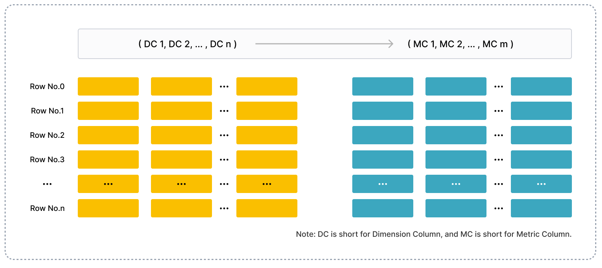
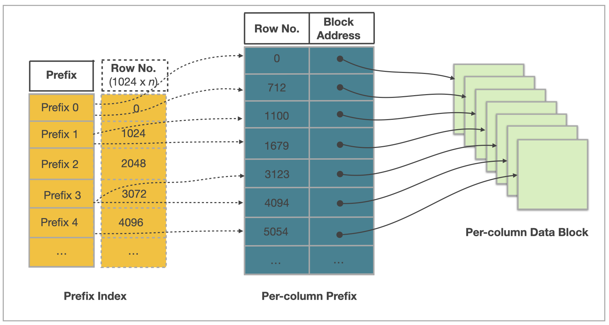

<<<<<<< HEAD
# Understand table design

## Columnar storage



Like in other relational databases, tables in StarRocks consist of rows and columns. Each row holds a record of user data, and data in each column has the same type. All rows in a table have the same number of columns. You can dynamically add columns to or delete columns from a table. The columns of a table can be categorized as dimension columns and metric columns. Dimension columns are also called key columns, and metric columns are also called value columns. Values in dimension columns are used to group and sort data, and values in metric columns can be accumulated by using functions such as sum, count, min, max, hll_union_agg, and bitmap_union.

StarRocks uses columnar storage for tables. Physically, the data in a column is segregated into data blocks, encoded, compressed, and then persistently stored on disk. Logically, the data in a column can be compared to an array that consists of elements of the same data type. The column values held in a row keep are listed as elements in the column order in their respective arrays. This means the column values held in a row have the same array index. Array indexes are implicit and do not need to be stored. All rows in a table are sorted in the order specified by one or more dimension columns. The location of a row in the sorted table is represented by the sequence number of that row.

For a query on a table, if you specify equality or range conditions on specific dimension columns that can comprise a dimension column prefix, StarRocks can run binary searches to quickly locate the rows of interest among sorted data. For example, you want to query data from a table named `table1`, and the table consists of four columns: `event_day`, `siteid`, `citycode`, and `username`, among which `event_day` and `siteid` are dimension columns. If you specify `event_day = 2020-09-18` and `siteid = 2` as query conditions, StarRocks can run binary searches and only needs to process the data within the specified range, because `event_day` and `siteid` can comprise a dimension column prefix. If you specify `citycode = 4` and `username = Andy` as query conditions, StarRocks cannot run binary searches and needs to process the data of the entire table, because `citycode` and `username` cannot comprise a dimension column prefix.

## Indexing

StarRocks uses prefix indexes and per-column indexes to quickly locate the starting rows of the data blocks taken by rows of interest.

The following figure shows how the StarRocks table design works to accelerate queries on a table in StarRocks.



The data of a table in StarRocks is organized into the following three parts:

- Prefix index
  
  StarRocks stores the data of every 1024 rows as a data block, for which an entry is maintained in the prefix index table. The content of the prefix index entry for each data block is the prefix composed of the dimension columns for the starting row in the data block and cannot exceed 36 bytes in length. The prefix index is a sparse index. When you query a row, StarRocks searches the prefix index table to retrieve the prefix that is composed of the dimension columns for the row. Then, StarRocks can quickly locate the sequence number of the starting row in the data block taken by the row of interest.

- Per-column data block
  
  StarRocks segregates the data of each column into multiple 64-KB data blocks. Each data block is independently encoded and compressed as the minimal I/O unit and is read from or written to disk as a whole.

- Per-column index
  
  StarRocks maintains a row number index for each column. In the row number index table, data blocks for the column are mapped one by one onto the sequence numbers of the rows held in the column. Additionally, each entry in the row number index table consists of the starting row number, address, and length of the data block that is mapped onto a specific row number. When you query a row, StarRocks searches the row number index table to retrieve the address of the data block mapped onto the sequence number of the row. Then, StarRocks reads the data block to locate the row.

In summary, StarRocks performs the following five steps to locate a row of a table by using the prefix that is composed of the dimension columns for the row:

1. Search the prefix index table to locate the sequence number of the starting row in the data block taken by the row of interest.

2. Search the row number index table of each dimension column to locate the data blocks for the dimension column.

3. Read the data blocks.

4. Decompress and decode the data blocks.

5. Search the data blocks to locate the row onto which the dimension column index is mapped.

## Accelerated processing

This section introduces the mechanisms that help StarRocks process data at higher speeds.

### Pre-aggregation

StarRocks provides the Aggregate table. For an Aggregate table, the rows that have the same values in the table's dimension columns can be aggregated into a single row. The value in each dimension column remains unchanged for the new row generated from the aggregation, and the values in each metric column are aggregated by the aggregate function you specify to produce the resulting value for the new row in the metric column. Pre-aggregation helps accelerate aggregate operations.

### Partitioning and bucketing

Each table in StarRocks is divided into multiple tablets. Each tablet is stored in multiple replicas on BEs. The number of BEs and the number of tablets can scale flexibly in line with changes in computing resources and data sizes. When you initiate a query, multiple BEs can search tablets in parallel to quickly locate the data of interest. Additionally, tablet replicas can be replicated and migrated, which increases data reliability and prevents data skews. Partitioning and bucketing help ensure the efficiency and stability of data retrieval.

### Materialized view

The prefix index of a table helps accelerate queries on the table but rely on the sequence of the table's dimension columns. If you construct query predicates by using dimension columns that are not included in a dimension column prefix, the prefix index does not work. In this case, you can create a materialized view for the table. The data of the materialized view is organized and stored in the same way as the data of the table. However, the materialized view can have its own prefix index. When you create a prefix index for the materialized view, you can specify appropriate aggregation granularity, column count, and dimension column ordering to ensure that frequently used query conditions can hit expected entries in the prefix index table for the materialized view.

### Per-column index

StarRocks supports per-column indexes such as Bloom filters, zone maps, and bitmap indexes:

- A Bloom filter is used to determine whether data blocks contain the values you want to query.

- A zone map is used to locate the values within a specified range.

- A bitmap index is used to locate the rows that meet specified query conditions in a column of the ENUM data type.
=======
# Table overview

import Replicanum from '../_assets/commonMarkdown/replicanum.md'

Tables are units of data storage. Understanding the table structure in StarRocks and how to design an efficient table structure helps optimize data organization and enhance query efficiency. Also, compared to traditional databases, StarRocks can store complex semi-structured data such as JSON, ARRAY, in a columnar manner to improve query performance.

This topic introduces the table structure in StarRocks from both basic and general perspectives.

From v3.3.1 onwards, StarRocks supports creating temporary tables in the Default Catalog.

## Get started with basic table structure

Like in other relational databases, a table is logically composed of rows and columns:

- Rows: Each row holds a record. Each row contains a set of related data values.
- Columns: Columns define attributes for each record. Each column holds data of a specific attribute. For example, an employee table may include columns like name, employee ID, department, and salary, where each column stores corresponding data. Data in each column is of the same data type. All rows in a table have the same number of columns.

It is simple to create a table in StarRocks. You just need to define columns and their data types in the CREATE TABLE statement to create a table. Example:

```SQL
CREATE DATABASE example_db;
USE example_db;
CREATE TABLE user_access (
    uid int,
    name varchar(64),
    age int, 
    phone varchar(16),
    last_access datetime,
    credits double
)
ORDER BY (uid, name);
```

The above CREATE TABLE example creates a Duplicate Key table. No constraint is added to columns in this type of table, so duplicate data rows can exist in the table. The first two columns of the Duplicate Key table are specified as sort columns to form the sort key. Data is stored after being sorted based on the sort key, which can accelerate indexing during queries.

Since v3.3.0, the Duplicate Key table supports specifying the sort key using `ORDER BY`. If both `ORDER BY` and `DUPLICATE KEY` are used, `DUPLICATE KEY` does not take effect.

<Replicanum />

Execute [DESCRIBE](../sql-reference/sql-statements/table_bucket_part_index/DESCRIBE.md) to view the table schema.

```SQL
MySQL [test]> DESCRIBE user_access;
+-------------+-------------+------+-------+---------+-------+
| Field       | Type        | Null | Key   | Default | Extra |
+-------------+-------------+------+-------+---------+-------+
| uid         | int         | YES  | true  | NULL    |       |
| name        | varchar(64) | YES  | true  | NULL    |       |
| age         | int         | YES  | false | NULL    |       |
| phone       | varchar(16) | YES  | false | NULL    |       |
| last_access | datetime    | YES  | false | NULL    |       |
| credits     | double      | YES  | false | NULL    |       |
+-------------+-------------+------+-------+---------+-------+
6 rows in set (0.00 sec)
```

Execute [SHOW CREATE TABLE](../sql-reference/sql-statements/table_bucket_part_index/SHOW_CREATE_TABLE.md) to view the CREATE TABLE statement.

```SQL
MySQL [example_db]> SHOW CREATE TABLE user_access\G
*************************** 1. row ***************************
       Table: user_access
Create Table: CREATE TABLE `user_access` (
  `uid` int(11) NULL COMMENT "",
  `name` varchar(64) NULL COMMENT "",
  `age` int(11) NULL COMMENT "",
  `phone` varchar(16) NULL COMMENT "",
  `last_access` datetime NULL COMMENT "",
  `credits` double NULL COMMENT ""
) ENGINE=OLAP 
DUPLICATE KEY(`uid`, `name`)
DISTRIBUTED BY RANDOM
ORDER BY(`uid`, `name`)
PROPERTIES (
"bucket_size" = "4294967296",
"compression" = "LZ4",
"fast_schema_evolution" = "true",
"replicated_storage" = "true",
"replication_num" = "3"
);
1 row in set (0.01 sec)
```

## Understand comprehensive table structure

A deep dive into StarRocks table structures helps you design efficient data management structure tailored to your business needs.  

### [Table types](./table_types/table_types.md)

StarRocks provides four types of tables which are Duplicate Key tables, Primary Key tables, Aggregate tables, and Unique Key tables, to store data for various business scenarios, such as raw data, frequently updated realtime data, and aggregated data.

- Duplicate Key tables are simple and easy to use. No constraint is added to columns in this type of table, so duplicate data rows can exist in the table. Duplicate Key tables are suitable for storing raw data, such as logs, that does not need any constraints or pre-aggregation.
- Primary Key tables are powerful. Both unique and non-null constraints are added to primary key columns. Primary Key tables support real-time frequent updates and partial column updates, while ensuring high query performance, and therefore are suitable for real-time queries scenarios.
- Aggregate tables are suitable to store pre-aggregated data, helping reduce the amount of data scanned and calculated and improve efficiency for aggregation queries.
- Unique tables are also suitable to store frequently updated realtime data. However this type of tables is being replaced by Primary Key tables, which are more powerful.

### [Data distribution](data_distribution/Data_distribution.md)

StarRocks uses a partitioning+bucketing two-tier data distribution strategy, to evenly distribute data across BEs. A well-designed data distribution strategy can effectively reduce the amount of data scanned and maximize StarRocks' concurrent processing capabilities, thereby increasing query performance.


#### Partitioning

The first level is partitioning: Data in tables can be divided into smaller data management units based on partitioning columns which are usually columns that hold dates and time. During queries, partition pruning can reduce the amount of data that needs to be scanned, effectively optimizing query performance.

StarRocks provides an easy-to-use partitioning method, expression partitioning, and also offers more flexible methods like range and list partitioning.

#### Bucketing

The second level is bucketing: Data within a partition is further divided into smaller data management units through bucketing. Replicas of each bucket are evenly distributed across BEs to ensure high data availability.

StarRocks provides two bucketing methods:

- Hash bucketing: Data is distributed into buckets based on the hash values of the bucketing key. You can select columns frequently used as condition columns in queries as bucketing columns, which helps improve query efficiency.
- Random bucketing: Data is randomly distributed to buckets. This bucketing method is more simple and ease to use.

### [Data types](../sql-reference/data-types/README.md)

In addition to basic data types such as NUMERIC, DATE, and STRING, StarRocks supports complex semi-structured data types, including ARRAY, JSON, MAP, and STRUCT.

### [Index](indexes/indexes.md)

An index is a special data structure and is used as a pointer to data in a table. When the conditional columns in queries are indexed columns, StarRocks can swiftly locate the data that meets the conditions.

StarRocks provides built-in indexes: Prefix indexes, Ordinal indexes, and ZoneMap indexes. StarRocks also allows users to create indexes, that is, Bitmap indexes and Bloom Filter indexes, to further enhance query efficiency.

### Constraints

Constraints help ensure data integrity, consistency, and accuracy. The primary key columns in Primary Key tables must have unique and NOT NULL values. The aggregate key columns in Aggregate tables and the unique key columns in Unique Key tables must have unique values.

### Temporary table

When processing data, you might need to save intermediate results for future reuse. In early versions, StarRocks only supports using CTE (Common Table Expressions) to define temporary results within a single query. However, CTEs are merely logical constructs, do not physically store the results, and cannot be used across different queries, which presents certain limitations. If you choose to create tables to save intermediate results, you will need to manage the lifecycle of these tables, which can be costly.

To address this issue, StarRocks introduces temporary tables in v3.3.1. Temporary tables allow you to temporarily store data (such as intermediate results from ETL processes) in a table, with their lifecycle bound to the session and managed by StarRocks. When the session ends, the temporary tables are automatically cleared. Temporary tables are only visible within the current session, and different sessions can create temporary tables with the same name.

#### Usage

You can use the `TEMPORARY` keyword in the following SQL statements to create and drop temporary tables:

- [CREATE TABLE](../sql-reference/sql-statements/table_bucket_part_index/CREATE_TABLE.md)
- [CREATE TABLE AS SELECT](../sql-reference/sql-statements/table_bucket_part_index/CREATE_TABLE_AS_SELECT.md)
- [CREATE TABLE LIKE](../sql-reference/sql-statements/table_bucket_part_index/CREATE_TABLE_LIKE.md)
- [DROP TABLE](../sql-reference/sql-statements/table_bucket_part_index/DROP_TABLE.md)

:::note

Similar to other types of native tables, temporary tables must be create under a database under the Default Catalog. However, because temporary tables are session-based, they are not subject to unique naming constraints. You can create temporary tables with the same name in different sessions, or even create temporary tables with the same names as other non-temporary, native tables.

If there are temporary and non-temporary tables with the same name in a database, the temporary table takes precedence. Within the session, all queries and operations on the tables with the same name will only affect the temporary table.

:::

#### Limitations

While the usage of temporary tables is similar to that of native tables, there are some constraints and differences:

- Temporary tables must be created in the Default Catalog.
- Setting a colocate group is not supported. If the `colocate_with` property is explicitly specified during table creation, it will be ignored.
- The `ENGINE` must be specified as `olap` during table creation.
- ALTER TABLE statements are not supported.
- Creating views and materialized views based on temporary tables is not supported.
- EXPORT statements are not supported.
- SELECT INTO OUTFILE statements are not supported.
- Submitting asynchronous tasks with SUBMIT TASK for creating temporary tables is not supported.

### More features

Apart from the above features, you can adopt more features based on your business requirements to design a more robust table structure. For example, using Bitmap and HLL columns to accelerate distinct counting, specifying generated columns or auto-increment columns to speed up some queries, configuring flexible and automatic storage cooldown methods to reduce maintenance costs, and configuring Colocate Join to speed up multi-table JOIN queries. For more details, see [CREATE TABLE](../sql-reference/sql-statements/table_bucket_part_index/CREATE_TABLE.md).
>>>>>>> edd5009ce6 ([Doc] Revise Backup Restore according to feedback (#53738))
