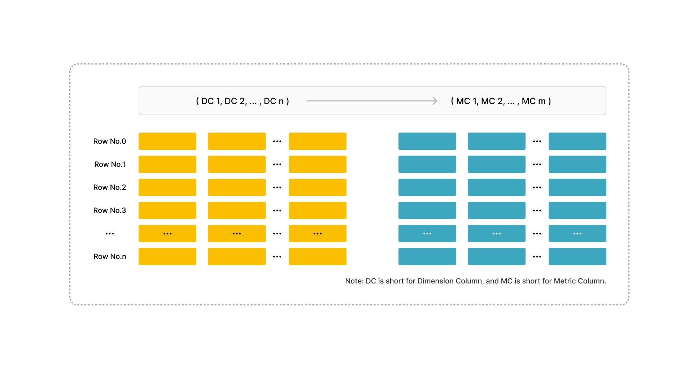

# Understand table design

## Columnar storage

Like in other relational databases, tables in StarRocks consist of rows and columns. Each row holds a record of user data, and data in each column has the same type. All rows in a table have the same number of columns. You can dynamically add columns to or delete columns from a table. The columns of a table can be categorized as dimension columns and metric columns. Dimension columns are also called key columns, and metric columns are also called value columns. Values in dimension columns are used to group and sort data, and values in metric columns can be accumulated by using functions such as sum, count, min, max, hll_union_agg, and bitmap_union.

StarRocks uses columnar storage for tables. Physically, the data in a column is segregated into data blocks, encoded, compressed, and then persistently stored on disk. Logically, the data in a column can be compared to an array that consists of elements of the same data type. The column values held in a row keep are listed as elements in the column order in their respective arrays. This means the column values held in a row have the same array index. Array indexes are implicit and do not need to be stored. All rows in a table are sorted in the order specified by one or more dimension columns. The location of a row in the sorted table is represented by the sequence number of that row.

For a query on a table, if you specify equality or range conditions on specific dimension columns that can comprise a dimension column prefix, StarRocks can run binary searches to quickly locate the rows of interest among sorted data. For example, you want to query data from a table named `table1`, and the table consists of four columns: `event_day`, `siteid`, `citycode`, and `username`, among which `event_day` and `siteid` are dimension columns. If you specify `event_day = 2020-09-18` and `siteid = 2` as query conditions, StarRocks can run binary searches and only needs to process the data within the specified range, because `event_day` and `siteid` can comprise a dimension column prefix. If you specify `citycode = 4` and `username = Andy` as query conditions, StarRocks cannot run binary searches and needs to process the data of the entire table, because `citycode` and `username` cannot comprise a dimension column prefix.

## Indexing

StarRocks uses prefix indexes and per-column indexes to quickly locate the starting rows of the data blocks taken by rows of interest.

The following figure shows how the StarRocks table design works to accelerate queries on a table in StarRocks.

The data of a table in StarRocks is organized into the following three parts:

- Prefix index
  
  StarRocks stores the data of every 1024 rows as a data block, for which an entry is maintained in the prefix index table. The content of the prefix index entry for each data block is the prefix composed of the dimension columns for the starting row in the data block and cannot exceed 36 bytes in length. The prefix index is a sparse index. When you query a row, StarRocks searches the prefix index table to retrieve the prefix that is composed of the dimension columns for the row. Then, StarRocks can quickly locate the sequence number of the starting row in the data block taken by the row of interest.

- Per-column data block
  
  StarRocks segregates the data of each column into multiple 64-KB data blocks. Each data block is independently encoded and compressed as the minimal I/O unit and is read from or written to disk as a whole.

- Per-column index
  
  StarRocks maintains a row number index for each column. In the row number index table, data blocks for the column are mapped one by one onto the sequence numbers of the rows held in the column. Additionally, each entry in the row number index table consists of the starting row number, address, and length of the data block that is mapped onto a specific row number. When you query a row, StarRocks searches the row number index table to retrieve the address of the data block mapped onto the sequence number of the row. Then, StarRocks reads the data block to locate the row.

In summary, StarRocks performs the following five steps to locate a row of a table by using the prefix that is composed of the dimension columns for the row:

1. Search the prefix index table to locate the sequence number of the starting row in the data block taken by the row of interest.

2. Search the row number index table of each dimension column to locate the data blocks for the dimension column.

3. Read the data blocks.

4. Decompress and decode the data blocks.

5. Search the data blocks to locate the row onto which the dimension column index is mapped.

## Accelerated processing

This section introduces the mechanisms that help StarRocks process data at higher speeds.

### Pre-aggregation

StarRocks provides the Aggregate table. For an Aggregate table, the rows that have the same values in the table's dimension columns can be aggregated into a single row. The value in each dimension column remains unchanged for the new row generated from the aggregation, and the values in each metric column are aggregated by the aggregate function you specify to produce the resulting value for the new row in the metric column. Pre-aggregation helps accelerate aggregate operations.

### Partitioning and bucketing

Each table in StarRocks is divided into multiple tablets. Each tablet is stored in multiple replicas on BEs. The number of BEs and the number of tablets can scale flexibly in line with changes in computing resources and data sizes. When you initiate a query, multiple BEs can search tablets in parallel to quickly locate the data of interest. Additionally, tablet replicas can be replicated and migrated, which increases data reliability and prevents data skews. Partitioning and bucketing help ensure the efficiency and stability of data retrieval.

### Materialized view

The prefix index of a table helps accelerate queries on the table but rely on the sequence of the table's dimension columns. If you construct query predicates by using dimension columns that are not included in a dimension column prefix, the prefix index does not work. In this case, you can create a materialized view for the table. The data of the materialized view is organized and stored in the same way as the data of the table. However, the materialized view can have its own prefix index. When you create a prefix index for the materialized view, you can specify appropriate aggregation granularity, column count, and dimension column ordering to ensure that frequently used query conditions can hit expected entries in the prefix index table for the materialized view.

### Per-column index

StarRocks supports per-column indexes such as Bloom filters, zone maps, and bitmap indexes:

- A Bloom filter is used to determine whether data blocks contain the values you want to query.

- A zone map is used to locate the values within a specified range.

- A bitmap index is used to locate the rows that meet specified query conditions in a column of the ENUM data type.
