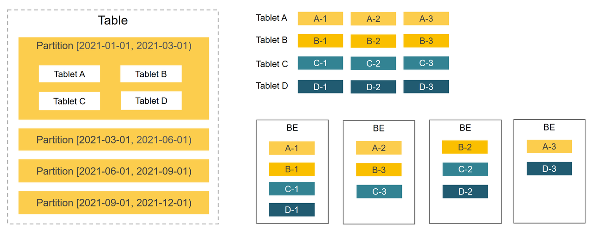

# Table overview

Tables are units of data storage. Understanding the table structure in StarRocks and how to design an efficient table structure helps optimize data organization and enhance query efficiency. Also, compared to traditional databases, StarRocks can store complex semi-structured data such as JSON, ARRAY, in a columnar manner to improve query performance.

This topic introduces the table structure in StarRocks from both basic and general perspectives.

## Get started with basic table structure

Like in other relational databases, a table is logically composed of rows and columns:

- Rows: Each row holds a record. Each row contains a set of related data values.
- Columns: Columns define attributes for each record. Each column holds data of a specific attribute. For example, an employee table may include columns like name, employee ID, department, and salary, where each column stores corresponding data. Data in each column is of the same data type. All rows in a table have the same number of columns.

It is simple to create a table in StarRocks. You just need to define columns and their data types in the CREATE TABLE statement to create a table. Example:

```SQL
CREATE DATABASE example_db;
USE example_db;
CREATE TABLE user_access (
    uid int,
    name varchar(64),
    age int, 
    phone varchar(16),
    last_access datetime,
    credits double
)
DUPLICATE KEY(uid, name);
```

The above CREATE TABLE example creates a Duplicate Key table. No constraint is added to columns in this type of table, so duplicate data rows can exist in the table. The first two columns of the Duplicate Key table are specified as sort columns to form the sort key. Data is stored after being sorted based on the sort key, which can accelerate indexing during queries.

:::note

If a StarRocks cluster in a staging environment contains only one BE, the number of replicas can be set to `1` in the `PROPERTIES` clause, such as `PROPERTIES( "replicaton_num" = "1" )`. The default number of replicas is 3, which is also the number recommended for production StarRocks clusters. If you want to use the default number, you do not need to configure the `PROPERTIES`.

:::

Execute [DESCRIBE](../sql-reference/sql-statements/Utility/DESCRIBE.md) to view the table schema.

```SQL
MySQL [test]> DESCRIBE user_access;
+-------------+-------------+------+-------+---------+-------+
| Field       | Type        | Null | Key   | Default | Extra |
+-------------+-------------+------+-------+---------+-------+
| uid         | int         | YES  | true  | NULL    |       |
| name        | varchar(64) | YES  | true  | NULL    |       |
| age         | int         | YES  | false | NULL    |       |
| phone       | varchar(16) | YES  | false | NULL    |       |
| last_access | datetime    | YES  | false | NULL    |       |
| credits     | double      | YES  | false | NULL    |       |
+-------------+-------------+------+-------+---------+-------+
6 rows in set (0.00 sec)
```

Execute [SHOW CREATE TABLE](../sql-reference/sql-statements/data-manipulation/SHOW_CREATE_TABLE.md) to view the CREATE TABLE statement.

```SQL
MySQL [example_db]> SHOW CREATE TABLE user_access\G
*************************** 1. row ***************************
       Table: user_access
Create Table: CREATE TABLE `user_access` (
  `uid` int(11) NULL COMMENT "",
  `name` varchar(64) NULL COMMENT "",
  `age` int(11) NULL COMMENT "",
  `phone` varchar(16) NULL COMMENT "",
  `last_access` datetime NULL COMMENT "",
  `credits` double NULL COMMENT ""
) ENGINE=OLAP 
DUPLICATE KEY(`uid`, `name`)
DISTRIBUTED BY RANDOM
PROPERTIES (
"replication_num" = "3",
"in_memory" = "false",
"enable_persistent_index" = "false",
"replicated_storage" = "true",
"compression" = "LZ4"
);
1 row in set (0.00 sec)
```

## Understand comprehensive table structure

A deep dive into StarRocks table structures helps you design efficient data management structure tailored to your business needs.  

### [Table types](./table_types/table_types.md)

StarRocks provides four types of tables which are Duplicate Key tables, Primary Key tables, Aggregate tables, and Unique Key tables, to store data for various business scenarios, such as raw data, frequently updated realtime data, and aggregated data.

- Duplicate Key tables are simple and easy to use. No constraint is added to columns in this type of table, so duplicate data rows can exist in the table. Duplicate Key tables are suitable for storing raw data, such as logs, that does not need any constraints or pre-aggregation.
- Primary Key tables are powerful. Both unique and non-null constraints are added to primary key columns. Primary Key tables support real-time frequent updates and partial column updates, while ensuring high query performance, and therefore are suitable for real-time queries scenarios.
- Aggregate tables are suitable to store pre-aggregated data, helping reduce the amount of data scanned and calculated and improve efficiency for aggregation queries.
- Unique tables are also suitable to store frequently updated realtime data. However this type of tables is being replaced by Primary Key tables, which are more powerful.

### [Data distribution](./Data_distribution.md)

StarRocks uses a partitioning+bucketing two-tier data distribution strategy, to evenly distribute data across BEs. A well-designed data distribution strategy can effectively reduce the amount of data scanned and maximize StarRocks' concurrent processing capabilities, thereby increasing query performance.



#### Partitioning

The first level is partitioning: Data in tables can be divided into smaller data management units based on partitioning columns which are usually columns that hold dates and time. During queries, partition pruning can reduce the amount of data that needs to be scanned, effectively optimizing query performance.

StarRocks provides an easy-to-use partitioning method, expression partitioning, and also offers more flexible methods like range and list partitioning.

#### Bucketing

The second level is bucketing: Data within a partition is further divided into smaller data management units through bucketing. Replicas of each bucket are evenly distributed across BEs to ensure high data availability.

StarRocks provides two bucketing methods:

- Hash bucketing: Data is distributed into buckets based on the hash values of the bucketing key. You can select columns frequently used as condition columns in queries as bucketing columns, which helps improve query efficiency.
- Random bucketing: Data is randomly distributed to buckets. This bucketing method is more simple and ease to use.

### [Data types](../sql-reference/sql-statements/data-types/data-type-list.md)

In addition to basic data types such as NUMERIC, DATE, and STRING, StarRocks supports complex semi-structured data types, including ARRAY, JSON, MAP, and STRUCT.

### Index

An index is a special data structure and is used as a pointer to data in a table. When the conditional columns in queries are indexed columns, StarRocks can swiftly locate the data that meets the conditions.

StarRocks provides a built-in primary index, which is a prefix index composed of the prefixes of the table's sort key columns. StarRocks also allows you to create secondary indexes, including Bitmap and Bloom Filter indexes, to further enhance query efficiency.


### Constraints

Constraints help ensure data integrity, consistency, and accuracy. The primary key columns in Primary Key tables must have unique and NOT NULL values. The aggregate key columns in Aggregate tables and the unique key columns in Unique Key tables must have unique values.

### More features

Apart from the above features, you can adopt more features based on your business requirements to design a more robust table structure. For example, using Bitmap and HLL columns to accelerate distinct counting, specifying generated columns or auto-increment columns to speed up some queries, configuring flexible and automatic storage cooldown methods to reduce maintainance costs, and configuring Colocate Join to speed up multi-table JOIN queries. For more details, see [CREATE TABLE](../sql-reference/sql-statements/data-definition/CREATE_TABLE.md).
