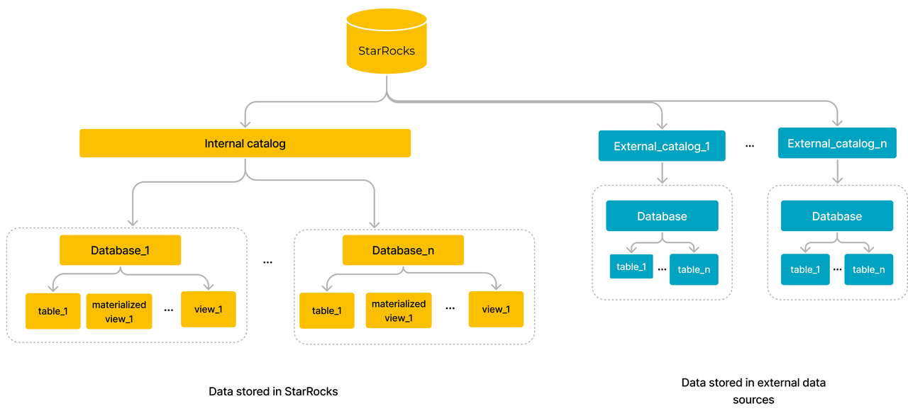

# Catalogs, databases, and tables

StarRocks uses internal catalogs to manage internal data and uses external catalogs to access external data in data lake. The data stored in StarRocks is maintained inside an internal catalog which consists of one or more databases. A database manages various objects, including tables, materialized views, and views, to store, manage, and manipulate data. StarRocks adopts a privilege system that controls users' privileges to perform operations on objects, thereby enhancing data security. 

## [Catalogs](../data_source/catalog/catalog_overview.md)

Catalogs are categorized into internal catalogs and external catalogs. Each cluster has only one Internal catalog `default_catalog` that can include one or more databases. The internal catalog of a StarRocks cluster manages the data loaded into the cluster and the materialized views. StarRocks can well serve as a data warehouse to store data, which significantly enhances query performance, especially for complex query analytics on large-scale data.

An external catalog, on the other hand, allows access to external data in your data lake. You can use StarRocks as a query engine to directly query data in the lake without loading the data into StarRocks.

## Databases

A database is a collection of data objects, such as tables, views, and materialized views, to store, manage, and manipulate data.

## [Tables](./table_types/table_types.md)

Tables are categorized into internal tables and external tables.

**Internal tables**

Internal tables are maintained in internal catalogs. The data of internal tables is stored in StarRocks. Internal tables are maintained in databases under the internal catalog. An internal table consists of rows and columns, where each row represents a record and each column represents an attribute or field of a data row.

:::note

The rows and columns of internal tables here are logical concepts. StarRocks uses columnar storage for tables. Physically, the data in a column is segregated into data blocks, encoded, compressed, and then persistently stored on disk. 

:::

StarRocks provides four types of internal tables, Primary Key tables, Duplicate Key tables, Aggregate tables, and Unique Key tables, to store various data, such as raw logs, realtime data, and aggregated data, to meet your varying business needs.

An internal table adopts a two-tier data distribution strategy, that is partitioning + bucketing, to achieve even data distribution. What's more, the replicas of each bucket are evenly distributed across BEs to guarantee high data availability.

**External tables**

External tables are maintained in external catalogs. The data of external tables is actually stored in external data sources. StarRocks only stores the metadata of these external tables, and you can use these tables to query data from external data sources.

## [Materialized views](../using_starrocks/Materialized_view.md)

Materialized views are special physical tables that hold precomputed query results from one or more base tables. Materialized views are categorized as synchronous and asynchronous materialized views. Asynchronous materialized views are more powerful because they can store precomputed results from multiple base tables (internal and external tables) and support various aggregation operators. When complex queries are executed on base tables, StarRocks can automatically reuse precomputed results stored in materialized views, to achieve transparent query acceleration, accelerate queries in data lakes and establish data modeling.

## [Views](../sql-reference/sql-statements/data-definition/CREATE_VIEW.md)

Views, or logical views, are virtual tables that do not hold any data. Views only display data that is the results of queries against other existing physical tables. The query that defines a view is run every time the view is referenced in a query.

## [Privileges](../administration/privilege_overview.md)

Privileges determine which users can perform which operations on which objects. StarRocks adopts two types of privilege models: identity-based access control and role-based access control. You can first assign privileges to roles, and then assign roles to users. In this case, privileges are passed to users through roles. Or, you can directly assign privileges to user identities.

## [Data storage in storage-compute separation architecture](../introduction/Architecture.md#storage-compute-separation)

Since v3.0, StarRocks introduces the new storage-compute separation (shared-data) architecture. Data storage is separated from BEs. Data is persistently stored in remote object storage or HDFS, while local disks are used for caching hot data to accelerate queries. 
