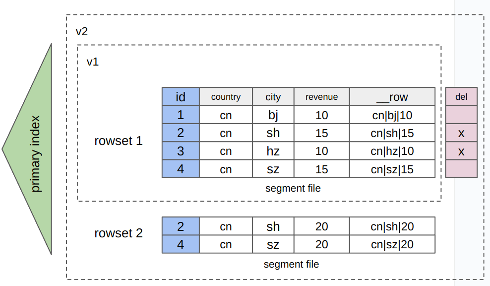

# Hybrid row-column storage

As an OLAP database, StarRocks originally stores data in the columnar storage, which can enhance the performance of complex queries, such as aggregate queries. Since v3.2.3, StarRocks also supports storing data in the hybrid row-column storage where data is stored in both row-by-row and column-by-column fashions. This hybrid row-column storage is well suited for various scenario such as primary key-based high-concurrency, low-latency point queries and partial column updates, while delivering efficient analytical capabilities comparable to columnar storage. Additionally, hybrid row-column storage supports [prepared statements](../sql-reference/sql-statements/prepared_statement.md), which enhances query performance and security.

## Comparisons between columnar storage and hybrid row-column storage 

| **Storage format**         | **Storage method**                                           | **Scenarios**                                                |
| -------------------------- | ------------------------------------------------------------ | ------------------------------------------------------------ |
| Hybrid row-column storage | Data is stored in both row-by-row and column-by-column fashions. Simply put, a table that uses hybrid row-column storage contains an additional, hidden binary-type column `__row`. When data is written to the table, all values from the value columns of a row are encoded and written to the `__row` column (as shown below). As the data is stored in both row-by-row and column-by-column fashions, additional storage costs are incurred.  | Suitable for use cases of both rowstore and columnstore storage xxx, but incurs additional storage costs.<ul><li>Use case of rowstore:</li><ul><li>High-concurrency point queries based on primary keys.</li><li>Queries against most fields from tables that consist of a small number of fields.</li><li>Partial column updates (more specifically, multiple columns and a small number of data rows need to be updated)</li></ul><li>Use case of columnstore: Complex data analysis.</li></ul>
|
| Column-oriented            | Data is stored in a column-by-column fashion  | Complex data analysis. <ul><li>Complex queries and analyses on massive datasets, such as aggregate analysis and multi-table join queries.</li><li>Tables consist of many fields (such as wide tables).  Queries involve only a few columns. </li></ul>|

## Basic usages  

### Create a table that uses hybrid row-column storage

1. The row-column hybrid feature is disabled by default. You can enable this feature by setting the FE dynamic parameter [`enable_experimental_rowstore`](../administration/FE_configuration.md#enable_experimental_rowstore) to `true`. 

2. Specify `"STORE_TYPE" = "column_with_row"` in the `PROPERTIES` at table creation.

   :::note

   - The table must be a Primary Key table.
   - The length of the `__row` column cannot exceed 1 MB.
   - Columns cannot be of data types like ARRAY, MAP, and STRUCT.

   :::

   ```SQL
   CREATE TABLE users (
   id bigint not null,
   country string,
   city string,
   revenue bigint
   )
   PRIMARY KEY (id)
   DISTRIBUTED by HASH (id)
   PROPERTIES ("store_type" = "column_with_row");
   ```

### Insert, delete, and update data

Similar to a table that uses columnar storage, you can insert, delete, and update data on a table that uses hybrid row-column storage by data loading and DML statements. This section demonstrates how to run DML statements on the above table with hybrid row-column storage.

1. Insert a data row.

   1. ```SQL
      INSERT INTO users (id, country, city, revenue)
      VALUES 
        (1, 'USA', 'New York', 5000),
        (2, 'UK', 'London', 4500),
        (3, 'France', 'Paris', 6000),
        (4, 'Germany', 'Berlin', 4000),
        (5, 'Japan', 'Tokyo', 7000),
        (6, 'Australia', 'Sydney', 7500);
      ```

2. Delete a data row.

   ```SQL
   DELETE FROM users WHERE id = 6;
   ```

3. Update a data row.

   ```SQL
   UPDATE users SET revenue = 6500 WHERE id = 4;
   ```

### Query data

This section uses a point query as an example. Point queries take a short circuit, directly querying data in row storage, which can improve query performance.

The following example still uses the above table with hybrid row-column storage. After the table creation and data modification operations mentioned above, the table stores the data as follows:

```SQL
MySQL [example_db]> SELECT * FROM users ORDER BY id;
+------+---------+----------+---------+
| id   | country | city     | revenue |
+------+---------+----------+---------+
|    1 | USA     | New York |    5000 |
|    2 | UK      | London   |    4500 |
|    3 | France  | Paris    |    6000 |
|    4 | Germany | Berlin   |    6500 |
|    5 | Japan   | Tokyo    |    7000 |
+------+---------+----------+---------+
5 rows in set (0.03 sec)
```

1. Make sure that the system enables short circuiting for queries. Once short circuiting for queries is enabled, queries that meet certain criteria (to evaluate whether the query is a point query) take a short circuit to scan data in row-oriented storage.

   ```SQL
   SHOW VARIABLES LIKE '%enable_short_circuit%';
   ```

   If the short circuiting for queries is not enabled, run the `SET enable_short_circuit = true;` command to set the variable [`enable_short_circuit`](../reference/System_variable.md#enable_short_circuit-323-and-later)  to `true`.

2. Query data. If the query meets the criteria that conditional columns in the WHERE clause include all primary key columns, and the operators in the WHERE clause are `=` or `IN`, the query takes the shortcut. 

   :::note
   
   The conditional columns in the WHERE clause can include additional columns beyond all primary key columns.
   
   :::

   ```SQL
   SELECT * FROM users WHERE id=1;
   ```

3. Check the query plan to verify whether the query can use the short circuit. If the query plan includes `Short Circuit Scan: true`, the query can take the short circuit.

      ```SQL
      MySQL [example_db]> EXPLAIN SELECT * FROM users WHERE id=1;
      +---------------------------------------------------------+
      | Explain String                                          |
      +---------------------------------------------------------+
      | PLAN FRAGMENT 0                                         |
      |  OUTPUT EXPRS:1: id | 2: country | 3: city | 4: revenue |
      |   PARTITION: RANDOM                                     |
      |                                                         |
      |   RESULT SINK                                           |
      |                                                         |
      |   0:OlapScanNode                                        |
      |      TABLE: users                                       |
      |      PREAGGREGATION: OFF. Reason: null                  |
      |      PREDICATES: 1: id = 1                              |
      |      partitions=1/1                                     |
      |      rollup: users                                      |
      |      tabletRatio=1/6                                    |
      |      tabletList=10184                                   |
      |      cardinality=-1                                     |
      |      avgRowSize=0.0                                     |
      |      Short Circuit Scan: true                           | -- The query can use the shortcut.
      +---------------------------------------------------------+
      17 rows in set (0.00 sec)
      ```

### Use prepared statements

You can use the [prepared statements](../sql-reference/sql-statements/prepared_statement.md#use-prepared-statements) to query data in the tables with hybrid row-column storage.

```SQL
-- Prepare the statements for execution.
PREPARE select_all_stmt FROM 'SELECT * FROM users';
PREPARE select_by_id_stmt FROM 'SELECT * FROM users WHERE id = ?';

-- Declare variables in the statements.
SET @id1 = 1, @id2 = 2;

-- Use the declared variables to execute the statements.
-- Query data with ID 1 or 2 separately.
EXECUTE select_by_id_stmt USING @id1;
EXECUTE select_by_id_stmt USING @id2;
```

## Limits

- Currently, the table with hybrid row-column storage cannot be altered by using [ALTER TABLE](../sql-reference/sql-statements/data-definition/ALTER_TABLE.md).
- The short circuiting for queries is currently only suitable for queries that happen after scheduled batch data loading. Because mutual exclusion of indexes may be incurred when the short circuiting for queries happens at the apply stage of the data writing process, data writing may block short circuiting for queries, affecting the response time of point queries during data writing.
- Hybrid row-column storage may significantly increase storage consumption. This is because data is stored in both row and column formats, and the data compression ratio of row storage may not be as high as that of column storage.
- Hybrid row-column storage can increase the time and resource consumption during data loading.
- The tables with hybrid row-column storage can be a viable solution for online services, but the performance of this type of table may not compete with mature OLTP databases. Note that  this type of table can not well support high-concurrency data updates (insert, update, delete operations).
- The tables with hybrid row-column storage do not support features that rely on columnar storage, such as partial updates in column mode.
- The tables with hybrid row-column storage must be Primary Key tables.
