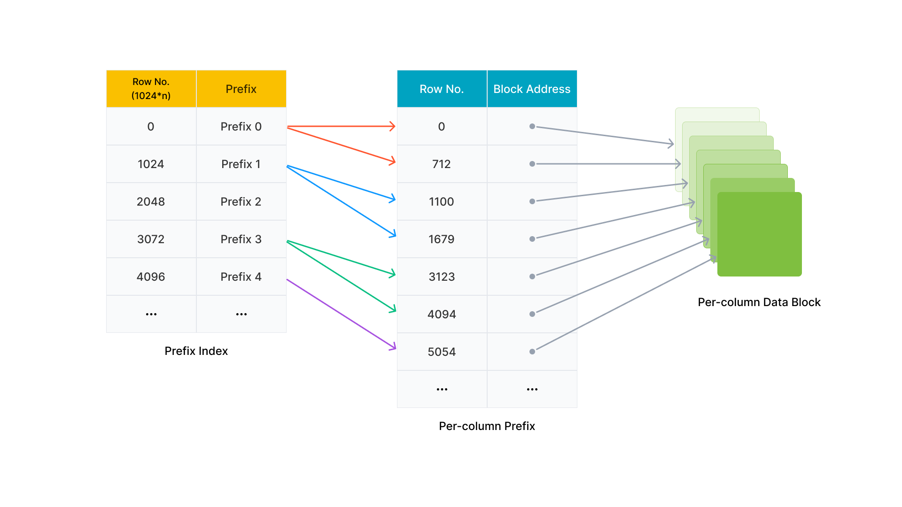

# Indexes

Indexes can help quickly locate data that matches certain query conditions. To be specific, when an index is built on a table based on some of the table's columns, queries that use these columns as query conditions require scanning only on portions of the table data in order to locate the data that meet the conditions. As such, query efficiency is improved. StarRocks provides a variety of index types, mainly divided into the following two categories:

- StarRocks provides built-in indexes which are automatically created by the system, including Prefix indexes, Ordinal indexes, and ZoneMap indexes.
- StarRocks also allows users to manually create indexes, including Bitmap indexes and Bloom filter indexes.

## Built-in indexes

### [Prefix indexes](./Prefix_index_sort_key.md)

The Prefix index is automatically generated during data writing. To more specifically, when data is written into StarRocks, the data is sorted according to the specified sort key, and every 1024 rows of data are included in one logical data block. An index entry that consists of the values of sort key columns of the first data row in that logical data block is added to the Prefix index table. When the filtering condition in a query match the prefix of the Prefix index, the Prefix index can quickly locate the data that meets the conditions, and reduce the amount of data scanned, which can significantly improve query performance.

### Ordinal indexes

StarRocks actually adopts columnar storage in the underlying storage. Data per column is stored in data pages, and the size of each data page's is generally 64 * 1024 bytes (data_page_size = 64 * 1024). An Ordinal index entry is added at the same time when a data page is generated. The Ordinal index entry contains information such as the starting row number of the data page. In this way, the Ordinal index can locate the physical address of the column Data Page data page by using the row number.

### ZoneMap indexes

ZoneMap index stores each data chunk's statistics that include Min (maximum value), Max (minimum value), HasNull (presence of null values), and HasNotNull (presence of non-null values) information. During queries, StarRocks can rapidly evaluate whether these data chunks can be filtered out based on their statistics, reducing the scanned data volume and improving query speed.

 More information

Each data chunk can be a segment, or a data page of a column. So correspondingly, two types of ZoneMap indexes exist: one storing statistics for each Segment and the other for each data page of a column. 

## Manually created indexes

If the column in the query condition is not a prefix field, you can manually apply a Bitmap index or Bloom filter index to this column to improve query efficiency.

### [Bitmap indexes](./Bitmap_index.md)

Bitmap indexes are generally suitable for columns with high cardinality. Bitmap indexes are a good choice when Bitmap indexes can exhibit high selectivity, and its filtering effect (number of data rows filtered by the Bitmap index/total number of data rows) is lower than one in ten thousand.

### [Bloom filter indexes](./Bloomfilter_index.md)

Bloom filter indexes are suitable for columns with relatively high cardinality, such as ID columns, but they may incur a certain rate of misjudgment.
