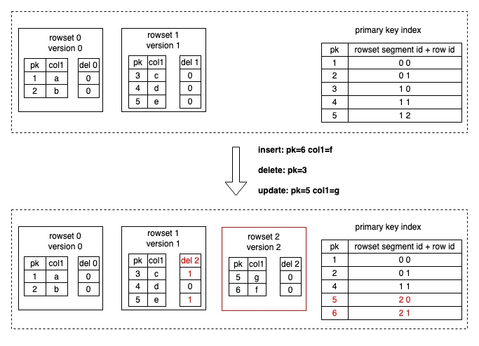
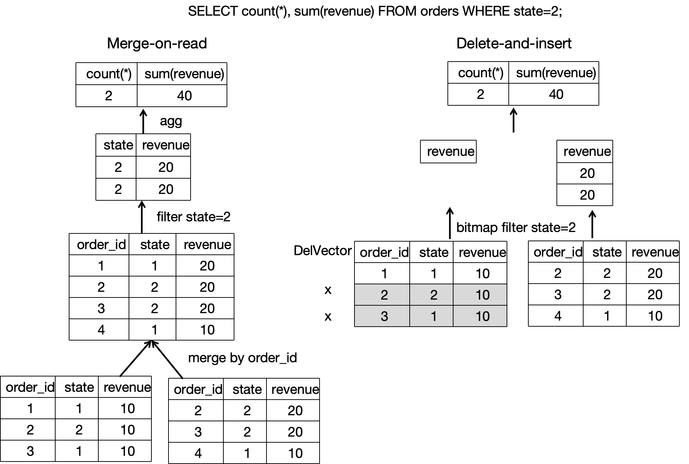
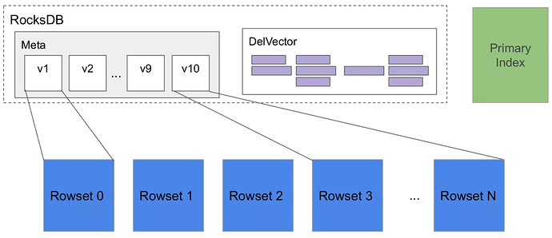
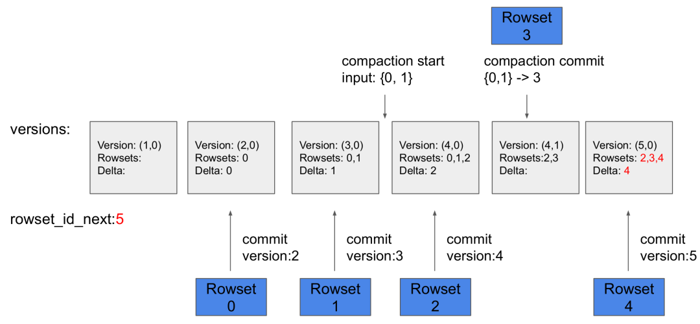
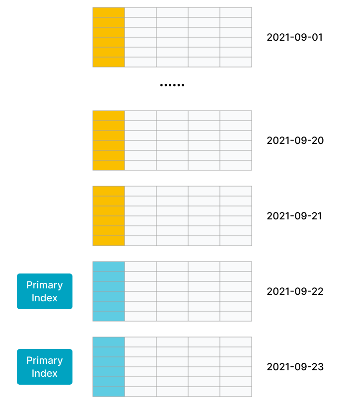

# Primary Key table

import Tabs from '@theme/Tabs';

import TabItem from '@theme/TabItem';

The Primary Key table uses a new storage engine designed by StarRocks. Its main advantage lies in supporting real-time data updates while ensuring efficient performance for complex ad-hoc queries. In real-time business analytics, decision-making can benefit from Primary Key tables which use the newest data to analyze results in real-time, which can mitigate data latency in data analysis.

The primary key of a Primary Key table has a UNIQUE constraint and NOT NULL constraint, and is used to uniquely identify each data row. If the primary key value of a new data row is same as that of an existing data row in the table, UNIQUE constraint violation occurs. Then the new data row will replace the existing data row.

:::info

- Since v3.0, the sort key of a Primary Key table is decoupled from the table's primary key, and the sort key can be specified separately. As such, table creation flexibility is improved.
- Since v3.1, StarRocks shared-data clusters support creating Primary Key tables. 
  - Since v3.1.4, persistent indexes can be created and stored in **local disks**.
  - Since v3.3.0, persistent indexes can be created and stored in **object storages**.

:::

## Scenarios

The Primary Key table can support real-time data updates while ensuring efficient query performance. It is suitable for the following scenarios:

- **Stream data in real time from transaction processing systems into StarRocks.** In normal cases, transaction processing systems involve a large number of update and delete operations in addition to insert operations. If you need to synchronize data from a transaction processing system to StarRocks, we recommend that you create a Primary Key table. Then, you can use tools, such as CDC Connectors for Apache Flink®, to synchronize the binary logs of the transaction processing system to StarRocks. StarRocks uses the binary logs to add, delete, and update the data in the table in real time. This simplifies data synchronization and delivers 3 to 10 times higher query performance than when a Unique Key table that adopts the Merge-On-Read strategy is used. For more information, see [Realtime synchronization from MySQL](../../loading/Flink_cdc_load.md).
- **Join multiple streams by performing [partial updates on individual columns](../../loading/Load_to_Primary_Key_tables.md#partial-updates)**. In business scenarios such as user profiling, flat tables are preferably used to improve multi-dimensional analysis performance and simplify the analytics model that is used by data analysts. Upstream data in these scenarios may come from various apps, such as shopping apps, delivery apps, and banking apps, or from systems, such as machine learning systems that perform computations to obtain the distinct tags and properties of users. The Primary Key table is well suited in these scenarios, because it supports updates to individual columns. Each app or system can update only the columns that hold the data within its own service scope while benefiting from real-time data additions, deletions, and updates at high query performance.

## How it works

The Unique Key table and Aggregate table adopt the Merge-On-Read strategy. This strategy makes data writing simple and efficient, but requires merging multiple versions of data files online during data reading. Moreover, because the Merge operator exists, the predicates and indexes cannot be pushed down to the underlying data, which severely impacts query performance.

However, to balance the performance of real-time updates and query, the metadata structure and the read/write mechanism in the Primary Key table differ from those in the other types of tables. The Primary Key table uses the Delete+Insert strategy. This strategy is realized by using the primary key index and the DelVector. This strategy ensures that only the latest record among the records with the same primary key value needs to be read during queries, which eliminates the need to merge multiple versions of data files. Moreover, predicates and indexes can be pushed down to the underlying data, which greatly improves query performance.

The overall process of writing and reading data within the Primary Key table is as follows:

- The data writing is achieved through StarRocks's internal Loadjob that includes a batch of data change operations (Insert, Update, and Delete). StarRocks loads the primary key indexes of the corresponding tablets into memory. For Delete operations, StarRocks first uses the primary key index to find the original location (data file and row number) of each data row, marking the data row as deleted in the DelVector (which stores and manages delete markers generated during data loading). For Update operations, in addition to marking the original data row as deleted in the DelVector, StarRocks also writes the latest data row to a new data file, essentially transforming the Update into a Delete+Insert (as shown in the following figure). The primary key index is also updated to record the new location (data file and row number) of the changed data row.

   
- During data reading, because historical duplicate records in various data files have already been marked as deleted during data writing, only the latest data row with the the same primary key value needs to be read. Multiple versions of data files no longer need to be read online to deduplicate data and find the latest data. When the underlying data files are scanned, filter operators and various indexes help reduce scanning overhead (as shown in the following figure). Therefore, query performance can be significantly improved. Compared to the Merge-On-Read strategy of the Unique Key table, the Delete+Insert strategy of the Primary Key table can help improve query performance by 3 to 10 times.

   

<details>
<summary>More details</summary>

If you want a deeper understanding of how data is written into or read from Primary Key tables, you can explore the detailed data writing and reading processes as follows:

StarRocks is an analytical database that uses columnar storage. Specifically, a tablet within a table often contains multiple rowset files, and the data of each rowset file is actually stored in segment files. Segment files organize data in columnar format (similar to Parquet) and are immutable.

When the data to be written is distributed to the Executor BE nodes, each Executor BE node executes a Loadjob. A Loadjob includes a batch of data changes and can be considered as a transaction with ACID properties. A Loadjob can be divided into two stages: write and commit.

1. Write stage: Data is distributed to the corresponding tablet based on partition and bucket information. When a tablet receives data, data is stored in columnar format and then a new rowset is formed.
2. Commit stage: After all data is successfully written, the FE initiates the commits to all tablets that are involved. Each commit carries a version number representing the latest version of the tablet's data. The commit process mainly includes searching and updating the primary key index, marking all the changed data as deleted, creating a DelVector based on the data marked as deleted, and generating metadata for the new version.

During data reading, the metadata is used to find which rowsets need to be read based on the latest tablet version. When a segment file in the rowset is being read, its latest version of DelVector is also being checked, which can ensure that only the latest data needs to be read and avoid reading old data with the same primary key value. Furthermore, filter operators pushed down to the Scan layer can directly utilize various indexes to reduce scanning overhead.

- **Tablet**: A table is divided into multiple tablets based on partition and bucket mechanisms. It is the actual physical storage unit and is distributed as replicas across different BEs.

   

- **Metadata**: The metadata stores the version history of the tablet and information about each version (for example, which rowsets are included). The commit phase of each Loadjob or compaction generates a new version.

   

- **Primary key index**: The primary key index stores the mapping between the data rows identified by those primary key values and the locations of those data rows. It is implemented as a HashMap, where the keys represent the encoded primary key values, and the values represent the locations of data rows（including `rowset_id`, `segment_id` and `rowid`）. Normarlly, the primary key index is only used during data writing to find the rowset and row in which each data row identified by a specific primary key value resides.
- **DelVector**: The DelVector stores the delete markers for each segment file (columnar file) in every rowset.
- **Rowset**: The rowset is a logical concept and stores the dataset from a batch of data changes in a tablet.
- **Segment**: The data in the rowset is actually segmented and stored in one or more segment files (columnar files). Each segment file contains column values and indexes information related to the columns.

</details>

## Usage

### Create Primary Key table

You just need to define the primary key in the `CREATE TABLE` statement to create a Primary Key table. Example:

```SQL
CREATE TABLE orders1 (
    order_id bigint NOT NULL,
    dt date NOT NULL,
    user_id INT NOT NULL,
    good_id INT NOT NULL,
    cnt int NOT NULL,
    revenue int NOT NULL
)
PRIMARY KEY (order_id)
DISTRIBUTED BY HASH (order_id)
;
```

:::info

Because the Primary Key table only supports hash bucketing as the bucketing strategy, you also need to define the hash bucketing key by using `DISTRIBUTED BY HASH ()`.

:::

However, in real business scenarios, when a Primary Key table is created, additional features such as data distribution and sort key are often used to accelerate queries and manage data more efficiently.

For example, the `order_id` field in the order table can uniquely identify data rows, so the `order_id` field can be used as the primary key.

Since v3.0, the sort key of a Primary Key table is decoupled from the table's primary key. Therefore, you can choose columns frequently used as query filter conditions to form the sort key. For example, if you frequently query product sales performance based on the combination of two dimensions, order date and merchant, you can specify the sort key as `dt` and `merchant_id` using the `ORDER BY (dt,merchant_id)` clause.

Note that if you use [data distribution strategies](../Data_distribution.md), the Primary Key table currently requires the primary key to include partitioning and bucketing columns. For example, the data distribution strategy uses `dt` as the partitioning column and `merchant_id` as the hash bucketing column. The primary key also needs to include `dt` and `merchant_id`.

In summary, the CREATE TABLE statement for the above order table can be as follows:

```SQL
CREATE TABLE orders2 (
    order_id bigint NOT NULL,
    dt date NOT NULL,
    merchant_id int NOT NULL,
    user_id int NOT NULL,
    good_id int NOT NULL,
    good_name string NOT NULL,
    price int NOT NULL,
    cnt int NOT NULL,
    revenue int NOT NULL,
    state tinyint NOT NULL
)
PRIMARY KEY (order_id,dt,merchant_id)
PARTITION BY date_trunc('day', dt)
DISTRIBUTED BY HASH (merchant_id)
ORDER BY (dt,merchant_id)
PROPERTIES (
    "enable_persistent_index" = "true"
);
```

### Primary key

The primary key of a table is used to uniquely identify each row in that table. The one or more columns comprising the primary key are defined in the `PRIMARY KEY`, and have the UNIQUE constraint and NOT NULL constraint.

Take note of the following considerations about the primary key:

- In the CREATE TABLE statement, the primary key columns must be defined before other columns.
- The primary key columns must include partitioning and bucketing columns.
- The primary key columns support the following data types: numeric (including integers and BOOLEAN), string, and date (DATE and DATETIME).
- By default, the maximum length of an encoded primary key value is 128 bytes.
- The primary key cannot be modified after table creation.
- For data consistency purposes, the primary key values cannot be updated.

### Primary key index

The primary key index is used to store the mapping between the primary key values and the locations of the data rows identified by the primary key values. Typically, the primary key indexes of relevant tablets are loaded into memory only during data loading (which involves a batch of data changes). You can consider persisting the primary key indexes after comprehensively evaluating the performance requirement for queries and updates, as well as the memory and disk.

<Tabs groupId="primary key index">

  <TabItem value="example1" label="Persistent primary key index" default>

When `enable_persistent_index` is set to `true` (default), the primary key indexes can be persisted to the disk. During loading, a small portion of the primary key indexes is loaded in memory, while the majority is stored on disk to avoid taking up too much memory. In general, query and update performance of the table with the persistent primary key indexes is nearly equivalent to that of the table with the fully in-memory primary key indexes.

If the disk is an SSD, it is recommended to set it to `true`. If the disk is an HDD and the load frequency is not high, you can also set it to `true`.

:::info

Since v3.1.4, Primary Key tables created in StarRocks shared-data clusters further support index persistence onto local disks.

:::

</TabItem>

<TabItem value="example2" label="Fully in-memory primary key index">

When `enable_persistent_index` is set to `false`, the primary key indexes are not persisted to the disk,  that is, the primary key indexes are fully stored in memory. During loading, the primary key indexes of tablets related to the data loaded will be loaded into memory, which may result in higher memory consumption. (If a tablet has not had data loaded for a long time, its primary key index will be released from memory.)

When using the fully in-memory primary key indexes, you are advised to follow the following guidelines when designing the Primary Key to control memory usage of the primary key indexes:

- The number and total length of Primary Key columns must be properly designed. We recommend that you identify columns whose data types occupy less memory and define those columns as the primary key, such as INT and BIGINT, not VARCHAR.
- Before you create the table, we recommend that you estimate the memory occupied by the primary key indexes based on the data types of the primary key columns and the number of rows in the table. This way, you can prevent running out of memory. The following example explains how to calculate the memory occupied by the primary key indexes:
  - Suppose that the `dt` column, which is of the DATE data type and occupies 4 bytes, and the `id` column, which is of the BIGINT data type and occupies 8 bytes, are defined as the Primary Key. In this case, the Primary Key is 12 bytes in length.
  - Suppose that the table contains 10,000,000 rows of hot data and is stored in three replicas.
  - Given the preceding information, the memory occupied by the primary key indexes is 945 MB based on the following formula: `(12 + 9) x 10,000,000 x 3 x 1.5 = 945 (MB)`

    In the preceding formula, `9` is the immutable overhead per row, and `1.5` is the average extra overhead per hash table.

The Primary Key table with the fully in-memory primary key indexes is suitable for scenarios in which the memory occupied by the Primary Key is controllable. Example:

- The table contains both fast-changing data and slow-changing data. Fast-changing data is frequently updated over the most recent days, whereas slow-changing data is rarely updated. Suppose that you need to synchronize a MySQL order table to StarRocks in real time for analytics and queries. In this example, the data of the table is partitioned by day, and most updates are performed on orders that are created within the most recent days. Historical orders are no longer updated after they are completed. When you run a data load job, the primary key indexes of historical orders are not loaded into the memory. Only the primary key indexes of the recently updated orders are loaded into the memory.
  
  As shown in the following figure, the data in the table is partitioned by day, and the data in the most recent two partitions is frequently updated.

   

- The table is a flat table that is composed of hundreds or thousands of columns. The Primary Key comprises only a small portion of the table data and consumes only a small amount of memory. For example, a user status or profile table consists of a large number of columns but only tens to hundreds of millions of users. In this situation, the amount of memory consumed by the primary key is controllable.
  
  As shown in the following figure, the table contains only a few rows, and the Primary Key of the table comprises only a small portion of the table.
   

</TabItem>

</Tabs>

### Sort key

From v3.0, the Primary Key table decouples the sort key from the Primary Key. The sort key is composed of the columns defined in `ORDER BY`, and can consist of any combination of columns, as long as the data type of the columns meets the requirement of the sort key.

During data loading, the data is stored after being sorted according to the sort key. The sort key is also used to build the Prefix index to accelerate queries. It is recommended to [design the sort key appropriately to form the Prefix index that can accelerate queries](../indexes/Prefix_index_sort_key.md#how-to-design-the-sort-key-appropriately-to-form-the-prefix-index-that-can-accelerate-queries).

:::info

- If the sort key is specified, the Prefix index is built based on the sort key. If no sorti key is specified,the Prefix index are built based on the Primary Key.
- After table creation, you can use `ALTER TABLE ... ORDER BY ...` to change the sort key. Deleting the sort key is not supported, and modifying the data types of sort columns is not supported.

:::

## What's more

- To load data into the table created, you can refer to [Loading overview](../../loading/loading_introduction/Loading_intro.md) to choose an appropriate load options.
- If you need to change data in the Primary Key table, you can refer to [change data through loading](../../loading/Load_to_Primary_Key_tables.md) or use DML ([INSERT](../../sql-reference/sql-statements/loading_unloading/INSERT.md), [UPDATE](../../sql-reference/sql-statements/table_bucket_part_index/UPDATE.md), and [DELETE](../../sql-reference/sql-statements/table_bucket_part_index/DELETE.md)).
- If you want to further accelerate queries, you can refer to [Query Acceleration](../../cover_pages/query_acceleration.mdx).
- If you need to modify the table schema, you can refer to [ALTER TABLE](../../sql-reference/sql-statements/Resource/ALTER_RESOURCE.md).
- An [AUTO_INCREMENT](../../sql-reference/sql-statements/generated_columns.md) column can be used as the Primary Key.
