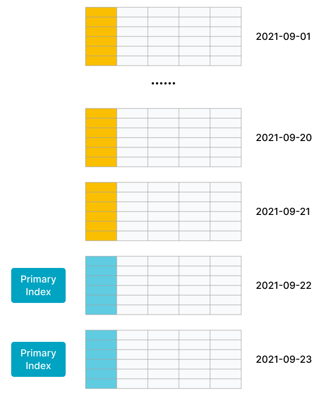
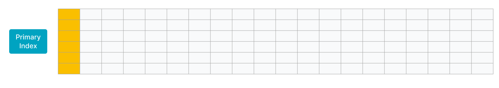

# Primary Key table

StarRocks has started to support the Primary Key table since v1.19. When you create a table that uses the Primary Key table, you can define primary key columns and metric columns. Queries return the most recent record among a group of records that have the same primary key. Unlike the Unique Key table, the Primary Key table does not require aggregate operations during queries and supports the pushdown of predicates and indexes. As such, the Primary Key table can deliver high query performance despite real-time and frequent data updates.

## Scenarios

- The Primary Key table is suitable for the following scenarios in which data needs to be frequently updated in real time:
  - **Stream data in real time from transaction processing systems into StarRocks.** In normal cases, transaction processing systems involve a large number of update and delete operations in addition to insert operations. If you need to synchronize data from a transaction processing system to StarRocks, we recommend that you create a table that uses the Primary Key table. Then, you can use tools, such as CDC Connectors for Apache Flink®, to synchronize the binary logs of the transaction processing system to StarRocks. StarRocks uses the binary logs to add, delete, and update the data in the table in real time. This simplifies data synchronization and delivers 3 to 10 times higher query performance than when a Merge on Read (MoR) table of the Unique Key table is used. For example, you can use flink-connector-starrocks to load data. For more information, see [Load data by using flink-connector-starrocks](../../loading/Flink-connector-starrocks.md).

  - **Join multiple streams by performing update operations on individual columns**. In business scenarios such as user profiling, flat tables are preferably used to improve multi-dimensional analysis performance and simplify the analytics model that is used by data analysts. Upstream data in these scenarios may come from various apps, such as shopping apps, delivery apps, and banking apps, or from systems, such as machine learning systems that perform computations to obtain the distinct tags and properties of users. The Primary Key table is well suited in these scenarios, because it supports updates to individual columns. Each app or system can update only the columns that hold the data within its own service scope while benefiting from real-time data additions, deletions, and updates at high query performance.

- The Primary Key table is suitable for scenarios in which the memory occupied by the primary key is controllable.

  The storage engine of StarRocks creates an index for the primary key of each table that uses the Primary Key table. Additionally, when you load data into a table, StarRocks loads the primary key index into the memory. Therefore, the Primary Key table requires a larger memory capacity than the other three table types. **StarRocks limits the total length of the fields that comprise the primary key to 127 bytes after encoding.**

  Consider using the Primary Key table if a table has the following characteristics:

  - The table contains both fast-changing data and slow-changing data. Fast-changing data is frequently updated over the most recent days, whereas slow-changing data is rarely updated. Suppose that you need to synchronize a MySQL order table to StarRocks in real time for analytics and queries. In this example, the data of the table is partitioned by day, and most updates are performed on orders that are created within the most recent days. Historical orders are no longer updated after they are completed. When you run a data load job, the primary key index is not loaded into the memory and only the index entries of the recently updated orders are loaded into the memory.

    As shown in the following figure, the data in the table is partitioned by day, and the data in the most recent two partitions is frequently updated.

    

  - The table is a flat table that is composed of hundreds or thousands of columns. The primary key comprises only a small portion of the table data and consumes only a small amount of memory. For example, a user status or profile table consists of a large number of columns but only tens to hundreds of millions of users. In this situation, the amount of memory consumed by the primary key is controllable.

    As shown in the following figure, the table contains only a few rows, and the primary key of the table comprises only a small portion of the table.

    

## Principle

The Primary Key table is designed based on a new storage engine that is provided by StarRocks. The metadata structure and the read/write mechanism in the Primary Key table differ from those in the Duplicate Key table. As such, the Primary Key table does not require aggregate operations and supports the pushdown of predicates and indexes. These significantly increase query performance.

The Duplicate Key table adopts the MoR policy. MoR streamlines data writes but requires online aggregation of multiple data versions. Additionally, the Merge operator does not support the pushdown of predicates and indexes. As a result, query performance deteriorates.

The Primary Key table adopts the Delete+Insert policy to ensure that each record has a unique primary key. This way, the Primary Key table does not require merge operations. Details are as follows:

- When StarRocks receives a request for an update operation on a record, it locates the record by searching the primary key index, marks the record as deleted, and inserts a new record. In other words, StarRocks converts an update operation to a delete operation plus an insert operation.

- When StarRocks receives a delete operation on a record, it locates the record by searching the primary key index and marks the record as deleted.

## Create a table

Example 1: Suppose that you need to analyze orders on a daily basis. In this example, create a table named `orders`, define `dt` and `order_id` as the primary key, and define the other columns as metric columns.

```SQL
create table orders (
    dt date NOT NULL,
    order_id bigint NOT NULL,
    user_id int NOT NULL,
    merchant_id int NOT NULL,
    good_id int NOT NULL,
    good_name string NOT NULL,
    price int NOT NULL,
    cnt int NOT NULL,
    revenue int NOT NULL,
    state tinyint NOT NULL
) PRIMARY KEY (dt, order_id)
PARTITION BY RANGE(`dt`) (
    PARTITION p20210820 VALUES [('2021-08-20'), ('2021-08-21')),
    PARTITION p20210821 VALUES [('2021-08-21'), ('2021-08-22')),
    ...
    PARTITION p20210929 VALUES [('2021-09-29'), ('2021-09-30')),
    PARTITION p20210930 VALUES [('2021-09-30'), ('2021-10-01'))
) DISTRIBUTED BY HASH(order_id) BUCKETS 4
PROPERTIES("replication_num" = "3",
"enable_persistent_index" = "true");
```

Example 2: Suppose that you need to analyze user behavior in real time. In this example, create a table named `users`, define `user_id` as the primary key, and define the other columns as metric columns.

```SQL
create table users (
    user_id bigint NOT NULL,
    name string NOT NULL,
    email string NULL,
    address string NULL,
    age tinyint NULL,
    sex tinyint NULL,
    last_active datetime,
    property0 tinyint NOT NULL,
    property1 tinyint NOT NULL,
    property2 tinyint NOT NULL,
    property3 tinyint NOT NULL,
    ....
) PRIMARY KEY (user_id)
DISTRIBUTED BY HASH(user_id) BUCKETS 4
PROPERTIES("replication_num" = "3",
"enable_persistent_index" = "true");
```

### Usage notes

- Take note of the following points about the primary key of a table:
  - The primary key is defined by using the `PRIMARY KEY` keyword.

  - The primary key must be created on columns on which unique constraints are enforced, and the names of the primary key columns cannot be changed.

  - The primary key columns can be any of the following data types: BOOLEAN, TINYINT, SMALLINT, INT, BIGINT, LARGEINT, STRING, VARCHAR, DATE, and DATETIME. However, the primary key columns cannot be defined as `NULL`.

  - The partition column and the bucket column must participate in the primary key.

  - The number and total length of primary key columns must be properly designed to save memory. We recommend that you identify columns whose data types occupy less memory and define those columns as the primary key. Such data types include INT and BIGINT. We recommend that you do not let a column of the VARCHAR data type to participate in the primary key.

  - Before you create the table, we recommend that you estimate the memory occupied by the primary key index based on the data types of the primary key columns and the number of rows in the table. This way, you can prevent the table from running out of memory. The following example explains how to calculate the memory occupied by the primary key index:
    - Suppose that the `dt` column, which is of the DATE data type that occupies 4 bytes, and the `id` column, which is of the BIGINT data type that occupies 8 bytes, are defined as the primary key. In this case, the primary key is 12 bytes in length.

    - Suppose that the table contains 10,000,000 rows of hot data and is stored in three replicas.

    - Given the preceding information, the memory occupied by the primary key index is 945 MB based on the following formula:

      (12 + 9) x 10,000,000 x 3 x 1.5 = 945 (MB)

      In the preceding formula, `9` is the immutable overhead per row, and `1.5` is the average extra overhead per hash table.

- `enable_persistent_index`: the primary key index can be persisted to disk and stored in memory to avoid it taking up too much memory. Generally, the primary key index can only take up 1/10 of the memory it does before. You can set this property in `PROPERTIES` when you create a table. Valid values are true or false. Default value is false.

  > - If you want to modify this parameter after the table is created, please see the part Modify the properties of table in [ALTER TABLE](../../sql-reference/sql-statements/data-definition/ALTER_TABLE.md).
  > - It is recommended to set this property to true if the disk is SSD.
  > - As of version 2.3.0, StarRocks supports to set this property.

- Since version 2.3.0, the indicator column now supports BITMAP, HLL data types.

- When you create a table, you cannot create BITMAP indexes or Bloom Filter indexes on the metric columns of the table.

- Since version 2.4.0, you can create asynchronous materialized views based on Primary Key tables.

- The Primary Key table does not support materialized views.

- You cannot use the ALTER TABLE statement to change the data types of the primary key columns and reorder metric columns. For the syntax and examples of using the ALTER TABLE statement, see [ALTER TABLE](../../sql-reference/sql-statements/data-definition/ALTER_TABLE.md).

## What to do next

After table creation, you can run load jobs to load data into the Primary Key table. For more information about supported loading methods, see [Overview of data loading](../../loading/Loading_intro.md).

If you need to update data in the Primary Key table, you can [run a load job](../../loading/Load_to_Primary_Key_tables.md) or execute a DML statement ([UPDATE](../../sql-reference/sql-statements/data-manipulation/UPDATE.md) or [DELETE](../../sql-reference/sql-statements/data-manipulation/DELETE.md)). Also, these update operations guarantee atomicity.
